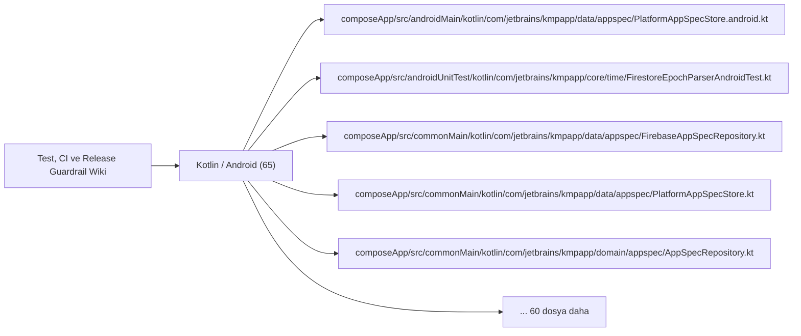

# Test, CI ve Release Guardrail Wiki

Unit, integration, E2E, statik analiz, CI ve release doğrulama yüzeyleri.

## Görselleştirme

## İndekslenen Dosyalar

| Dosya | Katman | Etiketler | Kanıt Durumu |
| --- | --- | --- | --- |
| `composeApp/src/androidMain/kotlin/com/jetbrains/kmpapp/data/appspec/PlatformAppSpecStore.android.kt` | `Kotlin / Android` | `mantık odağı, test` | Manuel doğrulanacak |
| `composeApp/src/androidUnitTest/kotlin/com/jetbrains/kmpapp/core/time/FirestoreEpochParserAndroidTest.kt` | `Kotlin / Android` | `mantık odağı, test` | Manuel doğrulanacak |
| `composeApp/src/commonMain/kotlin/com/jetbrains/kmpapp/data/appspec/FirebaseAppSpecRepository.kt` | `Kotlin / Android` | `mantık odağı, test` | Manuel doğrulanacak |
| `composeApp/src/commonMain/kotlin/com/jetbrains/kmpapp/data/appspec/PlatformAppSpecStore.kt` | `Kotlin / Android` | `mantık odağı, test` | Manuel doğrulanacak |
| `composeApp/src/commonMain/kotlin/com/jetbrains/kmpapp/domain/appspec/AppSpecRepository.kt` | `Kotlin / Android` | `mantık odağı, test` | Manuel doğrulanacak |
| `composeApp/src/commonTest/kotlin/com/jetbrains/kmpapp/core/time/FirestoreEpochParserTest.kt` | `Kotlin / Android` | `mantık odağı, test` | Manuel doğrulanacak |
| `composeApp/src/commonTest/kotlin/com/jetbrains/kmpapp/core/time/ServerSyncedTimeTest.kt` | `Kotlin / Android` | `test` | Manuel doğrulanacak |
| `composeApp/src/commonTest/kotlin/com/jetbrains/kmpapp/data/applications/ApplyConflictGuardTest.kt` | `Kotlin / Android` | `test` | Manuel doğrulanacak |
| `composeApp/src/commonTest/kotlin/com/jetbrains/kmpapp/data/auth/DummyOtpAuthBackendTest.kt` | `Kotlin / Android` | `test` | Manuel doğrulanacak |
| `composeApp/src/commonTest/kotlin/com/jetbrains/kmpapp/data/auth/KtorOtpAuthBackendTest.kt` | `Kotlin / Android` | `test` | Manuel doğrulanacak |
| `composeApp/src/commonTest/kotlin/com/jetbrains/kmpapp/data/employer/EmployerJobsRepositoryBucketsTest.kt` | `Kotlin / Android` | `mantık odağı, test` | Manuel doğrulanacak |
| `composeApp/src/commonTest/kotlin/com/jetbrains/kmpapp/data/jobs/FirebaseJobsFeedRepositoryBucketsTest.kt` | `Kotlin / Android` | `mantık odağı, test` | Manuel doğrulanacak |
| `composeApp/src/commonTest/kotlin/com/jetbrains/kmpapp/data/policy/RemoteConfigRepositoryImplTest.kt` | `Kotlin / Android` | `mantık odağı, test` | Manuel doğrulanacak |
| `composeApp/src/commonTest/kotlin/com/jetbrains/kmpapp/data/storage/PlatformProfileImageStorageTest.kt` | `Kotlin / Android` | `test` | Manuel doğrulanacak |
| `composeApp/src/commonTest/kotlin/com/jetbrains/kmpapp/data/user/SensitiveUserFieldsTest.kt` | `Kotlin / Android` | `test` | Manuel doğrulanacak |
| `composeApp/src/commonTest/kotlin/com/jetbrains/kmpapp/domain/action/CreateJobActorIdentityTest.kt` | `Kotlin / Android` | `test` | Manuel doğrulanacak |
| `composeApp/src/commonTest/kotlin/com/jetbrains/kmpapp/domain/activeshift/ActiveShiftModelsTest.kt` | `Kotlin / Android` | `test` | Manuel doğrulanacak |
| `composeApp/src/commonTest/kotlin/com/jetbrains/kmpapp/domain/auth/PhoneNormalizationTest.kt` | `Kotlin / Android` | `test` | Manuel doğrulanacak |
| `composeApp/src/commonTest/kotlin/com/jetbrains/kmpapp/domain/auth/PublicAuthRoleTest.kt` | `Kotlin / Android` | `test` | Manuel doğrulanacak |
| `composeApp/src/commonTest/kotlin/com/jetbrains/kmpapp/domain/crypto/IdentityHashingTest.kt` | `Kotlin / Android` | `test` | Manuel doğrulanacak |
| `composeApp/src/commonTest/kotlin/com/jetbrains/kmpapp/domain/jobs/CompletedCatalogHistoryTest.kt` | `Kotlin / Android` | `test` | Manuel doğrulanacak |
| `composeApp/src/commonTest/kotlin/com/jetbrains/kmpapp/domain/location/GeoDistanceTest.kt` | `Kotlin / Android` | `test` | Manuel doğrulanacak |
| `composeApp/src/commonTest/kotlin/com/jetbrains/kmpapp/domain/model/EmployeeProfileMappersTest.kt` | `Kotlin / Android` | `test` | Manuel doğrulanacak |
| `composeApp/src/commonTest/kotlin/com/jetbrains/kmpapp/domain/model/EmployerDocTest.kt` | `Kotlin / Android` | `test` | Manuel doğrulanacak |
| `composeApp/src/commonTest/kotlin/com/jetbrains/kmpapp/domain/model/JobAmenitiesAndProvisioningTest.kt` | `Kotlin / Android` | `test` | Manuel doğrulanacak |
| `composeApp/src/commonTest/kotlin/com/jetbrains/kmpapp/domain/model/JobAttendanceTest.kt` | `Kotlin / Android` | `test` | Manuel doğrulanacak |
| `composeApp/src/commonTest/kotlin/com/jetbrains/kmpapp/domain/model/JobHistoryTest.kt` | `Kotlin / Android` | `test` | Manuel doğrulanacak |
| `composeApp/src/commonTest/kotlin/com/jetbrains/kmpapp/domain/model/JobProcessDetailTest.kt` | `Kotlin / Android` | `test` | Manuel doğrulanacak |
| `composeApp/src/commonTest/kotlin/com/jetbrains/kmpapp/domain/model/JobProcessStatusTest.kt` | `Kotlin / Android` | `test` | Manuel doğrulanacak |
| `composeApp/src/commonTest/kotlin/com/jetbrains/kmpapp/domain/model/JobRequirementsMappingTest.kt` | `Kotlin / Android` | `test` | Manuel doğrulanacak |
| `composeApp/src/commonTest/kotlin/com/jetbrains/kmpapp/domain/notification/JobNotificationPayloadTest.kt` | `Kotlin / Android` | `test` | Manuel doğrulanacak |
| `composeApp/src/commonTest/kotlin/com/jetbrains/kmpapp/domain/notification/NotificationTimeTextTest.kt` | `Kotlin / Android` | `test` | Manuel doğrulanacak |
| `composeApp/src/commonTest/kotlin/com/jetbrains/kmpapp/domain/pendingratings/JobPendingRatingTest.kt` | `Kotlin / Android` | `test` | Manuel doğrulanacak |
| `composeApp/src/commonTest/kotlin/com/jetbrains/kmpapp/domain/policy/PolicyReacceptTest.kt` | `Kotlin / Android` | `test` | Manuel doğrulanacak |
| `composeApp/src/commonTest/kotlin/com/jetbrains/kmpapp/domain/revenue/RevenueReportSupportTest.kt` | `Kotlin / Android` | `test` | Manuel doğrulanacak |
| `composeApp/src/commonTest/kotlin/com/jetbrains/kmpapp/domain/usecase/SyncFcmTokenUseCaseTest.kt` | `Kotlin / Android` | `mantık odağı, test` | Manuel doğrulanacak |
| `composeApp/src/commonTest/kotlin/com/jetbrains/kmpapp/domain/usecase/notification/SaveEmployeeNotificationUseCaseTest.kt` | `Kotlin / Android` | `mantık odağı, test` | Manuel doğrulanacak |
| `composeApp/src/commonTest/kotlin/com/jetbrains/kmpapp/domain/user/EnsureRoleDocumentUseCaseTest.kt` | `Kotlin / Android` | `mantık odağı, test` | Manuel doğrulanacak |
| `composeApp/src/commonTest/kotlin/com/jetbrains/kmpapp/domain/util/ApprovedCancellationRulesTest.kt` | `Kotlin / Android` | `test` | Manuel doğrulanacak |
| `composeApp/src/commonTest/kotlin/com/jetbrains/kmpapp/presentation/auth/AuthViewModelTest.kt` | `Kotlin / Android` | `test` | Manuel doğrulanacak |
| `composeApp/src/commonTest/kotlin/com/jetbrains/kmpapp/presentation/employee/EmployeeHomeViewModelDerivationsTest.kt` | `Kotlin / Android` | `test` | Manuel doğrulanacak |
| `composeApp/src/commonTest/kotlin/com/jetbrains/kmpapp/presentation/employee/EmployeeJobDetailSupportTest.kt` | `Kotlin / Android` | `test` | Manuel doğrulanacak |
| `composeApp/src/commonTest/kotlin/com/jetbrains/kmpapp/presentation/employee/EmployeeJobMatchEngineTest.kt` | `Kotlin / Android` | `test` | Manuel doğrulanacak |
| `composeApp/src/commonTest/kotlin/com/jetbrains/kmpapp/presentation/employee/EmployeeJobsFilteringTest.kt` | `Kotlin / Android` | `test` | Manuel doğrulanacak |
| `composeApp/src/commonTest/kotlin/com/jetbrains/kmpapp/presentation/employee/EmployeeProfileSelectionNormalizationTest.kt` | `Kotlin / Android` | `test` | Manuel doğrulanacak |
| `composeApp/src/commonTest/kotlin/com/jetbrains/kmpapp/presentation/employee/EmployeeProfileWorkflowTest.kt` | `Kotlin / Android` | `test` | Manuel doğrulanacak |
| `composeApp/src/commonTest/kotlin/com/jetbrains/kmpapp/presentation/employee/JobsFeedPaginationTest.kt` | `Kotlin / Android` | `test` | Manuel doğrulanacak |
| `composeApp/src/commonTest/kotlin/com/jetbrains/kmpapp/presentation/employer/CreateJobDraftSupportTest.kt` | `Kotlin / Android` | `test` | Manuel doğrulanacak |
| `composeApp/src/commonTest/kotlin/com/jetbrains/kmpapp/presentation/employer/EmployerBranchFormValidationTest.kt` | `Kotlin / Android` | `test` | Manuel doğrulanacak |
| `composeApp/src/commonTest/kotlin/com/jetbrains/kmpapp/presentation/employer/EmployerEmployeeInsightSupportTest.kt` | `Kotlin / Android` | `test` | Manuel doğrulanacak |
| `composeApp/src/commonTest/kotlin/com/jetbrains/kmpapp/presentation/employer/EmployerFavoriteEmployeeDerivationTest.kt` | `Kotlin / Android` | `test` | Manuel doğrulanacak |
| `composeApp/src/commonTest/kotlin/com/jetbrains/kmpapp/presentation/employer/EmployerJobsViewModelTest.kt` | `Kotlin / Android` | `test` | Manuel doğrulanacak |
| `composeApp/src/commonTest/kotlin/com/jetbrains/kmpapp/presentation/employer/EmployerProfileDashboardDerivationTest.kt` | `Kotlin / Android` | `test` | Manuel doğrulanacak |
| `composeApp/src/commonTest/kotlin/com/jetbrains/kmpapp/presentation/employer/EmployerTaxValidationSummaryTest.kt` | `Kotlin / Android` | `test` | Manuel doğrulanacak |
| `composeApp/src/commonTest/kotlin/com/jetbrains/kmpapp/presentation/home/BaseHomeJobsCoordinatorTest.kt` | `Kotlin / Android` | `test` | Manuel doğrulanacak |
| `composeApp/src/commonTest/kotlin/com/jetbrains/kmpapp/presentation/home/HomeCandidatePoolSupportTest.kt` | `Kotlin / Android` | `test` | Manuel doğrulanacak |
| `composeApp/src/commonTest/kotlin/com/jetbrains/kmpapp/presentation/jobprocess/JobProcessDetailUiModelTest.kt` | `Kotlin / Android` | `test` | Manuel doğrulanacak |
| `composeApp/src/commonTest/kotlin/com/jetbrains/kmpapp/ui/components/RevenuePieChartMathTest.kt` | `Kotlin / Android` | `test` | Manuel doğrulanacak |
| `composeApp/src/commonTest/kotlin/com/jetbrains/kmpapp/ui/components/UnifiedHomeJobCardMappersTest.kt` | `Kotlin / Android` | `test` | Manuel doğrulanacak |
| `composeApp/src/iosMain/kotlin/com/jetbrains/kmpapp/data/appspec/IosAppSpecBridgeRuntime.kt` | `Kotlin / Android` | `test` | Manuel doğrulanacak |
| `composeApp/src/iosMain/kotlin/com/jetbrains/kmpapp/data/appspec/PlatformAppSpecStore.ios.kt` | `Kotlin / Android` | `mantık odağı, test` | Manuel doğrulanacak |
| `build.gradle.kts` | `Kotlin / Android` | `config` | Manuel doğrulanacak |
| `composeApp/build.gradle.kts` | `Kotlin / Android` | `config` | Manuel doğrulanacak |
| `composeApp/src/androidMain/AndroidManifest.xml` | `Kotlin / Android` | `config` | Manuel doğrulanacak |
| `settings.gradle.kts` | `Kotlin / Android` | `config` | Manuel doğrulanacak |

## Manuel Dokümantasyon Kontrol Listesi

- Gözlenen davranışı doğrudan dosya yolları ve sembollerle kaydet.
- Gözlenen olguları, çıkarımları ve bilinmeyenleri ayır.
- İlgili ekranları, servisleri, testleri ve Parton vaka gruplarını bağla.
- Kaynak yol kanıtlamıyorsa davranışı implement edilmiş gibi anlatma.
