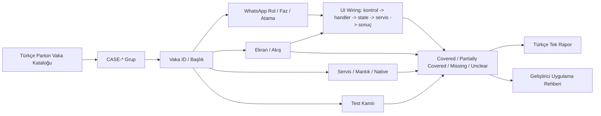
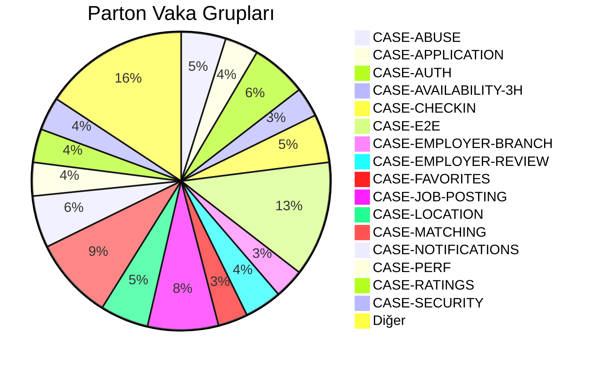
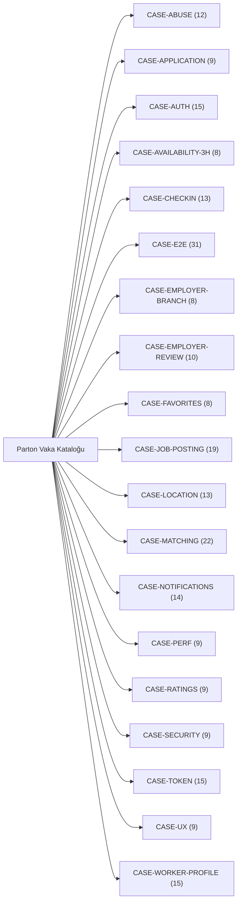
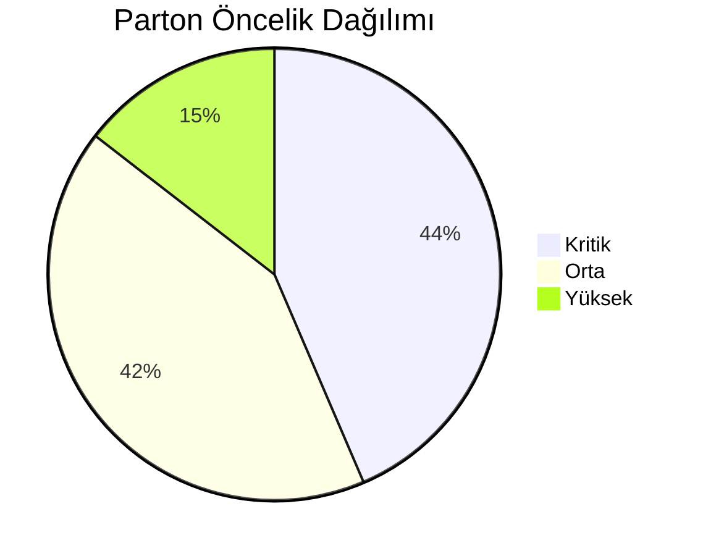
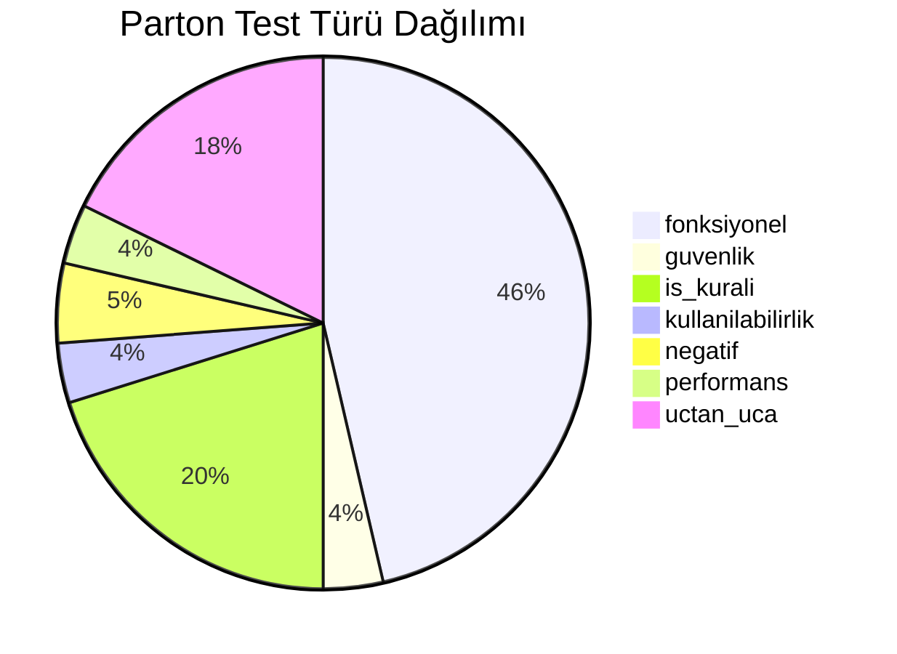
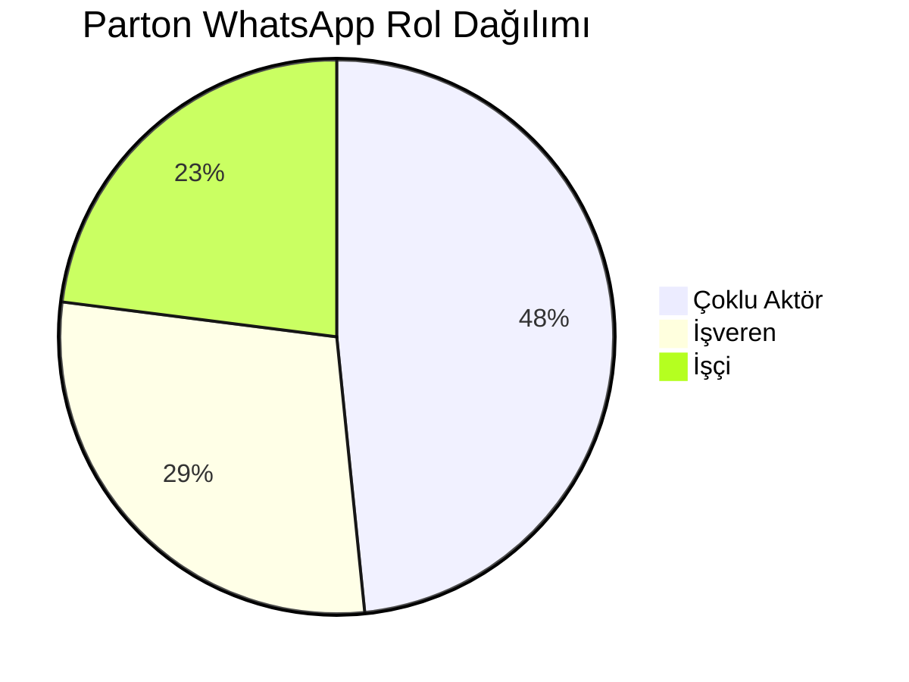
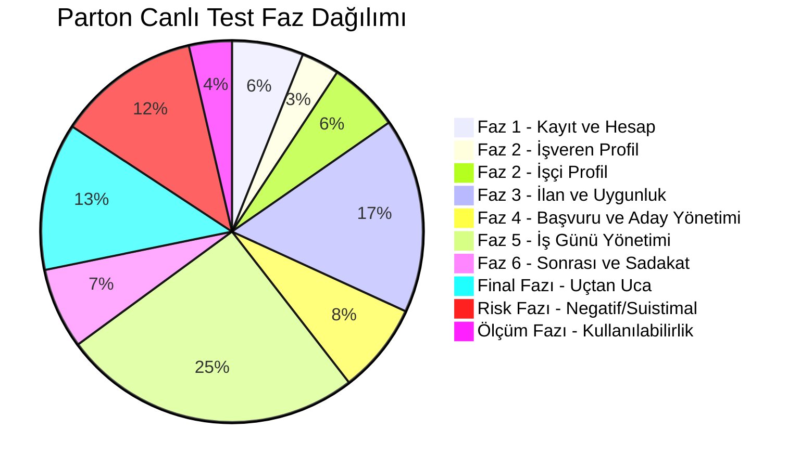
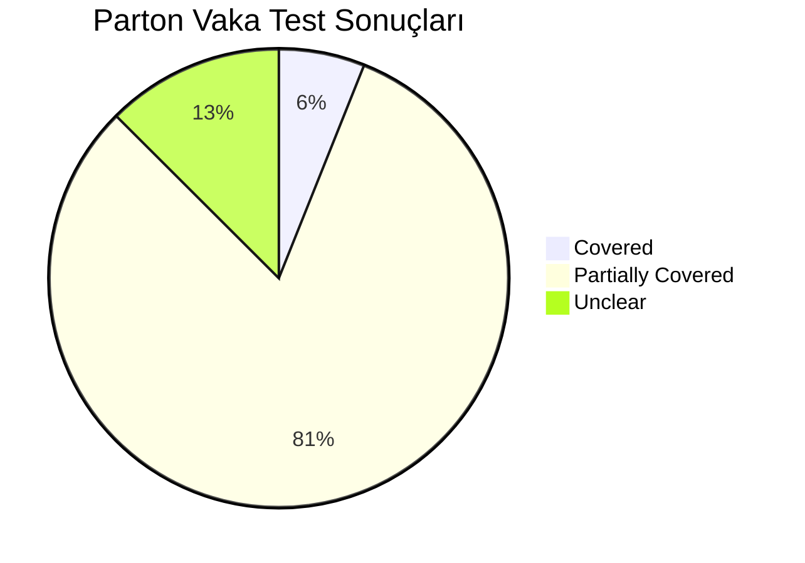

# Parton Vaka Haritası Wiki

Bu sayfa kodbase dokümantasyonunu Türkçe yapılandırılmış Parton vaka kataloğuna bağlamak için kullanılır.

## Vaka Test Eşleştirme Akışı

## Vaka Grubu Dağılımı

## Vaka Grubu Haritası

## Öncelik Dağılımı

## Test Türü Dağılımı

## WhatsApp Rol Dağılımı

## Canlı Test Faz Dağılımı

## Vaka Test Sonuç Dağılımı

## Grup Bazlı Öncelik Matrisi

| Grup | Kritik | Yüksek | Orta | Toplam |
| --- | --- | --- | --- | --- |
| `CASE-ABUSE` | 3 | 0 | 9 | 12 |
| `CASE-APPLICATION` | 4 | 1 | 4 | 9 |
| `CASE-AUTH` | 6 | 0 | 9 | 15 |
| `CASE-AVAILABILITY-3H` | 0 | 1 | 7 | 8 |
| `CASE-CHECKIN` | 13 | 0 | 0 | 13 |
| `CASE-E2E` | 31 | 0 | 0 | 31 |
| `CASE-EMPLOYER-BRANCH` | 1 | 0 | 7 | 8 |
| `CASE-EMPLOYER-REVIEW` | 1 | 2 | 7 | 10 |
| `CASE-FAVORITES` | 0 | 0 | 8 | 8 |
| `CASE-JOB-POSTING` | 2 | 1 | 16 | 19 |
| `CASE-LOCATION` | 13 | 0 | 0 | 13 |
| `CASE-MATCHING` | 1 | 8 | 13 | 22 |
| `CASE-NOTIFICATIONS` | 1 | 13 | 0 | 14 |
| `CASE-PERF` | 2 | 3 | 4 | 9 |
| `CASE-RATINGS` | 0 | 1 | 8 | 9 |
| `CASE-SECURITY` | 9 | 0 | 0 | 9 |
| `CASE-TOKEN` | 15 | 0 | 0 | 15 |
| `CASE-UX` | 3 | 2 | 4 | 9 |
| `CASE-WORKER-PROFILE` | 3 | 4 | 8 | 15 |

## Grup Bazlı Test Türü Matrisi

| Grup | Fonksiyonel | Guvenlik | Is Kurali | Kullanilabilirlik | Negatif | Performans | Uctan Uca | Toplam |
| --- | --- | --- | --- | --- | --- | --- | --- | --- |
| `CASE-ABUSE` | 0 | 0 | 0 | 0 | 12 | 0 | 0 | 12 |
| `CASE-APPLICATION` | 9 | 0 | 0 | 0 | 0 | 0 | 0 | 9 |
| `CASE-AUTH` | 15 | 0 | 0 | 0 | 0 | 0 | 0 | 15 |
| `CASE-AVAILABILITY-3H` | 8 | 0 | 0 | 0 | 0 | 0 | 0 | 8 |
| `CASE-CHECKIN` | 0 | 0 | 0 | 0 | 0 | 0 | 13 | 13 |
| `CASE-E2E` | 0 | 0 | 0 | 0 | 0 | 0 | 31 | 31 |
| `CASE-EMPLOYER-BRANCH` | 8 | 0 | 0 | 0 | 0 | 0 | 0 | 8 |
| `CASE-EMPLOYER-REVIEW` | 10 | 0 | 0 | 0 | 0 | 0 | 0 | 10 |
| `CASE-FAVORITES` | 8 | 0 | 0 | 0 | 0 | 0 | 0 | 8 |
| `CASE-JOB-POSTING` | 19 | 0 | 0 | 0 | 0 | 0 | 0 | 19 |
| `CASE-LOCATION` | 0 | 0 | 13 | 0 | 0 | 0 | 0 | 13 |
| `CASE-MATCHING` | 0 | 0 | 22 | 0 | 0 | 0 | 0 | 22 |
| `CASE-NOTIFICATIONS` | 14 | 0 | 0 | 0 | 0 | 0 | 0 | 14 |
| `CASE-PERF` | 0 | 0 | 0 | 0 | 0 | 9 | 0 | 9 |
| `CASE-RATINGS` | 9 | 0 | 0 | 0 | 0 | 0 | 0 | 9 |
| `CASE-SECURITY` | 0 | 9 | 0 | 0 | 0 | 0 | 0 | 9 |
| `CASE-TOKEN` | 0 | 0 | 15 | 0 | 0 | 0 | 0 | 15 |
| `CASE-UX` | 0 | 0 | 0 | 9 | 0 | 0 | 0 | 9 |
| `CASE-WORKER-PROFILE` | 15 | 0 | 0 | 0 | 0 | 0 | 0 | 15 |

## Grup Detay Sayfaları

| Grup Sayfası | Vaka Sayısı | İçerik |
| --- | --- | --- |
| [CASE-ABUSE](case-tests/case-abuse.md) | 12 | Öncelik, test türü, sonuç durumu, güven ve test kalitesi görselleştirmesi |
| [CASE-APPLICATION](case-tests/case-application.md) | 9 | Öncelik, test türü, sonuç durumu, güven ve test kalitesi görselleştirmesi |
| [CASE-AUTH](case-tests/case-auth.md) | 15 | Öncelik, test türü, sonuç durumu, güven ve test kalitesi görselleştirmesi |
| [CASE-AVAILABILITY-3H](case-tests/case-availability-3h.md) | 8 | Öncelik, test türü, sonuç durumu, güven ve test kalitesi görselleştirmesi |
| [CASE-CHECKIN](case-tests/case-checkin.md) | 13 | Öncelik, test türü, sonuç durumu, güven ve test kalitesi görselleştirmesi |
| [CASE-E2E](case-tests/case-e2e.md) | 31 | Öncelik, test türü, sonuç durumu, güven ve test kalitesi görselleştirmesi |
| [CASE-EMPLOYER-BRANCH](case-tests/case-employer-branch.md) | 8 | Öncelik, test türü, sonuç durumu, güven ve test kalitesi görselleştirmesi |
| [CASE-EMPLOYER-REVIEW](case-tests/case-employer-review.md) | 10 | Öncelik, test türü, sonuç durumu, güven ve test kalitesi görselleştirmesi |
| [CASE-FAVORITES](case-tests/case-favorites.md) | 8 | Öncelik, test türü, sonuç durumu, güven ve test kalitesi görselleştirmesi |
| [CASE-JOB-POSTING](case-tests/case-job-posting.md) | 19 | Öncelik, test türü, sonuç durumu, güven ve test kalitesi görselleştirmesi |
| [CASE-LOCATION](case-tests/case-location.md) | 13 | Öncelik, test türü, sonuç durumu, güven ve test kalitesi görselleştirmesi |
| [CASE-MATCHING](case-tests/case-matching.md) | 22 | Öncelik, test türü, sonuç durumu, güven ve test kalitesi görselleştirmesi |
| [CASE-NOTIFICATIONS](case-tests/case-notifications.md) | 14 | Öncelik, test türü, sonuç durumu, güven ve test kalitesi görselleştirmesi |
| [CASE-PERF](case-tests/case-perf.md) | 9 | Öncelik, test türü, sonuç durumu, güven ve test kalitesi görselleştirmesi |
| [CASE-RATINGS](case-tests/case-ratings.md) | 9 | Öncelik, test türü, sonuç durumu, güven ve test kalitesi görselleştirmesi |
| [CASE-SECURITY](case-tests/case-security.md) | 9 | Öncelik, test türü, sonuç durumu, güven ve test kalitesi görselleştirmesi |
| [CASE-TOKEN](case-tests/case-token.md) | 15 | Öncelik, test türü, sonuç durumu, güven ve test kalitesi görselleştirmesi |
| [CASE-UX](case-tests/case-ux.md) | 9 | Öncelik, test türü, sonuç durumu, güven ve test kalitesi görselleştirmesi |
| [CASE-WORKER-PROFILE](case-tests/case-worker-profile.md) | 15 | Öncelik, test türü, sonuç durumu, güven ve test kalitesi görselleştirmesi |

## Vaka Grupları

| Grup | Vaka | Eşleştirme Kuralı |
| --- | --- | --- |
| `CASE-ABUSE` | 12 | Ekran/modül/test kanıtı ile eşleştir |
| `CASE-APPLICATION` | 9 | Ekran/modül/test kanıtı ile eşleştir |
| `CASE-AUTH` | 15 | Ekran/modül/test kanıtı ile eşleştir |
| `CASE-AVAILABILITY-3H` | 8 | Ekran/modül/test kanıtı ile eşleştir |
| `CASE-CHECKIN` | 13 | Ekran/modül/test kanıtı ile eşleştir |
| `CASE-E2E` | 31 | Ekran/modül/test kanıtı ile eşleştir |
| `CASE-EMPLOYER-BRANCH` | 8 | Ekran/modül/test kanıtı ile eşleştir |
| `CASE-EMPLOYER-REVIEW` | 10 | Ekran/modül/test kanıtı ile eşleştir |
| `CASE-FAVORITES` | 8 | Ekran/modül/test kanıtı ile eşleştir |
| `CASE-JOB-POSTING` | 19 | Ekran/modül/test kanıtı ile eşleştir |
| `CASE-LOCATION` | 13 | Ekran/modül/test kanıtı ile eşleştir |
| `CASE-MATCHING` | 22 | Ekran/modül/test kanıtı ile eşleştir |
| `CASE-NOTIFICATIONS` | 14 | Ekran/modül/test kanıtı ile eşleştir |
| `CASE-PERF` | 9 | Ekran/modül/test kanıtı ile eşleştir |
| `CASE-RATINGS` | 9 | Ekran/modül/test kanıtı ile eşleştir |
| `CASE-SECURITY` | 9 | Ekran/modül/test kanıtı ile eşleştir |
| `CASE-TOKEN` | 15 | Ekran/modül/test kanıtı ile eşleştir |
| `CASE-UX` | 9 | Ekran/modül/test kanıtı ile eşleştir |
| `CASE-WORKER-PROFILE` | 15 | Ekran/modül/test kanıtı ile eşleştir |

## Eşleştirme Gereksinimleri

- `vaka_id` ve `grup_kodu` sabit kimlikler olarak korunmalıdır.
- Her kritik/yüksek öncelikli vaka; ekranlar, giriş noktaları, mantık dosyaları, servis çağrıları, native/platform dosyaları ve varsa testlerle eşleştirilmelidir.
- Kanıt eksikse vaka `Unclear` veya `Partially Covered` kalmalıdır; isim benzerliğinden kapsama çıkarımı yapılmamalıdır.
- Nihai eşleştirmeler Türkçe tek rapora ve izlenebilirlik matrisine geri taşınmalıdır.
