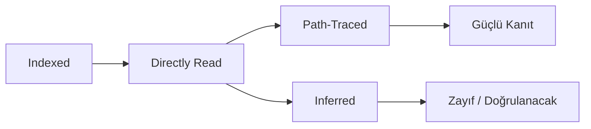

# Kanıt Defteri Wiki: StaffMatch

| Alan | Dosya | Sembol / Fonksiyon | Akış | İnceleme Derinliği | Gözlenen Davranış | Doğrudan mı Çıkarım mı | Neden Önemli |
| --- | --- | --- | --- | --- | --- | --- | --- |
| Tamamlanacak | Tamamlanacak | Tamamlanacak | Tamamlanacak | Indexed / Directly Read / Path-Traced / Inferred | Tamamlanacak | Tamamlanacak | Tamamlanacak |

## Kanıt Akışı Görselleştirmesi

## Kurallar

- `Indexed`: dosya bulundu ama derin okunmadı.
- `Directly Read`: dosya içeriği incelendi.
- `Path-Traced`: davranış birden çok dosya boyunca izlendi.
- `Inferred`: sonuç daha zayıftır ve doğrudan kapsama kanıtı olarak kullanılmamalıdır.
