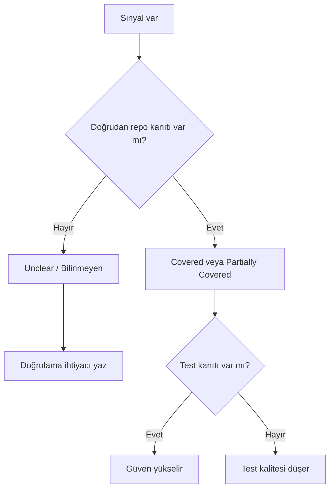

# Bilinmeyenler ve Çelişkiler Wiki: StaffMatch

## Varsayımlar ve Bilinmeyenler

| Alan | Varsayım / Bilinmeyen | Etki | Gerekli Doğrulama |
| --- | --- | --- | --- |
| Tamamlanacak | Tamamlanacak | Tamamlanacak | Tamamlanacak |

## Çelişkiler

| Alan | Gözlenen Çelişki | Olası Etki | Önerilen Takip |
| --- | --- | --- | --- |
| Tamamlanacak | Tamamlanacak | Tamamlanacak | Tamamlanacak |

## Belirsizlik Karar Ağacı

## Konservatif Kural

- Eksik kanıt küçük not değildir; durum ve güven skorunu değiştirir.
- Backend veya SDK sahipli davranış, repo kanıtlamıyorsa bilinmeyen kalmalıdır.
