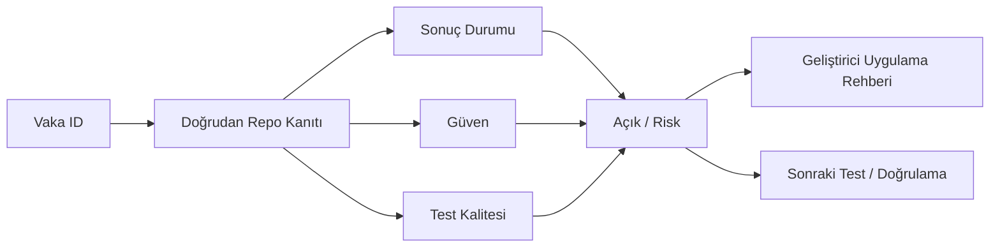
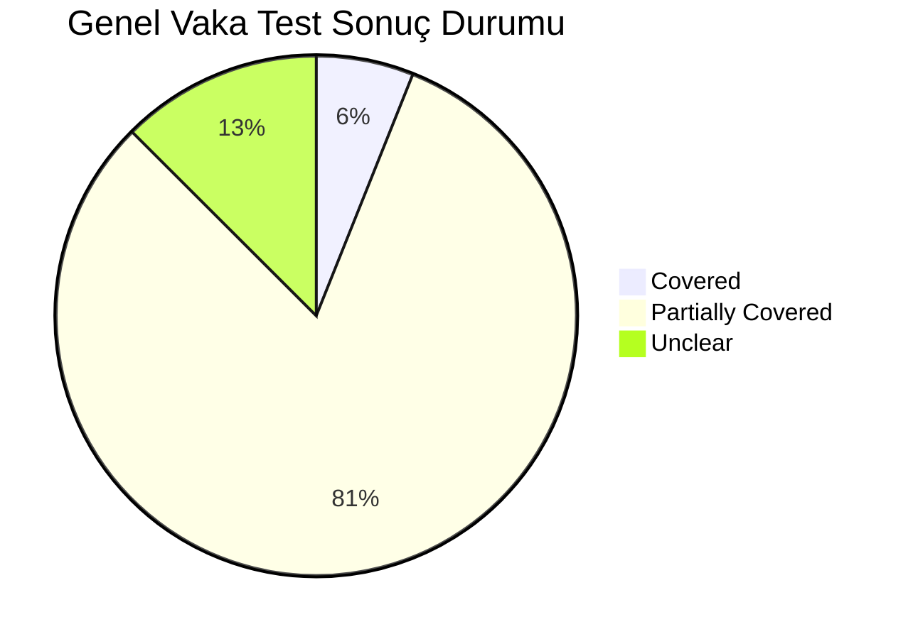
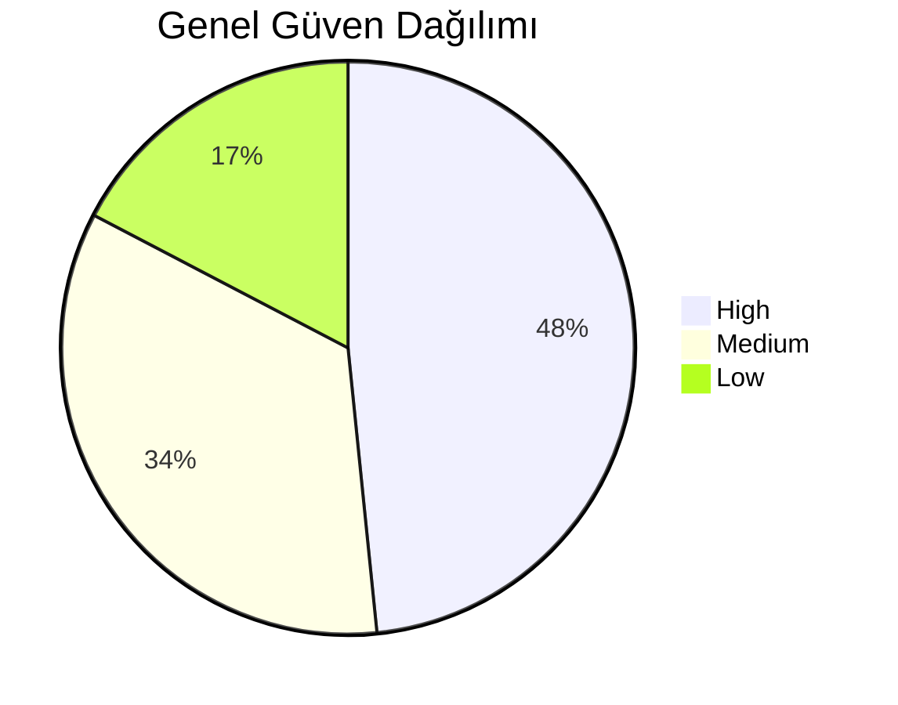
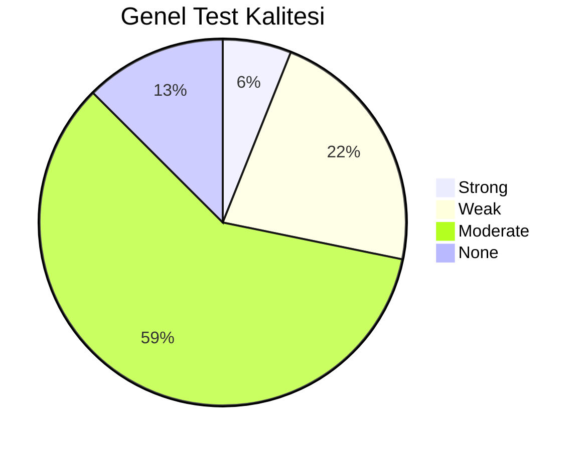

# Vaka Test Sonuçları Wiki

Bu sayfa Parton vaka test sonuçlarını görselleştirir. Sonuçlar yalnızca doğrudan repo kanıtı veya açıkça sağlanan sonuç JSON'u ile doldurulmalıdır.

- Sonuç kaynağı: `/Users/hakanbilir/MyDevZone/StaffMatch/parton-case-results.json`
- Toplam vaka: `248`

## Sonuç Karar Akışı

## Genel Durum Dağılımı

## Genel Güven Dağılımı

## Genel Test Kalitesi Dağılımı

## Grup Bazlı Sonuç Isı Haritası

| Grup | Covered | Partially Covered | Missing | Unclear | Not Applicable | Tamamlanacak | Toplam |
| --- | --- | --- | --- | --- | --- | --- | --- |
| `CASE-ABUSE` | 0 | 12 | 0 | 0 | 0 | 0 | 12 |
| `CASE-APPLICATION` | 0 | 9 | 0 | 0 | 0 | 0 | 9 |
| `CASE-AUTH` | 0 | 15 | 0 | 0 | 0 | 0 | 15 |
| `CASE-AVAILABILITY-3H` | 0 | 8 | 0 | 0 | 0 | 0 | 8 |
| `CASE-CHECKIN` | 0 | 13 | 0 | 0 | 0 | 0 | 13 |
| `CASE-E2E` | 0 | 0 | 0 | 31 | 0 | 0 | 31 |
| `CASE-EMPLOYER-BRANCH` | 0 | 8 | 0 | 0 | 0 | 0 | 8 |
| `CASE-EMPLOYER-REVIEW` | 0 | 10 | 0 | 0 | 0 | 0 | 10 |
| `CASE-FAVORITES` | 0 | 8 | 0 | 0 | 0 | 0 | 8 |
| `CASE-JOB-POSTING` | 0 | 19 | 0 | 0 | 0 | 0 | 19 |
| `CASE-LOCATION` | 0 | 13 | 0 | 0 | 0 | 0 | 13 |
| `CASE-MATCHING` | 0 | 22 | 0 | 0 | 0 | 0 | 22 |
| `CASE-NOTIFICATIONS` | 0 | 14 | 0 | 0 | 0 | 0 | 14 |
| `CASE-PERF` | 0 | 9 | 0 | 0 | 0 | 0 | 9 |
| `CASE-RATINGS` | 0 | 9 | 0 | 0 | 0 | 0 | 9 |
| `CASE-SECURITY` | 0 | 9 | 0 | 0 | 0 | 0 | 9 |
| `CASE-TOKEN` | 15 | 0 | 0 | 0 | 0 | 0 | 15 |
| `CASE-UX` | 0 | 9 | 0 | 0 | 0 | 0 | 9 |
| `CASE-WORKER-PROFILE` | 0 | 15 | 0 | 0 | 0 | 0 | 15 |

## Grup Bazlı Sonuç Özeti

| Grup | Toplam | Covered | Partially Covered | Missing | Unclear | Tamamlanacak | Açık / Belirsiz |
| --- | --- | --- | --- | --- | --- | --- | --- |
| [CASE-ABUSE](case-tests/case-abuse.md) | 12 | 0 | 12 | 0 | 0 | 0 | 12 |
| [CASE-APPLICATION](case-tests/case-application.md) | 9 | 0 | 9 | 0 | 0 | 0 | 9 |
| [CASE-AUTH](case-tests/case-auth.md) | 15 | 0 | 15 | 0 | 0 | 0 | 15 |
| [CASE-AVAILABILITY-3H](case-tests/case-availability-3h.md) | 8 | 0 | 8 | 0 | 0 | 0 | 8 |
| [CASE-CHECKIN](case-tests/case-checkin.md) | 13 | 0 | 13 | 0 | 0 | 0 | 13 |
| [CASE-E2E](case-tests/case-e2e.md) | 31 | 0 | 0 | 0 | 31 | 0 | 31 |
| [CASE-EMPLOYER-BRANCH](case-tests/case-employer-branch.md) | 8 | 0 | 8 | 0 | 0 | 0 | 8 |
| [CASE-EMPLOYER-REVIEW](case-tests/case-employer-review.md) | 10 | 0 | 10 | 0 | 0 | 0 | 10 |
| [CASE-FAVORITES](case-tests/case-favorites.md) | 8 | 0 | 8 | 0 | 0 | 0 | 8 |
| [CASE-JOB-POSTING](case-tests/case-job-posting.md) | 19 | 0 | 19 | 0 | 0 | 0 | 19 |
| [CASE-LOCATION](case-tests/case-location.md) | 13 | 0 | 13 | 0 | 0 | 0 | 13 |
| [CASE-MATCHING](case-tests/case-matching.md) | 22 | 0 | 22 | 0 | 0 | 0 | 22 |
| [CASE-NOTIFICATIONS](case-tests/case-notifications.md) | 14 | 0 | 14 | 0 | 0 | 0 | 14 |
| [CASE-PERF](case-tests/case-perf.md) | 9 | 0 | 9 | 0 | 0 | 0 | 9 |
| [CASE-RATINGS](case-tests/case-ratings.md) | 9 | 0 | 9 | 0 | 0 | 0 | 9 |
| [CASE-SECURITY](case-tests/case-security.md) | 9 | 0 | 9 | 0 | 0 | 0 | 9 |
| [CASE-TOKEN](case-tests/case-token.md) | 15 | 15 | 0 | 0 | 0 | 0 | 0 |
| [CASE-UX](case-tests/case-ux.md) | 9 | 0 | 9 | 0 | 0 | 0 | 9 |
| [CASE-WORKER-PROFILE](case-tests/case-worker-profile.md) | 15 | 0 | 15 | 0 | 0 | 0 | 15 |

## Kritik / Yüksek Öncelikli Açık Sonuçlar

| Vaka ID | Grup | Öncelik | Başlık | Durum | Güven | Test Kalitesi | Açık |
| --- | --- | --- | --- | --- | --- | --- | --- |
| `T-003` | `CASE-AUTH` | Kritik | Aynı telefon ile ikinci kez kayıt engeli | Partially Covered | High | Moderate | Brute-force/rate-limit ve sunucu tarafı ihlal korumaları client repoda kanıtlanamıyor. |
| `T-005` | `CASE-AUTH` | Kritik | Yanlış SMS doğrulama kodu | Partially Covered | High | Moderate | Brute-force/rate-limit ve sunucu tarafı ihlal korumaları client repoda kanıtlanamıyor. |
| `T-006` | `CASE-AUTH` | Kritik | Süresi geçmiş doğrulama kodu | Partially Covered | High | Moderate | Brute-force/rate-limit ve sunucu tarafı ihlal korumaları client repoda kanıtlanamıyor. |
| `T-009` | `CASE-AUTH` | Kritik | Konum izni vermeden kayıt tamamlama | Partially Covered | High | Moderate | Brute-force/rate-limit ve sunucu tarafı ihlal korumaları client repoda kanıtlanamıyor. |
| `T-014` | `CASE-AUTH` | Kritik | Yetkisiz kullanıcının şube açma denemesi | Partially Covered | High | Moderate | Brute-force/rate-limit ve sunucu tarafı ihlal korumaları client repoda kanıtlanamıyor. |
| `T-015` | `CASE-AUTH` | Kritik | Firma doğrulaması olmadan ilan açma denemesi | Partially Covered | High | Moderate | Brute-force/rate-limit ve sunucu tarafı ihlal korumaları client repoda kanıtlanamıyor. |
| `T-016` | `CASE-WORKER-PROFILE` | Yüksek | Uygun gün seçiminin doğru kaydedilmesi | Partially Covered | Medium | Moderate | Profil tamamlama edge-case senaryolarında E2E ve veri migrasyon güvence kapsamı sınırlı. |
| `T-018` | `CASE-WORKER-PROFILE` | Kritik | Çakışan saat aralıklarını engelleme | Partially Covered | Medium | Moderate | Profil tamamlama edge-case senaryolarında E2E ve veri migrasyon güvence kapsamı sınırlı. |
| `T-019` | `CASE-WORKER-PROFILE` | Yüksek | Gece vardiyası uygunluğu tanımlama | Partially Covered | Medium | Moderate | Profil tamamlama edge-case senaryolarında E2E ve veri migrasyon güvence kapsamı sınırlı. |
| `T-025` | `CASE-WORKER-PROFILE` | Kritik | Konum pinleme doğruluğu | Partially Covered | Medium | Moderate | Profil tamamlama edge-case senaryolarında E2E ve veri migrasyon güvence kapsamı sınırlı. |
| `T-026` | `CASE-WORKER-PROFILE` | Yüksek | Profil güncelleme sonrası eşleşme güncelleniyor mu | Partially Covered | Medium | Moderate | Profil tamamlama edge-case senaryolarında E2E ve veri migrasyon güvence kapsamı sınırlı. |
| `T-028` | `CASE-WORKER-PROFILE` | Yüksek | Cinsiyet değişikliği sonrası eşleşme güncelleniyor mu | Partially Covered | Medium | Moderate | Profil tamamlama edge-case senaryolarında E2E ve veri migrasyon güvence kapsamı sınırlı. |
| `T-029` | `CASE-WORKER-PROFILE` | Kritik | Eksik profille başvuru engeli | Partially Covered | Medium | Moderate | Profil tamamlama edge-case senaryolarında E2E ve veri migrasyon güvence kapsamı sınırlı. |
| `T-033` | `CASE-EMPLOYER-BRANCH` | Kritik | Şube konumunun doğru kaydedilmesi | Partially Covered | Medium | Weak | Branch yetki sınırları çoğunlukla rule/backend tarafında; client kanıtı tek başına yeterli değil. |
| `T-049` | `CASE-JOB-POSTING` | Kritik | Yetersiz jeton ile ilan açma denemesi | Partially Covered | High | Moderate | Bazı ilan kısıtları backend side doğrulanıyor; tüm kenar koşullar için E2E yok. |
| `T-050` | `CASE-JOB-POSTING` | Kritik | Yeterli jeton ile provizyona alma | Partially Covered | High | Moderate | Bazı ilan kısıtları backend side doğrulanıyor; tüm kenar koşullar için E2E yok. |
| `T-057` | `CASE-JOB-POSTING` | Yüksek | Favorilere özel ilanda uygun aday yoksa davranış | Partially Covered | High | Moderate | Bazı ilan kısıtları backend side doğrulanıyor; tüm kenar koşullar için E2E yok. |
| `T-058` | `CASE-MATCHING` | Yüksek | Uygun gün eşleşmesi | Partially Covered | High | Moderate | İş kuralı açıklanabilirliği ve fairness analitiği/guardrail testleri sınırlı. |
| `T-059` | `CASE-MATCHING` | Yüksek | Uygun olmayan gün için ilanın gösterilmemesi | Partially Covered | High | Moderate | İş kuralı açıklanabilirliği ve fairness analitiği/guardrail testleri sınırlı. |
| `T-060` | `CASE-MATCHING` | Yüksek | Uygun saat eşleşmesi | Partially Covered | High | Moderate | İş kuralı açıklanabilirliği ve fairness analitiği/guardrail testleri sınırlı. |
| `T-061` | `CASE-MATCHING` | Yüksek | Uygun olmayan saat için ilanın gösterilmemesi | Partially Covered | High | Moderate | İş kuralı açıklanabilirliği ve fairness analitiği/guardrail testleri sınırlı. |
| `T-068` | `CASE-MATCHING` | Kritik | Konum yakınlığına göre sıralama | Partially Covered | High | Moderate | İş kuralı açıklanabilirliği ve fairness analitiği/guardrail testleri sınırlı. |
| `T-069` | `CASE-MATCHING` | Yüksek | Çoklu sektör seçen işçiye tüm uygun ilanların görünmesi | Partially Covered | High | Moderate | İş kuralı açıklanabilirliği ve fairness analitiği/guardrail testleri sınırlı. |
| `T-070` | `CASE-MATCHING` | Yüksek | Çoklu meslek seçen işçiye tüm uygun ilanların görünmesi | Partially Covered | High | Moderate | İş kuralı açıklanabilirliği ve fairness analitiği/guardrail testleri sınırlı. |
| `T-073` | `CASE-MATCHING` | Yüksek | Gece vardiyası eşleşmesi | Partially Covered | High | Moderate | İş kuralı açıklanabilirliği ve fairness analitiği/guardrail testleri sınırlı. |
| `T-077` | `CASE-MATCHING` | Yüksek | En yüksek eşleşme skorunun üstte görünmesi | Partially Covered | High | Moderate | İş kuralı açıklanabilirliği ve fairness analitiği/guardrail testleri sınırlı. |
| `T-080` | `CASE-APPLICATION` | Yüksek | Uygun ilana başvuru | Partially Covered | High | Moderate | Kuralın tamamı backend rule/API bağımlı; tüm negatif senaryolar için E2E yok. |
| `T-081` | `CASE-APPLICATION` | Kritik | Aynı ilana ikinci kez başvurunun engellenmesi | Partially Covered | High | Moderate | Kuralın tamamı backend rule/API bağımlı; tüm negatif senaryolar için E2E yok. |
| `T-082` | `CASE-APPLICATION` | Kritik | Profil eksikse başvuru engeli | Partially Covered | High | Moderate | Kuralın tamamı backend rule/API bağımlı; tüm negatif senaryolar için E2E yok. |
| `T-083` | `CASE-APPLICATION` | Kritik | Süresi geçmiş ilana başvuru engeli | Partially Covered | High | Moderate | Kuralın tamamı backend rule/API bağımlı; tüm negatif senaryolar için E2E yok. |
| `T-084` | `CASE-APPLICATION` | Kritik | Kontenjan dolu ilana başvuru engeli | Partially Covered | High | Moderate | Kuralın tamamı backend rule/API bağımlı; tüm negatif senaryolar için E2E yok. |
| `T-094` | `CASE-EMPLOYER-REVIEW` | Kritik | Kontenjan üstü aday onayının engellenmesi | Partially Covered | Medium | Moderate | Moderator/suistimal kararları ve tutarlılık için bağımsız E2E/contract test eksik. |
| `T-096` | `CASE-EMPLOYER-REVIEW` | Yüksek | Red bildirimlerinin doğru gitmesi | Partially Covered | Medium | Moderate | Moderator/suistimal kararları ve tutarlılık için bağımsız E2E/contract test eksik. |
| `T-097` | `CASE-EMPLOYER-REVIEW` | Yüksek | Onay bildirimlerinin doğru gitmesi | Partially Covered | Medium | Moderate | Moderator/suistimal kararları ve tutarlılık için bağımsız E2E/contract test eksik. |
| `T-100` | `CASE-NOTIFICATIONS` | Yüksek | Yeni uygun ilan bildirimi | Partially Covered | High | Moderate | Background delivery ve üretim FCM edge-case’leri için entegrasyon testi kanıtı düşük. |
| `T-101` | `CASE-NOTIFICATIONS` | Yüksek | Başvuru alındı bildirimi | Partially Covered | High | Moderate | Background delivery ve üretim FCM edge-case’leri için entegrasyon testi kanıtı düşük. |
| `T-102` | `CASE-NOTIFICATIONS` | Yüksek | Onay bildirimi | Partially Covered | High | Moderate | Background delivery ve üretim FCM edge-case’leri için entegrasyon testi kanıtı düşük. |
| `T-103` | `CASE-NOTIFICATIONS` | Yüksek | Red bildirimi | Partially Covered | High | Moderate | Background delivery ve üretim FCM edge-case’leri için entegrasyon testi kanıtı düşük. |
| `T-104` | `CASE-NOTIFICATIONS` | Kritik | 3 saat kala check-in bildirimi | Partially Covered | High | Moderate | Background delivery ve üretim FCM edge-case’leri için entegrasyon testi kanıtı düşük. |
| `T-105` | `CASE-NOTIFICATIONS` | Yüksek | 10 dakika kala işe geldim bildirimi | Partially Covered | High | Moderate | Background delivery ve üretim FCM edge-case’leri için entegrasyon testi kanıtı düşük. |
| `T-106` | `CASE-NOTIFICATIONS` | Yüksek | 24 saat sonra değerlendirme bildirimi | Partially Covered | High | Moderate | Background delivery ve üretim FCM edge-case’leri için entegrasyon testi kanıtı düşük. |
| `T-107` | `CASE-NOTIFICATIONS` | Yüksek | Favori işveren ilan bildirimi | Partially Covered | High | Moderate | Background delivery ve üretim FCM edge-case’leri için entegrasyon testi kanıtı düşük. |
| `T-108` | `CASE-NOTIFICATIONS` | Yüksek | Sadece favorilere özel bildirim | Partially Covered | High | Moderate | Background delivery ve üretim FCM edge-case’leri için entegrasyon testi kanıtı düşük. |
| `T-109` | `CASE-NOTIFICATIONS` | Yüksek | Bildirim tıklanınca doğru ekrana yönlendirme | Partially Covered | High | Moderate | Background delivery ve üretim FCM edge-case’leri için entegrasyon testi kanıtı düşük. |
| `T-110` | `CASE-NOTIFICATIONS` | Yüksek | Çift bildirim oluşmaması | Partially Covered | High | Moderate | Background delivery ve üretim FCM edge-case’leri için entegrasyon testi kanıtı düşük. |
| `T-111` | `CASE-NOTIFICATIONS` | Yüksek | Push kapalıysa uygulama içi bildirim | Partially Covered | High | Moderate | Background delivery ve üretim FCM edge-case’leri için entegrasyon testi kanıtı düşük. |
| `T-112` | `CASE-NOTIFICATIONS` | Yüksek | Gecikmeli bildirim senaryosu | Partially Covered | High | Moderate | Background delivery ve üretim FCM edge-case’leri için entegrasyon testi kanıtı düşük. |
| `T-113` | `CASE-NOTIFICATIONS` | Yüksek | Yanlış kullanıcıya bildirim gitmemesi | Partially Covered | High | Moderate | Background delivery ve üretim FCM edge-case’leri için entegrasyon testi kanıtı düşük. |
| `T-114` | `CASE-AVAILABILITY-3H` | Yüksek | İşçiye 3 saat kala bildirim gitmesi | Partially Covered | Medium | Weak | 3 saat kuralının uçtan uca zorlaması ve timezone kenar durumları için doğrudan kanıt sınırlı. |
| `T-123` | `CASE-CHECKIN` | Kritik | 10 dakika kala bildirim gitmesi | Partially Covered | High | Moderate | Sahte GPS/anti-spoof ve cihaz manipülasyonlarına karşı güçlü backend kanıtı bu repoda görünmüyor. |
| `T-124` | `CASE-CHECKIN` | Kritik | İşçinin “işe geldim” seçmesi | Partially Covered | High | Moderate | Sahte GPS/anti-spoof ve cihaz manipülasyonlarına karşı güçlü backend kanıtı bu repoda görünmüyor. |
| `T-125` | `CASE-CHECKIN` | Kritik | Uygun konumdaysa doğrulama başarılı olması | Partially Covered | High | Moderate | Sahte GPS/anti-spoof ve cihaz manipülasyonlarına karşı güçlü backend kanıtı bu repoda görünmüyor. |
| `T-126` | `CASE-CHECKIN` | Kritik | Uygun konumda değilse reddedilmesi | Partially Covered | High | Moderate | Sahte GPS/anti-spoof ve cihaz manipülasyonlarına karşı güçlü backend kanıtı bu repoda görünmüyor. |
| `T-127` | `CASE-CHECKIN` | Kritik | GPS sapmasında tolerans testi | Partially Covered | High | Moderate | Sahte GPS/anti-spoof ve cihaz manipülasyonlarına karşı güçlü backend kanıtı bu repoda görünmüyor. |
| `T-128` | `CASE-CHECKIN` | Kritik | Düşük internetle tekrar deneme | Partially Covered | High | Moderate | Sahte GPS/anti-spoof ve cihaz manipülasyonlarına karşı güçlü backend kanıtı bu repoda görünmüyor. |
| `T-129` | `CASE-CHECKIN` | Kritik | Erken check-in denemesi | Partially Covered | High | Moderate | Sahte GPS/anti-spoof ve cihaz manipülasyonlarına karşı güçlü backend kanıtı bu repoda görünmüyor. |
| `T-130` | `CASE-CHECKIN` | Kritik | Geç check-in denemesi | Partially Covered | High | Moderate | Sahte GPS/anti-spoof ve cihaz manipülasyonlarına karşı güçlü backend kanıtı bu repoda görünmüyor. |
| `T-131` | `CASE-CHECKIN` | Kritik | Sahte konumla check-in denemesi | Partially Covered | High | Moderate | Sahte GPS/anti-spoof ve cihaz manipülasyonlarına karşı güçlü backend kanıtı bu repoda görünmüyor. |
| `T-132` | `CASE-CHECKIN` | Kritik | Konum izni kapalıyken check-in denemesi | Partially Covered | High | Moderate | Sahte GPS/anti-spoof ve cihaz manipülasyonlarına karşı güçlü backend kanıtı bu repoda görünmüyor. |
| `T-133` | `CASE-CHECKIN` | Kritik | İşverenin işçi geldi bildirimi alması | Partially Covered | High | Moderate | Sahte GPS/anti-spoof ve cihaz manipülasyonlarına karşı güçlü backend kanıtı bu repoda görünmüyor. |
| `T-134` | `CASE-CHECKIN` | Kritik | Manuel doğrulama akışı varsa testi | Partially Covered | High | Moderate | Sahte GPS/anti-spoof ve cihaz manipülasyonlarına karşı güçlü backend kanıtı bu repoda görünmüyor. |
| `T-135` | `CASE-CHECKIN` | Kritik | Hatalı reddedilmiş check-in için itiraz süreci | Partially Covered | High | Moderate | Sahte GPS/anti-spoof ve cihaz manipülasyonlarına karşı güçlü backend kanıtı bu repoda görünmüyor. |
| `T-136` | `CASE-LOCATION` | Kritik | Şube koordinatı doğruysa doğrulama | Partially Covered | High | Moderate | Gerçek cihaz/OS varyasyonları ve spoof tespiti için runtime kanıt yok. |
| `T-137` | `CASE-LOCATION` | Kritik | Şube koordinatı yanlışsa hata yakalama | Partially Covered | High | Moderate | Gerçek cihaz/OS varyasyonları ve spoof tespiti için runtime kanıt yok. |
| `T-138` | `CASE-LOCATION` | Kritik | 50 metre yarıçap doğrulaması | Partially Covered | High | Moderate | Gerçek cihaz/OS varyasyonları ve spoof tespiti için runtime kanıt yok. |
| `T-139` | `CASE-LOCATION` | Kritik | 100 metre yarıçap doğrulaması | Partially Covered | High | Moderate | Gerçek cihaz/OS varyasyonları ve spoof tespiti için runtime kanıt yok. |
| `T-140` | `CASE-LOCATION` | Kritik | Kapalı alanda GPS sapması | Partially Covered | High | Moderate | Gerçek cihaz/OS varyasyonları ve spoof tespiti için runtime kanıt yok. |
| `T-141` | `CASE-LOCATION` | Kritik | AVM içinde lokasyon sapması | Partially Covered | High | Moderate | Gerçek cihaz/OS varyasyonları ve spoof tespiti için runtime kanıt yok. |
| `T-142` | `CASE-LOCATION` | Kritik | Plaza ve çok katlı yapı senaryosu | Partially Covered | High | Moderate | Gerçek cihaz/OS varyasyonları ve spoof tespiti için runtime kanıt yok. |
| `T-143` | `CASE-LOCATION` | Kritik | Kırsal bölgede düşük GPS kalitesi | Partially Covered | High | Moderate | Gerçek cihaz/OS varyasyonları ve spoof tespiti için runtime kanıt yok. |
| `T-144` | `CASE-LOCATION` | Kritik | Wi-Fi destekli konum doğrulama | Partially Covered | High | Moderate | Gerçek cihaz/OS varyasyonları ve spoof tespiti için runtime kanıt yok. |
| `T-145` | `CASE-LOCATION` | Kritik | Hareket halindeyken check-in | Partially Covered | High | Moderate | Gerçek cihaz/OS varyasyonları ve spoof tespiti için runtime kanıt yok. |
| `T-146` | `CASE-LOCATION` | Kritik | Arka planda konum izni yokken davranış | Partially Covered | High | Moderate | Gerçek cihaz/OS varyasyonları ve spoof tespiti için runtime kanıt yok. |
| `T-147` | `CASE-LOCATION` | Kritik | iOS ve Android farkları | Partially Covered | High | Moderate | Gerçek cihaz/OS varyasyonları ve spoof tespiti için runtime kanıt yok. |
| `T-148` | `CASE-LOCATION` | Kritik | Sahte GPS aracı tespiti | Partially Covered | High | Moderate | Gerçek cihaz/OS varyasyonları ve spoof tespiti için runtime kanıt yok. |
| `T-172` | `CASE-RATINGS` | Yüksek | 24 saat sonra değerlendirme bildirimi | Partially Covered | Medium | Moderate | Abuse-resistant puanlama kurallarının tamamı client repoda kanıtlanamıyor. |
| `T-184` | `CASE-ABUSE` | Kritik | Aynı cihazdan çoklu sahte hesap | Partially Covered | Low | Weak | Bot/sahte hesap/cihaz parmak izi gibi suistimal savunmaları client repoda doğrudan kanıtlı değil. |
| `T-185` | `CASE-ABUSE` | Kritik | Sahte ilan açma girişimi | Partially Covered | Low | Weak | Bot/sahte hesap/cihaz parmak izi gibi suistimal savunmaları client repoda doğrudan kanıtlı değil. |
| `T-188` | `CASE-ABUSE` | Kritik | Sahte konumla jeton düşürme denemesi | Partially Covered | Low | Weak | Bot/sahte hesap/cihaz parmak izi gibi suistimal savunmaları client repoda doğrudan kanıtlı değil. |
| `T-193` | `CASE-E2E` | Kritik | İşçi kayıt olur | Unclear | Low | None | E2E otomasyon eksikliği nedeniyle çok-aktör akışların regresyon güvencesi düşük. |
| ... | ... | ... | 49 ek yüksek riskli sonuç | ... | ... | ... | ... |

## Sonuç Hassasiyeti Kuralları

- `Covered` yalnızca doğrudan enforcement kanıtı ve yeterli bağlam varsa kullanılmalıdır.
- Test kanıtı yoksa güven veya test kalitesi düşürülmelidir.
- Backend, SDK veya görünmeyen servis davranışı repoda kanıtlanmıyorsa sonuç `Unclear` veya `Partially Covered` kalmalıdır.
- Bu sayfadaki grafikler sonuçları özetler; grafik tek başına kapsama kanıtı değildir.
