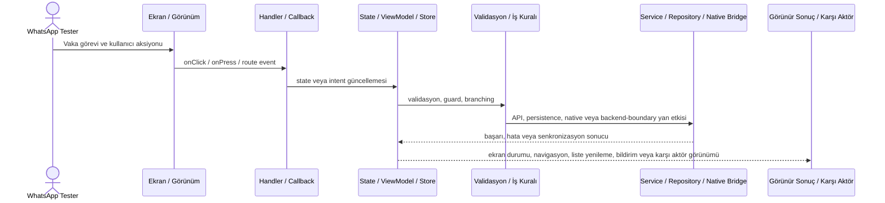
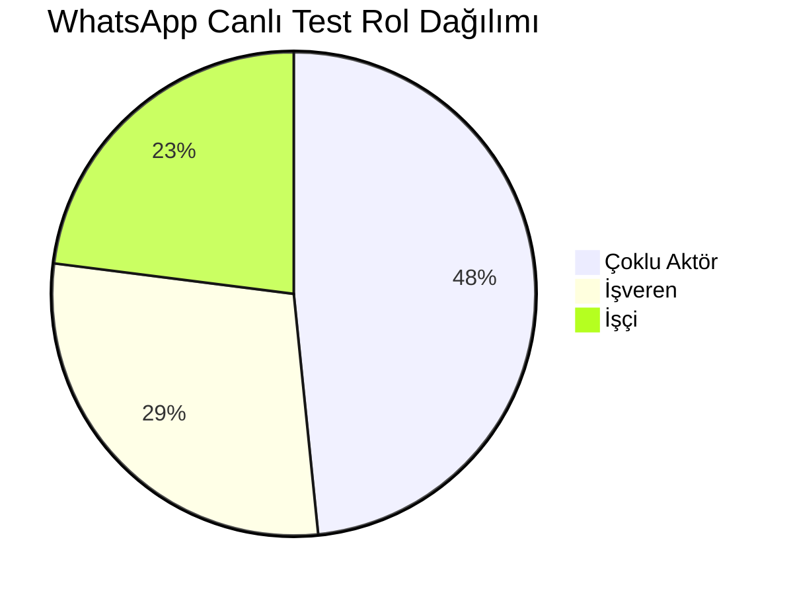
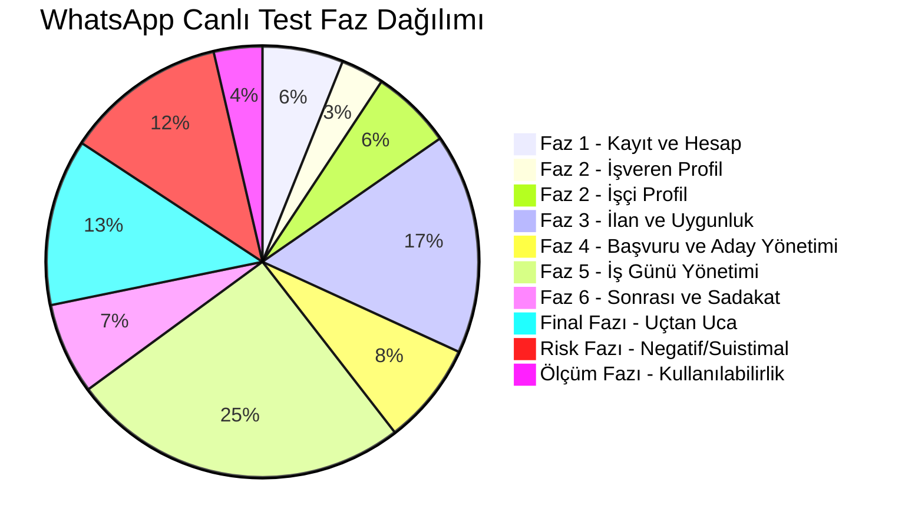
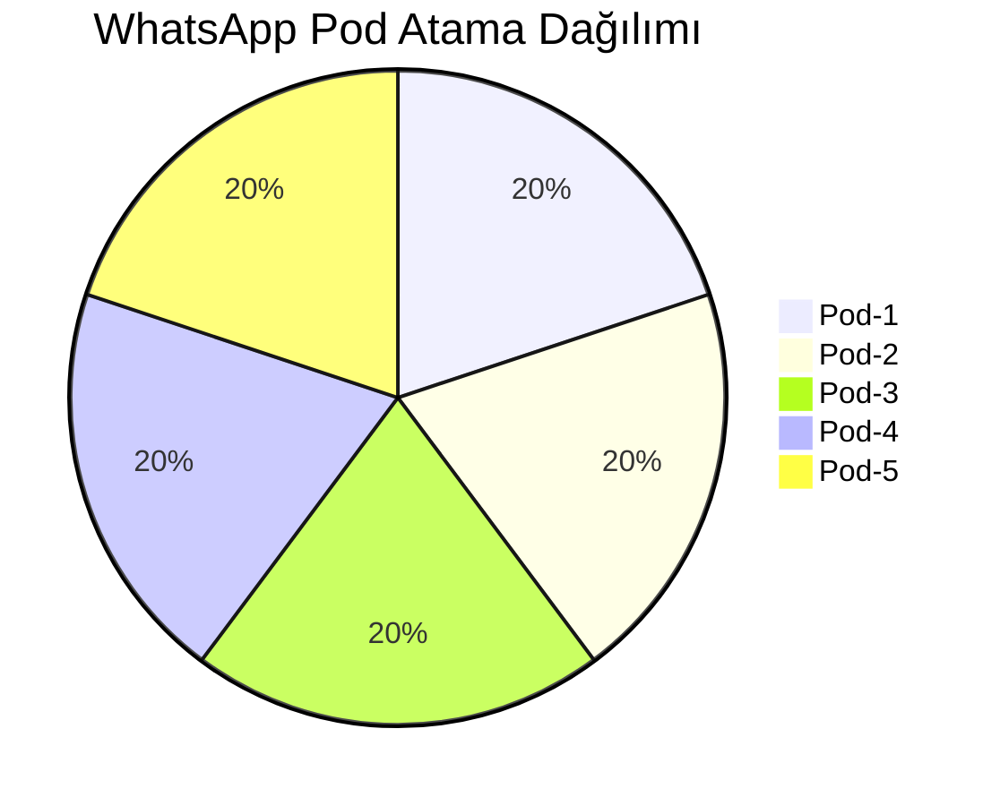

# UI Wiring ve WhatsApp Canlı Test Wiki

Bu sayfa zenginleştirilmiş JSON içindeki WhatsApp görev planını kodbase denetimine bağlar. Buradaki rol, faz ve pod bilgileri uygulama kapsamını planlar; uygulama kapsaması yine yalnızca doğrudan repo kanıtıyla verilir.

- Toplam canlı test ile zenginleştirilmiş vaka: `248`
- Sonuç kaynağı: `/Users/hakanbilir/MyDevZone/StaffMatch/parton-case-results.json`
- UI wiring statüsü: her vaka için kaynak kodda ayrıca doğrulanmalıdır.

## UI Wiring İz Sürme Diyagramı

## Rol Dağılımı

## Canlı Test Faz Dağılımı

## Pod Atama Dağılımı

## UI Wiring Kanıt Matrisi

| Vaka ID | Grup | Rol | Canlı Test Fazı | Pod | Başlık | Zorunlu Kod Zinciri |
| --- | --- | --- | --- | --- | --- | --- |
| `T-001` | `CASE-AUTH` | Çoklu Aktör | Faz 1 - Kayıt ve Hesap | Pod-1 | Geçerli telefon numarası ile kayıt | Ekran/kontrol -> handler -> state/ViewModel/store -> validasyon -> servis/native/API -> görünür sonuç |
| `T-002` | `CASE-AUTH` | Çoklu Aktör | Faz 1 - Kayıt ve Hesap | Pod-2 | Geçerli e-posta ile kayıt | Ekran/kontrol -> handler -> state/ViewModel/store -> validasyon -> servis/native/API -> görünür sonuç |
| `T-003` | `CASE-AUTH` | Çoklu Aktör | Faz 1 - Kayıt ve Hesap | Pod-3 | Aynı telefon ile ikinci kez kayıt engeli | Ekran/kontrol -> handler -> state/ViewModel/store -> validasyon -> servis/native/API -> görünür sonuç |
| `T-004` | `CASE-AUTH` | Çoklu Aktör | Faz 1 - Kayıt ve Hesap | Pod-4 | Eksik alanlarla kayıt denemesi | Ekran/kontrol -> handler -> state/ViewModel/store -> validasyon -> servis/native/API -> görünür sonuç |
| `T-005` | `CASE-AUTH` | Çoklu Aktör | Faz 1 - Kayıt ve Hesap | Pod-5 | Yanlış SMS doğrulama kodu | Ekran/kontrol -> handler -> state/ViewModel/store -> validasyon -> servis/native/API -> görünür sonuç |
| `T-006` | `CASE-AUTH` | Çoklu Aktör | Faz 1 - Kayıt ve Hesap | Pod-1 | Süresi geçmiş doğrulama kodu | Ekran/kontrol -> handler -> state/ViewModel/store -> validasyon -> servis/native/API -> görünür sonuç |
| `T-007` | `CASE-AUTH` | Çoklu Aktör | Faz 1 - Kayıt ve Hesap | Pod-2 | Çok sayıda yanlış kod girişinde bloke | Ekran/kontrol -> handler -> state/ViewModel/store -> validasyon -> servis/native/API -> görünür sonuç |
| `T-008` | `CASE-AUTH` | Çoklu Aktör | Faz 1 - Kayıt ve Hesap | Pod-3 | Zayıf şifre ile kayıt denemesi | Ekran/kontrol -> handler -> state/ViewModel/store -> validasyon -> servis/native/API -> görünür sonuç |
| `T-009` | `CASE-AUTH` | Çoklu Aktör | Faz 1 - Kayıt ve Hesap | Pod-4 | Konum izni vermeden kayıt tamamlama | Ekran/kontrol -> handler -> state/ViewModel/store -> validasyon -> servis/native/API -> görünür sonuç |
| `T-010` | `CASE-AUTH` | Çoklu Aktör | Faz 1 - Kayıt ve Hesap | Pod-5 | Kayıt sonrası profil tamamlama zorunluluğu | Ekran/kontrol -> handler -> state/ViewModel/store -> validasyon -> servis/native/API -> görünür sonuç |
| `T-011` | `CASE-AUTH` | İşveren | Faz 1 - Kayıt ve Hesap | Pod-1 | Geçerli firma bilgileri ile kayıt | Ekran/kontrol -> handler -> state/ViewModel/store -> validasyon -> servis/native/API -> görünür sonuç |
| `T-012` | `CASE-AUTH` | İşveren | Faz 1 - Kayıt ve Hesap | Pod-2 | Eksik firma bilgileri ile kayıt denemesi | Ekran/kontrol -> handler -> state/ViewModel/store -> validasyon -> servis/native/API -> görünür sonuç |
| `T-013` | `CASE-AUTH` | Çoklu Aktör | Faz 1 - Kayıt ve Hesap | Pod-1 | Aynı vergi numarası ile mükerrer hesap kontrolü | Ekran/kontrol -> handler -> state/ViewModel/store -> validasyon -> servis/native/API -> görünür sonuç |
| `T-014` | `CASE-AUTH` | İşveren | Faz 1 - Kayıt ve Hesap | Pod-3 | Yetkisiz kullanıcının şube açma denemesi | Ekran/kontrol -> handler -> state/ViewModel/store -> validasyon -> servis/native/API -> görünür sonuç |
| `T-015` | `CASE-AUTH` | İşveren | Faz 1 - Kayıt ve Hesap | Pod-4 | Firma doğrulaması olmadan ilan açma denemesi | Ekran/kontrol -> handler -> state/ViewModel/store -> validasyon -> servis/native/API -> görünür sonuç |
| `T-016` | `CASE-WORKER-PROFILE` | İşçi | Faz 2 - İşçi Profil | yok | Uygun gün seçiminin doğru kaydedilmesi | Ekran/kontrol -> handler -> state/ViewModel/store -> validasyon -> servis/native/API -> görünür sonuç |
| `T-017` | `CASE-WORKER-PROFILE` | İşçi | Faz 2 - İşçi Profil | yok | Gün içinde birden fazla saat aralığı ekleme | Ekran/kontrol -> handler -> state/ViewModel/store -> validasyon -> servis/native/API -> görünür sonuç |
| `T-018` | `CASE-WORKER-PROFILE` | İşçi | Faz 2 - İşçi Profil | yok | Çakışan saat aralıklarını engelleme | Ekran/kontrol -> handler -> state/ViewModel/store -> validasyon -> servis/native/API -> görünür sonuç |
| `T-019` | `CASE-WORKER-PROFILE` | İşçi | Faz 2 - İşçi Profil | yok | Gece vardiyası uygunluğu tanımlama | Ekran/kontrol -> handler -> state/ViewModel/store -> validasyon -> servis/native/API -> görünür sonuç |
| `T-020` | `CASE-WORKER-PROFILE` | İşçi | Faz 2 - İşçi Profil | yok | Çoklu sektör seçimi | Ekran/kontrol -> handler -> state/ViewModel/store -> validasyon -> servis/native/API -> görünür sonuç |
| `T-021` | `CASE-WORKER-PROFILE` | İşçi | Faz 2 - İşçi Profil | yok | Çoklu meslek seçimi | Ekran/kontrol -> handler -> state/ViewModel/store -> validasyon -> servis/native/API -> görünür sonuç |
| `T-022` | `CASE-WORKER-PROFILE` | İşçi | Faz 2 - İşçi Profil | yok | Belge seçimi doğru kaydediliyor mu | Ekran/kontrol -> handler -> state/ViewModel/store -> validasyon -> servis/native/API -> görünür sonuç |
| `T-023` | `CASE-WORKER-PROFILE` | İşçi | Faz 2 - İşçi Profil | yok | Belge yükleme varsa dosya tipi kontrolü | Ekran/kontrol -> handler -> state/ViewModel/store -> validasyon -> servis/native/API -> görünür sonuç |
| `T-024` | `CASE-WORKER-PROFILE` | İşçi | Faz 2 - İşçi Profil | yok | Geçersiz belge yükleme | Ekran/kontrol -> handler -> state/ViewModel/store -> validasyon -> servis/native/API -> görünür sonuç |
| `T-025` | `CASE-WORKER-PROFILE` | İşçi | Faz 2 - İşçi Profil | yok | Konum pinleme doğruluğu | Ekran/kontrol -> handler -> state/ViewModel/store -> validasyon -> servis/native/API -> görünür sonuç |
| `T-026` | `CASE-WORKER-PROFILE` | İşçi | Faz 2 - İşçi Profil | yok | Profil güncelleme sonrası eşleşme güncelleniyor mu | Ekran/kontrol -> handler -> state/ViewModel/store -> validasyon -> servis/native/API -> görünür sonuç |
| `T-027` | `CASE-WORKER-PROFILE` | İşçi | Faz 2 - İşçi Profil | yok | Yaş değişikliği sonrası ilan görünürlüğü değişiyor mu | Ekran/kontrol -> handler -> state/ViewModel/store -> validasyon -> servis/native/API -> görünür sonuç |
| `T-028` | `CASE-WORKER-PROFILE` | İşçi | Faz 2 - İşçi Profil | yok | Cinsiyet değişikliği sonrası eşleşme güncelleniyor mu | Ekran/kontrol -> handler -> state/ViewModel/store -> validasyon -> servis/native/API -> görünür sonuç |
| `T-029` | `CASE-WORKER-PROFILE` | İşçi | Faz 2 - İşçi Profil | yok | Eksik profille başvuru engeli | Ekran/kontrol -> handler -> state/ViewModel/store -> validasyon -> servis/native/API -> görünür sonuç |
| `T-030` | `CASE-WORKER-PROFILE` | İşçi | Faz 2 - İşçi Profil | yok | Profil silinince aktif başvuruların durumu | Ekran/kontrol -> handler -> state/ViewModel/store -> validasyon -> servis/native/API -> görünür sonuç |
| `T-031` | `CASE-EMPLOYER-BRANCH` | İşveren | Faz 2 - İşveren Profil | Pod-5 | Yeni şube ekleme | Ekran/kontrol -> handler -> state/ViewModel/store -> validasyon -> servis/native/API -> görünür sonuç |
| `T-032` | `CASE-EMPLOYER-BRANCH` | İşveren | Faz 2 - İşveren Profil | Pod-2 | Aynı işverene çoklu şube ekleme | Ekran/kontrol -> handler -> state/ViewModel/store -> validasyon -> servis/native/API -> görünür sonuç |
| `T-033` | `CASE-EMPLOYER-BRANCH` | İşveren | Faz 2 - İşveren Profil | Pod-3 | Şube konumunun doğru kaydedilmesi | Ekran/kontrol -> handler -> state/ViewModel/store -> validasyon -> servis/native/API -> görünür sonuç |
| `T-034` | `CASE-EMPLOYER-BRANCH` | İşveren | Faz 2 - İşveren Profil | Pod-4 | Şube güncelleme sonrası ilan ilişkisi | Ekran/kontrol -> handler -> state/ViewModel/store -> validasyon -> servis/native/API -> görünür sonuç |
| `T-035` | `CASE-EMPLOYER-BRANCH` | İşveren | Faz 2 - İşveren Profil | Pod-5 | Pasife alınan şubedeki ilanların durumu | Ekran/kontrol -> handler -> state/ViewModel/store -> validasyon -> servis/native/API -> görünür sonuç |
| `T-036` | `CASE-EMPLOYER-BRANCH` | İşveren | Faz 2 - İşveren Profil | Pod-1 | Yanlış koordinat ile şube oluşturma | Ekran/kontrol -> handler -> state/ViewModel/store -> validasyon -> servis/native/API -> görünür sonuç |
| `T-037` | `CASE-EMPLOYER-BRANCH` | İşveren | Faz 2 - İşveren Profil | Pod-2 | Sadece kendi şubelerini görüntüleme yetkisi | Ekran/kontrol -> handler -> state/ViewModel/store -> validasyon -> servis/native/API -> görünür sonuç |
| `T-038` | `CASE-EMPLOYER-BRANCH` | İşveren | Faz 2 - İşveren Profil | Pod-3 | Şube silme sonrası geçmiş ilan görünürlüğü | Ekran/kontrol -> handler -> state/ViewModel/store -> validasyon -> servis/native/API -> görünür sonuç |
| `T-039` | `CASE-JOB-POSTING` | İşveren | Faz 3 - İlan ve Uygunluk | Pod-4 | Geçerli sektör ile ilan oluşturma | Ekran/kontrol -> handler -> state/ViewModel/store -> validasyon -> servis/native/API -> görünür sonuç |
| `T-040` | `CASE-JOB-POSTING` | İşveren | Faz 3 - İlan ve Uygunluk | Pod-5 | Geçerli meslek ile ilan oluşturma | Ekran/kontrol -> handler -> state/ViewModel/store -> validasyon -> servis/native/API -> görünür sonuç |
| `T-041` | `CASE-JOB-POSTING` | İşveren | Faz 3 - İlan ve Uygunluk | Pod-1 | Gelecek tarihli ilan oluşturma | Ekran/kontrol -> handler -> state/ViewModel/store -> validasyon -> servis/native/API -> görünür sonuç |
| `T-042` | `CASE-JOB-POSTING` | İşveren | Faz 3 - İlan ve Uygunluk | Pod-2 | Geçmiş tarihli ilan oluşturma denemesi | Ekran/kontrol -> handler -> state/ViewModel/store -> validasyon -> servis/native/API -> görünür sonuç |
| `T-043` | `CASE-JOB-POSTING` | İşveren | Faz 3 - İlan ve Uygunluk | Pod-3 | Başlangıç saati bitiş saatinden sonra girilmesi | Ekran/kontrol -> handler -> state/ViewModel/store -> validasyon -> servis/native/API -> görünür sonuç |
| `T-044` | `CASE-JOB-POSTING` | İşveren | Faz 3 - İlan ve Uygunluk | Pod-4 | Cinsiyet filtresi ile ilan oluşturma | Ekran/kontrol -> handler -> state/ViewModel/store -> validasyon -> servis/native/API -> görünür sonuç |
| `T-045` | `CASE-JOB-POSTING` | İşveren | Faz 3 - İlan ve Uygunluk | Pod-5 | Belge zorunluluğu ekleme | Ekran/kontrol -> handler -> state/ViewModel/store -> validasyon -> servis/native/API -> görünür sonuç |
| `T-046` | `CASE-JOB-POSTING` | İşveren | Faz 3 - İlan ve Uygunluk | Pod-1 | Personel sayısı 1 olan ilan | Ekran/kontrol -> handler -> state/ViewModel/store -> validasyon -> servis/native/API -> görünür sonuç |
| `T-047` | `CASE-JOB-POSTING` | İşveren | Faz 3 - İlan ve Uygunluk | Pod-2 | Çoklu personel sayılı ilan | Ekran/kontrol -> handler -> state/ViewModel/store -> validasyon -> servis/native/API -> görünür sonuç |
| `T-048` | `CASE-JOB-POSTING` | İşveren | Faz 3 - İlan ve Uygunluk | Pod-3 | Aynı saatlerde çakışan çoklu ilan | Ekran/kontrol -> handler -> state/ViewModel/store -> validasyon -> servis/native/API -> görünür sonuç |
| `T-049` | `CASE-JOB-POSTING` | İşveren | Faz 3 - İlan ve Uygunluk | Pod-4 | Yetersiz jeton ile ilan açma denemesi | Ekran/kontrol -> handler -> state/ViewModel/store -> validasyon -> servis/native/API -> görünür sonuç |
| `T-050` | `CASE-JOB-POSTING` | İşveren | Faz 3 - İlan ve Uygunluk | Pod-5 | Yeterli jeton ile provizyona alma | Ekran/kontrol -> handler -> state/ViewModel/store -> validasyon -> servis/native/API -> görünür sonuç |
| `T-051` | `CASE-JOB-POSTING` | İşveren | Faz 3 - İlan ve Uygunluk | Pod-1 | İlan taslak kaydetme | Ekran/kontrol -> handler -> state/ViewModel/store -> validasyon -> servis/native/API -> görünür sonuç |
| `T-052` | `CASE-JOB-POSTING` | İşveren | Faz 3 - İlan ve Uygunluk | Pod-2 | İlanı sonradan düzenleme | Ekran/kontrol -> handler -> state/ViewModel/store -> validasyon -> servis/native/API -> görünür sonuç |
| `T-053` | `CASE-JOB-POSTING` | İşveren | Faz 3 - İlan ve Uygunluk | Pod-3 | Personel sayısını artırma | Ekran/kontrol -> handler -> state/ViewModel/store -> validasyon -> servis/native/API -> görünür sonuç |
| `T-054` | `CASE-JOB-POSTING` | İşveren | Faz 3 - İlan ve Uygunluk | Pod-4 | Personel sayısını azaltma | Ekran/kontrol -> handler -> state/ViewModel/store -> validasyon -> servis/native/API -> görünür sonuç |
| `T-055` | `CASE-JOB-POSTING` | İşveren | Faz 3 - İlan ve Uygunluk | Pod-5 | İlanı yayından kaldırma | Ekran/kontrol -> handler -> state/ViewModel/store -> validasyon -> servis/native/API -> görünür sonuç |
| `T-056` | `CASE-JOB-POSTING` | İşveren | Faz 3 - İlan ve Uygunluk | Pod-1 | İlanı sadece favorilere açma | Ekran/kontrol -> handler -> state/ViewModel/store -> validasyon -> servis/native/API -> görünür sonuç |
| `T-057` | `CASE-JOB-POSTING` | İşveren | Faz 3 - İlan ve Uygunluk | Pod-2 | Favorilere özel ilanda uygun aday yoksa davranış | Ekran/kontrol -> handler -> state/ViewModel/store -> validasyon -> servis/native/API -> görünür sonuç |
| `T-058` | `CASE-MATCHING` | Çoklu Aktör | Faz 3 - İlan ve Uygunluk | Pod-2 | Uygun gün eşleşmesi | Ekran/kontrol -> handler -> state/ViewModel/store -> validasyon -> servis/native/API -> görünür sonuç |
| `T-059` | `CASE-MATCHING` | Çoklu Aktör | Faz 3 - İlan ve Uygunluk | Pod-3 | Uygun olmayan gün için ilanın gösterilmemesi | Ekran/kontrol -> handler -> state/ViewModel/store -> validasyon -> servis/native/API -> görünür sonuç |
| `T-060` | `CASE-MATCHING` | Çoklu Aktör | Faz 3 - İlan ve Uygunluk | Pod-4 | Uygun saat eşleşmesi | Ekran/kontrol -> handler -> state/ViewModel/store -> validasyon -> servis/native/API -> görünür sonuç |
| `T-061` | `CASE-MATCHING` | Çoklu Aktör | Faz 3 - İlan ve Uygunluk | Pod-5 | Uygun olmayan saat için ilanın gösterilmemesi | Ekran/kontrol -> handler -> state/ViewModel/store -> validasyon -> servis/native/API -> görünür sonuç |
| `T-062` | `CASE-MATCHING` | Çoklu Aktör | Faz 3 - İlan ve Uygunluk | Pod-1 | Sektör uyumlu ilanın görünmesi | Ekran/kontrol -> handler -> state/ViewModel/store -> validasyon -> servis/native/API -> görünür sonuç |
| `T-063` | `CASE-MATCHING` | Çoklu Aktör | Faz 3 - İlan ve Uygunluk | Pod-2 | Sektör uyumsuz ilanın görünmemesi | Ekran/kontrol -> handler -> state/ViewModel/store -> validasyon -> servis/native/API -> görünür sonuç |
| `T-064` | `CASE-MATCHING` | Çoklu Aktör | Faz 3 - İlan ve Uygunluk | Pod-3 | Meslek uyumlu ilanın görünmesi | Ekran/kontrol -> handler -> state/ViewModel/store -> validasyon -> servis/native/API -> görünür sonuç |
| `T-065` | `CASE-MATCHING` | Çoklu Aktör | Faz 3 - İlan ve Uygunluk | Pod-4 | Meslek uyumsuz ilanın görünmemesi | Ekran/kontrol -> handler -> state/ViewModel/store -> validasyon -> servis/native/API -> görünür sonuç |
| `T-066` | `CASE-MATCHING` | Çoklu Aktör | Faz 3 - İlan ve Uygunluk | Pod-5 | Belgesi olan kullanıcının ilgili ilanı görmesi | Ekran/kontrol -> handler -> state/ViewModel/store -> validasyon -> servis/native/API -> görünür sonuç |
| `T-067` | `CASE-MATCHING` | Çoklu Aktör | Faz 3 - İlan ve Uygunluk | Pod-1 | Belgesi olmayan kullanıcının ilgili ilanı görmemesi | Ekran/kontrol -> handler -> state/ViewModel/store -> validasyon -> servis/native/API -> görünür sonuç |
| `T-068` | `CASE-MATCHING` | Çoklu Aktör | Faz 3 - İlan ve Uygunluk | Pod-2 | Konum yakınlığına göre sıralama | Ekran/kontrol -> handler -> state/ViewModel/store -> validasyon -> servis/native/API -> görünür sonuç |
| `T-069` | `CASE-MATCHING` | İşçi | Faz 3 - İlan ve Uygunluk | yok | Çoklu sektör seçen işçiye tüm uygun ilanların görünmesi | Ekran/kontrol -> handler -> state/ViewModel/store -> validasyon -> servis/native/API -> görünür sonuç |
| `T-070` | `CASE-MATCHING` | İşçi | Faz 3 - İlan ve Uygunluk | yok | Çoklu meslek seçen işçiye tüm uygun ilanların görünmesi | Ekran/kontrol -> handler -> state/ViewModel/store -> validasyon -> servis/native/API -> görünür sonuç |
| `T-071` | `CASE-MATCHING` | Çoklu Aktör | Faz 3 - İlan ve Uygunluk | Pod-3 | Kısmi saat çakışmasında davranış | Ekran/kontrol -> handler -> state/ViewModel/store -> validasyon -> servis/native/API -> görünür sonuç |
| `T-072` | `CASE-MATCHING` | Çoklu Aktör | Faz 3 - İlan ve Uygunluk | Pod-4 | Tam kapsama kuralı testi | Ekran/kontrol -> handler -> state/ViewModel/store -> validasyon -> servis/native/API -> görünür sonuç |
| `T-073` | `CASE-MATCHING` | Çoklu Aktör | Faz 3 - İlan ve Uygunluk | Pod-5 | Gece vardiyası eşleşmesi | Ekran/kontrol -> handler -> state/ViewModel/store -> validasyon -> servis/native/API -> görünür sonuç |
| `T-074` | `CASE-MATCHING` | İşveren | Faz 3 - İlan ve Uygunluk | Pod-1 | Favori işveren ilanlarının ayrı gösterimi | Ekran/kontrol -> handler -> state/ViewModel/store -> validasyon -> servis/native/API -> görünür sonuç |
| `T-075` | `CASE-MATCHING` | İşçi | Faz 3 - İlan ve Uygunluk | yok | Sadece favorilere açık ilanın diğer işçilere görünmemesi | Ekran/kontrol -> handler -> state/ViewModel/store -> validasyon -> servis/native/API -> görünür sonuç |
| `T-076` | `CASE-MATCHING` | Çoklu Aktör | Faz 3 - İlan ve Uygunluk | Pod-1 | En yakın işin üstte görünmesi | Ekran/kontrol -> handler -> state/ViewModel/store -> validasyon -> servis/native/API -> görünür sonuç |
| `T-077` | `CASE-MATCHING` | Çoklu Aktör | Faz 3 - İlan ve Uygunluk | Pod-2 | En yüksek eşleşme skorunun üstte görünmesi | Ekran/kontrol -> handler -> state/ViewModel/store -> validasyon -> servis/native/API -> görünür sonuç |
| `T-078` | `CASE-MATCHING` | İşveren | Faz 3 - İlan ve Uygunluk | Pod-3 | Favori işveren ilanının öncelikli görünmesi | Ekran/kontrol -> handler -> state/ViewModel/store -> validasyon -> servis/native/API -> görünür sonuç |
| `T-079` | `CASE-MATCHING` | Çoklu Aktör | Faz 3 - İlan ve Uygunluk | Pod-3 | Tarihi en yakın olan ilanın önceliği | Ekran/kontrol -> handler -> state/ViewModel/store -> validasyon -> servis/native/API -> görünür sonuç |
| `T-080` | `CASE-APPLICATION` | İşçi | Faz 4 - Başvuru ve Aday Yönetimi | yok | Uygun ilana başvuru | Ekran/kontrol -> handler -> state/ViewModel/store -> validasyon -> servis/native/API -> görünür sonuç |
| `T-081` | `CASE-APPLICATION` | İşçi | Faz 4 - Başvuru ve Aday Yönetimi | yok | Aynı ilana ikinci kez başvurunun engellenmesi | Ekran/kontrol -> handler -> state/ViewModel/store -> validasyon -> servis/native/API -> görünür sonuç |
| `T-082` | `CASE-APPLICATION` | İşçi | Faz 4 - Başvuru ve Aday Yönetimi | yok | Profil eksikse başvuru engeli | Ekran/kontrol -> handler -> state/ViewModel/store -> validasyon -> servis/native/API -> görünür sonuç |
| `T-083` | `CASE-APPLICATION` | İşçi | Faz 4 - Başvuru ve Aday Yönetimi | yok | Süresi geçmiş ilana başvuru engeli | Ekran/kontrol -> handler -> state/ViewModel/store -> validasyon -> servis/native/API -> görünür sonuç |
| `T-084` | `CASE-APPLICATION` | İşçi | Faz 4 - Başvuru ve Aday Yönetimi | yok | Kontenjan dolu ilana başvuru engeli | Ekran/kontrol -> handler -> state/ViewModel/store -> validasyon -> servis/native/API -> görünür sonuç |
| `T-085` | `CASE-APPLICATION` | İşçi | Faz 4 - Başvuru ve Aday Yönetimi | yok | Aynı saat aralığında çakışan işe ikinci başvuru | Ekran/kontrol -> handler -> state/ViewModel/store -> validasyon -> servis/native/API -> görünür sonuç |
| `T-086` | `CASE-APPLICATION` | İşçi | Faz 4 - Başvuru ve Aday Yönetimi | yok | Başvuru geri çekme | Ekran/kontrol -> handler -> state/ViewModel/store -> validasyon -> servis/native/API -> görünür sonuç |
| `T-087` | `CASE-APPLICATION` | İşçi | Faz 4 - Başvuru ve Aday Yönetimi | yok | Başvuru sonrası profil değişikliği etkisi | Ekran/kontrol -> handler -> state/ViewModel/store -> validasyon -> servis/native/API -> görünür sonuç |
| `T-088` | `CASE-APPLICATION` | İşçi | Faz 4 - Başvuru ve Aday Yönetimi | yok | İlan şartı sonradan değişirse başvuru durumu | Ekran/kontrol -> handler -> state/ViewModel/store -> validasyon -> servis/native/API -> görünür sonuç |
| `T-089` | `CASE-EMPLOYER-REVIEW` | İşveren | Faz 4 - Başvuru ve Aday Yönetimi | Pod-4 | Başvuranları listeleme | Ekran/kontrol -> handler -> state/ViewModel/store -> validasyon -> servis/native/API -> görünür sonuç |
| `T-090` | `CASE-EMPLOYER-REVIEW` | İşveren | Faz 4 - Başvuru ve Aday Yönetimi | Pod-5 | Aday filtreleme | Ekran/kontrol -> handler -> state/ViewModel/store -> validasyon -> servis/native/API -> görünür sonuç |
| `T-091` | `CASE-EMPLOYER-REVIEW` | İşveren | Faz 4 - Başvuru ve Aday Yönetimi | Pod-4 | Aday onaylama | Ekran/kontrol -> handler -> state/ViewModel/store -> validasyon -> servis/native/API -> görünür sonuç |
| `T-092` | `CASE-EMPLOYER-REVIEW` | İşveren | Faz 4 - Başvuru ve Aday Yönetimi | Pod-5 | Aday reddetme | Ekran/kontrol -> handler -> state/ViewModel/store -> validasyon -> servis/native/API -> görünür sonuç |
| `T-093` | `CASE-EMPLOYER-REVIEW` | İşveren | Faz 4 - Başvuru ve Aday Yönetimi | Pod-1 | Kontenjan dolunca ilanı kapatma | Ekran/kontrol -> handler -> state/ViewModel/store -> validasyon -> servis/native/API -> görünür sonuç |
| `T-094` | `CASE-EMPLOYER-REVIEW` | İşveren | Faz 4 - Başvuru ve Aday Yönetimi | Pod-2 | Kontenjan üstü aday onayının engellenmesi | Ekran/kontrol -> handler -> state/ViewModel/store -> validasyon -> servis/native/API -> görünür sonuç |
| `T-096` | `CASE-EMPLOYER-REVIEW` | İşveren | Faz 4 - Başvuru ve Aday Yönetimi | Pod-3 | Red bildirimlerinin doğru gitmesi | Ekran/kontrol -> handler -> state/ViewModel/store -> validasyon -> servis/native/API -> görünür sonuç |
| `T-097` | `CASE-EMPLOYER-REVIEW` | İşveren | Faz 4 - Başvuru ve Aday Yönetimi | Pod-4 | Onay bildirimlerinin doğru gitmesi | Ekran/kontrol -> handler -> state/ViewModel/store -> validasyon -> servis/native/API -> görünür sonuç |
| `T-098` | `CASE-EMPLOYER-REVIEW` | İşveren | Faz 4 - Başvuru ve Aday Yönetimi | Pod-5 | Onaylı adayı sonradan iptal etme | Ekran/kontrol -> handler -> state/ViewModel/store -> validasyon -> servis/native/API -> görünür sonuç |
| `T-099` | `CASE-EMPLOYER-REVIEW` | İşveren | Faz 4 - Başvuru ve Aday Yönetimi | Pod-1 | İlanı kapatma sonrası onaylı adayların durumu | Ekran/kontrol -> handler -> state/ViewModel/store -> validasyon -> servis/native/API -> görünür sonuç |
| `T-100` | `CASE-NOTIFICATIONS` | Çoklu Aktör | Faz 5 - İş Günü Yönetimi | Pod-4 | Yeni uygun ilan bildirimi | Ekran/kontrol -> handler -> state/ViewModel/store -> validasyon -> servis/native/API -> görünür sonuç |
| `T-101` | `CASE-NOTIFICATIONS` | Çoklu Aktör | Faz 5 - İş Günü Yönetimi | Pod-5 | Başvuru alındı bildirimi | Ekran/kontrol -> handler -> state/ViewModel/store -> validasyon -> servis/native/API -> görünür sonuç |
| `T-102` | `CASE-NOTIFICATIONS` | Çoklu Aktör | Faz 5 - İş Günü Yönetimi | Pod-1 | Onay bildirimi | Ekran/kontrol -> handler -> state/ViewModel/store -> validasyon -> servis/native/API -> görünür sonuç |
| `T-103` | `CASE-NOTIFICATIONS` | Çoklu Aktör | Faz 5 - İş Günü Yönetimi | Pod-2 | Red bildirimi | Ekran/kontrol -> handler -> state/ViewModel/store -> validasyon -> servis/native/API -> görünür sonuç |
| `T-104` | `CASE-NOTIFICATIONS` | Çoklu Aktör | Faz 5 - İş Günü Yönetimi | Pod-3 | 3 saat kala check-in bildirimi | Ekran/kontrol -> handler -> state/ViewModel/store -> validasyon -> servis/native/API -> görünür sonuç |
| `T-105` | `CASE-NOTIFICATIONS` | Çoklu Aktör | Faz 5 - İş Günü Yönetimi | Pod-4 | 10 dakika kala işe geldim bildirimi | Ekran/kontrol -> handler -> state/ViewModel/store -> validasyon -> servis/native/API -> görünür sonuç |
| `T-106` | `CASE-NOTIFICATIONS` | Çoklu Aktör | Faz 5 - İş Günü Yönetimi | Pod-5 | 24 saat sonra değerlendirme bildirimi | Ekran/kontrol -> handler -> state/ViewModel/store -> validasyon -> servis/native/API -> görünür sonuç |
| `T-107` | `CASE-NOTIFICATIONS` | İşveren | Faz 5 - İş Günü Yönetimi | Pod-2 | Favori işveren ilan bildirimi | Ekran/kontrol -> handler -> state/ViewModel/store -> validasyon -> servis/native/API -> görünür sonuç |
| `T-108` | `CASE-NOTIFICATIONS` | Çoklu Aktör | Faz 5 - İş Günü Yönetimi | Pod-1 | Sadece favorilere özel bildirim | Ekran/kontrol -> handler -> state/ViewModel/store -> validasyon -> servis/native/API -> görünür sonuç |
| `T-109` | `CASE-NOTIFICATIONS` | Çoklu Aktör | Faz 5 - İş Günü Yönetimi | Pod-2 | Bildirim tıklanınca doğru ekrana yönlendirme | Ekran/kontrol -> handler -> state/ViewModel/store -> validasyon -> servis/native/API -> görünür sonuç |
| `T-110` | `CASE-NOTIFICATIONS` | Çoklu Aktör | Faz 5 - İş Günü Yönetimi | Pod-3 | Çift bildirim oluşmaması | Ekran/kontrol -> handler -> state/ViewModel/store -> validasyon -> servis/native/API -> görünür sonuç |
| `T-111` | `CASE-NOTIFICATIONS` | Çoklu Aktör | Faz 5 - İş Günü Yönetimi | Pod-4 | Push kapalıysa uygulama içi bildirim | Ekran/kontrol -> handler -> state/ViewModel/store -> validasyon -> servis/native/API -> görünür sonuç |
| `T-112` | `CASE-NOTIFICATIONS` | Çoklu Aktör | Faz 5 - İş Günü Yönetimi | Pod-5 | Gecikmeli bildirim senaryosu | Ekran/kontrol -> handler -> state/ViewModel/store -> validasyon -> servis/native/API -> görünür sonuç |
| `T-113` | `CASE-NOTIFICATIONS` | Çoklu Aktör | Faz 5 - İş Günü Yönetimi | Pod-1 | Yanlış kullanıcıya bildirim gitmemesi | Ekran/kontrol -> handler -> state/ViewModel/store -> validasyon -> servis/native/API -> görünür sonuç |
| `T-114` | `CASE-AVAILABILITY-3H` | İşçi | Faz 5 - İş Günü Yönetimi | yok | İşçiye 3 saat kala bildirim gitmesi | Ekran/kontrol -> handler -> state/ViewModel/store -> validasyon -> servis/native/API -> görünür sonuç |
| `T-115` | `CASE-AVAILABILITY-3H` | İşçi | Faz 5 - İş Günü Yönetimi | yok | “Gelebileceğim” seçeneği | Ekran/kontrol -> handler -> state/ViewModel/store -> validasyon -> servis/native/API -> görünür sonuç |
| `T-116` | `CASE-AVAILABILITY-3H` | İşçi | Faz 5 - İş Günü Yönetimi | yok | “Gelemiyorum” seçeneği | Ekran/kontrol -> handler -> state/ViewModel/store -> validasyon -> servis/native/API -> görünür sonuç |
| `T-117` | `CASE-AVAILABILITY-3H` | İşçi | Faz 5 - İş Günü Yönetimi | yok | Hiç yanıt verilmemesi | Ekran/kontrol -> handler -> state/ViewModel/store -> validasyon -> servis/native/API -> görünür sonuç |
| `T-118` | `CASE-AVAILABILITY-3H` | İşçi | Faz 5 - İş Günü Yönetimi | yok | Önce gelebileceğim sonra gelemiyorum seçimi | Ekran/kontrol -> handler -> state/ViewModel/store -> validasyon -> servis/native/API -> görünür sonuç |
| `T-119` | `CASE-AVAILABILITY-3H` | İşçi | Faz 5 - İş Günü Yönetimi | yok | İşverenin gelemiyorum bilgisini alması | Ekran/kontrol -> handler -> state/ViewModel/store -> validasyon -> servis/native/API -> görünür sonuç |
| `T-121` | `CASE-AVAILABILITY-3H` | İşçi | Faz 5 - İş Günü Yönetimi | yok | Birden fazla personelde sadece bazılarının iptal etmesi | Ekran/kontrol -> handler -> state/ViewModel/store -> validasyon -> servis/native/API -> görünür sonuç |
| `T-122` | `CASE-AVAILABILITY-3H` | İşçi | Faz 5 - İş Günü Yönetimi | yok | Son dakika açılan ilanda bu akışın uyarlanması | Ekran/kontrol -> handler -> state/ViewModel/store -> validasyon -> servis/native/API -> görünür sonuç |

## Tester Çıktısı ve Kontrol Listesi

| Vaka ID | Beklenen Tester Çıktısı | UI Wiring Kontrolleri |
| --- | --- | --- |
| `T-001` | Taraflar arası senkron durum özeti, hangi tarafta sorun çıktığı, iş kuralı tutarsızlığı varsa not. Kısa sonuç notu + varsa ekran görüntüsü/video + kullanım kolaylığı puanı (10 üzerinden). | İlgili ekran/görünüm bu vakayı başlatan kullanıcı kontrolünü veya giriş noktasını açıkça göstermelidir. Kullanıcı aksiyonu doğrudan handler/callback üzerinden state, ViewModel, reducer, store veya hook güncellemesine bağlanmalıdır. Validasyon, disabled/loading/success/error durumları ve hata mesajı aynı akışta kaynak koddan izlenebilmelidir. State değişimi servis/repository/API/native bridge çağrısı veya yerel persistence yan etkisiyle bağlantılıysa zincir dosya düzeyinde kanıtlanmalıdır. |
| `T-002` | Taraflar arası senkron durum özeti, hangi tarafta sorun çıktığı, iş kuralı tutarsızlığı varsa not. Kısa sonuç notu + varsa ekran görüntüsü/video + kullanım kolaylığı puanı (10 üzerinden). | İlgili ekran/görünüm bu vakayı başlatan kullanıcı kontrolünü veya giriş noktasını açıkça göstermelidir. Kullanıcı aksiyonu doğrudan handler/callback üzerinden state, ViewModel, reducer, store veya hook güncellemesine bağlanmalıdır. Validasyon, disabled/loading/success/error durumları ve hata mesajı aynı akışta kaynak koddan izlenebilmelidir. State değişimi servis/repository/API/native bridge çağrısı veya yerel persistence yan etkisiyle bağlantılıysa zincir dosya düzeyinde kanıtlanmalıdır. |
| `T-003` | Taraflar arası senkron durum özeti, hangi tarafta sorun çıktığı, iş kuralı tutarsızlığı varsa not. Kısa sonuç notu + varsa ekran görüntüsü/video + kullanım kolaylığı puanı (10 üzerinden). | İlgili ekran/görünüm bu vakayı başlatan kullanıcı kontrolünü veya giriş noktasını açıkça göstermelidir. Kullanıcı aksiyonu doğrudan handler/callback üzerinden state, ViewModel, reducer, store veya hook güncellemesine bağlanmalıdır. Validasyon, disabled/loading/success/error durumları ve hata mesajı aynı akışta kaynak koddan izlenebilmelidir. State değişimi servis/repository/API/native bridge çağrısı veya yerel persistence yan etkisiyle bağlantılıysa zincir dosya düzeyinde kanıtlanmalıdır. |
| `T-004` | Taraflar arası senkron durum özeti, hangi tarafta sorun çıktığı, iş kuralı tutarsızlığı varsa not. Kısa sonuç notu + varsa ekran görüntüsü/video + kullanım kolaylığı puanı (10 üzerinden). | İlgili ekran/görünüm bu vakayı başlatan kullanıcı kontrolünü veya giriş noktasını açıkça göstermelidir. Kullanıcı aksiyonu doğrudan handler/callback üzerinden state, ViewModel, reducer, store veya hook güncellemesine bağlanmalıdır. Validasyon, disabled/loading/success/error durumları ve hata mesajı aynı akışta kaynak koddan izlenebilmelidir. State değişimi servis/repository/API/native bridge çağrısı veya yerel persistence yan etkisiyle bağlantılıysa zincir dosya düzeyinde kanıtlanmalıdır. |
| `T-005` | Taraflar arası senkron durum özeti, hangi tarafta sorun çıktığı, iş kuralı tutarsızlığı varsa not. Kısa sonuç notu + varsa ekran görüntüsü/video + kullanım kolaylığı puanı (10 üzerinden). | İlgili ekran/görünüm bu vakayı başlatan kullanıcı kontrolünü veya giriş noktasını açıkça göstermelidir. Kullanıcı aksiyonu doğrudan handler/callback üzerinden state, ViewModel, reducer, store veya hook güncellemesine bağlanmalıdır. Validasyon, disabled/loading/success/error durumları ve hata mesajı aynı akışta kaynak koddan izlenebilmelidir. State değişimi servis/repository/API/native bridge çağrısı veya yerel persistence yan etkisiyle bağlantılıysa zincir dosya düzeyinde kanıtlanmalıdır. |
| `T-006` | Taraflar arası senkron durum özeti, hangi tarafta sorun çıktığı, iş kuralı tutarsızlığı varsa not. Kısa sonuç notu + varsa ekran görüntüsü/video + kullanım kolaylığı puanı (10 üzerinden). | İlgili ekran/görünüm bu vakayı başlatan kullanıcı kontrolünü veya giriş noktasını açıkça göstermelidir. Kullanıcı aksiyonu doğrudan handler/callback üzerinden state, ViewModel, reducer, store veya hook güncellemesine bağlanmalıdır. Validasyon, disabled/loading/success/error durumları ve hata mesajı aynı akışta kaynak koddan izlenebilmelidir. State değişimi servis/repository/API/native bridge çağrısı veya yerel persistence yan etkisiyle bağlantılıysa zincir dosya düzeyinde kanıtlanmalıdır. |
| `T-007` | Taraflar arası senkron durum özeti, hangi tarafta sorun çıktığı, iş kuralı tutarsızlığı varsa not. Kısa sonuç notu + varsa ekran görüntüsü/video + kullanım kolaylığı puanı (10 üzerinden). | İlgili ekran/görünüm bu vakayı başlatan kullanıcı kontrolünü veya giriş noktasını açıkça göstermelidir. Kullanıcı aksiyonu doğrudan handler/callback üzerinden state, ViewModel, reducer, store veya hook güncellemesine bağlanmalıdır. Validasyon, disabled/loading/success/error durumları ve hata mesajı aynı akışta kaynak koddan izlenebilmelidir. State değişimi servis/repository/API/native bridge çağrısı veya yerel persistence yan etkisiyle bağlantılıysa zincir dosya düzeyinde kanıtlanmalıdır. |
| `T-008` | Taraflar arası senkron durum özeti, hangi tarafta sorun çıktığı, iş kuralı tutarsızlığı varsa not. Kısa sonuç notu + varsa ekran görüntüsü/video + kullanım kolaylığı puanı (10 üzerinden). | İlgili ekran/görünüm bu vakayı başlatan kullanıcı kontrolünü veya giriş noktasını açıkça göstermelidir. Kullanıcı aksiyonu doğrudan handler/callback üzerinden state, ViewModel, reducer, store veya hook güncellemesine bağlanmalıdır. Validasyon, disabled/loading/success/error durumları ve hata mesajı aynı akışta kaynak koddan izlenebilmelidir. State değişimi servis/repository/API/native bridge çağrısı veya yerel persistence yan etkisiyle bağlantılıysa zincir dosya düzeyinde kanıtlanmalıdır. |
| `T-009` | Taraflar arası senkron durum özeti, hangi tarafta sorun çıktığı, iş kuralı tutarsızlığı varsa not. Kısa sonuç notu + varsa ekran görüntüsü/video + kullanım kolaylığı puanı (10 üzerinden). | İlgili ekran/görünüm bu vakayı başlatan kullanıcı kontrolünü veya giriş noktasını açıkça göstermelidir. Kullanıcı aksiyonu doğrudan handler/callback üzerinden state, ViewModel, reducer, store veya hook güncellemesine bağlanmalıdır. Validasyon, disabled/loading/success/error durumları ve hata mesajı aynı akışta kaynak koddan izlenebilmelidir. State değişimi servis/repository/API/native bridge çağrısı veya yerel persistence yan etkisiyle bağlantılıysa zincir dosya düzeyinde kanıtlanmalıdır. |
| `T-010` | Taraflar arası senkron durum özeti, hangi tarafta sorun çıktığı, iş kuralı tutarsızlığı varsa not. Kısa sonuç notu + varsa ekran görüntüsü/video + kullanım kolaylığı puanı (10 üzerinden). | İlgili ekran/görünüm bu vakayı başlatan kullanıcı kontrolünü veya giriş noktasını açıkça göstermelidir. Kullanıcı aksiyonu doğrudan handler/callback üzerinden state, ViewModel, reducer, store veya hook güncellemesine bağlanmalıdır. Validasyon, disabled/loading/success/error durumları ve hata mesajı aynı akışta kaynak koddan izlenebilmelidir. State değişimi servis/repository/API/native bridge çağrısı veya yerel persistence yan etkisiyle bağlantılıysa zincir dosya düzeyinde kanıtlanmalıdır. |
| `T-011` | İlan/aday yönetimi değerlendirmesi, en karışık alan, en riskli gördüğüm nokta, genel puan. Kısa sonuç notu + varsa ekran görüntüsü/video + kullanım kolaylığı puanı (10 üzerinden). | İlgili ekran/görünüm bu vakayı başlatan kullanıcı kontrolünü veya giriş noktasını açıkça göstermelidir. Kullanıcı aksiyonu doğrudan handler/callback üzerinden state, ViewModel, reducer, store veya hook güncellemesine bağlanmalıdır. Validasyon, disabled/loading/success/error durumları ve hata mesajı aynı akışta kaynak koddan izlenebilmelidir. State değişimi servis/repository/API/native bridge çağrısı veya yerel persistence yan etkisiyle bağlantılıysa zincir dosya düzeyinde kanıtlanmalıdır. |
| `T-012` | İlan/aday yönetimi değerlendirmesi, en karışık alan, en riskli gördüğüm nokta, genel puan. Kısa sonuç notu + varsa ekran görüntüsü/video + kullanım kolaylığı puanı (10 üzerinden). | İlgili ekran/görünüm bu vakayı başlatan kullanıcı kontrolünü veya giriş noktasını açıkça göstermelidir. Kullanıcı aksiyonu doğrudan handler/callback üzerinden state, ViewModel, reducer, store veya hook güncellemesine bağlanmalıdır. Validasyon, disabled/loading/success/error durumları ve hata mesajı aynı akışta kaynak koddan izlenebilmelidir. State değişimi servis/repository/API/native bridge çağrısı veya yerel persistence yan etkisiyle bağlantılıysa zincir dosya düzeyinde kanıtlanmalıdır. |
| `T-013` | Taraflar arası senkron durum özeti, hangi tarafta sorun çıktığı, iş kuralı tutarsızlığı varsa not. Kısa sonuç notu + varsa ekran görüntüsü/video + kullanım kolaylığı puanı (10 üzerinden). | İlgili ekran/görünüm bu vakayı başlatan kullanıcı kontrolünü veya giriş noktasını açıkça göstermelidir. Kullanıcı aksiyonu doğrudan handler/callback üzerinden state, ViewModel, reducer, store veya hook güncellemesine bağlanmalıdır. Validasyon, disabled/loading/success/error durumları ve hata mesajı aynı akışta kaynak koddan izlenebilmelidir. State değişimi servis/repository/API/native bridge çağrısı veya yerel persistence yan etkisiyle bağlantılıysa zincir dosya düzeyinde kanıtlanmalıdır. |
| `T-014` | İlan/aday yönetimi değerlendirmesi, en karışık alan, en riskli gördüğüm nokta, genel puan. Kısa sonuç notu + varsa ekran görüntüsü/video + kullanım kolaylığı puanı (10 üzerinden). | İlgili ekran/görünüm bu vakayı başlatan kullanıcı kontrolünü veya giriş noktasını açıkça göstermelidir. Kullanıcı aksiyonu doğrudan handler/callback üzerinden state, ViewModel, reducer, store veya hook güncellemesine bağlanmalıdır. Validasyon, disabled/loading/success/error durumları ve hata mesajı aynı akışta kaynak koddan izlenebilmelidir. State değişimi servis/repository/API/native bridge çağrısı veya yerel persistence yan etkisiyle bağlantılıysa zincir dosya düzeyinde kanıtlanmalıdır. |
| `T-015` | İlan/aday yönetimi değerlendirmesi, en karışık alan, en riskli gördüğüm nokta, genel puan. Kısa sonuç notu + varsa ekran görüntüsü/video + kullanım kolaylığı puanı (10 üzerinden). | İlgili ekran/görünüm bu vakayı başlatan kullanıcı kontrolünü veya giriş noktasını açıkça göstermelidir. Kullanıcı aksiyonu doğrudan handler/callback üzerinden state, ViewModel, reducer, store veya hook güncellemesine bağlanmalıdır. Validasyon, disabled/loading/success/error durumları ve hata mesajı aynı akışta kaynak koddan izlenebilmelidir. State değişimi servis/repository/API/native bridge çağrısı veya yerel persistence yan etkisiyle bağlantılıysa zincir dosya düzeyinde kanıtlanmalıdır. |
| `T-016` | Başardım/başaramadım durumu, zorlandığım ekranlar, karşılaştığım hata, genel puan. Kısa sonuç notu + varsa ekran görüntüsü/video + kullanım kolaylığı puanı (10 üzerinden). | İlgili ekran/görünüm bu vakayı başlatan kullanıcı kontrolünü veya giriş noktasını açıkça göstermelidir. Kullanıcı aksiyonu doğrudan handler/callback üzerinden state, ViewModel, reducer, store veya hook güncellemesine bağlanmalıdır. Validasyon, disabled/loading/success/error durumları ve hata mesajı aynı akışta kaynak koddan izlenebilmelidir. State değişimi servis/repository/API/native bridge çağrısı veya yerel persistence yan etkisiyle bağlantılıysa zincir dosya düzeyinde kanıtlanmalıdır. |
| `T-017` | Başardım/başaramadım durumu, zorlandığım ekranlar, karşılaştığım hata, genel puan. Kısa sonuç notu + varsa ekran görüntüsü/video + kullanım kolaylığı puanı (10 üzerinden). | İlgili ekran/görünüm bu vakayı başlatan kullanıcı kontrolünü veya giriş noktasını açıkça göstermelidir. Kullanıcı aksiyonu doğrudan handler/callback üzerinden state, ViewModel, reducer, store veya hook güncellemesine bağlanmalıdır. Validasyon, disabled/loading/success/error durumları ve hata mesajı aynı akışta kaynak koddan izlenebilmelidir. State değişimi servis/repository/API/native bridge çağrısı veya yerel persistence yan etkisiyle bağlantılıysa zincir dosya düzeyinde kanıtlanmalıdır. |
| `T-018` | Başardım/başaramadım durumu, zorlandığım ekranlar, karşılaştığım hata, genel puan. Kısa sonuç notu + varsa ekran görüntüsü/video + kullanım kolaylığı puanı (10 üzerinden). | İlgili ekran/görünüm bu vakayı başlatan kullanıcı kontrolünü veya giriş noktasını açıkça göstermelidir. Kullanıcı aksiyonu doğrudan handler/callback üzerinden state, ViewModel, reducer, store veya hook güncellemesine bağlanmalıdır. Validasyon, disabled/loading/success/error durumları ve hata mesajı aynı akışta kaynak koddan izlenebilmelidir. State değişimi servis/repository/API/native bridge çağrısı veya yerel persistence yan etkisiyle bağlantılıysa zincir dosya düzeyinde kanıtlanmalıdır. |
| `T-019` | Başardım/başaramadım durumu, zorlandığım ekranlar, karşılaştığım hata, genel puan. Kısa sonuç notu + varsa ekran görüntüsü/video + kullanım kolaylığı puanı (10 üzerinden). | İlgili ekran/görünüm bu vakayı başlatan kullanıcı kontrolünü veya giriş noktasını açıkça göstermelidir. Kullanıcı aksiyonu doğrudan handler/callback üzerinden state, ViewModel, reducer, store veya hook güncellemesine bağlanmalıdır. Validasyon, disabled/loading/success/error durumları ve hata mesajı aynı akışta kaynak koddan izlenebilmelidir. State değişimi servis/repository/API/native bridge çağrısı veya yerel persistence yan etkisiyle bağlantılıysa zincir dosya düzeyinde kanıtlanmalıdır. |
| `T-020` | Başardım/başaramadım durumu, zorlandığım ekranlar, karşılaştığım hata, genel puan. Kısa sonuç notu + varsa ekran görüntüsü/video + kullanım kolaylığı puanı (10 üzerinden). | İlgili ekran/görünüm bu vakayı başlatan kullanıcı kontrolünü veya giriş noktasını açıkça göstermelidir. Kullanıcı aksiyonu doğrudan handler/callback üzerinden state, ViewModel, reducer, store veya hook güncellemesine bağlanmalıdır. Validasyon, disabled/loading/success/error durumları ve hata mesajı aynı akışta kaynak koddan izlenebilmelidir. State değişimi servis/repository/API/native bridge çağrısı veya yerel persistence yan etkisiyle bağlantılıysa zincir dosya düzeyinde kanıtlanmalıdır. |
| `T-021` | Başardım/başaramadım durumu, zorlandığım ekranlar, karşılaştığım hata, genel puan. Kısa sonuç notu + varsa ekran görüntüsü/video + kullanım kolaylığı puanı (10 üzerinden). | İlgili ekran/görünüm bu vakayı başlatan kullanıcı kontrolünü veya giriş noktasını açıkça göstermelidir. Kullanıcı aksiyonu doğrudan handler/callback üzerinden state, ViewModel, reducer, store veya hook güncellemesine bağlanmalıdır. Validasyon, disabled/loading/success/error durumları ve hata mesajı aynı akışta kaynak koddan izlenebilmelidir. State değişimi servis/repository/API/native bridge çağrısı veya yerel persistence yan etkisiyle bağlantılıysa zincir dosya düzeyinde kanıtlanmalıdır. |
| `T-022` | Başardım/başaramadım durumu, zorlandığım ekranlar, karşılaştığım hata, genel puan. Kısa sonuç notu + varsa ekran görüntüsü/video + kullanım kolaylığı puanı (10 üzerinden). | İlgili ekran/görünüm bu vakayı başlatan kullanıcı kontrolünü veya giriş noktasını açıkça göstermelidir. Kullanıcı aksiyonu doğrudan handler/callback üzerinden state, ViewModel, reducer, store veya hook güncellemesine bağlanmalıdır. Validasyon, disabled/loading/success/error durumları ve hata mesajı aynı akışta kaynak koddan izlenebilmelidir. State değişimi servis/repository/API/native bridge çağrısı veya yerel persistence yan etkisiyle bağlantılıysa zincir dosya düzeyinde kanıtlanmalıdır. |
| `T-023` | Başardım/başaramadım durumu, zorlandığım ekranlar, karşılaştığım hata, genel puan. Kısa sonuç notu + varsa ekran görüntüsü/video + kullanım kolaylığı puanı (10 üzerinden). | İlgili ekran/görünüm bu vakayı başlatan kullanıcı kontrolünü veya giriş noktasını açıkça göstermelidir. Kullanıcı aksiyonu doğrudan handler/callback üzerinden state, ViewModel, reducer, store veya hook güncellemesine bağlanmalıdır. Validasyon, disabled/loading/success/error durumları ve hata mesajı aynı akışta kaynak koddan izlenebilmelidir. State değişimi servis/repository/API/native bridge çağrısı veya yerel persistence yan etkisiyle bağlantılıysa zincir dosya düzeyinde kanıtlanmalıdır. |
| `T-024` | Başardım/başaramadım durumu, zorlandığım ekranlar, karşılaştığım hata, genel puan. Kısa sonuç notu + varsa ekran görüntüsü/video + kullanım kolaylığı puanı (10 üzerinden). | İlgili ekran/görünüm bu vakayı başlatan kullanıcı kontrolünü veya giriş noktasını açıkça göstermelidir. Kullanıcı aksiyonu doğrudan handler/callback üzerinden state, ViewModel, reducer, store veya hook güncellemesine bağlanmalıdır. Validasyon, disabled/loading/success/error durumları ve hata mesajı aynı akışta kaynak koddan izlenebilmelidir. State değişimi servis/repository/API/native bridge çağrısı veya yerel persistence yan etkisiyle bağlantılıysa zincir dosya düzeyinde kanıtlanmalıdır. |
| `T-025` | Başardım/başaramadım durumu, zorlandığım ekranlar, karşılaştığım hata, genel puan. Kısa sonuç notu + varsa ekran görüntüsü/video + kullanım kolaylığı puanı (10 üzerinden). | İlgili ekran/görünüm bu vakayı başlatan kullanıcı kontrolünü veya giriş noktasını açıkça göstermelidir. Kullanıcı aksiyonu doğrudan handler/callback üzerinden state, ViewModel, reducer, store veya hook güncellemesine bağlanmalıdır. Validasyon, disabled/loading/success/error durumları ve hata mesajı aynı akışta kaynak koddan izlenebilmelidir. State değişimi servis/repository/API/native bridge çağrısı veya yerel persistence yan etkisiyle bağlantılıysa zincir dosya düzeyinde kanıtlanmalıdır. |
| `T-026` | Başardım/başaramadım durumu, zorlandığım ekranlar, karşılaştığım hata, genel puan. Kısa sonuç notu + varsa ekran görüntüsü/video + kullanım kolaylığı puanı (10 üzerinden). | İlgili ekran/görünüm bu vakayı başlatan kullanıcı kontrolünü veya giriş noktasını açıkça göstermelidir. Kullanıcı aksiyonu doğrudan handler/callback üzerinden state, ViewModel, reducer, store veya hook güncellemesine bağlanmalıdır. Validasyon, disabled/loading/success/error durumları ve hata mesajı aynı akışta kaynak koddan izlenebilmelidir. State değişimi servis/repository/API/native bridge çağrısı veya yerel persistence yan etkisiyle bağlantılıysa zincir dosya düzeyinde kanıtlanmalıdır. |
| `T-027` | Başardım/başaramadım durumu, zorlandığım ekranlar, karşılaştığım hata, genel puan. Kısa sonuç notu + varsa ekran görüntüsü/video + kullanım kolaylığı puanı (10 üzerinden). | İlgili ekran/görünüm bu vakayı başlatan kullanıcı kontrolünü veya giriş noktasını açıkça göstermelidir. Kullanıcı aksiyonu doğrudan handler/callback üzerinden state, ViewModel, reducer, store veya hook güncellemesine bağlanmalıdır. Validasyon, disabled/loading/success/error durumları ve hata mesajı aynı akışta kaynak koddan izlenebilmelidir. State değişimi servis/repository/API/native bridge çağrısı veya yerel persistence yan etkisiyle bağlantılıysa zincir dosya düzeyinde kanıtlanmalıdır. |
| `T-028` | Başardım/başaramadım durumu, zorlandığım ekranlar, karşılaştığım hata, genel puan. Kısa sonuç notu + varsa ekran görüntüsü/video + kullanım kolaylığı puanı (10 üzerinden). | İlgili ekran/görünüm bu vakayı başlatan kullanıcı kontrolünü veya giriş noktasını açıkça göstermelidir. Kullanıcı aksiyonu doğrudan handler/callback üzerinden state, ViewModel, reducer, store veya hook güncellemesine bağlanmalıdır. Validasyon, disabled/loading/success/error durumları ve hata mesajı aynı akışta kaynak koddan izlenebilmelidir. State değişimi servis/repository/API/native bridge çağrısı veya yerel persistence yan etkisiyle bağlantılıysa zincir dosya düzeyinde kanıtlanmalıdır. |
| `T-029` | Başardım/başaramadım durumu, zorlandığım ekranlar, karşılaştığım hata, genel puan. Kısa sonuç notu + varsa ekran görüntüsü/video + kullanım kolaylığı puanı (10 üzerinden). | İlgili ekran/görünüm bu vakayı başlatan kullanıcı kontrolünü veya giriş noktasını açıkça göstermelidir. Kullanıcı aksiyonu doğrudan handler/callback üzerinden state, ViewModel, reducer, store veya hook güncellemesine bağlanmalıdır. Validasyon, disabled/loading/success/error durumları ve hata mesajı aynı akışta kaynak koddan izlenebilmelidir. State değişimi servis/repository/API/native bridge çağrısı veya yerel persistence yan etkisiyle bağlantılıysa zincir dosya düzeyinde kanıtlanmalıdır. |
| `T-030` | Başardım/başaramadım durumu, zorlandığım ekranlar, karşılaştığım hata, genel puan. Kısa sonuç notu + varsa ekran görüntüsü/video + kullanım kolaylığı puanı (10 üzerinden). | İlgili ekran/görünüm bu vakayı başlatan kullanıcı kontrolünü veya giriş noktasını açıkça göstermelidir. Kullanıcı aksiyonu doğrudan handler/callback üzerinden state, ViewModel, reducer, store veya hook güncellemesine bağlanmalıdır. Validasyon, disabled/loading/success/error durumları ve hata mesajı aynı akışta kaynak koddan izlenebilmelidir. State değişimi servis/repository/API/native bridge çağrısı veya yerel persistence yan etkisiyle bağlantılıysa zincir dosya düzeyinde kanıtlanmalıdır. |
| `T-031` | İlan/aday yönetimi değerlendirmesi, en karışık alan, en riskli gördüğüm nokta, genel puan. Kısa sonuç notu + varsa ekran görüntüsü/video + kullanım kolaylığı puanı (10 üzerinden). | İlgili ekran/görünüm bu vakayı başlatan kullanıcı kontrolünü veya giriş noktasını açıkça göstermelidir. Kullanıcı aksiyonu doğrudan handler/callback üzerinden state, ViewModel, reducer, store veya hook güncellemesine bağlanmalıdır. Validasyon, disabled/loading/success/error durumları ve hata mesajı aynı akışta kaynak koddan izlenebilmelidir. State değişimi servis/repository/API/native bridge çağrısı veya yerel persistence yan etkisiyle bağlantılıysa zincir dosya düzeyinde kanıtlanmalıdır. |
| `T-032` | İlan/aday yönetimi değerlendirmesi, en karışık alan, en riskli gördüğüm nokta, genel puan. Kısa sonuç notu + varsa ekran görüntüsü/video + kullanım kolaylığı puanı (10 üzerinden). | İlgili ekran/görünüm bu vakayı başlatan kullanıcı kontrolünü veya giriş noktasını açıkça göstermelidir. Kullanıcı aksiyonu doğrudan handler/callback üzerinden state, ViewModel, reducer, store veya hook güncellemesine bağlanmalıdır. Validasyon, disabled/loading/success/error durumları ve hata mesajı aynı akışta kaynak koddan izlenebilmelidir. State değişimi servis/repository/API/native bridge çağrısı veya yerel persistence yan etkisiyle bağlantılıysa zincir dosya düzeyinde kanıtlanmalıdır. |
| `T-033` | İlan/aday yönetimi değerlendirmesi, en karışık alan, en riskli gördüğüm nokta, genel puan. Kısa sonuç notu + varsa ekran görüntüsü/video + kullanım kolaylığı puanı (10 üzerinden). | İlgili ekran/görünüm bu vakayı başlatan kullanıcı kontrolünü veya giriş noktasını açıkça göstermelidir. Kullanıcı aksiyonu doğrudan handler/callback üzerinden state, ViewModel, reducer, store veya hook güncellemesine bağlanmalıdır. Validasyon, disabled/loading/success/error durumları ve hata mesajı aynı akışta kaynak koddan izlenebilmelidir. State değişimi servis/repository/API/native bridge çağrısı veya yerel persistence yan etkisiyle bağlantılıysa zincir dosya düzeyinde kanıtlanmalıdır. |
| `T-034` | İlan/aday yönetimi değerlendirmesi, en karışık alan, en riskli gördüğüm nokta, genel puan. Kısa sonuç notu + varsa ekran görüntüsü/video + kullanım kolaylığı puanı (10 üzerinden). | İlgili ekran/görünüm bu vakayı başlatan kullanıcı kontrolünü veya giriş noktasını açıkça göstermelidir. Kullanıcı aksiyonu doğrudan handler/callback üzerinden state, ViewModel, reducer, store veya hook güncellemesine bağlanmalıdır. Validasyon, disabled/loading/success/error durumları ve hata mesajı aynı akışta kaynak koddan izlenebilmelidir. State değişimi servis/repository/API/native bridge çağrısı veya yerel persistence yan etkisiyle bağlantılıysa zincir dosya düzeyinde kanıtlanmalıdır. |
| `T-035` | İlan/aday yönetimi değerlendirmesi, en karışık alan, en riskli gördüğüm nokta, genel puan. Kısa sonuç notu + varsa ekran görüntüsü/video + kullanım kolaylığı puanı (10 üzerinden). | İlgili ekran/görünüm bu vakayı başlatan kullanıcı kontrolünü veya giriş noktasını açıkça göstermelidir. Kullanıcı aksiyonu doğrudan handler/callback üzerinden state, ViewModel, reducer, store veya hook güncellemesine bağlanmalıdır. Validasyon, disabled/loading/success/error durumları ve hata mesajı aynı akışta kaynak koddan izlenebilmelidir. State değişimi servis/repository/API/native bridge çağrısı veya yerel persistence yan etkisiyle bağlantılıysa zincir dosya düzeyinde kanıtlanmalıdır. |
| `T-036` | İlan/aday yönetimi değerlendirmesi, en karışık alan, en riskli gördüğüm nokta, genel puan. Kısa sonuç notu + varsa ekran görüntüsü/video + kullanım kolaylığı puanı (10 üzerinden). | İlgili ekran/görünüm bu vakayı başlatan kullanıcı kontrolünü veya giriş noktasını açıkça göstermelidir. Kullanıcı aksiyonu doğrudan handler/callback üzerinden state, ViewModel, reducer, store veya hook güncellemesine bağlanmalıdır. Validasyon, disabled/loading/success/error durumları ve hata mesajı aynı akışta kaynak koddan izlenebilmelidir. State değişimi servis/repository/API/native bridge çağrısı veya yerel persistence yan etkisiyle bağlantılıysa zincir dosya düzeyinde kanıtlanmalıdır. |
| `T-037` | İlan/aday yönetimi değerlendirmesi, en karışık alan, en riskli gördüğüm nokta, genel puan. Kısa sonuç notu + varsa ekran görüntüsü/video + kullanım kolaylığı puanı (10 üzerinden). | İlgili ekran/görünüm bu vakayı başlatan kullanıcı kontrolünü veya giriş noktasını açıkça göstermelidir. Kullanıcı aksiyonu doğrudan handler/callback üzerinden state, ViewModel, reducer, store veya hook güncellemesine bağlanmalıdır. Validasyon, disabled/loading/success/error durumları ve hata mesajı aynı akışta kaynak koddan izlenebilmelidir. State değişimi servis/repository/API/native bridge çağrısı veya yerel persistence yan etkisiyle bağlantılıysa zincir dosya düzeyinde kanıtlanmalıdır. |
| `T-038` | İlan/aday yönetimi değerlendirmesi, en karışık alan, en riskli gördüğüm nokta, genel puan. Kısa sonuç notu + varsa ekran görüntüsü/video + kullanım kolaylığı puanı (10 üzerinden). | İlgili ekran/görünüm bu vakayı başlatan kullanıcı kontrolünü veya giriş noktasını açıkça göstermelidir. Kullanıcı aksiyonu doğrudan handler/callback üzerinden state, ViewModel, reducer, store veya hook güncellemesine bağlanmalıdır. Validasyon, disabled/loading/success/error durumları ve hata mesajı aynı akışta kaynak koddan izlenebilmelidir. State değişimi servis/repository/API/native bridge çağrısı veya yerel persistence yan etkisiyle bağlantılıysa zincir dosya düzeyinde kanıtlanmalıdır. |
| `T-039` | İlan/aday yönetimi değerlendirmesi, en karışık alan, en riskli gördüğüm nokta, genel puan. Kısa sonuç notu + varsa ekran görüntüsü/video + kullanım kolaylığı puanı (10 üzerinden). | İlgili ekran/görünüm bu vakayı başlatan kullanıcı kontrolünü veya giriş noktasını açıkça göstermelidir. Kullanıcı aksiyonu doğrudan handler/callback üzerinden state, ViewModel, reducer, store veya hook güncellemesine bağlanmalıdır. Validasyon, disabled/loading/success/error durumları ve hata mesajı aynı akışta kaynak koddan izlenebilmelidir. State değişimi servis/repository/API/native bridge çağrısı veya yerel persistence yan etkisiyle bağlantılıysa zincir dosya düzeyinde kanıtlanmalıdır. |
| `T-040` | İlan/aday yönetimi değerlendirmesi, en karışık alan, en riskli gördüğüm nokta, genel puan. Kısa sonuç notu + varsa ekran görüntüsü/video + kullanım kolaylığı puanı (10 üzerinden). | İlgili ekran/görünüm bu vakayı başlatan kullanıcı kontrolünü veya giriş noktasını açıkça göstermelidir. Kullanıcı aksiyonu doğrudan handler/callback üzerinden state, ViewModel, reducer, store veya hook güncellemesine bağlanmalıdır. Validasyon, disabled/loading/success/error durumları ve hata mesajı aynı akışta kaynak koddan izlenebilmelidir. State değişimi servis/repository/API/native bridge çağrısı veya yerel persistence yan etkisiyle bağlantılıysa zincir dosya düzeyinde kanıtlanmalıdır. |
| `T-041` | İlan/aday yönetimi değerlendirmesi, en karışık alan, en riskli gördüğüm nokta, genel puan. Kısa sonuç notu + varsa ekran görüntüsü/video + kullanım kolaylığı puanı (10 üzerinden). | İlgili ekran/görünüm bu vakayı başlatan kullanıcı kontrolünü veya giriş noktasını açıkça göstermelidir. Kullanıcı aksiyonu doğrudan handler/callback üzerinden state, ViewModel, reducer, store veya hook güncellemesine bağlanmalıdır. Validasyon, disabled/loading/success/error durumları ve hata mesajı aynı akışta kaynak koddan izlenebilmelidir. State değişimi servis/repository/API/native bridge çağrısı veya yerel persistence yan etkisiyle bağlantılıysa zincir dosya düzeyinde kanıtlanmalıdır. |
| `T-042` | İlan/aday yönetimi değerlendirmesi, en karışık alan, en riskli gördüğüm nokta, genel puan. Kısa sonuç notu + varsa ekran görüntüsü/video + kullanım kolaylığı puanı (10 üzerinden). | İlgili ekran/görünüm bu vakayı başlatan kullanıcı kontrolünü veya giriş noktasını açıkça göstermelidir. Kullanıcı aksiyonu doğrudan handler/callback üzerinden state, ViewModel, reducer, store veya hook güncellemesine bağlanmalıdır. Validasyon, disabled/loading/success/error durumları ve hata mesajı aynı akışta kaynak koddan izlenebilmelidir. State değişimi servis/repository/API/native bridge çağrısı veya yerel persistence yan etkisiyle bağlantılıysa zincir dosya düzeyinde kanıtlanmalıdır. |
| `T-043` | İlan/aday yönetimi değerlendirmesi, en karışık alan, en riskli gördüğüm nokta, genel puan. Kısa sonuç notu + varsa ekran görüntüsü/video + kullanım kolaylığı puanı (10 üzerinden). | İlgili ekran/görünüm bu vakayı başlatan kullanıcı kontrolünü veya giriş noktasını açıkça göstermelidir. Kullanıcı aksiyonu doğrudan handler/callback üzerinden state, ViewModel, reducer, store veya hook güncellemesine bağlanmalıdır. Validasyon, disabled/loading/success/error durumları ve hata mesajı aynı akışta kaynak koddan izlenebilmelidir. State değişimi servis/repository/API/native bridge çağrısı veya yerel persistence yan etkisiyle bağlantılıysa zincir dosya düzeyinde kanıtlanmalıdır. |
| `T-044` | İlan/aday yönetimi değerlendirmesi, en karışık alan, en riskli gördüğüm nokta, genel puan. Kısa sonuç notu + varsa ekran görüntüsü/video + kullanım kolaylığı puanı (10 üzerinden). | İlgili ekran/görünüm bu vakayı başlatan kullanıcı kontrolünü veya giriş noktasını açıkça göstermelidir. Kullanıcı aksiyonu doğrudan handler/callback üzerinden state, ViewModel, reducer, store veya hook güncellemesine bağlanmalıdır. Validasyon, disabled/loading/success/error durumları ve hata mesajı aynı akışta kaynak koddan izlenebilmelidir. State değişimi servis/repository/API/native bridge çağrısı veya yerel persistence yan etkisiyle bağlantılıysa zincir dosya düzeyinde kanıtlanmalıdır. |
| `T-045` | İlan/aday yönetimi değerlendirmesi, en karışık alan, en riskli gördüğüm nokta, genel puan. Kısa sonuç notu + varsa ekran görüntüsü/video + kullanım kolaylığı puanı (10 üzerinden). | İlgili ekran/görünüm bu vakayı başlatan kullanıcı kontrolünü veya giriş noktasını açıkça göstermelidir. Kullanıcı aksiyonu doğrudan handler/callback üzerinden state, ViewModel, reducer, store veya hook güncellemesine bağlanmalıdır. Validasyon, disabled/loading/success/error durumları ve hata mesajı aynı akışta kaynak koddan izlenebilmelidir. State değişimi servis/repository/API/native bridge çağrısı veya yerel persistence yan etkisiyle bağlantılıysa zincir dosya düzeyinde kanıtlanmalıdır. |
| `T-046` | İlan/aday yönetimi değerlendirmesi, en karışık alan, en riskli gördüğüm nokta, genel puan. Kısa sonuç notu + varsa ekran görüntüsü/video + kullanım kolaylığı puanı (10 üzerinden). | İlgili ekran/görünüm bu vakayı başlatan kullanıcı kontrolünü veya giriş noktasını açıkça göstermelidir. Kullanıcı aksiyonu doğrudan handler/callback üzerinden state, ViewModel, reducer, store veya hook güncellemesine bağlanmalıdır. Validasyon, disabled/loading/success/error durumları ve hata mesajı aynı akışta kaynak koddan izlenebilmelidir. State değişimi servis/repository/API/native bridge çağrısı veya yerel persistence yan etkisiyle bağlantılıysa zincir dosya düzeyinde kanıtlanmalıdır. |
| `T-047` | İlan/aday yönetimi değerlendirmesi, en karışık alan, en riskli gördüğüm nokta, genel puan. Kısa sonuç notu + varsa ekran görüntüsü/video + kullanım kolaylığı puanı (10 üzerinden). | İlgili ekran/görünüm bu vakayı başlatan kullanıcı kontrolünü veya giriş noktasını açıkça göstermelidir. Kullanıcı aksiyonu doğrudan handler/callback üzerinden state, ViewModel, reducer, store veya hook güncellemesine bağlanmalıdır. Validasyon, disabled/loading/success/error durumları ve hata mesajı aynı akışta kaynak koddan izlenebilmelidir. State değişimi servis/repository/API/native bridge çağrısı veya yerel persistence yan etkisiyle bağlantılıysa zincir dosya düzeyinde kanıtlanmalıdır. |
| `T-048` | İlan/aday yönetimi değerlendirmesi, en karışık alan, en riskli gördüğüm nokta, genel puan. Kısa sonuç notu + varsa ekran görüntüsü/video + kullanım kolaylığı puanı (10 üzerinden). | İlgili ekran/görünüm bu vakayı başlatan kullanıcı kontrolünü veya giriş noktasını açıkça göstermelidir. Kullanıcı aksiyonu doğrudan handler/callback üzerinden state, ViewModel, reducer, store veya hook güncellemesine bağlanmalıdır. Validasyon, disabled/loading/success/error durumları ve hata mesajı aynı akışta kaynak koddan izlenebilmelidir. State değişimi servis/repository/API/native bridge çağrısı veya yerel persistence yan etkisiyle bağlantılıysa zincir dosya düzeyinde kanıtlanmalıdır. |
| `T-049` | İlan/aday yönetimi değerlendirmesi, en karışık alan, en riskli gördüğüm nokta, genel puan. Kısa sonuç notu + varsa ekran görüntüsü/video + kullanım kolaylığı puanı (10 üzerinden). | İlgili ekran/görünüm bu vakayı başlatan kullanıcı kontrolünü veya giriş noktasını açıkça göstermelidir. Kullanıcı aksiyonu doğrudan handler/callback üzerinden state, ViewModel, reducer, store veya hook güncellemesine bağlanmalıdır. Validasyon, disabled/loading/success/error durumları ve hata mesajı aynı akışta kaynak koddan izlenebilmelidir. State değişimi servis/repository/API/native bridge çağrısı veya yerel persistence yan etkisiyle bağlantılıysa zincir dosya düzeyinde kanıtlanmalıdır. |
| `T-050` | İlan/aday yönetimi değerlendirmesi, en karışık alan, en riskli gördüğüm nokta, genel puan. Kısa sonuç notu + varsa ekran görüntüsü/video + kullanım kolaylığı puanı (10 üzerinden). | İlgili ekran/görünüm bu vakayı başlatan kullanıcı kontrolünü veya giriş noktasını açıkça göstermelidir. Kullanıcı aksiyonu doğrudan handler/callback üzerinden state, ViewModel, reducer, store veya hook güncellemesine bağlanmalıdır. Validasyon, disabled/loading/success/error durumları ve hata mesajı aynı akışta kaynak koddan izlenebilmelidir. State değişimi servis/repository/API/native bridge çağrısı veya yerel persistence yan etkisiyle bağlantılıysa zincir dosya düzeyinde kanıtlanmalıdır. |
| `T-051` | İlan/aday yönetimi değerlendirmesi, en karışık alan, en riskli gördüğüm nokta, genel puan. Kısa sonuç notu + varsa ekran görüntüsü/video + kullanım kolaylığı puanı (10 üzerinden). | İlgili ekran/görünüm bu vakayı başlatan kullanıcı kontrolünü veya giriş noktasını açıkça göstermelidir. Kullanıcı aksiyonu doğrudan handler/callback üzerinden state, ViewModel, reducer, store veya hook güncellemesine bağlanmalıdır. Validasyon, disabled/loading/success/error durumları ve hata mesajı aynı akışta kaynak koddan izlenebilmelidir. State değişimi servis/repository/API/native bridge çağrısı veya yerel persistence yan etkisiyle bağlantılıysa zincir dosya düzeyinde kanıtlanmalıdır. |
| `T-052` | İlan/aday yönetimi değerlendirmesi, en karışık alan, en riskli gördüğüm nokta, genel puan. Kısa sonuç notu + varsa ekran görüntüsü/video + kullanım kolaylığı puanı (10 üzerinden). | İlgili ekran/görünüm bu vakayı başlatan kullanıcı kontrolünü veya giriş noktasını açıkça göstermelidir. Kullanıcı aksiyonu doğrudan handler/callback üzerinden state, ViewModel, reducer, store veya hook güncellemesine bağlanmalıdır. Validasyon, disabled/loading/success/error durumları ve hata mesajı aynı akışta kaynak koddan izlenebilmelidir. State değişimi servis/repository/API/native bridge çağrısı veya yerel persistence yan etkisiyle bağlantılıysa zincir dosya düzeyinde kanıtlanmalıdır. |
| `T-053` | İlan/aday yönetimi değerlendirmesi, en karışık alan, en riskli gördüğüm nokta, genel puan. Kısa sonuç notu + varsa ekran görüntüsü/video + kullanım kolaylığı puanı (10 üzerinden). | İlgili ekran/görünüm bu vakayı başlatan kullanıcı kontrolünü veya giriş noktasını açıkça göstermelidir. Kullanıcı aksiyonu doğrudan handler/callback üzerinden state, ViewModel, reducer, store veya hook güncellemesine bağlanmalıdır. Validasyon, disabled/loading/success/error durumları ve hata mesajı aynı akışta kaynak koddan izlenebilmelidir. State değişimi servis/repository/API/native bridge çağrısı veya yerel persistence yan etkisiyle bağlantılıysa zincir dosya düzeyinde kanıtlanmalıdır. |
| `T-054` | İlan/aday yönetimi değerlendirmesi, en karışık alan, en riskli gördüğüm nokta, genel puan. Kısa sonuç notu + varsa ekran görüntüsü/video + kullanım kolaylığı puanı (10 üzerinden). | İlgili ekran/görünüm bu vakayı başlatan kullanıcı kontrolünü veya giriş noktasını açıkça göstermelidir. Kullanıcı aksiyonu doğrudan handler/callback üzerinden state, ViewModel, reducer, store veya hook güncellemesine bağlanmalıdır. Validasyon, disabled/loading/success/error durumları ve hata mesajı aynı akışta kaynak koddan izlenebilmelidir. State değişimi servis/repository/API/native bridge çağrısı veya yerel persistence yan etkisiyle bağlantılıysa zincir dosya düzeyinde kanıtlanmalıdır. |
| `T-055` | İlan/aday yönetimi değerlendirmesi, en karışık alan, en riskli gördüğüm nokta, genel puan. Kısa sonuç notu + varsa ekran görüntüsü/video + kullanım kolaylığı puanı (10 üzerinden). | İlgili ekran/görünüm bu vakayı başlatan kullanıcı kontrolünü veya giriş noktasını açıkça göstermelidir. Kullanıcı aksiyonu doğrudan handler/callback üzerinden state, ViewModel, reducer, store veya hook güncellemesine bağlanmalıdır. Validasyon, disabled/loading/success/error durumları ve hata mesajı aynı akışta kaynak koddan izlenebilmelidir. State değişimi servis/repository/API/native bridge çağrısı veya yerel persistence yan etkisiyle bağlantılıysa zincir dosya düzeyinde kanıtlanmalıdır. |
| `T-056` | İlan/aday yönetimi değerlendirmesi, en karışık alan, en riskli gördüğüm nokta, genel puan. Kısa sonuç notu + varsa ekran görüntüsü/video + kullanım kolaylığı puanı (10 üzerinden). | İlgili ekran/görünüm bu vakayı başlatan kullanıcı kontrolünü veya giriş noktasını açıkça göstermelidir. Kullanıcı aksiyonu doğrudan handler/callback üzerinden state, ViewModel, reducer, store veya hook güncellemesine bağlanmalıdır. Validasyon, disabled/loading/success/error durumları ve hata mesajı aynı akışta kaynak koddan izlenebilmelidir. State değişimi servis/repository/API/native bridge çağrısı veya yerel persistence yan etkisiyle bağlantılıysa zincir dosya düzeyinde kanıtlanmalıdır. |
| `T-057` | İlan/aday yönetimi değerlendirmesi, en karışık alan, en riskli gördüğüm nokta, genel puan. Kısa sonuç notu + varsa ekran görüntüsü/video + kullanım kolaylığı puanı (10 üzerinden). | İlgili ekran/görünüm bu vakayı başlatan kullanıcı kontrolünü veya giriş noktasını açıkça göstermelidir. Kullanıcı aksiyonu doğrudan handler/callback üzerinden state, ViewModel, reducer, store veya hook güncellemesine bağlanmalıdır. Validasyon, disabled/loading/success/error durumları ve hata mesajı aynı akışta kaynak koddan izlenebilmelidir. State değişimi servis/repository/API/native bridge çağrısı veya yerel persistence yan etkisiyle bağlantılıysa zincir dosya düzeyinde kanıtlanmalıdır. |
| `T-058` | Taraflar arası senkron durum özeti, hangi tarafta sorun çıktığı, iş kuralı tutarsızlığı varsa not. Kısa sonuç notu + varsa ekran görüntüsü/video + kullanım kolaylığı puanı (10 üzerinden). | İlgili ekran/görünüm bu vakayı başlatan kullanıcı kontrolünü veya giriş noktasını açıkça göstermelidir. Kullanıcı aksiyonu doğrudan handler/callback üzerinden state, ViewModel, reducer, store veya hook güncellemesine bağlanmalıdır. Validasyon, disabled/loading/success/error durumları ve hata mesajı aynı akışta kaynak koddan izlenebilmelidir. State değişimi servis/repository/API/native bridge çağrısı veya yerel persistence yan etkisiyle bağlantılıysa zincir dosya düzeyinde kanıtlanmalıdır. |
| `T-059` | Taraflar arası senkron durum özeti, hangi tarafta sorun çıktığı, iş kuralı tutarsızlığı varsa not. Kısa sonuç notu + varsa ekran görüntüsü/video + kullanım kolaylığı puanı (10 üzerinden). | İlgili ekran/görünüm bu vakayı başlatan kullanıcı kontrolünü veya giriş noktasını açıkça göstermelidir. Kullanıcı aksiyonu doğrudan handler/callback üzerinden state, ViewModel, reducer, store veya hook güncellemesine bağlanmalıdır. Validasyon, disabled/loading/success/error durumları ve hata mesajı aynı akışta kaynak koddan izlenebilmelidir. State değişimi servis/repository/API/native bridge çağrısı veya yerel persistence yan etkisiyle bağlantılıysa zincir dosya düzeyinde kanıtlanmalıdır. |
| `T-060` | Taraflar arası senkron durum özeti, hangi tarafta sorun çıktığı, iş kuralı tutarsızlığı varsa not. Kısa sonuç notu + varsa ekran görüntüsü/video + kullanım kolaylığı puanı (10 üzerinden). | İlgili ekran/görünüm bu vakayı başlatan kullanıcı kontrolünü veya giriş noktasını açıkça göstermelidir. Kullanıcı aksiyonu doğrudan handler/callback üzerinden state, ViewModel, reducer, store veya hook güncellemesine bağlanmalıdır. Validasyon, disabled/loading/success/error durumları ve hata mesajı aynı akışta kaynak koddan izlenebilmelidir. State değişimi servis/repository/API/native bridge çağrısı veya yerel persistence yan etkisiyle bağlantılıysa zincir dosya düzeyinde kanıtlanmalıdır. |
| `T-061` | Taraflar arası senkron durum özeti, hangi tarafta sorun çıktığı, iş kuralı tutarsızlığı varsa not. Kısa sonuç notu + varsa ekran görüntüsü/video + kullanım kolaylığı puanı (10 üzerinden). | İlgili ekran/görünüm bu vakayı başlatan kullanıcı kontrolünü veya giriş noktasını açıkça göstermelidir. Kullanıcı aksiyonu doğrudan handler/callback üzerinden state, ViewModel, reducer, store veya hook güncellemesine bağlanmalıdır. Validasyon, disabled/loading/success/error durumları ve hata mesajı aynı akışta kaynak koddan izlenebilmelidir. State değişimi servis/repository/API/native bridge çağrısı veya yerel persistence yan etkisiyle bağlantılıysa zincir dosya düzeyinde kanıtlanmalıdır. |
| `T-062` | Taraflar arası senkron durum özeti, hangi tarafta sorun çıktığı, iş kuralı tutarsızlığı varsa not. Kısa sonuç notu + varsa ekran görüntüsü/video + kullanım kolaylığı puanı (10 üzerinden). | İlgili ekran/görünüm bu vakayı başlatan kullanıcı kontrolünü veya giriş noktasını açıkça göstermelidir. Kullanıcı aksiyonu doğrudan handler/callback üzerinden state, ViewModel, reducer, store veya hook güncellemesine bağlanmalıdır. Validasyon, disabled/loading/success/error durumları ve hata mesajı aynı akışta kaynak koddan izlenebilmelidir. State değişimi servis/repository/API/native bridge çağrısı veya yerel persistence yan etkisiyle bağlantılıysa zincir dosya düzeyinde kanıtlanmalıdır. |
| `T-063` | Taraflar arası senkron durum özeti, hangi tarafta sorun çıktığı, iş kuralı tutarsızlığı varsa not. Kısa sonuç notu + varsa ekran görüntüsü/video + kullanım kolaylığı puanı (10 üzerinden). | İlgili ekran/görünüm bu vakayı başlatan kullanıcı kontrolünü veya giriş noktasını açıkça göstermelidir. Kullanıcı aksiyonu doğrudan handler/callback üzerinden state, ViewModel, reducer, store veya hook güncellemesine bağlanmalıdır. Validasyon, disabled/loading/success/error durumları ve hata mesajı aynı akışta kaynak koddan izlenebilmelidir. State değişimi servis/repository/API/native bridge çağrısı veya yerel persistence yan etkisiyle bağlantılıysa zincir dosya düzeyinde kanıtlanmalıdır. |
| `T-064` | Taraflar arası senkron durum özeti, hangi tarafta sorun çıktığı, iş kuralı tutarsızlığı varsa not. Kısa sonuç notu + varsa ekran görüntüsü/video + kullanım kolaylığı puanı (10 üzerinden). | İlgili ekran/görünüm bu vakayı başlatan kullanıcı kontrolünü veya giriş noktasını açıkça göstermelidir. Kullanıcı aksiyonu doğrudan handler/callback üzerinden state, ViewModel, reducer, store veya hook güncellemesine bağlanmalıdır. Validasyon, disabled/loading/success/error durumları ve hata mesajı aynı akışta kaynak koddan izlenebilmelidir. State değişimi servis/repository/API/native bridge çağrısı veya yerel persistence yan etkisiyle bağlantılıysa zincir dosya düzeyinde kanıtlanmalıdır. |
| `T-065` | Taraflar arası senkron durum özeti, hangi tarafta sorun çıktığı, iş kuralı tutarsızlığı varsa not. Kısa sonuç notu + varsa ekran görüntüsü/video + kullanım kolaylığı puanı (10 üzerinden). | İlgili ekran/görünüm bu vakayı başlatan kullanıcı kontrolünü veya giriş noktasını açıkça göstermelidir. Kullanıcı aksiyonu doğrudan handler/callback üzerinden state, ViewModel, reducer, store veya hook güncellemesine bağlanmalıdır. Validasyon, disabled/loading/success/error durumları ve hata mesajı aynı akışta kaynak koddan izlenebilmelidir. State değişimi servis/repository/API/native bridge çağrısı veya yerel persistence yan etkisiyle bağlantılıysa zincir dosya düzeyinde kanıtlanmalıdır. |
| `T-066` | Taraflar arası senkron durum özeti, hangi tarafta sorun çıktığı, iş kuralı tutarsızlığı varsa not. Kısa sonuç notu + varsa ekran görüntüsü/video + kullanım kolaylığı puanı (10 üzerinden). | İlgili ekran/görünüm bu vakayı başlatan kullanıcı kontrolünü veya giriş noktasını açıkça göstermelidir. Kullanıcı aksiyonu doğrudan handler/callback üzerinden state, ViewModel, reducer, store veya hook güncellemesine bağlanmalıdır. Validasyon, disabled/loading/success/error durumları ve hata mesajı aynı akışta kaynak koddan izlenebilmelidir. State değişimi servis/repository/API/native bridge çağrısı veya yerel persistence yan etkisiyle bağlantılıysa zincir dosya düzeyinde kanıtlanmalıdır. |
| `T-067` | Taraflar arası senkron durum özeti, hangi tarafta sorun çıktığı, iş kuralı tutarsızlığı varsa not. Kısa sonuç notu + varsa ekran görüntüsü/video + kullanım kolaylığı puanı (10 üzerinden). | İlgili ekran/görünüm bu vakayı başlatan kullanıcı kontrolünü veya giriş noktasını açıkça göstermelidir. Kullanıcı aksiyonu doğrudan handler/callback üzerinden state, ViewModel, reducer, store veya hook güncellemesine bağlanmalıdır. Validasyon, disabled/loading/success/error durumları ve hata mesajı aynı akışta kaynak koddan izlenebilmelidir. State değişimi servis/repository/API/native bridge çağrısı veya yerel persistence yan etkisiyle bağlantılıysa zincir dosya düzeyinde kanıtlanmalıdır. |
| `T-068` | Taraflar arası senkron durum özeti, hangi tarafta sorun çıktığı, iş kuralı tutarsızlığı varsa not. Kısa sonuç notu + varsa ekran görüntüsü/video + kullanım kolaylığı puanı (10 üzerinden). | İlgili ekran/görünüm bu vakayı başlatan kullanıcı kontrolünü veya giriş noktasını açıkça göstermelidir. Kullanıcı aksiyonu doğrudan handler/callback üzerinden state, ViewModel, reducer, store veya hook güncellemesine bağlanmalıdır. Validasyon, disabled/loading/success/error durumları ve hata mesajı aynı akışta kaynak koddan izlenebilmelidir. State değişimi servis/repository/API/native bridge çağrısı veya yerel persistence yan etkisiyle bağlantılıysa zincir dosya düzeyinde kanıtlanmalıdır. |
| `T-069` | Başardım/başaramadım durumu, zorlandığım ekranlar, karşılaştığım hata, genel puan. Kısa sonuç notu + varsa ekran görüntüsü/video + kullanım kolaylığı puanı (10 üzerinden). | İlgili ekran/görünüm bu vakayı başlatan kullanıcı kontrolünü veya giriş noktasını açıkça göstermelidir. Kullanıcı aksiyonu doğrudan handler/callback üzerinden state, ViewModel, reducer, store veya hook güncellemesine bağlanmalıdır. Validasyon, disabled/loading/success/error durumları ve hata mesajı aynı akışta kaynak koddan izlenebilmelidir. State değişimi servis/repository/API/native bridge çağrısı veya yerel persistence yan etkisiyle bağlantılıysa zincir dosya düzeyinde kanıtlanmalıdır. |
| `T-070` | Başardım/başaramadım durumu, zorlandığım ekranlar, karşılaştığım hata, genel puan. Kısa sonuç notu + varsa ekran görüntüsü/video + kullanım kolaylığı puanı (10 üzerinden). | İlgili ekran/görünüm bu vakayı başlatan kullanıcı kontrolünü veya giriş noktasını açıkça göstermelidir. Kullanıcı aksiyonu doğrudan handler/callback üzerinden state, ViewModel, reducer, store veya hook güncellemesine bağlanmalıdır. Validasyon, disabled/loading/success/error durumları ve hata mesajı aynı akışta kaynak koddan izlenebilmelidir. State değişimi servis/repository/API/native bridge çağrısı veya yerel persistence yan etkisiyle bağlantılıysa zincir dosya düzeyinde kanıtlanmalıdır. |
| `T-071` | Taraflar arası senkron durum özeti, hangi tarafta sorun çıktığı, iş kuralı tutarsızlığı varsa not. Kısa sonuç notu + varsa ekran görüntüsü/video + kullanım kolaylığı puanı (10 üzerinden). | İlgili ekran/görünüm bu vakayı başlatan kullanıcı kontrolünü veya giriş noktasını açıkça göstermelidir. Kullanıcı aksiyonu doğrudan handler/callback üzerinden state, ViewModel, reducer, store veya hook güncellemesine bağlanmalıdır. Validasyon, disabled/loading/success/error durumları ve hata mesajı aynı akışta kaynak koddan izlenebilmelidir. State değişimi servis/repository/API/native bridge çağrısı veya yerel persistence yan etkisiyle bağlantılıysa zincir dosya düzeyinde kanıtlanmalıdır. |
| `T-072` | Taraflar arası senkron durum özeti, hangi tarafta sorun çıktığı, iş kuralı tutarsızlığı varsa not. Kısa sonuç notu + varsa ekran görüntüsü/video + kullanım kolaylığı puanı (10 üzerinden). | İlgili ekran/görünüm bu vakayı başlatan kullanıcı kontrolünü veya giriş noktasını açıkça göstermelidir. Kullanıcı aksiyonu doğrudan handler/callback üzerinden state, ViewModel, reducer, store veya hook güncellemesine bağlanmalıdır. Validasyon, disabled/loading/success/error durumları ve hata mesajı aynı akışta kaynak koddan izlenebilmelidir. State değişimi servis/repository/API/native bridge çağrısı veya yerel persistence yan etkisiyle bağlantılıysa zincir dosya düzeyinde kanıtlanmalıdır. |
| `T-073` | Taraflar arası senkron durum özeti, hangi tarafta sorun çıktığı, iş kuralı tutarsızlığı varsa not. Kısa sonuç notu + varsa ekran görüntüsü/video + kullanım kolaylığı puanı (10 üzerinden). | İlgili ekran/görünüm bu vakayı başlatan kullanıcı kontrolünü veya giriş noktasını açıkça göstermelidir. Kullanıcı aksiyonu doğrudan handler/callback üzerinden state, ViewModel, reducer, store veya hook güncellemesine bağlanmalıdır. Validasyon, disabled/loading/success/error durumları ve hata mesajı aynı akışta kaynak koddan izlenebilmelidir. State değişimi servis/repository/API/native bridge çağrısı veya yerel persistence yan etkisiyle bağlantılıysa zincir dosya düzeyinde kanıtlanmalıdır. |
| `T-074` | İlan/aday yönetimi değerlendirmesi, en karışık alan, en riskli gördüğüm nokta, genel puan. Kısa sonuç notu + varsa ekran görüntüsü/video + kullanım kolaylığı puanı (10 üzerinden). | İlgili ekran/görünüm bu vakayı başlatan kullanıcı kontrolünü veya giriş noktasını açıkça göstermelidir. Kullanıcı aksiyonu doğrudan handler/callback üzerinden state, ViewModel, reducer, store veya hook güncellemesine bağlanmalıdır. Validasyon, disabled/loading/success/error durumları ve hata mesajı aynı akışta kaynak koddan izlenebilmelidir. State değişimi servis/repository/API/native bridge çağrısı veya yerel persistence yan etkisiyle bağlantılıysa zincir dosya düzeyinde kanıtlanmalıdır. |
| `T-075` | Başardım/başaramadım durumu, zorlandığım ekranlar, karşılaştığım hata, genel puan. Kısa sonuç notu + varsa ekran görüntüsü/video + kullanım kolaylığı puanı (10 üzerinden). | İlgili ekran/görünüm bu vakayı başlatan kullanıcı kontrolünü veya giriş noktasını açıkça göstermelidir. Kullanıcı aksiyonu doğrudan handler/callback üzerinden state, ViewModel, reducer, store veya hook güncellemesine bağlanmalıdır. Validasyon, disabled/loading/success/error durumları ve hata mesajı aynı akışta kaynak koddan izlenebilmelidir. State değişimi servis/repository/API/native bridge çağrısı veya yerel persistence yan etkisiyle bağlantılıysa zincir dosya düzeyinde kanıtlanmalıdır. |
| `T-076` | Taraflar arası senkron durum özeti, hangi tarafta sorun çıktığı, iş kuralı tutarsızlığı varsa not. Kısa sonuç notu + varsa ekran görüntüsü/video + kullanım kolaylığı puanı (10 üzerinden). | İlgili ekran/görünüm bu vakayı başlatan kullanıcı kontrolünü veya giriş noktasını açıkça göstermelidir. Kullanıcı aksiyonu doğrudan handler/callback üzerinden state, ViewModel, reducer, store veya hook güncellemesine bağlanmalıdır. Validasyon, disabled/loading/success/error durumları ve hata mesajı aynı akışta kaynak koddan izlenebilmelidir. State değişimi servis/repository/API/native bridge çağrısı veya yerel persistence yan etkisiyle bağlantılıysa zincir dosya düzeyinde kanıtlanmalıdır. |
| `T-077` | Taraflar arası senkron durum özeti, hangi tarafta sorun çıktığı, iş kuralı tutarsızlığı varsa not. Kısa sonuç notu + varsa ekran görüntüsü/video + kullanım kolaylığı puanı (10 üzerinden). | İlgili ekran/görünüm bu vakayı başlatan kullanıcı kontrolünü veya giriş noktasını açıkça göstermelidir. Kullanıcı aksiyonu doğrudan handler/callback üzerinden state, ViewModel, reducer, store veya hook güncellemesine bağlanmalıdır. Validasyon, disabled/loading/success/error durumları ve hata mesajı aynı akışta kaynak koddan izlenebilmelidir. State değişimi servis/repository/API/native bridge çağrısı veya yerel persistence yan etkisiyle bağlantılıysa zincir dosya düzeyinde kanıtlanmalıdır. |
| `T-078` | İlan/aday yönetimi değerlendirmesi, en karışık alan, en riskli gördüğüm nokta, genel puan. Kısa sonuç notu + varsa ekran görüntüsü/video + kullanım kolaylığı puanı (10 üzerinden). | İlgili ekran/görünüm bu vakayı başlatan kullanıcı kontrolünü veya giriş noktasını açıkça göstermelidir. Kullanıcı aksiyonu doğrudan handler/callback üzerinden state, ViewModel, reducer, store veya hook güncellemesine bağlanmalıdır. Validasyon, disabled/loading/success/error durumları ve hata mesajı aynı akışta kaynak koddan izlenebilmelidir. State değişimi servis/repository/API/native bridge çağrısı veya yerel persistence yan etkisiyle bağlantılıysa zincir dosya düzeyinde kanıtlanmalıdır. |
| `T-079` | Taraflar arası senkron durum özeti, hangi tarafta sorun çıktığı, iş kuralı tutarsızlığı varsa not. Kısa sonuç notu + varsa ekran görüntüsü/video + kullanım kolaylığı puanı (10 üzerinden). | İlgili ekran/görünüm bu vakayı başlatan kullanıcı kontrolünü veya giriş noktasını açıkça göstermelidir. Kullanıcı aksiyonu doğrudan handler/callback üzerinden state, ViewModel, reducer, store veya hook güncellemesine bağlanmalıdır. Validasyon, disabled/loading/success/error durumları ve hata mesajı aynı akışta kaynak koddan izlenebilmelidir. State değişimi servis/repository/API/native bridge çağrısı veya yerel persistence yan etkisiyle bağlantılıysa zincir dosya düzeyinde kanıtlanmalıdır. |
| `T-080` | Başardım/başaramadım durumu, zorlandığım ekranlar, karşılaştığım hata, genel puan. Kısa sonuç notu + varsa ekran görüntüsü/video + kullanım kolaylığı puanı (10 üzerinden). | İlgili ekran/görünüm bu vakayı başlatan kullanıcı kontrolünü veya giriş noktasını açıkça göstermelidir. Kullanıcı aksiyonu doğrudan handler/callback üzerinden state, ViewModel, reducer, store veya hook güncellemesine bağlanmalıdır. Validasyon, disabled/loading/success/error durumları ve hata mesajı aynı akışta kaynak koddan izlenebilmelidir. State değişimi servis/repository/API/native bridge çağrısı veya yerel persistence yan etkisiyle bağlantılıysa zincir dosya düzeyinde kanıtlanmalıdır. |

## Konservatif Karar Kuralı

- Ekran varlığı tek başına kapsama kanıtı değildir.
- UI kontrolü handler'a bağlı değilse veya state/servis sonucu görünür UI çıktısına dönmüyorsa vaka `Covered` olamaz.
- Karşı aktör, bildirim, konum veya realtime senkronizasyon gerekiyorsa iki tarafın görünür sonucu ayrı kanıtlanmalıdır.
- WhatsApp görev metni canlı test kapsamıdır; repo audit kararı için kaynak dosya zinciri ayrıca gerekir.
