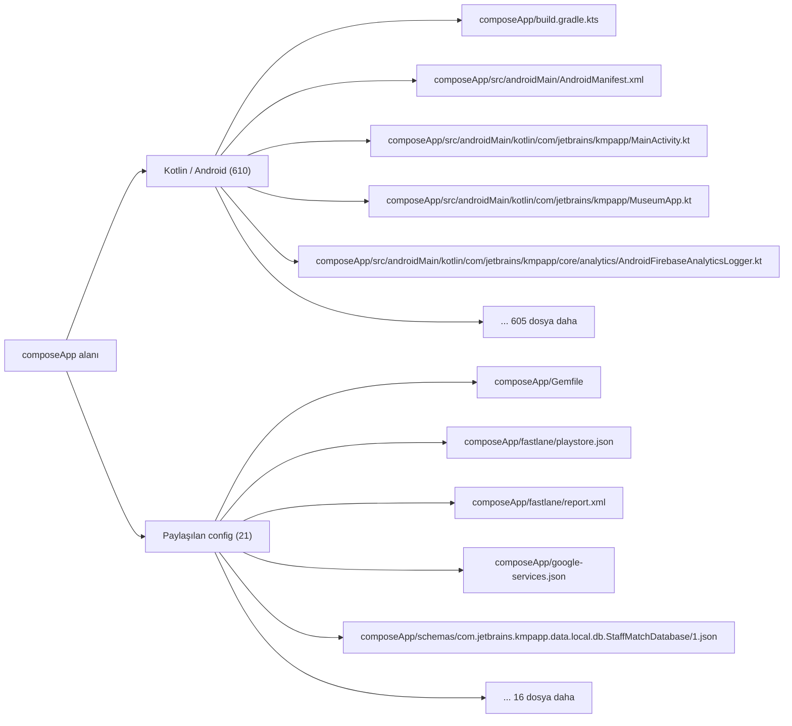

# Alan Wiki: composeApp

- Bu alanda indekslenen dosya: `631`

## Katman Karışımı

| Katman | Sayı |
| --- | --- |
| `kotlin-native` | 610 |
| `shared-config` | 21 |

## Etiket Karışımı

| Etiket | Sayı |
| --- | --- |
| `config` | 2 |
| `entrypoint` | 1 |
| `logic-hotspot` | 148 |
| `navigation` | 9 |
| `screen` | 52 |
| `test` | 61 |

## Alan Görselleştirmesi

## Temsilci Dosyalar

- `composeApp/Gemfile` - katman: `Paylaşılan config`, etiketler: `yok`
- `composeApp/build.gradle.kts` - katman: `Kotlin / Android`, etiketler: `config`
- `composeApp/fastlane/playstore.json` - katman: `Paylaşılan config`, etiketler: `mantık odağı`
- `composeApp/fastlane/report.xml` - katman: `Paylaşılan config`, etiketler: `yok`
- `composeApp/google-services.json` - katman: `Paylaşılan config`, etiketler: `mantık odağı`
- `composeApp/schemas/com.jetbrains.kmpapp.data.local.db.StaffMatchDatabase/1.json` - katman: `Paylaşılan config`, etiketler: `yok`
- `composeApp/schemas/com.jetbrains.kmpapp.data.local.db.StaffMatchDatabase/2.json` - katman: `Paylaşılan config`, etiketler: `yok`
- `composeApp/schemas/com.jetbrains.kmpapp.data.local.db.StaffMatchDatabase/3.json` - katman: `Paylaşılan config`, etiketler: `yok`
- `composeApp/schemas/com.jetbrains.kmpapp.data.local.db.StaffMatchDatabase/4.json` - katman: `Paylaşılan config`, etiketler: `yok`
- `composeApp/schemas/com.jetbrains.kmpapp.data.local.db.StaffMatchDatabase/5.json` - katman: `Paylaşılan config`, etiketler: `yok`
- `composeApp/src/androidMain/AndroidManifest.xml` - katman: `Kotlin / Android`, etiketler: `config`
- `composeApp/src/androidMain/kotlin/com/jetbrains/kmpapp/MainActivity.kt` - katman: `Kotlin / Android`, etiketler: `giriş noktası, ekran`
- `composeApp/src/androidMain/kotlin/com/jetbrains/kmpapp/MuseumApp.kt` - katman: `Kotlin / Android`, etiketler: `yok`
- `composeApp/src/androidMain/kotlin/com/jetbrains/kmpapp/core/analytics/AndroidFirebaseAnalyticsLogger.kt` - katman: `Kotlin / Android`, etiketler: `yok`
- `composeApp/src/androidMain/kotlin/com/jetbrains/kmpapp/core/time/FirestoreEpochParser.android.kt` - katman: `Kotlin / Android`, etiketler: `mantık odağı`
- `composeApp/src/androidMain/kotlin/com/jetbrains/kmpapp/core/time/PlatformDeviceClock.android.kt` - katman: `Kotlin / Android`, etiketler: `yok`
- `composeApp/src/androidMain/kotlin/com/jetbrains/kmpapp/data/applications/PlatformFirestoreJobApplicationsStore.android.kt` - katman: `Kotlin / Android`, etiketler: `mantık odağı`
- `composeApp/src/androidMain/kotlin/com/jetbrains/kmpapp/data/appspec/PlatformAppSpecStore.android.kt` - katman: `Kotlin / Android`, etiketler: `mantık odağı, test`
- `composeApp/src/androidMain/kotlin/com/jetbrains/kmpapp/data/auth/AndroidCurrentActivityHolder.kt` - katman: `Kotlin / Android`, etiketler: `yok`
- `composeApp/src/androidMain/kotlin/com/jetbrains/kmpapp/data/auth/PartOnBackendBaseUrl.android.kt` - katman: `Kotlin / Android`, etiketler: `yok`
- `composeApp/src/androidMain/kotlin/com/jetbrains/kmpapp/data/auth/PlatformAuthProvider.android.kt` - katman: `Kotlin / Android`, etiketler: `yok`
- `composeApp/src/androidMain/kotlin/com/jetbrains/kmpapp/data/branch/PlatformFirestoreBranchStore.android.kt` - katman: `Kotlin / Android`, etiketler: `mantık odağı`
- `composeApp/src/androidMain/kotlin/com/jetbrains/kmpapp/data/calendar/PlatformCalendarManager.android.kt` - katman: `Kotlin / Android`, etiketler: `mantık odağı`
- `composeApp/src/androidMain/kotlin/com/jetbrains/kmpapp/data/crypto/SensitiveFieldCrypto.android.kt` - katman: `Kotlin / Android`, etiketler: `yok`
- `composeApp/src/androidMain/kotlin/com/jetbrains/kmpapp/data/datastore/createDataStore.android.kt` - katman: `Kotlin / Android`, etiketler: `mantık odağı`
- `composeApp/src/androidMain/kotlin/com/jetbrains/kmpapp/data/employer/PlatformFirestoreEmployerJobsStore.android.kt` - katman: `Kotlin / Android`, etiketler: `mantık odağı`
- `composeApp/src/androidMain/kotlin/com/jetbrains/kmpapp/data/jobcatalog/PlatformFirestoreJobCatalogStore.android.kt` - katman: `Kotlin / Android`, etiketler: `mantık odağı`
- `composeApp/src/androidMain/kotlin/com/jetbrains/kmpapp/data/jobratings/PlatformFirestoreJobRatingStore.kt` - katman: `Kotlin / Android`, etiketler: `mantık odağı`
- `composeApp/src/androidMain/kotlin/com/jetbrains/kmpapp/data/jobs/PlatformFirestoreJobCompletionStore.kt` - katman: `Kotlin / Android`, etiketler: `mantık odağı`
- `composeApp/src/androidMain/kotlin/com/jetbrains/kmpapp/data/jobs/PlatformFirestoreJobsFeedStore.android.kt` - katman: `Kotlin / Android`, etiketler: `mantık odağı`
- `composeApp/src/androidMain/kotlin/com/jetbrains/kmpapp/data/local/db/DatabaseBuilder.android.kt` - katman: `Kotlin / Android`, etiketler: `yok`
- `composeApp/src/androidMain/kotlin/com/jetbrains/kmpapp/data/location/LocationObserver.android.kt` - katman: `Kotlin / Android`, etiketler: `yok`
- `composeApp/src/androidMain/kotlin/com/jetbrains/kmpapp/data/location/PlatformFirestoreLocationStore.android.kt` - katman: `Kotlin / Android`, etiketler: `mantık odağı`
- `composeApp/src/androidMain/kotlin/com/jetbrains/kmpapp/data/location/PlatformGeocoder.android.kt` - katman: `Kotlin / Android`, etiketler: `yok`
- `composeApp/src/androidMain/kotlin/com/jetbrains/kmpapp/data/notification/NotificationBackendBaseUrl.android.kt` - katman: `Kotlin / Android`, etiketler: `yok`
- `composeApp/src/androidMain/kotlin/com/jetbrains/kmpapp/data/notification/NotificationHttpClientFactory.android.kt` - katman: `Kotlin / Android`, etiketler: `yok`
- `composeApp/src/androidMain/kotlin/com/jetbrains/kmpapp/data/pendingratings/PlatformFirestorePendingRatingsStore.kt` - katman: `Kotlin / Android`, etiketler: `mantık odağı`
- `composeApp/src/androidMain/kotlin/com/jetbrains/kmpapp/data/policy/AndroidPolicyAcceptanceDataSource.kt` - katman: `Kotlin / Android`, etiketler: `yok`
- `composeApp/src/androidMain/kotlin/com/jetbrains/kmpapp/data/policy/AndroidRemoteConfigDataSource.kt` - katman: `Kotlin / Android`, etiketler: `yok`
- `composeApp/src/androidMain/kotlin/com/jetbrains/kmpapp/data/push/PlatformPushTokenStore.android.kt` - katman: `Kotlin / Android`, etiketler: `mantık odağı`
- `composeApp/src/androidMain/kotlin/com/jetbrains/kmpapp/data/ratings/PlatformFirestoreBranchRatingStore.kt` - katman: `Kotlin / Android`, etiketler: `mantık odağı`
- `composeApp/src/androidMain/kotlin/com/jetbrains/kmpapp/data/ratings/PlatformFirestoreEmployeeRatingStore.kt` - katman: `Kotlin / Android`, etiketler: `mantık odağı`
- `composeApp/src/androidMain/kotlin/com/jetbrains/kmpapp/data/storage/PlatformProfileImageStorage.android.kt` - katman: `Kotlin / Android`, etiketler: `yok`
- `composeApp/src/androidMain/kotlin/com/jetbrains/kmpapp/data/time/PlatformFirestoreTimeSyncApi.android.kt` - katman: `Kotlin / Android`, etiketler: `mantık odağı`
- `composeApp/src/androidMain/kotlin/com/jetbrains/kmpapp/data/user/PlatformFirestoreUserStore.android.kt` - katman: `Kotlin / Android`, etiketler: `mantık odağı`
- `composeApp/src/androidMain/kotlin/com/jetbrains/kmpapp/di/Koin.android.kt` - katman: `Kotlin / Android`, etiketler: `yok`
- `composeApp/src/androidMain/kotlin/com/jetbrains/kmpapp/domain/notification/StaffMatchNotificationHandler.android.kt` - katman: `Kotlin / Android`, etiketler: `yok`
- `composeApp/src/androidMain/kotlin/com/jetbrains/kmpapp/domain/push/PushTokenProvider.android.kt` - katman: `Kotlin / Android`, etiketler: `yok`
- `composeApp/src/androidMain/kotlin/com/jetbrains/kmpapp/platform/AndroidAppInfoProvider.kt` - katman: `Kotlin / Android`, etiketler: `yok`
- `composeApp/src/androidMain/kotlin/com/jetbrains/kmpapp/platform/AndroidUrlOpener.kt` - katman: `Kotlin / Android`, etiketler: `yok`
- `composeApp/src/androidMain/kotlin/com/jetbrains/kmpapp/push/NotificationIntentContract.kt` - katman: `Kotlin / Android`, etiketler: `yok`
- `composeApp/src/androidMain/kotlin/com/jetbrains/kmpapp/push/StaffMatchFirebaseMessagingService.kt` - katman: `Kotlin / Android`, etiketler: `mantık odağı`
- `composeApp/src/androidMain/kotlin/com/jetbrains/kmpapp/ui/calendar/CalendarPermissionRequester.android.kt` - katman: `Kotlin / Android`, etiketler: `yok`
- `composeApp/src/androidMain/kotlin/com/jetbrains/kmpapp/ui/components/jobsmap/PlatformJobsMap.android.kt` - katman: `Kotlin / Android`, etiketler: `yok`
- `composeApp/src/androidMain/kotlin/com/jetbrains/kmpapp/ui/components/map/BranchLocationPicker.android.kt` - katman: `Kotlin / Android`, etiketler: `yok`
- `composeApp/src/androidMain/kotlin/com/jetbrains/kmpapp/ui/components/profile/PartonWhatsAppShareCard.android.kt` - katman: `Kotlin / Android`, etiketler: `yok`
- `composeApp/src/androidMain/kotlin/com/jetbrains/kmpapp/ui/imagepicker/ImagePicker.android.kt` - katman: `Kotlin / Android`, etiketler: `yok`
- `composeApp/src/androidMain/kotlin/com/jetbrains/kmpapp/ui/imagepicker/PlatformImageProcessor.android.kt` - katman: `Kotlin / Android`, etiketler: `yok`
- `composeApp/src/androidMain/kotlin/com/jetbrains/kmpapp/ui/location/LocationPermissionRequester.android.kt` - katman: `Kotlin / Android`, etiketler: `yok`
- `composeApp/src/androidMain/kotlin/com/jetbrains/kmpapp/ui/screens/auth/SignupLegalDocumentDialog.android.kt` - katman: `Kotlin / Android`, etiketler: `yok`
- `composeApp/src/androidMain/kotlin/com/jetbrains/kmpapp/ui/screens/employee/JobRouteLauncher.android.kt` - katman: `Kotlin / Android`, etiketler: `yok`
- `composeApp/src/androidMain/kotlin/com/jetbrains/kmpapp/ui/screens/employee/PlatformJobsMap.android.kt` - katman: `Kotlin / Android`, etiketler: `yok`
- `composeApp/src/androidMain/kotlin/com/staffmatch/billing/RevenueCatConfig.android.kt` - katman: `Kotlin / Android`, etiketler: `yok`
- `composeApp/src/androidMain/res/drawable-v24/ic_launcher_foreground.xml` - katman: `Paylaşılan config`, etiketler: `yok`
- `composeApp/src/androidMain/res/drawable/ic_launcher_background.xml` - katman: `Paylaşılan config`, etiketler: `yok`
- `composeApp/src/androidMain/res/drawable/ic_notification.xml` - katman: `Paylaşılan config`, etiketler: `yok`
- `composeApp/src/androidMain/res/mipmap-anydpi-v26/ic_launcher.xml` - katman: `Paylaşılan config`, etiketler: `yok`
- `composeApp/src/androidMain/res/mipmap-anydpi-v26/ic_launcher_round.xml` - katman: `Paylaşılan config`, etiketler: `yok`
- `composeApp/src/androidMain/res/mipmap-anydpi-v26/ic_parton.xml` - katman: `Paylaşılan config`, etiketler: `yok`
- `composeApp/src/androidMain/res/mipmap-anydpi-v26/ic_parton_round.xml` - katman: `Paylaşılan config`, etiketler: `yok`
- `composeApp/src/androidMain/res/values/ic_parton_background.xml` - katman: `Paylaşılan config`, etiketler: `yok`
- `composeApp/src/androidMain/res/values/strings.xml` - katman: `Paylaşılan config`, etiketler: `yok`
- `composeApp/src/androidMain/res/xml/network_security_config.xml` - katman: `Paylaşılan config`, etiketler: `yok`
- `composeApp/src/androidUnitTest/kotlin/com/jetbrains/kmpapp/core/time/FirestoreEpochParserAndroidTest.kt` - katman: `Kotlin / Android`, etiketler: `mantık odağı, test`
- `composeApp/src/commonMain/composeResources/values/strings.xml` - katman: `Paylaşılan config`, etiketler: `yok`
- `composeApp/src/commonMain/kotlin/com/jetbrains/kmpapp/App.kt` - katman: `Kotlin / Android`, etiketler: `yok`
- `composeApp/src/commonMain/kotlin/com/jetbrains/kmpapp/core/Result.kt` - katman: `Kotlin / Android`, etiketler: `yok`
- `composeApp/src/commonMain/kotlin/com/jetbrains/kmpapp/core/TimeProvider.kt` - katman: `Kotlin / Android`, etiketler: `yok`
- `composeApp/src/commonMain/kotlin/com/jetbrains/kmpapp/core/analytics/AnalyticsLogger.kt` - katman: `Kotlin / Android`, etiketler: `yok`
- `composeApp/src/commonMain/kotlin/com/jetbrains/kmpapp/core/analytics/AnalyticsSanitizer.kt` - katman: `Kotlin / Android`, etiketler: `yok`
- `composeApp/src/commonMain/kotlin/com/jetbrains/kmpapp/core/coroutines/DispatcherProvider.kt` - katman: `Kotlin / Android`, etiketler: `yok`
- `composeApp/src/commonMain/kotlin/com/jetbrains/kmpapp/core/time/DeviceClock.kt` - katman: `Kotlin / Android`, etiketler: `yok`
- `composeApp/src/commonMain/kotlin/com/jetbrains/kmpapp/core/time/FirestoreEpochParser.kt` - katman: `Kotlin / Android`, etiketler: `mantık odağı`
- `composeApp/src/commonMain/kotlin/com/jetbrains/kmpapp/core/time/ServerSyncedTime.kt` - katman: `Kotlin / Android`, etiketler: `yok`
- `composeApp/src/commonMain/kotlin/com/jetbrains/kmpapp/core/time/TimeSyncApi.kt` - katman: `Kotlin / Android`, etiketler: `yok`
- `composeApp/src/commonMain/kotlin/com/jetbrains/kmpapp/core/time/TimeSyncStore.kt` - katman: `Kotlin / Android`, etiketler: `mantık odağı`
- `composeApp/src/commonMain/kotlin/com/jetbrains/kmpapp/core/time/TrustedTime.kt` - katman: `Kotlin / Android`, etiketler: `yok`
- `composeApp/src/commonMain/kotlin/com/jetbrains/kmpapp/core/time/TrustedTimeHelpers.kt` - katman: `Kotlin / Android`, etiketler: `mantık odağı`
- `composeApp/src/commonMain/kotlin/com/jetbrains/kmpapp/core/time/TrustedTimeSyncBridge.kt` - katman: `Kotlin / Android`, etiketler: `yok`
- `composeApp/src/commonMain/kotlin/com/jetbrains/kmpapp/data/MuseumApi.kt` - katman: `Kotlin / Android`, etiketler: `yok`
- `composeApp/src/commonMain/kotlin/com/jetbrains/kmpapp/data/MuseumObject.kt` - katman: `Kotlin / Android`, etiketler: `yok`
- `composeApp/src/commonMain/kotlin/com/jetbrains/kmpapp/data/MuseumRepository.kt` - katman: `Kotlin / Android`, etiketler: `mantık odağı`
- `composeApp/src/commonMain/kotlin/com/jetbrains/kmpapp/data/MuseumStorage.kt` - katman: `Kotlin / Android`, etiketler: `yok`
- `composeApp/src/commonMain/kotlin/com/jetbrains/kmpapp/data/activeshift/FirebaseActiveShiftRepository.kt` - katman: `Kotlin / Android`, etiketler: `mantık odağı`
- `composeApp/src/commonMain/kotlin/com/jetbrains/kmpapp/data/applications/ApplyConflictGuard.kt` - katman: `Kotlin / Android`, etiketler: `yok`
- `composeApp/src/commonMain/kotlin/com/jetbrains/kmpapp/data/applications/FirebaseJobApplicationsRepository.kt` - katman: `Kotlin / Android`, etiketler: `mantık odağı`
- `composeApp/src/commonMain/kotlin/com/jetbrains/kmpapp/data/applications/JobApplicationsRepository.kt` - katman: `Kotlin / Android`, etiketler: `mantık odağı`
- `composeApp/src/commonMain/kotlin/com/jetbrains/kmpapp/data/applications/PlatformFirestoreJobApplicationsStore.kt` - katman: `Kotlin / Android`, etiketler: `mantık odağı`
- `composeApp/src/commonMain/kotlin/com/jetbrains/kmpapp/data/appspec/FirebaseAppSpecRepository.kt` - katman: `Kotlin / Android`, etiketler: `mantık odağı, test`
- `composeApp/src/commonMain/kotlin/com/jetbrains/kmpapp/data/appspec/PlatformAppSpecStore.kt` - katman: `Kotlin / Android`, etiketler: `mantık odağı, test`
- `composeApp/src/commonMain/kotlin/com/jetbrains/kmpapp/data/auth/DummyOtpAuthBackend.kt` - katman: `Kotlin / Android`, etiketler: `yok`
- `composeApp/src/commonMain/kotlin/com/jetbrains/kmpapp/data/auth/FirebaseAuthRepository.kt` - katman: `Kotlin / Android`, etiketler: `mantık odağı`
- `composeApp/src/commonMain/kotlin/com/jetbrains/kmpapp/data/auth/KtorOtpAuthBackend.kt` - katman: `Kotlin / Android`, etiketler: `yok`
- `composeApp/src/commonMain/kotlin/com/jetbrains/kmpapp/data/auth/OtpAuthRepository.kt` - katman: `Kotlin / Android`, etiketler: `mantık odağı`
- `composeApp/src/commonMain/kotlin/com/jetbrains/kmpapp/data/auth/OtpRoleDocumentHelper.kt` - katman: `Kotlin / Android`, etiketler: `mantık odağı`
- `composeApp/src/commonMain/kotlin/com/jetbrains/kmpapp/data/auth/PartOnBackendBaseUrl.kt` - katman: `Kotlin / Android`, etiketler: `yok`
- `composeApp/src/commonMain/kotlin/com/jetbrains/kmpapp/data/auth/PlatformAuthProvider.kt` - katman: `Kotlin / Android`, etiketler: `yok`
- `composeApp/src/commonMain/kotlin/com/jetbrains/kmpapp/data/branch/FirebaseBranchRepository.kt` - katman: `Kotlin / Android`, etiketler: `mantık odağı`
- `composeApp/src/commonMain/kotlin/com/jetbrains/kmpapp/data/branch/PlatformFirestoreBranchStore.kt` - katman: `Kotlin / Android`, etiketler: `mantık odağı`
- `composeApp/src/commonMain/kotlin/com/jetbrains/kmpapp/data/calendar/PlatformCalendarManager.kt` - katman: `Kotlin / Android`, etiketler: `mantık odağı`
- `composeApp/src/commonMain/kotlin/com/jetbrains/kmpapp/data/crypto/SensitiveFieldCrypto.kt` - katman: `Kotlin / Android`, etiketler: `yok`
- `composeApp/src/commonMain/kotlin/com/jetbrains/kmpapp/data/datastore/createDataStore.kt` - katman: `Kotlin / Android`, etiketler: `mantık odağı`
- `composeApp/src/commonMain/kotlin/com/jetbrains/kmpapp/data/employee/FakeEmployeeOnboardingRepository.kt` - katman: `Kotlin / Android`, etiketler: `mantık odağı`
- `composeApp/src/commonMain/kotlin/com/jetbrains/kmpapp/data/employer/DataStoreEmployerIndustryScopeRepository.kt` - katman: `Kotlin / Android`, etiketler: `mantık odağı`
- `composeApp/src/commonMain/kotlin/com/jetbrains/kmpapp/data/employer/EmployerJobsRepository.kt` - katman: `Kotlin / Android`, etiketler: `mantık odağı`
- `composeApp/src/commonMain/kotlin/com/jetbrains/kmpapp/data/employer/FakeEmployerOnboardingRepository.kt` - katman: `Kotlin / Android`, etiketler: `mantık odağı`
- `composeApp/src/commonMain/kotlin/com/jetbrains/kmpapp/data/employer/PlatformFirestoreEmployerJobsStore.kt` - katman: `Kotlin / Android`, etiketler: `mantık odağı`
- `composeApp/src/commonMain/kotlin/com/jetbrains/kmpapp/data/fake/FakeDatabase.kt` - katman: `Kotlin / Android`, etiketler: `yok`
- `composeApp/src/commonMain/kotlin/com/jetbrains/kmpapp/data/jobcatalog/FirebaseJobCatalogRepository.kt` - katman: `Kotlin / Android`, etiketler: `mantık odağı`
- `composeApp/src/commonMain/kotlin/com/jetbrains/kmpapp/data/jobcatalog/JobCatalogFirestoreParser.kt` - katman: `Kotlin / Android`, etiketler: `mantık odağı`
- ... `511` ek kayıt

## Manuel Notlar

- Sorumluluk: manuel doğrulanacak.
- Ana giriş noktaları: manuel doğrulanacak.
- Önemli bağımlılıklar: manuel doğrulanacak.
- Testler ve guardrail'ler: manuel doğrulanacak.
- Riskler ve bilinmeyenler: manuel doğrulanacak.
