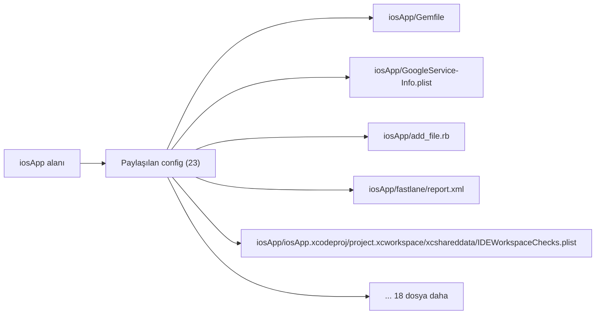

# Alan Wiki: iosApp

- Bu alanda indekslenen dosya: `23`

## Katman Karışımı

| Katman | Sayı |
| --- | --- |
| `shared-config` | 23 |

## Etiket Karışımı

| Etiket | Sayı |
| --- | --- |
| `logic-hotspot` | 1 |
| `screen` | 1 |

## Alan Görselleştirmesi

## Temsilci Dosyalar

- `iosApp/Gemfile` - katman: `Paylaşılan config`, etiketler: `yok`
- `iosApp/GoogleService-Info.plist` - katman: `Paylaşılan config`, etiketler: `mantık odağı`
- `iosApp/add_file.rb` - katman: `Paylaşılan config`, etiketler: `yok`
- `iosApp/fastlane/report.xml` - katman: `Paylaşılan config`, etiketler: `yok`
- `iosApp/iosApp.xcodeproj/project.xcworkspace/xcshareddata/IDEWorkspaceChecks.plist` - katman: `Paylaşılan config`, etiketler: `yok`
- `iosApp/iosApp/AppDelegate.swift` - katman: `Paylaşılan config`, etiketler: `yok`
- `iosApp/iosApp/Assets.xcassets/AccentColor.colorset/Contents.json` - katman: `Paylaşılan config`, etiketler: `yok`
- `iosApp/iosApp/Assets.xcassets/AppIcon.appiconset/Contents.json` - katman: `Paylaşılan config`, etiketler: `yok`
- `iosApp/iosApp/Assets.xcassets/Contents.json` - katman: `Paylaşılan config`, etiketler: `yok`
- `iosApp/iosApp/BranchRatingBridge.swift` - katman: `Paylaşılan config`, etiketler: `yok`
- `iosApp/iosApp/ContentView.swift` - katman: `Paylaşılan config`, etiketler: `ekran`
- `iosApp/iosApp/FirebaseBridge/EmployeeRatingBridge.swift` - katman: `Paylaşılan config`, etiketler: `yok`
- `iosApp/iosApp/Info.plist` - katman: `Paylaşılan config`, etiketler: `yok`
- `iosApp/iosApp/IosFirebaseAnalyticsBridge.swift` - katman: `Paylaşılan config`, etiketler: `yok`
- `iosApp/iosApp/IosFirebaseAuthBridge.swift` - katman: `Paylaşılan config`, etiketler: `yok`
- `iosApp/iosApp/IosFirebaseJobBridge.swift` - katman: `Paylaşılan config`, etiketler: `yok`
- `iosApp/iosApp/IosFirebaseJobCatalogBridge.swift` - katman: `Paylaşılan config`, etiketler: `yok`
- `iosApp/iosApp/IosFirebaseLocationBridge.swift` - katman: `Paylaşılan config`, etiketler: `yok`
- `iosApp/iosApp/IosFirebasePolicyBridge.swift` - katman: `Paylaşılan config`, etiketler: `yok`
- `iosApp/iosApp/IosFirebaseTimeSyncBridge.swift` - katman: `Paylaşılan config`, etiketler: `yok`
- `iosApp/iosApp/IosSensitiveFieldBridge.swift` - katman: `Paylaşılan config`, etiketler: `yok`
- `iosApp/iosApp/Preview Content/Preview Assets.xcassets/Contents.json` - katman: `Paylaşılan config`, etiketler: `yok`
- `iosApp/iosApp/iOSApp.swift` - katman: `Paylaşılan config`, etiketler: `yok`

## Manuel Notlar

- Sorumluluk: manuel doğrulanacak.
- Ana giriş noktaları: manuel doğrulanacak.
- Önemli bağımlılıklar: manuel doğrulanacak.
- Testler ve guardrail'ler: manuel doğrulanacak.
- Riskler ve bilinmeyenler: manuel doğrulanacak.
