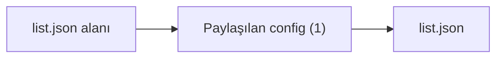

# Alan Wiki: list.json

- Bu alanda indekslenen dosya: `1`

## Katman Karışımı

| Katman | Sayı |
| --- | --- |
| `shared-config` | 1 |

## Etiket Karışımı

| Etiket | Sayı |
| --- | --- |
| yok | yok |

## Alan Görselleştirmesi

## Temsilci Dosyalar

- `list.json` - katman: `Paylaşılan config`, etiketler: `yok`

## Manuel Notlar

- Sorumluluk: manuel doğrulanacak.
- Ana giriş noktaları: manuel doğrulanacak.
- Önemli bağımlılıklar: manuel doğrulanacak.
- Testler ve guardrail'ler: manuel doğrulanacak.
- Riskler ve bilinmeyenler: manuel doğrulanacak.
