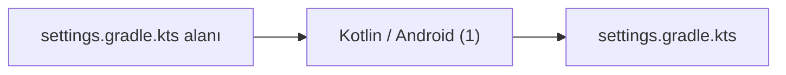

# Alan Wiki: settings.gradle.kts

- Bu alanda indekslenen dosya: `1`

## Katman Karışımı

| Katman | Sayı |
| --- | --- |
| `kotlin-native` | 1 |

## Etiket Karışımı

| Etiket | Sayı |
| --- | --- |
| `config` | 1 |

## Alan Görselleştirmesi

## Temsilci Dosyalar

- `settings.gradle.kts` - katman: `Kotlin / Android`, etiketler: `config`

## Manuel Notlar

- Sorumluluk: manuel doğrulanacak.
- Ana giriş noktaları: manuel doğrulanacak.
- Önemli bağımlılıklar: manuel doğrulanacak.
- Testler ve guardrail'ler: manuel doğrulanacak.
- Riskler ve bilinmeyenler: manuel doğrulanacak.
