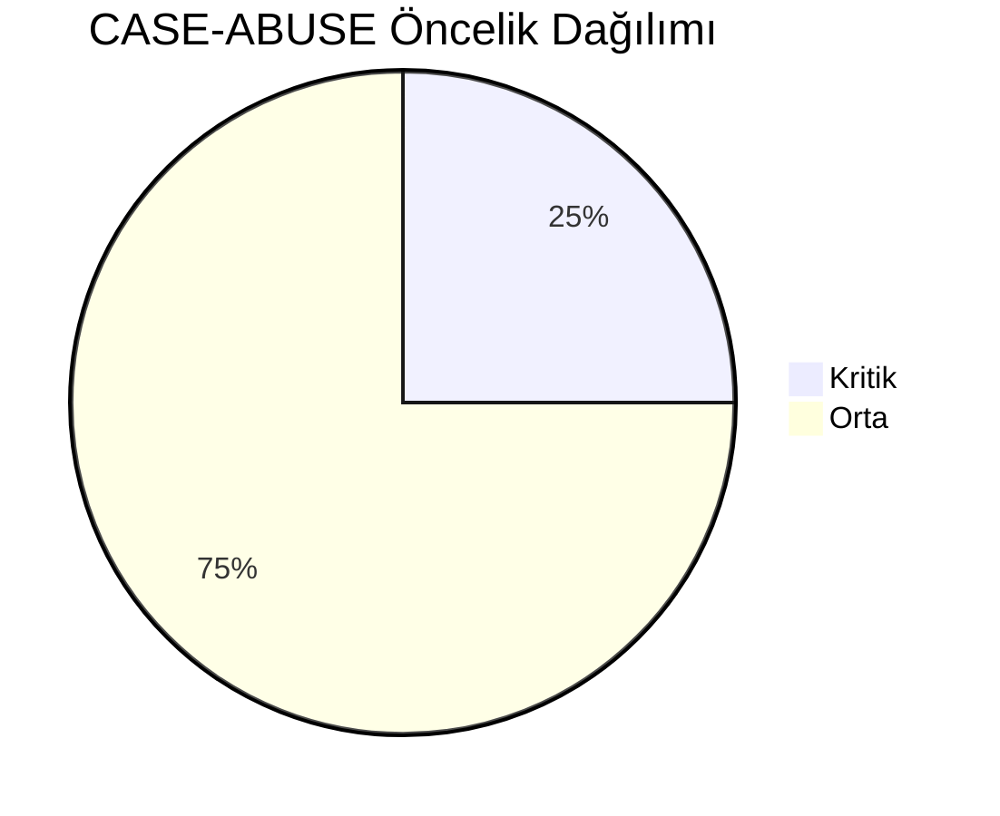
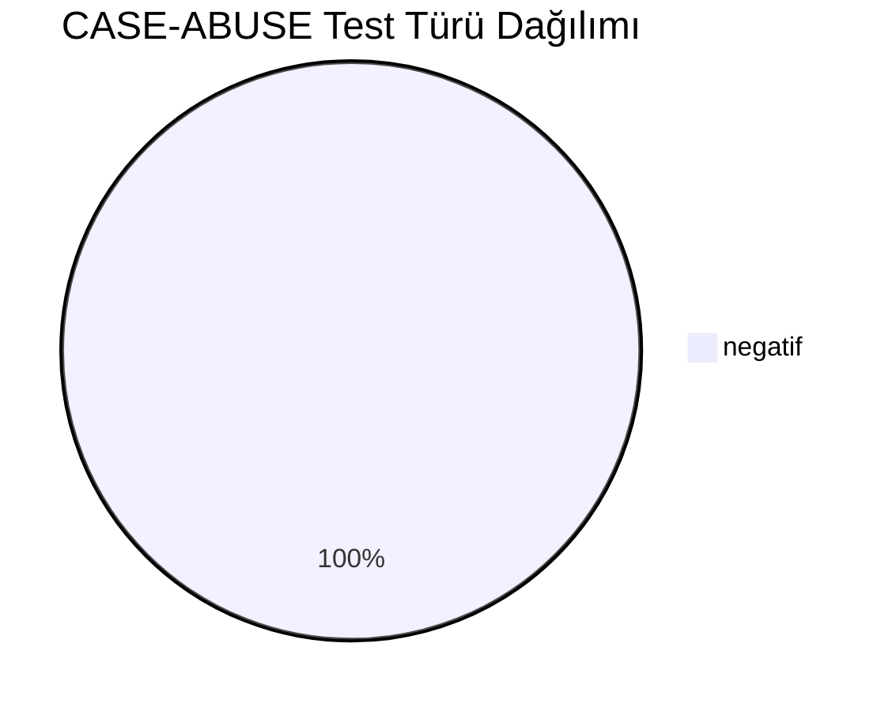
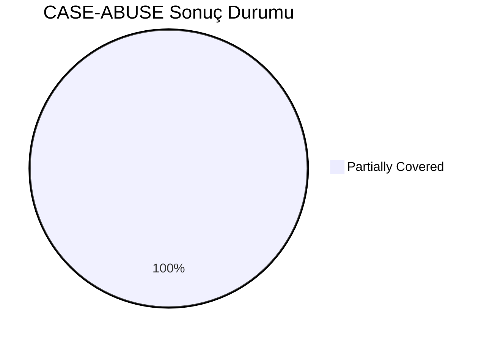
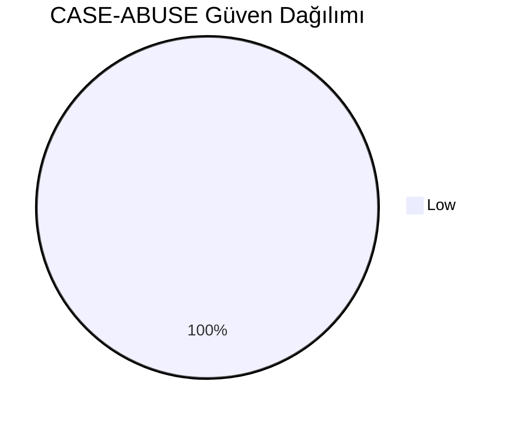
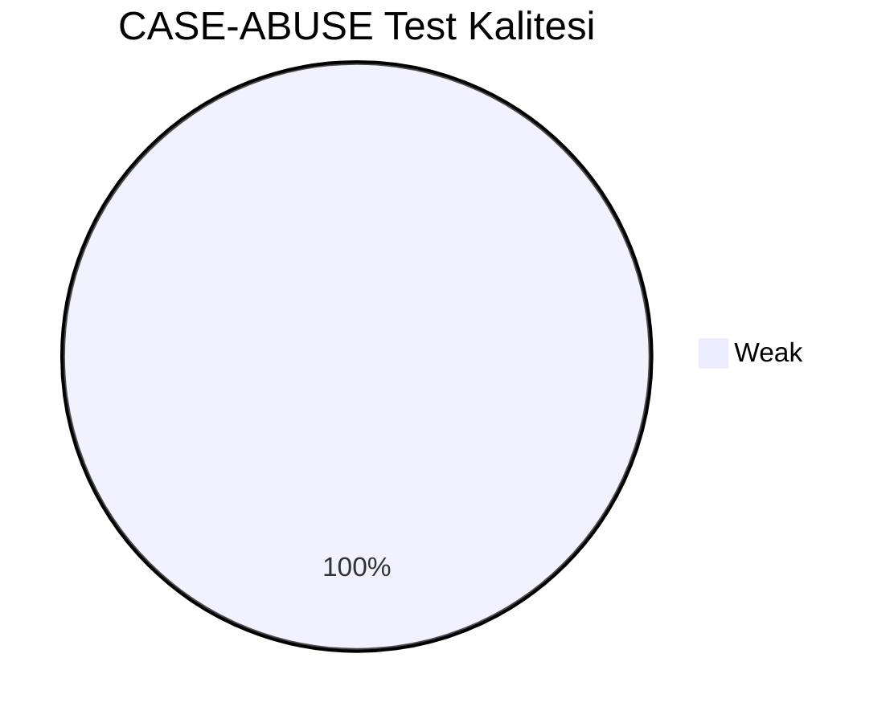
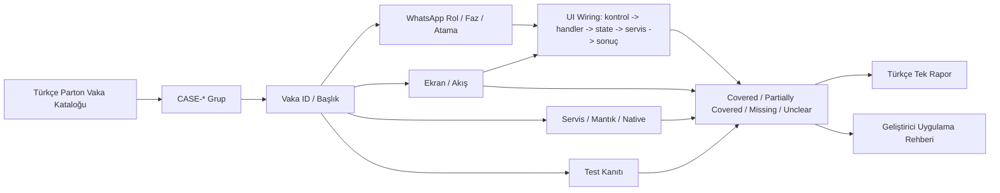
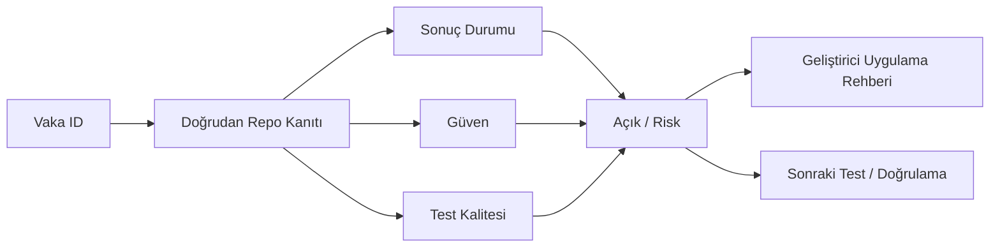

# CASE-ABUSE Vaka Test Görselleştirmesi

- Toplam vaka: `12`
- Sonuç kaynağı: `/Users/hakanbilir/MyDevZone/StaffMatch/parton-case-results.json`
- Kanıt politikası: isim benzerliği kapsama kanıtı değildir; her vaka doğrudan repo kanıtı ile eşleştirilmelidir.

## Öncelik Dağılımı

## Test Türü Dağılımı

## Vaka Test Sonuç Özeti

## Güven Dağılımı

## Test Kalitesi Dağılımı

## Vaka Eşleştirme Akışı

## Sonuç Akışı

## Sonuç Matrisi

| Vaka ID | Başlık | Durum | Güven | Test Kalitesi | Kanıt | Açık | Olası Kod Alanı | UI Wiring Kanıtı |
| --- | --- | --- | --- | --- | --- | --- | --- | --- |
| `T-181` | Aynı saat diliminde iki işe onay alma | Partially Covered | Low | Weak | Çakışma/iptal/zaman kısıtı ve rule-based bazı suistimal engelleri mevcut. | Bot/sahte hesap/cihaz parmak izi gibi suistimal savunmaları client repoda doğrudan kanıtlı değil. | backend | kontrol -> handler -> state -> servis/native/API -> görünür sonuç |
| `T-182` | Sürekli “geleceğim” deyip gelmeyen işçi | Partially Covered | Low | Weak | Çakışma/iptal/zaman kısıtı ve rule-based bazı suistimal engelleri mevcut. | Bot/sahte hesap/cihaz parmak izi gibi suistimal savunmaları client repoda doğrudan kanıtlı değil. | backend | kontrol -> handler -> state -> servis/native/API -> görünür sonuç |
| `T-183` | Sürekli son dakika iptal eden işveren | Partially Covered | Low | Weak | Çakışma/iptal/zaman kısıtı ve rule-based bazı suistimal engelleri mevcut. | Bot/sahte hesap/cihaz parmak izi gibi suistimal savunmaları client repoda doğrudan kanıtlı değil. | backend | kontrol -> handler -> state -> servis/native/API -> görünür sonuç |
| `T-184` | Aynı cihazdan çoklu sahte hesap | Partially Covered | Low | Weak | Çakışma/iptal/zaman kısıtı ve rule-based bazı suistimal engelleri mevcut. | Bot/sahte hesap/cihaz parmak izi gibi suistimal savunmaları client repoda doğrudan kanıtlı değil. | backend | kontrol -> handler -> state -> servis/native/API -> görünür sonuç |
| `T-185` | Sahte ilan açma girişimi | Partially Covered | Low | Weak | Çakışma/iptal/zaman kısıtı ve rule-based bazı suistimal engelleri mevcut. | Bot/sahte hesap/cihaz parmak izi gibi suistimal savunmaları client repoda doğrudan kanıtlı değil. | backend | kontrol -> handler -> state -> servis/native/API -> görünür sonuç |
| `T-186` | Bot başvuru denemeleri | Partially Covered | Low | Weak | Çakışma/iptal/zaman kısıtı ve rule-based bazı suistimal engelleri mevcut. | Bot/sahte hesap/cihaz parmak izi gibi suistimal savunmaları client repoda doğrudan kanıtlı değil. | backend | kontrol -> handler -> state -> servis/native/API -> görünür sonuç |
| `T-187` | Puan manipülasyonu | Partially Covered | Low | Weak | Çakışma/iptal/zaman kısıtı ve rule-based bazı suistimal engelleri mevcut. | Bot/sahte hesap/cihaz parmak izi gibi suistimal savunmaları client repoda doğrudan kanıtlı değil. | backend | kontrol -> handler -> state -> servis/native/API -> görünür sonuç |
| `T-188` | Sahte konumla jeton düşürme denemesi | Partially Covered | Low | Weak | Çakışma/iptal/zaman kısıtı ve rule-based bazı suistimal engelleri mevcut. | Bot/sahte hesap/cihaz parmak izi gibi suistimal savunmaları client repoda doğrudan kanıtlı değil. | backend | kontrol -> handler -> state -> servis/native/API -> görünür sonuç |
| `T-189` | İşverenin gelen işçiyi gelmedi göstermesi | Partially Covered | Low | Weak | Çakışma/iptal/zaman kısıtı ve rule-based bazı suistimal engelleri mevcut. | Bot/sahte hesap/cihaz parmak izi gibi suistimal savunmaları client repoda doğrudan kanıtlı değil. | backend | kontrol -> handler -> state -> servis/native/API -> görünür sonuç |
| `T-190` | İşçinin gelmediği halde geldi göstermesi | Partially Covered | Low | Weak | Çakışma/iptal/zaman kısıtı ve rule-based bazı suistimal engelleri mevcut. | Bot/sahte hesap/cihaz parmak izi gibi suistimal savunmaları client repoda doğrudan kanıtlı değil. | backend | kontrol -> handler -> state -> servis/native/API -> görünür sonuç |
| `T-191` | Yaş sınırını yanlış beyan etme | Partially Covered | Low | Weak | Çakışma/iptal/zaman kısıtı ve rule-based bazı suistimal engelleri mevcut. | Bot/sahte hesap/cihaz parmak izi gibi suistimal savunmaları client repoda doğrudan kanıtlı değil. | backend | kontrol -> handler -> state -> servis/native/API -> görünür sonuç |
| `T-192` | Yasaklı kullanıcının tekrar kayıt denemesi | Partially Covered | Low | Weak | Çakışma/iptal/zaman kısıtı ve rule-based bazı suistimal engelleri mevcut. | Bot/sahte hesap/cihaz parmak izi gibi suistimal savunmaları client repoda doğrudan kanıtlı değil. | backend | kontrol -> handler -> state -> servis/native/API -> görünür sonuç |

## Vakalar

| Vaka ID | Başlık | Öncelik | Test Türü | Rol | Canlı Test Fazı | Görsel Eşleştirme Notu |
| --- | --- | --- | --- | --- | --- | --- |
| `T-181` | Aynı saat diliminde iki işe onay alma | Orta | Negatif | Çoklu Aktör | Risk Fazı - Negatif/Suistimal | Ekran / servis / test kanıtı ile eşleştirilecek |
| `T-182` | Sürekli “geleceğim” deyip gelmeyen işçi | Orta | Negatif | İşçi | Risk Fazı - Negatif/Suistimal | Ekran / servis / test kanıtı ile eşleştirilecek |
| `T-183` | Sürekli son dakika iptal eden işveren | Orta | Negatif | İşveren | Risk Fazı - Negatif/Suistimal | Ekran / servis / test kanıtı ile eşleştirilecek |
| `T-184` | Aynı cihazdan çoklu sahte hesap | Kritik | Negatif | Çoklu Aktör | Risk Fazı - Negatif/Suistimal | Ekran / servis / test kanıtı ile eşleştirilecek |
| `T-185` | Sahte ilan açma girişimi | Kritik | Negatif | Çoklu Aktör | Risk Fazı - Negatif/Suistimal | Ekran / servis / test kanıtı ile eşleştirilecek |
| `T-186` | Bot başvuru denemeleri | Orta | Negatif | Çoklu Aktör | Risk Fazı - Negatif/Suistimal | Ekran / servis / test kanıtı ile eşleştirilecek |
| `T-187` | Puan manipülasyonu | Orta | Negatif | Çoklu Aktör | Risk Fazı - Negatif/Suistimal | Ekran / servis / test kanıtı ile eşleştirilecek |
| `T-188` | Sahte konumla jeton düşürme denemesi | Kritik | Negatif | Çoklu Aktör | Risk Fazı - Negatif/Suistimal | Ekran / servis / test kanıtı ile eşleştirilecek |
| `T-189` | İşverenin gelen işçiyi gelmedi göstermesi | Orta | Negatif | İşçi | Risk Fazı - Negatif/Suistimal | Ekran / servis / test kanıtı ile eşleştirilecek |
| `T-190` | İşçinin gelmediği halde geldi göstermesi | Orta | Negatif | Çoklu Aktör | Risk Fazı - Negatif/Suistimal | Ekran / servis / test kanıtı ile eşleştirilecek |
| `T-191` | Yaş sınırını yanlış beyan etme | Orta | Negatif | Çoklu Aktör | Risk Fazı - Negatif/Suistimal | Ekran / servis / test kanıtı ile eşleştirilecek |
| `T-192` | Yasaklı kullanıcının tekrar kayıt denemesi | Orta | Negatif | Çoklu Aktör | Risk Fazı - Negatif/Suistimal | Ekran / servis / test kanıtı ile eşleştirilecek |

## Manuel Tamamlama Kontrol Listesi

- Her vaka için ilişkili ekran/görünüm, servis/modül, native/platform alanı ve test dosyası yazılmalıdır.
- UI wiring kanıtı; ekran kontrolü, handler, state sahibi, validasyon, servis/native/API yan etkisi ve görünür sonucu birlikte göstermelidir.
- Kritik vakalarda enforcement kanıtı ve varsa test kanıtı ayrı ayrı gösterilmelidir.
- Kanıt zayıfsa durum `Unclear` veya `Partially Covered` kalmalıdır.
