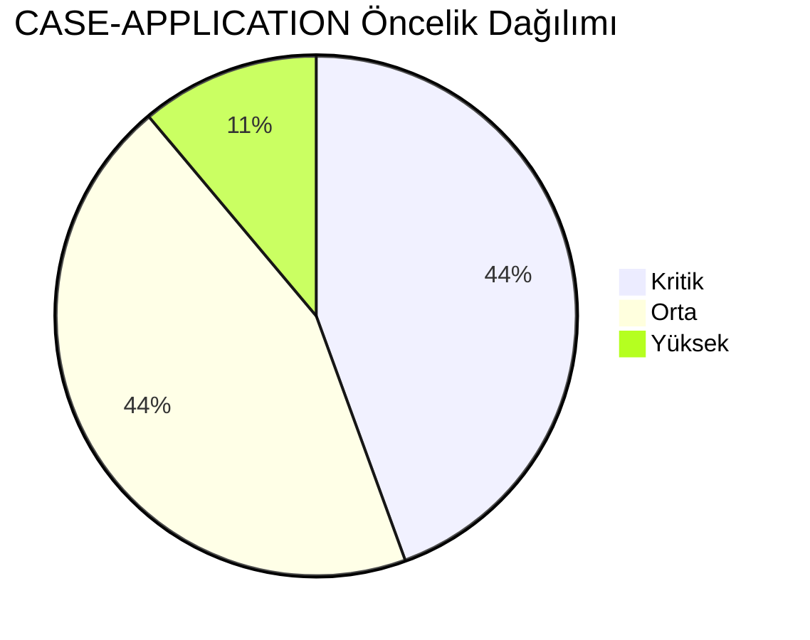
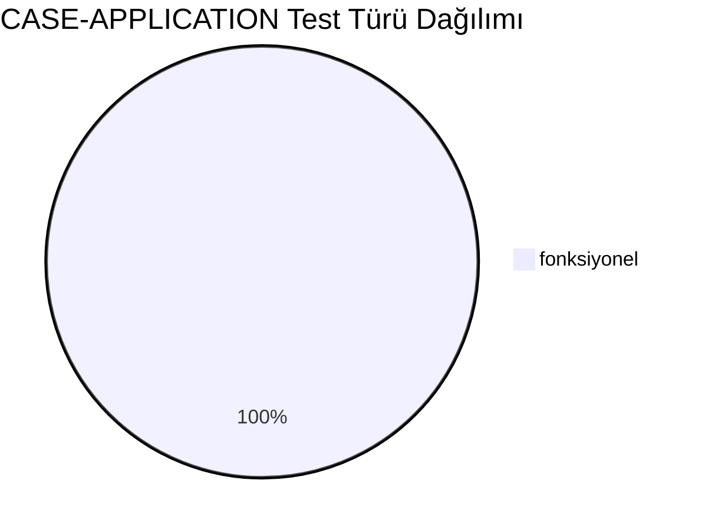
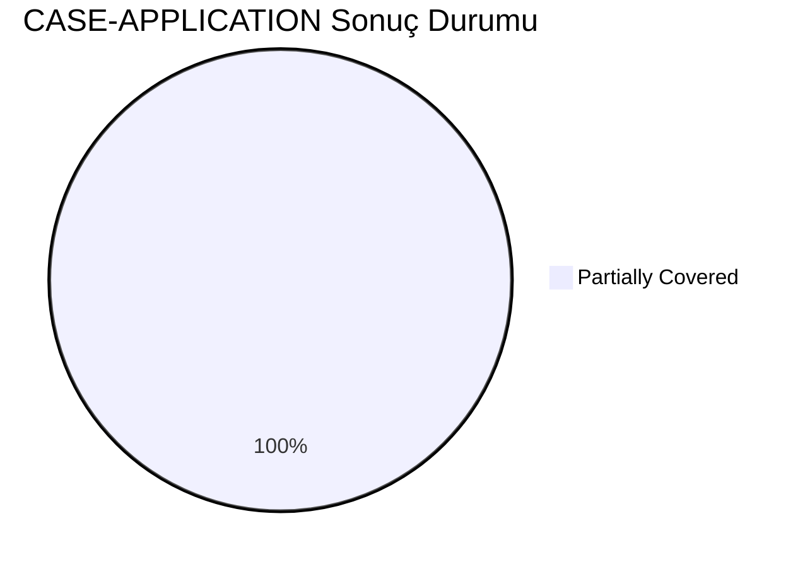
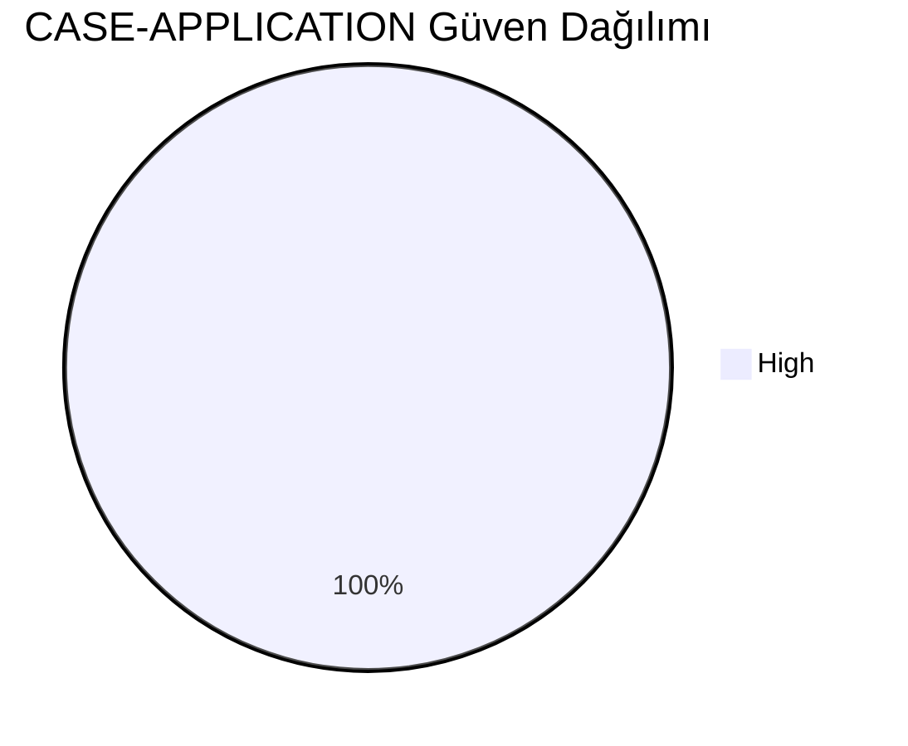
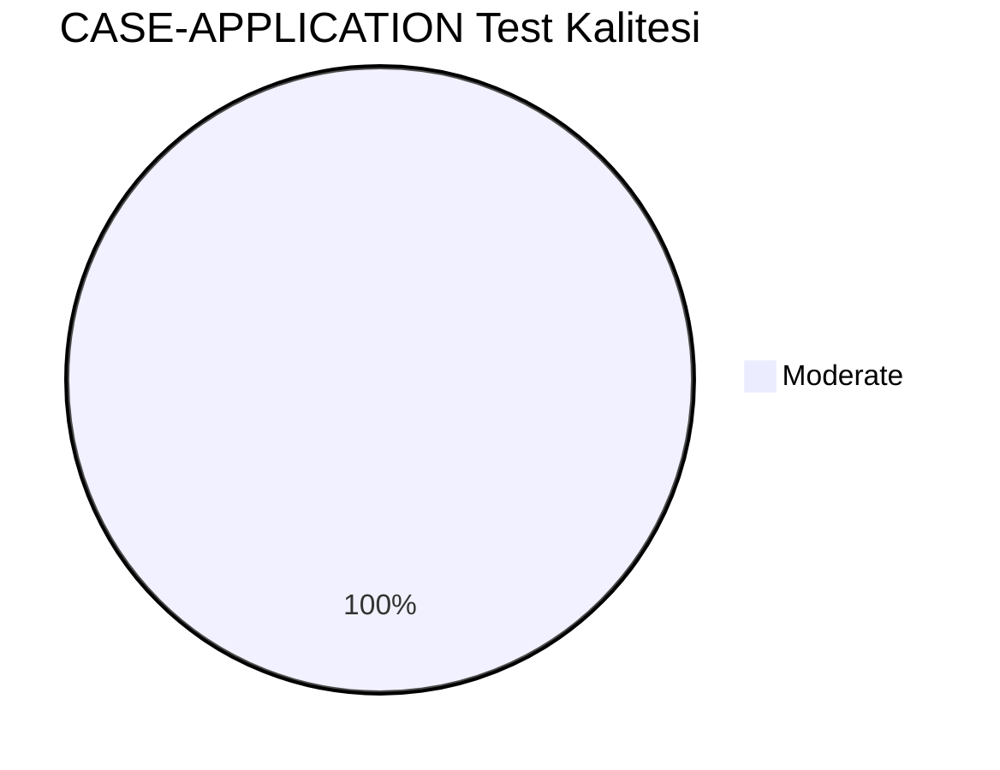
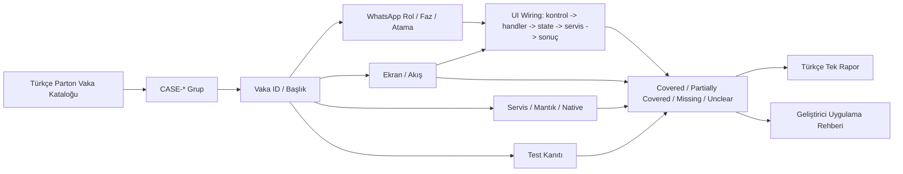
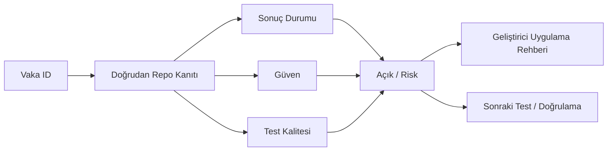

# CASE-APPLICATION Vaka Test Görselleştirmesi

- Toplam vaka: `9`
- Sonuç kaynağı: `/Users/hakanbilir/MyDevZone/StaffMatch/parton-case-results.json`
- Kanıt politikası: isim benzerliği kapsama kanıtı değildir; her vaka doğrudan repo kanıtı ile eşleştirilmelidir.

## Öncelik Dağılımı

## Test Türü Dağılımı

## Vaka Test Sonuç Özeti

## Güven Dağılımı

## Test Kalitesi Dağılımı

## Vaka Eşleştirme Akışı

## Sonuç Akışı

## Sonuç Matrisi

| Vaka ID | Başlık | Durum | Güven | Test Kalitesi | Kanıt | Açık | Olası Kod Alanı | UI Wiring Kanıtı |
| --- | --- | --- | --- | --- | --- | --- | --- | --- |
| `T-080` | Uygun ilana başvuru | Partially Covered | High | Moderate | EmployeeHomeViewModel.applyToJob + JobApplicationsRepository + Firestore process alanları. | Kuralın tamamı backend rule/API bağımlı; tüm negatif senaryolar için E2E yok. | shared | kontrol -> handler -> state -> servis/native/API -> görünür sonuç |
| `T-081` | Aynı ilana ikinci kez başvurunun engellenmesi | Partially Covered | High | Moderate | EmployeeHomeViewModel.applyToJob + JobApplicationsRepository + Firestore process alanları. | Kuralın tamamı backend rule/API bağımlı; tüm negatif senaryolar için E2E yok. | shared | kontrol -> handler -> state -> servis/native/API -> görünür sonuç |
| `T-082` | Profil eksikse başvuru engeli | Partially Covered | High | Moderate | EmployeeHomeViewModel.applyToJob + JobApplicationsRepository + Firestore process alanları. | Kuralın tamamı backend rule/API bağımlı; tüm negatif senaryolar için E2E yok. | shared | kontrol -> handler -> state -> servis/native/API -> görünür sonuç |
| `T-083` | Süresi geçmiş ilana başvuru engeli | Partially Covered | High | Moderate | EmployeeHomeViewModel.applyToJob + JobApplicationsRepository + Firestore process alanları. | Kuralın tamamı backend rule/API bağımlı; tüm negatif senaryolar için E2E yok. | shared | kontrol -> handler -> state -> servis/native/API -> görünür sonuç |
| `T-084` | Kontenjan dolu ilana başvuru engeli | Partially Covered | High | Moderate | EmployeeHomeViewModel.applyToJob + JobApplicationsRepository + Firestore process alanları. | Kuralın tamamı backend rule/API bağımlı; tüm negatif senaryolar için E2E yok. | shared | kontrol -> handler -> state -> servis/native/API -> görünür sonuç |
| `T-085` | Aynı saat aralığında çakışan işe ikinci başvuru | Partially Covered | High | Moderate | EmployeeHomeViewModel.applyToJob + JobApplicationsRepository + Firestore process alanları. | Kuralın tamamı backend rule/API bağımlı; tüm negatif senaryolar için E2E yok. | shared | kontrol -> handler -> state -> servis/native/API -> görünür sonuç |
| `T-086` | Başvuru geri çekme | Partially Covered | High | Moderate | EmployeeHomeViewModel.applyToJob + JobApplicationsRepository + Firestore process alanları. | Kuralın tamamı backend rule/API bağımlı; tüm negatif senaryolar için E2E yok. | shared | kontrol -> handler -> state -> servis/native/API -> görünür sonuç |
| `T-087` | Başvuru sonrası profil değişikliği etkisi | Partially Covered | High | Moderate | EmployeeHomeViewModel.applyToJob + JobApplicationsRepository + Firestore process alanları. | Kuralın tamamı backend rule/API bağımlı; tüm negatif senaryolar için E2E yok. | shared | kontrol -> handler -> state -> servis/native/API -> görünür sonuç |
| `T-088` | İlan şartı sonradan değişirse başvuru durumu | Partially Covered | High | Moderate | EmployeeHomeViewModel.applyToJob + JobApplicationsRepository + Firestore process alanları. | Kuralın tamamı backend rule/API bağımlı; tüm negatif senaryolar için E2E yok. | shared | kontrol -> handler -> state -> servis/native/API -> görünür sonuç |

## Vakalar

| Vaka ID | Başlık | Öncelik | Test Türü | Rol | Canlı Test Fazı | Görsel Eşleştirme Notu |
| --- | --- | --- | --- | --- | --- | --- |
| `T-080` | Uygun ilana başvuru | Yüksek | Fonksiyonel | İşçi | Faz 4 - Başvuru ve Aday Yönetimi | Ekran / servis / test kanıtı ile eşleştirilecek |
| `T-081` | Aynı ilana ikinci kez başvurunun engellenmesi | Kritik | Fonksiyonel | İşçi | Faz 4 - Başvuru ve Aday Yönetimi | Ekran / servis / test kanıtı ile eşleştirilecek |
| `T-082` | Profil eksikse başvuru engeli | Kritik | Fonksiyonel | İşçi | Faz 4 - Başvuru ve Aday Yönetimi | Ekran / servis / test kanıtı ile eşleştirilecek |
| `T-083` | Süresi geçmiş ilana başvuru engeli | Kritik | Fonksiyonel | İşçi | Faz 4 - Başvuru ve Aday Yönetimi | Ekran / servis / test kanıtı ile eşleştirilecek |
| `T-084` | Kontenjan dolu ilana başvuru engeli | Kritik | Fonksiyonel | İşçi | Faz 4 - Başvuru ve Aday Yönetimi | Ekran / servis / test kanıtı ile eşleştirilecek |
| `T-085` | Aynı saat aralığında çakışan işe ikinci başvuru | Orta | Fonksiyonel | İşçi | Faz 4 - Başvuru ve Aday Yönetimi | Ekran / servis / test kanıtı ile eşleştirilecek |
| `T-086` | Başvuru geri çekme | Orta | Fonksiyonel | İşçi | Faz 4 - Başvuru ve Aday Yönetimi | Ekran / servis / test kanıtı ile eşleştirilecek |
| `T-087` | Başvuru sonrası profil değişikliği etkisi | Orta | Fonksiyonel | İşçi | Faz 4 - Başvuru ve Aday Yönetimi | Ekran / servis / test kanıtı ile eşleştirilecek |
| `T-088` | İlan şartı sonradan değişirse başvuru durumu | Orta | Fonksiyonel | İşçi | Faz 4 - Başvuru ve Aday Yönetimi | Ekran / servis / test kanıtı ile eşleştirilecek |

## Manuel Tamamlama Kontrol Listesi

- Her vaka için ilişkili ekran/görünüm, servis/modül, native/platform alanı ve test dosyası yazılmalıdır.
- UI wiring kanıtı; ekran kontrolü, handler, state sahibi, validasyon, servis/native/API yan etkisi ve görünür sonucu birlikte göstermelidir.
- Kritik vakalarda enforcement kanıtı ve varsa test kanıtı ayrı ayrı gösterilmelidir.
- Kanıt zayıfsa durum `Unclear` veya `Partially Covered` kalmalıdır.
