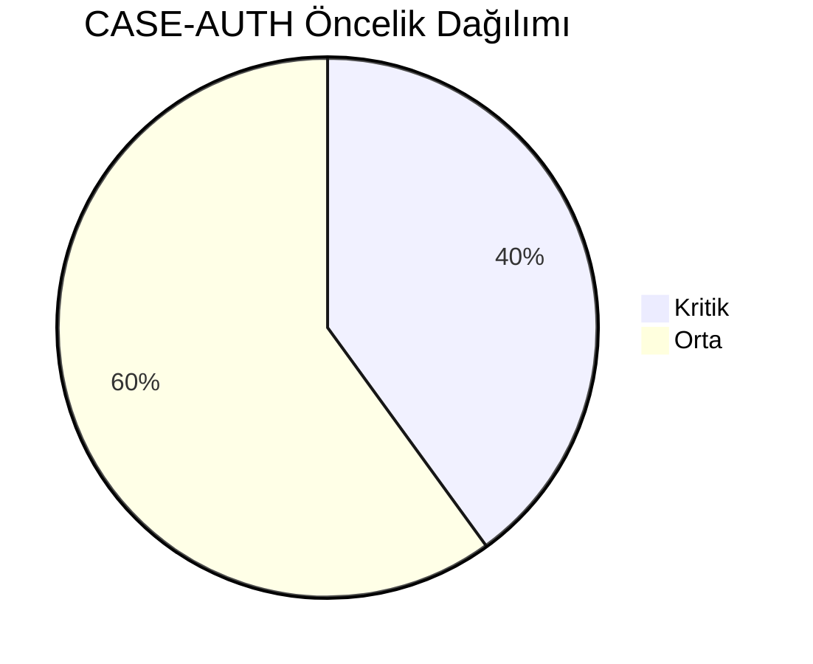
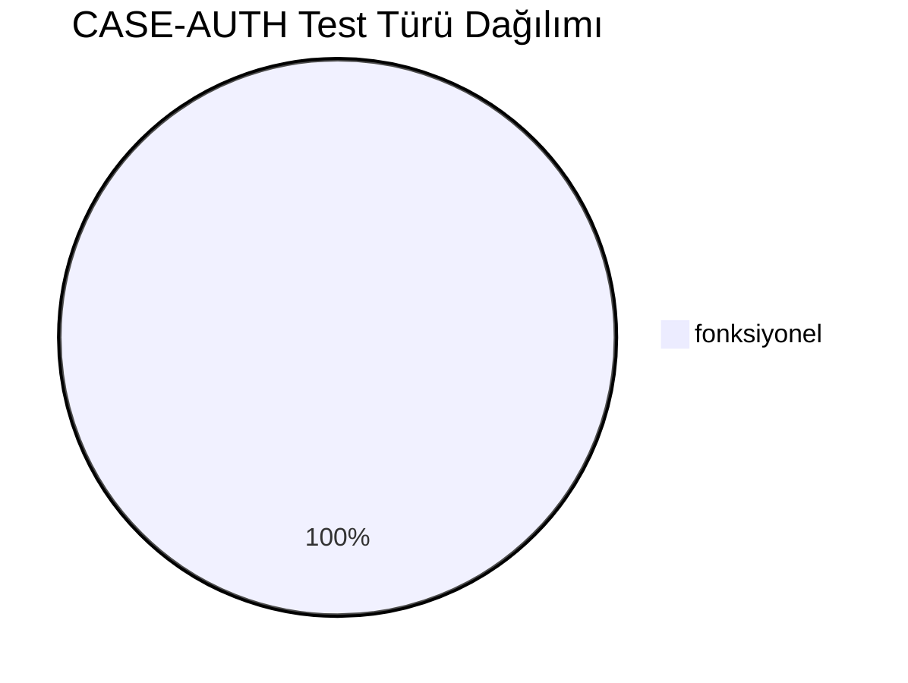
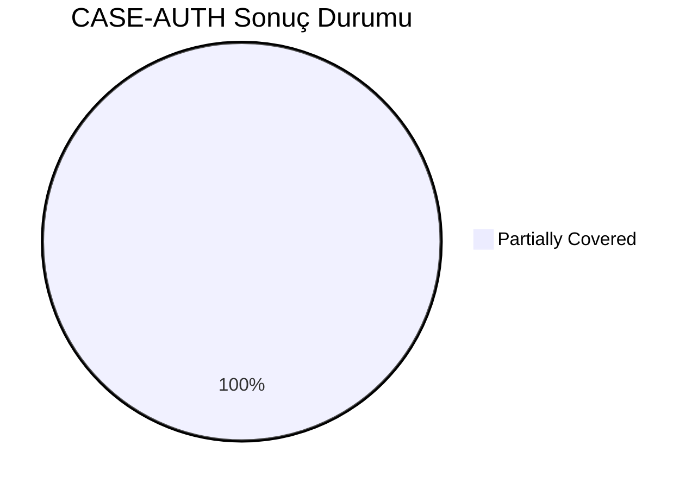
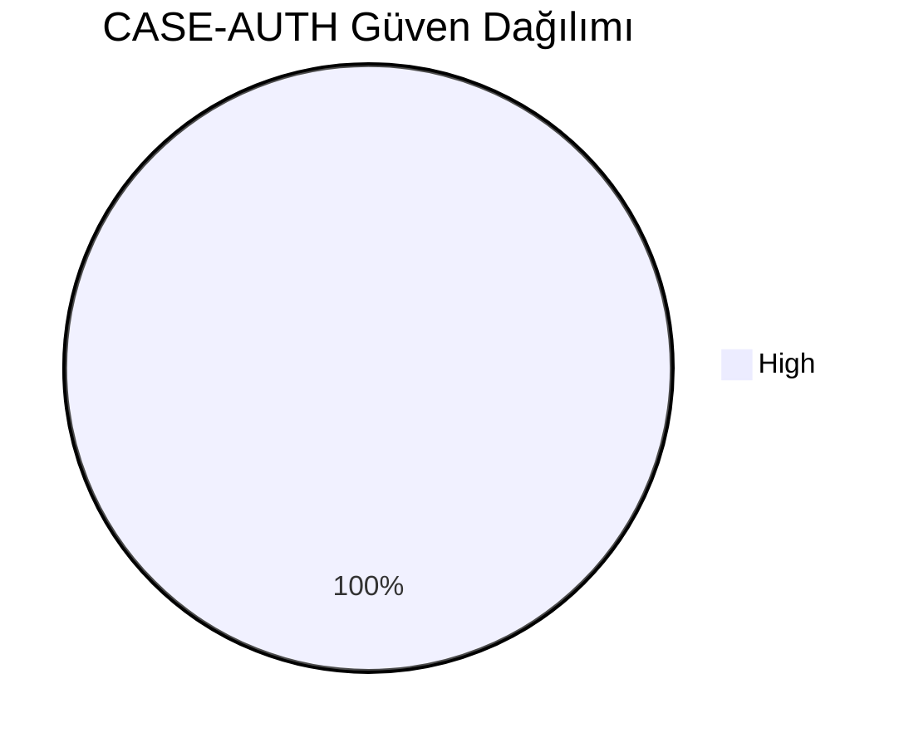
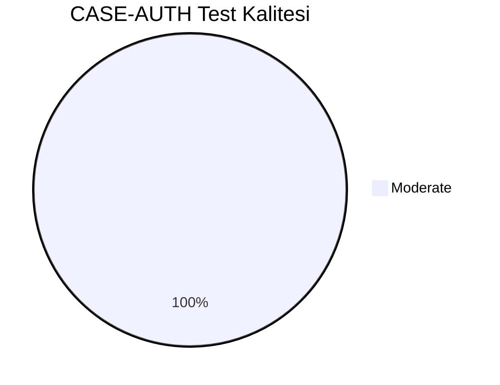
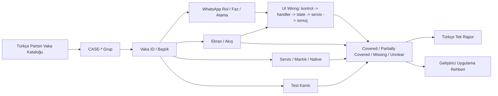
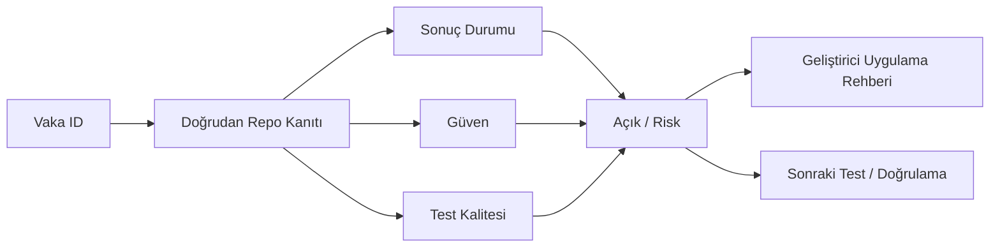

# CASE-AUTH Vaka Test Görselleştirmesi

- Toplam vaka: `15`
- Sonuç kaynağı: `/Users/hakanbilir/MyDevZone/StaffMatch/parton-case-results.json`
- Kanıt politikası: isim benzerliği kapsama kanıtı değildir; her vaka doğrudan repo kanıtı ile eşleştirilmelidir.

## Öncelik Dağılımı

## Test Türü Dağılımı

## Vaka Test Sonuç Özeti

## Güven Dağılımı

## Test Kalitesi Dağılımı

## Vaka Eşleştirme Akışı

## Sonuç Akışı

## Sonuç Matrisi

| Vaka ID | Başlık | Durum | Güven | Test Kalitesi | Kanıt | Açık | Olası Kod Alanı | UI Wiring Kanıtı |
| --- | --- | --- | --- | --- | --- | --- | --- | --- |
| `T-001` | Geçerli telefon numarası ile kayıt | Partially Covered | High | Moderate | AuthViewModel + FirebaseAuthRepository + AppViewModel ile rol/policy/session zinciri mevcut. | Brute-force/rate-limit ve sunucu tarafı ihlal korumaları client repoda kanıtlanamıyor. | shared | kontrol -> handler -> state -> servis/native/API -> görünür sonuç |
| `T-002` | Geçerli e-posta ile kayıt | Partially Covered | High | Moderate | AuthViewModel + FirebaseAuthRepository + AppViewModel ile rol/policy/session zinciri mevcut. | Brute-force/rate-limit ve sunucu tarafı ihlal korumaları client repoda kanıtlanamıyor. | shared | kontrol -> handler -> state -> servis/native/API -> görünür sonuç |
| `T-003` | Aynı telefon ile ikinci kez kayıt engeli | Partially Covered | High | Moderate | AuthViewModel + FirebaseAuthRepository + AppViewModel ile rol/policy/session zinciri mevcut. | Brute-force/rate-limit ve sunucu tarafı ihlal korumaları client repoda kanıtlanamıyor. | shared | kontrol -> handler -> state -> servis/native/API -> görünür sonuç |
| `T-004` | Eksik alanlarla kayıt denemesi | Partially Covered | High | Moderate | AuthViewModel + FirebaseAuthRepository + AppViewModel ile rol/policy/session zinciri mevcut. | Brute-force/rate-limit ve sunucu tarafı ihlal korumaları client repoda kanıtlanamıyor. | shared | kontrol -> handler -> state -> servis/native/API -> görünür sonuç |
| `T-005` | Yanlış SMS doğrulama kodu | Partially Covered | High | Moderate | AuthViewModel + FirebaseAuthRepository + AppViewModel ile rol/policy/session zinciri mevcut. | Brute-force/rate-limit ve sunucu tarafı ihlal korumaları client repoda kanıtlanamıyor. | shared | kontrol -> handler -> state -> servis/native/API -> görünür sonuç |
| `T-006` | Süresi geçmiş doğrulama kodu | Partially Covered | High | Moderate | AuthViewModel + FirebaseAuthRepository + AppViewModel ile rol/policy/session zinciri mevcut. | Brute-force/rate-limit ve sunucu tarafı ihlal korumaları client repoda kanıtlanamıyor. | shared | kontrol -> handler -> state -> servis/native/API -> görünür sonuç |
| `T-007` | Çok sayıda yanlış kod girişinde bloke | Partially Covered | High | Moderate | AuthViewModel + FirebaseAuthRepository + AppViewModel ile rol/policy/session zinciri mevcut. | Brute-force/rate-limit ve sunucu tarafı ihlal korumaları client repoda kanıtlanamıyor. | shared | kontrol -> handler -> state -> servis/native/API -> görünür sonuç |
| `T-008` | Zayıf şifre ile kayıt denemesi | Partially Covered | High | Moderate | AuthViewModel + FirebaseAuthRepository + AppViewModel ile rol/policy/session zinciri mevcut. | Brute-force/rate-limit ve sunucu tarafı ihlal korumaları client repoda kanıtlanamıyor. | shared | kontrol -> handler -> state -> servis/native/API -> görünür sonuç |
| `T-009` | Konum izni vermeden kayıt tamamlama | Partially Covered | High | Moderate | AuthViewModel + FirebaseAuthRepository + AppViewModel ile rol/policy/session zinciri mevcut. | Brute-force/rate-limit ve sunucu tarafı ihlal korumaları client repoda kanıtlanamıyor. | shared | kontrol -> handler -> state -> servis/native/API -> görünür sonuç |
| `T-010` | Kayıt sonrası profil tamamlama zorunluluğu | Partially Covered | High | Moderate | AuthViewModel + FirebaseAuthRepository + AppViewModel ile rol/policy/session zinciri mevcut. | Brute-force/rate-limit ve sunucu tarafı ihlal korumaları client repoda kanıtlanamıyor. | shared | kontrol -> handler -> state -> servis/native/API -> görünür sonuç |
| `T-011` | Geçerli firma bilgileri ile kayıt | Partially Covered | High | Moderate | AuthViewModel + FirebaseAuthRepository + AppViewModel ile rol/policy/session zinciri mevcut. | Brute-force/rate-limit ve sunucu tarafı ihlal korumaları client repoda kanıtlanamıyor. | shared | kontrol -> handler -> state -> servis/native/API -> görünür sonuç |
| `T-012` | Eksik firma bilgileri ile kayıt denemesi | Partially Covered | High | Moderate | AuthViewModel + FirebaseAuthRepository + AppViewModel ile rol/policy/session zinciri mevcut. | Brute-force/rate-limit ve sunucu tarafı ihlal korumaları client repoda kanıtlanamıyor. | shared | kontrol -> handler -> state -> servis/native/API -> görünür sonuç |
| `T-013` | Aynı vergi numarası ile mükerrer hesap kontrolü | Partially Covered | High | Moderate | AuthViewModel + FirebaseAuthRepository + AppViewModel ile rol/policy/session zinciri mevcut. | Brute-force/rate-limit ve sunucu tarafı ihlal korumaları client repoda kanıtlanamıyor. | shared | kontrol -> handler -> state -> servis/native/API -> görünür sonuç |
| `T-014` | Yetkisiz kullanıcının şube açma denemesi | Partially Covered | High | Moderate | AuthViewModel + FirebaseAuthRepository + AppViewModel ile rol/policy/session zinciri mevcut. | Brute-force/rate-limit ve sunucu tarafı ihlal korumaları client repoda kanıtlanamıyor. | shared | kontrol -> handler -> state -> servis/native/API -> görünür sonuç |
| `T-015` | Firma doğrulaması olmadan ilan açma denemesi | Partially Covered | High | Moderate | AuthViewModel + FirebaseAuthRepository + AppViewModel ile rol/policy/session zinciri mevcut. | Brute-force/rate-limit ve sunucu tarafı ihlal korumaları client repoda kanıtlanamıyor. | shared | kontrol -> handler -> state -> servis/native/API -> görünür sonuç |

## Vakalar

| Vaka ID | Başlık | Öncelik | Test Türü | Rol | Canlı Test Fazı | Görsel Eşleştirme Notu |
| --- | --- | --- | --- | --- | --- | --- |
| `T-001` | Geçerli telefon numarası ile kayıt | Orta | Fonksiyonel | Çoklu Aktör | Faz 1 - Kayıt ve Hesap | Ekran / servis / test kanıtı ile eşleştirilecek |
| `T-002` | Geçerli e-posta ile kayıt | Orta | Fonksiyonel | Çoklu Aktör | Faz 1 - Kayıt ve Hesap | Ekran / servis / test kanıtı ile eşleştirilecek |
| `T-003` | Aynı telefon ile ikinci kez kayıt engeli | Kritik | Fonksiyonel | Çoklu Aktör | Faz 1 - Kayıt ve Hesap | Ekran / servis / test kanıtı ile eşleştirilecek |
| `T-004` | Eksik alanlarla kayıt denemesi | Orta | Fonksiyonel | Çoklu Aktör | Faz 1 - Kayıt ve Hesap | Ekran / servis / test kanıtı ile eşleştirilecek |
| `T-005` | Yanlış SMS doğrulama kodu | Kritik | Fonksiyonel | Çoklu Aktör | Faz 1 - Kayıt ve Hesap | Ekran / servis / test kanıtı ile eşleştirilecek |
| `T-006` | Süresi geçmiş doğrulama kodu | Kritik | Fonksiyonel | Çoklu Aktör | Faz 1 - Kayıt ve Hesap | Ekran / servis / test kanıtı ile eşleştirilecek |
| `T-007` | Çok sayıda yanlış kod girişinde bloke | Orta | Fonksiyonel | Çoklu Aktör | Faz 1 - Kayıt ve Hesap | Ekran / servis / test kanıtı ile eşleştirilecek |
| `T-008` | Zayıf şifre ile kayıt denemesi | Orta | Fonksiyonel | Çoklu Aktör | Faz 1 - Kayıt ve Hesap | Ekran / servis / test kanıtı ile eşleştirilecek |
| `T-009` | Konum izni vermeden kayıt tamamlama | Kritik | Fonksiyonel | Çoklu Aktör | Faz 1 - Kayıt ve Hesap | Ekran / servis / test kanıtı ile eşleştirilecek |
| `T-010` | Kayıt sonrası profil tamamlama zorunluluğu | Orta | Fonksiyonel | Çoklu Aktör | Faz 1 - Kayıt ve Hesap | Ekran / servis / test kanıtı ile eşleştirilecek |
| `T-011` | Geçerli firma bilgileri ile kayıt | Orta | Fonksiyonel | İşveren | Faz 1 - Kayıt ve Hesap | Ekran / servis / test kanıtı ile eşleştirilecek |
| `T-012` | Eksik firma bilgileri ile kayıt denemesi | Orta | Fonksiyonel | İşveren | Faz 1 - Kayıt ve Hesap | Ekran / servis / test kanıtı ile eşleştirilecek |
| `T-013` | Aynı vergi numarası ile mükerrer hesap kontrolü | Orta | Fonksiyonel | Çoklu Aktör | Faz 1 - Kayıt ve Hesap | Ekran / servis / test kanıtı ile eşleştirilecek |
| `T-014` | Yetkisiz kullanıcının şube açma denemesi | Kritik | Fonksiyonel | İşveren | Faz 1 - Kayıt ve Hesap | Ekran / servis / test kanıtı ile eşleştirilecek |
| `T-015` | Firma doğrulaması olmadan ilan açma denemesi | Kritik | Fonksiyonel | İşveren | Faz 1 - Kayıt ve Hesap | Ekran / servis / test kanıtı ile eşleştirilecek |

## Manuel Tamamlama Kontrol Listesi

- Her vaka için ilişkili ekran/görünüm, servis/modül, native/platform alanı ve test dosyası yazılmalıdır.
- UI wiring kanıtı; ekran kontrolü, handler, state sahibi, validasyon, servis/native/API yan etkisi ve görünür sonucu birlikte göstermelidir.
- Kritik vakalarda enforcement kanıtı ve varsa test kanıtı ayrı ayrı gösterilmelidir.
- Kanıt zayıfsa durum `Unclear` veya `Partially Covered` kalmalıdır.
