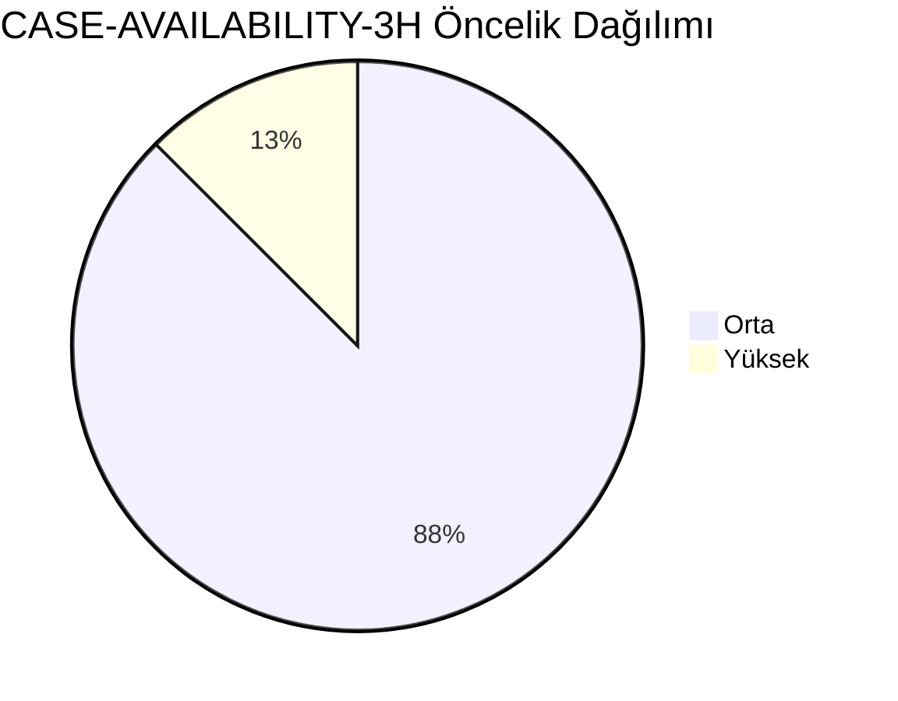
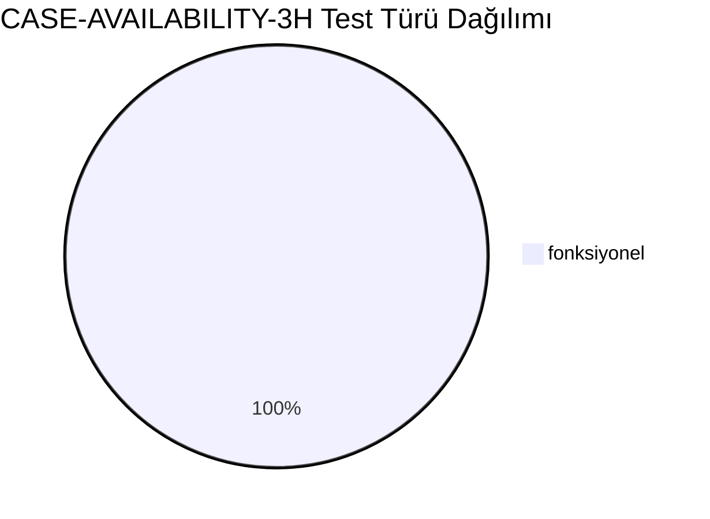
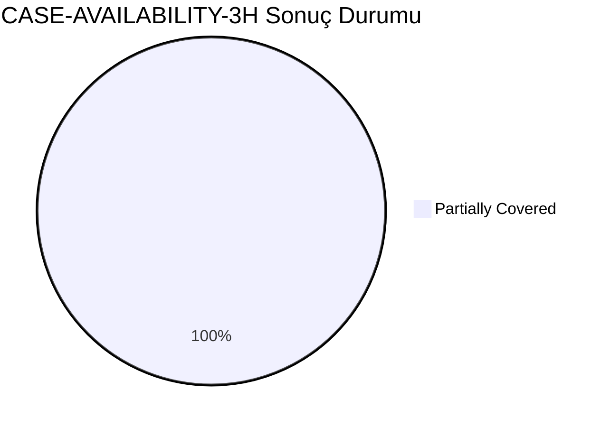
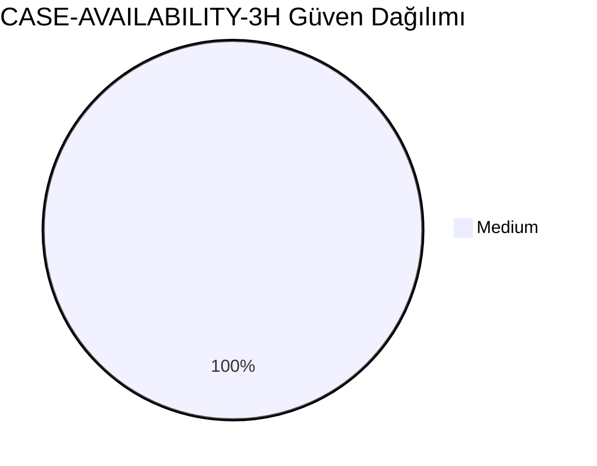
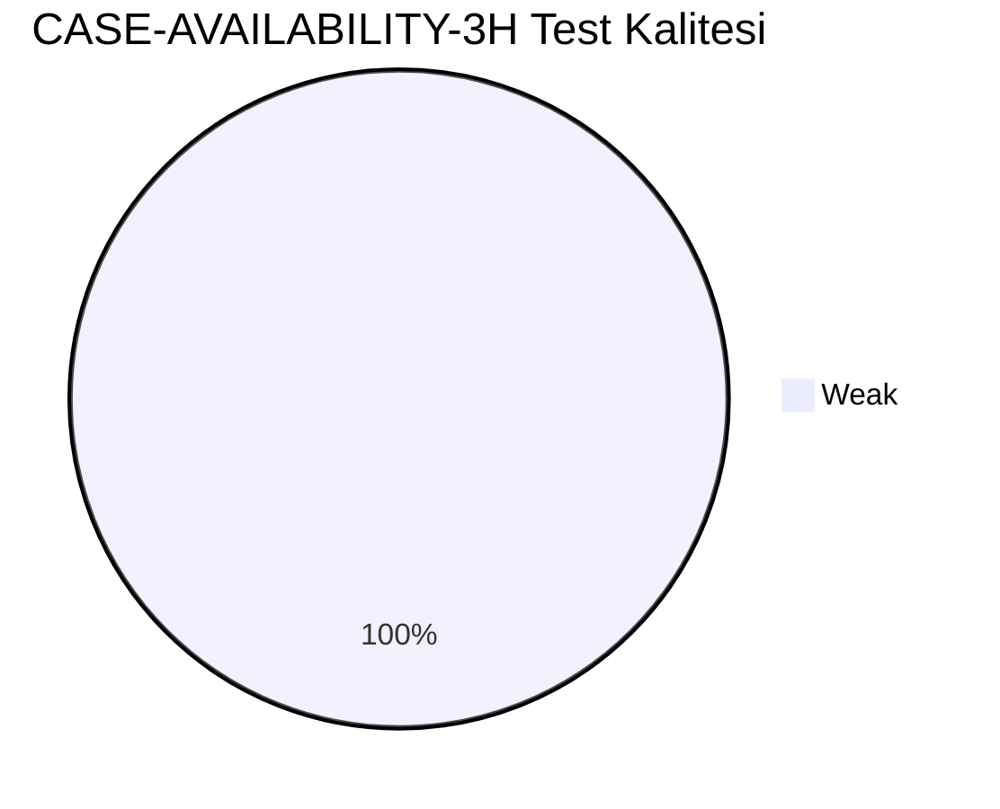
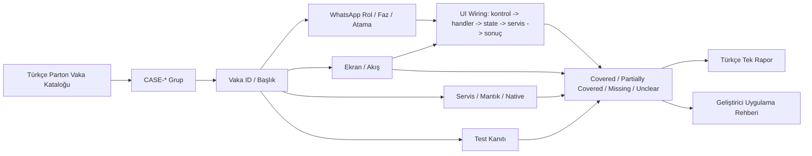
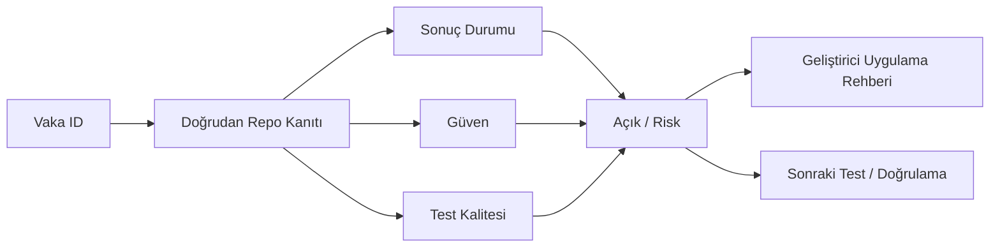

# CASE-AVAILABILITY-3H Vaka Test Görselleştirmesi

- Toplam vaka: `8`
- Sonuç kaynağı: `/Users/hakanbilir/MyDevZone/StaffMatch/parton-case-results.json`
- Kanıt politikası: isim benzerliği kapsama kanıtı değildir; her vaka doğrudan repo kanıtı ile eşleştirilmelidir.

## Öncelik Dağılımı

## Test Türü Dağılımı

## Vaka Test Sonuç Özeti

## Güven Dağılımı

## Test Kalitesi Dağılımı

## Vaka Eşleştirme Akışı

## Sonuç Akışı

## Sonuç Matrisi

| Vaka ID | Başlık | Durum | Güven | Test Kalitesi | Kanıt | Açık | Olası Kod Alanı | UI Wiring Kanıtı |
| --- | --- | --- | --- | --- | --- | --- | --- | --- |
| `T-114` | İşçiye 3 saat kala bildirim gitmesi | Partially Covered | Medium | Weak | EmployeeJobMatchEngine ve feedAvailableDays üzerinden uygunluk filtresi uygulanıyor. | 3 saat kuralının uçtan uca zorlaması ve timezone kenar durumları için doğrudan kanıt sınırlı. | shared | kontrol -> handler -> state -> servis/native/API -> görünür sonuç |
| `T-115` | “Gelebileceğim” seçeneği | Partially Covered | Medium | Weak | EmployeeJobMatchEngine ve feedAvailableDays üzerinden uygunluk filtresi uygulanıyor. | 3 saat kuralının uçtan uca zorlaması ve timezone kenar durumları için doğrudan kanıt sınırlı. | shared | kontrol -> handler -> state -> servis/native/API -> görünür sonuç |
| `T-116` | “Gelemiyorum” seçeneği | Partially Covered | Medium | Weak | EmployeeJobMatchEngine ve feedAvailableDays üzerinden uygunluk filtresi uygulanıyor. | 3 saat kuralının uçtan uca zorlaması ve timezone kenar durumları için doğrudan kanıt sınırlı. | shared | kontrol -> handler -> state -> servis/native/API -> görünür sonuç |
| `T-117` | Hiç yanıt verilmemesi | Partially Covered | Medium | Weak | EmployeeJobMatchEngine ve feedAvailableDays üzerinden uygunluk filtresi uygulanıyor. | 3 saat kuralının uçtan uca zorlaması ve timezone kenar durumları için doğrudan kanıt sınırlı. | shared | kontrol -> handler -> state -> servis/native/API -> görünür sonuç |
| `T-118` | Önce gelebileceğim sonra gelemiyorum seçimi | Partially Covered | Medium | Weak | EmployeeJobMatchEngine ve feedAvailableDays üzerinden uygunluk filtresi uygulanıyor. | 3 saat kuralının uçtan uca zorlaması ve timezone kenar durumları için doğrudan kanıt sınırlı. | shared | kontrol -> handler -> state -> servis/native/API -> görünür sonuç |
| `T-119` | İşverenin gelemiyorum bilgisini alması | Partially Covered | Medium | Weak | EmployeeJobMatchEngine ve feedAvailableDays üzerinden uygunluk filtresi uygulanıyor. | 3 saat kuralının uçtan uca zorlaması ve timezone kenar durumları için doğrudan kanıt sınırlı. | shared | kontrol -> handler -> state -> servis/native/API -> görünür sonuç |
| `T-121` | Birden fazla personelde sadece bazılarının iptal etmesi | Partially Covered | Medium | Weak | EmployeeJobMatchEngine ve feedAvailableDays üzerinden uygunluk filtresi uygulanıyor. | 3 saat kuralının uçtan uca zorlaması ve timezone kenar durumları için doğrudan kanıt sınırlı. | shared | kontrol -> handler -> state -> servis/native/API -> görünür sonuç |
| `T-122` | Son dakika açılan ilanda bu akışın uyarlanması | Partially Covered | Medium | Weak | EmployeeJobMatchEngine ve feedAvailableDays üzerinden uygunluk filtresi uygulanıyor. | 3 saat kuralının uçtan uca zorlaması ve timezone kenar durumları için doğrudan kanıt sınırlı. | shared | kontrol -> handler -> state -> servis/native/API -> görünür sonuç |

## Vakalar

| Vaka ID | Başlık | Öncelik | Test Türü | Rol | Canlı Test Fazı | Görsel Eşleştirme Notu |
| --- | --- | --- | --- | --- | --- | --- |
| `T-114` | İşçiye 3 saat kala bildirim gitmesi | Yüksek | Fonksiyonel | İşçi | Faz 5 - İş Günü Yönetimi | Ekran / servis / test kanıtı ile eşleştirilecek |
| `T-115` | “Gelebileceğim” seçeneği | Orta | Fonksiyonel | İşçi | Faz 5 - İş Günü Yönetimi | Ekran / servis / test kanıtı ile eşleştirilecek |
| `T-116` | “Gelemiyorum” seçeneği | Orta | Fonksiyonel | İşçi | Faz 5 - İş Günü Yönetimi | Ekran / servis / test kanıtı ile eşleştirilecek |
| `T-117` | Hiç yanıt verilmemesi | Orta | Fonksiyonel | İşçi | Faz 5 - İş Günü Yönetimi | Ekran / servis / test kanıtı ile eşleştirilecek |
| `T-118` | Önce gelebileceğim sonra gelemiyorum seçimi | Orta | Fonksiyonel | İşçi | Faz 5 - İş Günü Yönetimi | Ekran / servis / test kanıtı ile eşleştirilecek |
| `T-119` | İşverenin gelemiyorum bilgisini alması | Orta | Fonksiyonel | İşçi | Faz 5 - İş Günü Yönetimi | Ekran / servis / test kanıtı ile eşleştirilecek |
| `T-121` | Birden fazla personelde sadece bazılarının iptal etmesi | Orta | Fonksiyonel | İşçi | Faz 5 - İş Günü Yönetimi | Ekran / servis / test kanıtı ile eşleştirilecek |
| `T-122` | Son dakika açılan ilanda bu akışın uyarlanması | Orta | Fonksiyonel | İşçi | Faz 5 - İş Günü Yönetimi | Ekran / servis / test kanıtı ile eşleştirilecek |

## Manuel Tamamlama Kontrol Listesi

- Her vaka için ilişkili ekran/görünüm, servis/modül, native/platform alanı ve test dosyası yazılmalıdır.
- UI wiring kanıtı; ekran kontrolü, handler, state sahibi, validasyon, servis/native/API yan etkisi ve görünür sonucu birlikte göstermelidir.
- Kritik vakalarda enforcement kanıtı ve varsa test kanıtı ayrı ayrı gösterilmelidir.
- Kanıt zayıfsa durum `Unclear` veya `Partially Covered` kalmalıdır.
