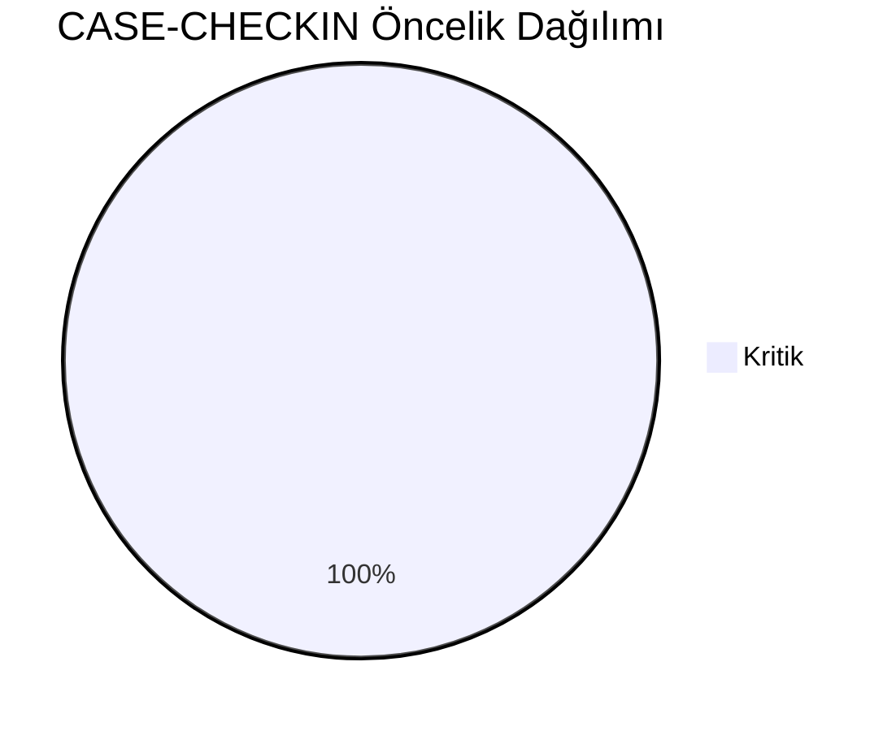
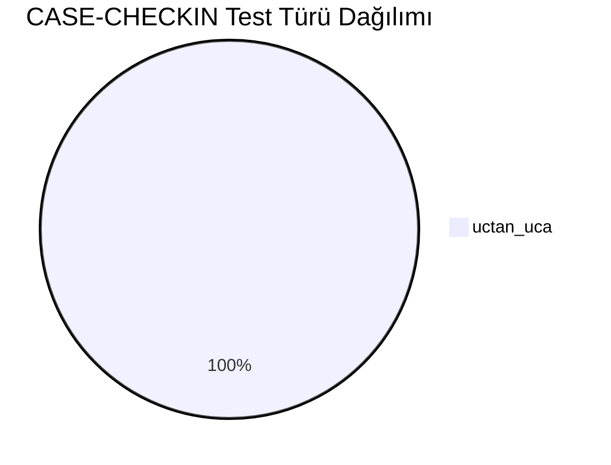
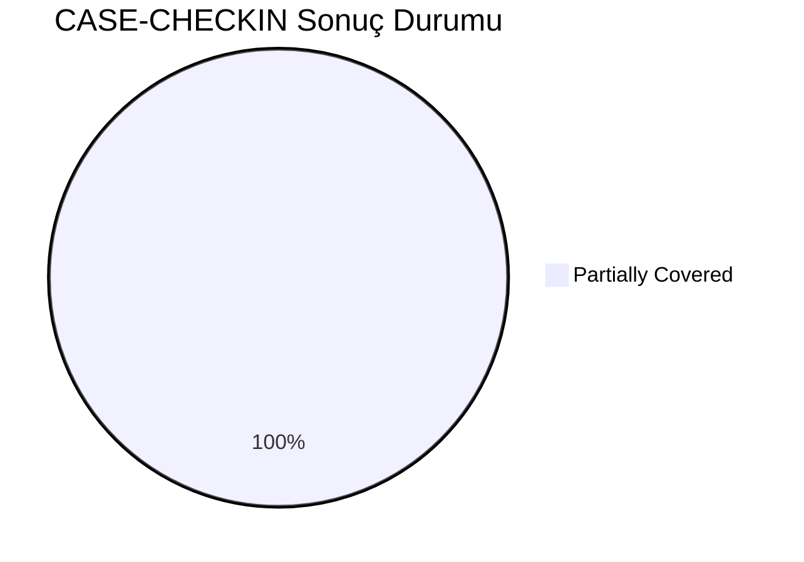
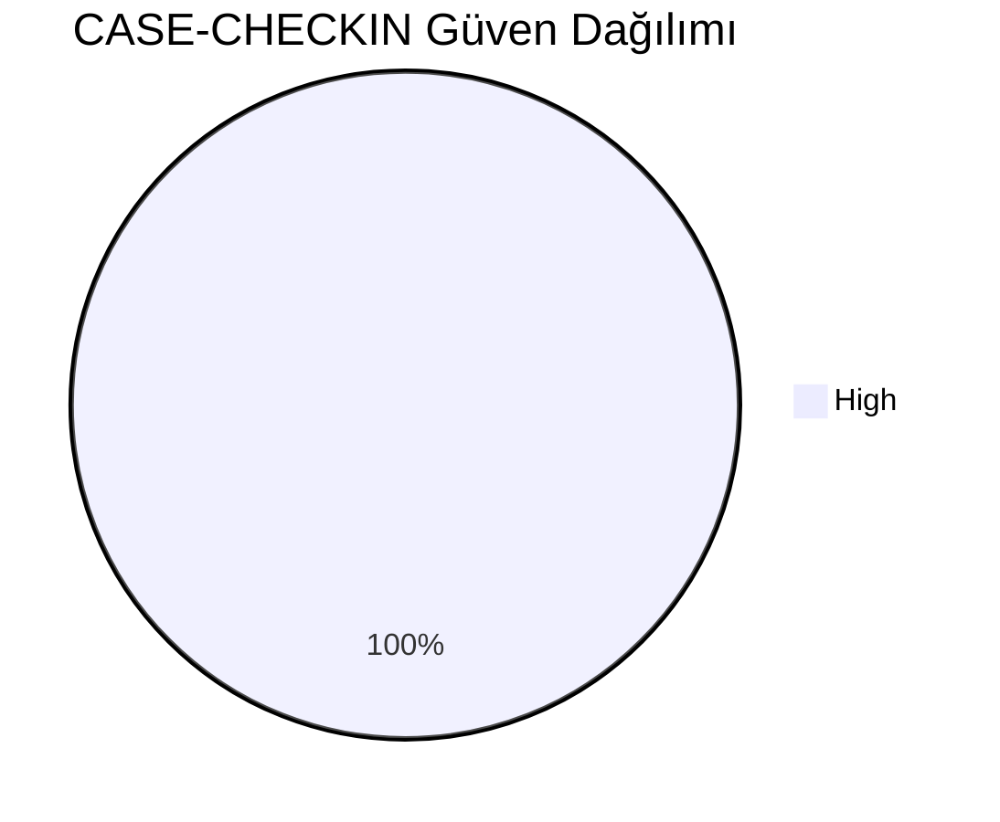
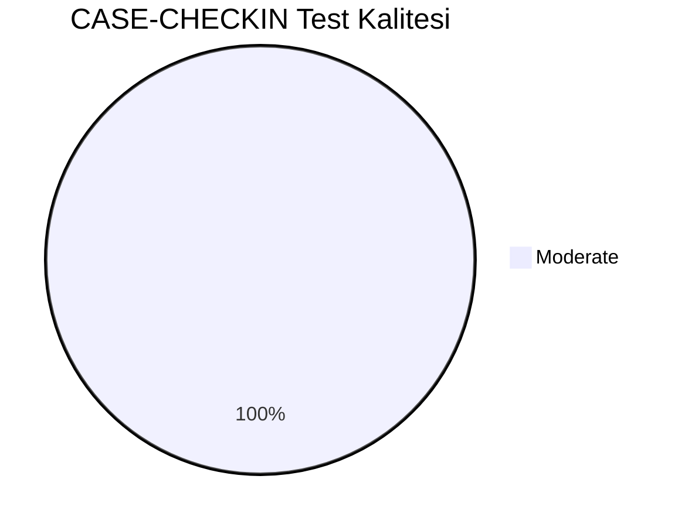
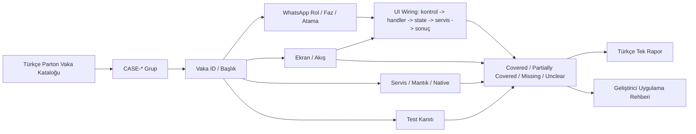
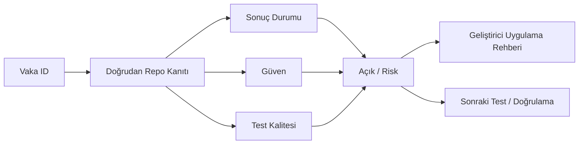

# CASE-CHECKIN Vaka Test Görselleştirmesi

- Toplam vaka: `13`
- Sonuç kaynağı: `/Users/hakanbilir/MyDevZone/StaffMatch/parton-case-results.json`
- Kanıt politikası: isim benzerliği kapsama kanıtı değildir; her vaka doğrudan repo kanıtı ile eşleştirilmelidir.

## Öncelik Dağılımı

## Test Türü Dağılımı

## Vaka Test Sonuç Özeti

## Güven Dağılımı

## Test Kalitesi Dağılımı

## Vaka Eşleştirme Akışı

## Sonuç Akışı

## Sonuç Matrisi

| Vaka ID | Başlık | Durum | Güven | Test Kalitesi | Kanıt | Açık | Olası Kod Alanı | UI Wiring Kanıtı |
| --- | --- | --- | --- | --- | --- | --- | --- | --- |
| `T-123` | 10 dakika kala bildirim gitmesi | Partially Covered | High | Moderate | EmployeeShiftWorkflowViewModel + FirebaseActiveShiftRepository checkIn/checkOut/location validation akışı. | Sahte GPS/anti-spoof ve cihaz manipülasyonlarına karşı güçlü backend kanıtı bu repoda görünmüyor. | shared | kontrol -> handler -> state -> servis/native/API -> görünür sonuç |
| `T-124` | İşçinin “işe geldim” seçmesi | Partially Covered | High | Moderate | EmployeeShiftWorkflowViewModel + FirebaseActiveShiftRepository checkIn/checkOut/location validation akışı. | Sahte GPS/anti-spoof ve cihaz manipülasyonlarına karşı güçlü backend kanıtı bu repoda görünmüyor. | shared | kontrol -> handler -> state -> servis/native/API -> görünür sonuç |
| `T-125` | Uygun konumdaysa doğrulama başarılı olması | Partially Covered | High | Moderate | EmployeeShiftWorkflowViewModel + FirebaseActiveShiftRepository checkIn/checkOut/location validation akışı. | Sahte GPS/anti-spoof ve cihaz manipülasyonlarına karşı güçlü backend kanıtı bu repoda görünmüyor. | shared | kontrol -> handler -> state -> servis/native/API -> görünür sonuç |
| `T-126` | Uygun konumda değilse reddedilmesi | Partially Covered | High | Moderate | EmployeeShiftWorkflowViewModel + FirebaseActiveShiftRepository checkIn/checkOut/location validation akışı. | Sahte GPS/anti-spoof ve cihaz manipülasyonlarına karşı güçlü backend kanıtı bu repoda görünmüyor. | shared | kontrol -> handler -> state -> servis/native/API -> görünür sonuç |
| `T-127` | GPS sapmasında tolerans testi | Partially Covered | High | Moderate | EmployeeShiftWorkflowViewModel + FirebaseActiveShiftRepository checkIn/checkOut/location validation akışı. | Sahte GPS/anti-spoof ve cihaz manipülasyonlarına karşı güçlü backend kanıtı bu repoda görünmüyor. | shared | kontrol -> handler -> state -> servis/native/API -> görünür sonuç |
| `T-128` | Düşük internetle tekrar deneme | Partially Covered | High | Moderate | EmployeeShiftWorkflowViewModel + FirebaseActiveShiftRepository checkIn/checkOut/location validation akışı. | Sahte GPS/anti-spoof ve cihaz manipülasyonlarına karşı güçlü backend kanıtı bu repoda görünmüyor. | shared | kontrol -> handler -> state -> servis/native/API -> görünür sonuç |
| `T-129` | Erken check-in denemesi | Partially Covered | High | Moderate | EmployeeShiftWorkflowViewModel + FirebaseActiveShiftRepository checkIn/checkOut/location validation akışı. | Sahte GPS/anti-spoof ve cihaz manipülasyonlarına karşı güçlü backend kanıtı bu repoda görünmüyor. | shared | kontrol -> handler -> state -> servis/native/API -> görünür sonuç |
| `T-130` | Geç check-in denemesi | Partially Covered | High | Moderate | EmployeeShiftWorkflowViewModel + FirebaseActiveShiftRepository checkIn/checkOut/location validation akışı. | Sahte GPS/anti-spoof ve cihaz manipülasyonlarına karşı güçlü backend kanıtı bu repoda görünmüyor. | shared | kontrol -> handler -> state -> servis/native/API -> görünür sonuç |
| `T-131` | Sahte konumla check-in denemesi | Partially Covered | High | Moderate | EmployeeShiftWorkflowViewModel + FirebaseActiveShiftRepository checkIn/checkOut/location validation akışı. | Sahte GPS/anti-spoof ve cihaz manipülasyonlarına karşı güçlü backend kanıtı bu repoda görünmüyor. | shared | kontrol -> handler -> state -> servis/native/API -> görünür sonuç |
| `T-132` | Konum izni kapalıyken check-in denemesi | Partially Covered | High | Moderate | EmployeeShiftWorkflowViewModel + FirebaseActiveShiftRepository checkIn/checkOut/location validation akışı. | Sahte GPS/anti-spoof ve cihaz manipülasyonlarına karşı güçlü backend kanıtı bu repoda görünmüyor. | shared | kontrol -> handler -> state -> servis/native/API -> görünür sonuç |
| `T-133` | İşverenin işçi geldi bildirimi alması | Partially Covered | High | Moderate | EmployeeShiftWorkflowViewModel + FirebaseActiveShiftRepository checkIn/checkOut/location validation akışı. | Sahte GPS/anti-spoof ve cihaz manipülasyonlarına karşı güçlü backend kanıtı bu repoda görünmüyor. | shared | kontrol -> handler -> state -> servis/native/API -> görünür sonuç |
| `T-134` | Manuel doğrulama akışı varsa testi | Partially Covered | High | Moderate | EmployeeShiftWorkflowViewModel + FirebaseActiveShiftRepository checkIn/checkOut/location validation akışı. | Sahte GPS/anti-spoof ve cihaz manipülasyonlarına karşı güçlü backend kanıtı bu repoda görünmüyor. | shared | kontrol -> handler -> state -> servis/native/API -> görünür sonuç |
| `T-135` | Hatalı reddedilmiş check-in için itiraz süreci | Partially Covered | High | Moderate | EmployeeShiftWorkflowViewModel + FirebaseActiveShiftRepository checkIn/checkOut/location validation akışı. | Sahte GPS/anti-spoof ve cihaz manipülasyonlarına karşı güçlü backend kanıtı bu repoda görünmüyor. | shared | kontrol -> handler -> state -> servis/native/API -> görünür sonuç |

## Vakalar

| Vaka ID | Başlık | Öncelik | Test Türü | Rol | Canlı Test Fazı | Görsel Eşleştirme Notu |
| --- | --- | --- | --- | --- | --- | --- |
| `T-123` | 10 dakika kala bildirim gitmesi | Kritik | Uçtan Uca | İşçi | Faz 5 - İş Günü Yönetimi | Ekran / servis / test kanıtı ile eşleştirilecek |
| `T-124` | İşçinin “işe geldim” seçmesi | Kritik | Uçtan Uca | İşçi | Faz 5 - İş Günü Yönetimi | Ekran / servis / test kanıtı ile eşleştirilecek |
| `T-125` | Uygun konumdaysa doğrulama başarılı olması | Kritik | Uçtan Uca | İşçi | Faz 5 - İş Günü Yönetimi | Ekran / servis / test kanıtı ile eşleştirilecek |
| `T-126` | Uygun konumda değilse reddedilmesi | Kritik | Uçtan Uca | İşçi | Faz 5 - İş Günü Yönetimi | Ekran / servis / test kanıtı ile eşleştirilecek |
| `T-127` | GPS sapmasında tolerans testi | Kritik | Uçtan Uca | İşçi | Faz 5 - İş Günü Yönetimi | Ekran / servis / test kanıtı ile eşleştirilecek |
| `T-128` | Düşük internetle tekrar deneme | Kritik | Uçtan Uca | İşçi | Faz 5 - İş Günü Yönetimi | Ekran / servis / test kanıtı ile eşleştirilecek |
| `T-129` | Erken check-in denemesi | Kritik | Uçtan Uca | İşçi | Faz 5 - İş Günü Yönetimi | Ekran / servis / test kanıtı ile eşleştirilecek |
| `T-130` | Geç check-in denemesi | Kritik | Uçtan Uca | İşçi | Faz 5 - İş Günü Yönetimi | Ekran / servis / test kanıtı ile eşleştirilecek |
| `T-131` | Sahte konumla check-in denemesi | Kritik | Uçtan Uca | İşçi | Faz 5 - İş Günü Yönetimi | Ekran / servis / test kanıtı ile eşleştirilecek |
| `T-132` | Konum izni kapalıyken check-in denemesi | Kritik | Uçtan Uca | İşçi | Faz 5 - İş Günü Yönetimi | Ekran / servis / test kanıtı ile eşleştirilecek |
| `T-133` | İşverenin işçi geldi bildirimi alması | Kritik | Uçtan Uca | İşçi | Faz 5 - İş Günü Yönetimi | Ekran / servis / test kanıtı ile eşleştirilecek |
| `T-134` | Manuel doğrulama akışı varsa testi | Kritik | Uçtan Uca | İşçi | Faz 5 - İş Günü Yönetimi | Ekran / servis / test kanıtı ile eşleştirilecek |
| `T-135` | Hatalı reddedilmiş check-in için itiraz süreci | Kritik | Uçtan Uca | İşçi | Faz 5 - İş Günü Yönetimi | Ekran / servis / test kanıtı ile eşleştirilecek |

## Manuel Tamamlama Kontrol Listesi

- Her vaka için ilişkili ekran/görünüm, servis/modül, native/platform alanı ve test dosyası yazılmalıdır.
- UI wiring kanıtı; ekran kontrolü, handler, state sahibi, validasyon, servis/native/API yan etkisi ve görünür sonucu birlikte göstermelidir.
- Kritik vakalarda enforcement kanıtı ve varsa test kanıtı ayrı ayrı gösterilmelidir.
- Kanıt zayıfsa durum `Unclear` veya `Partially Covered` kalmalıdır.
