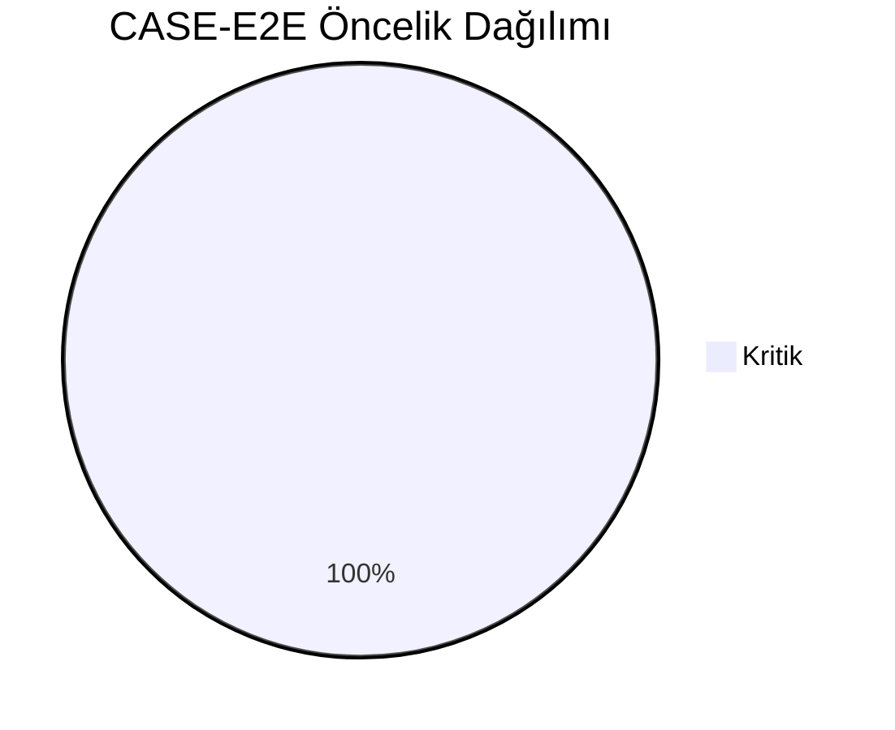
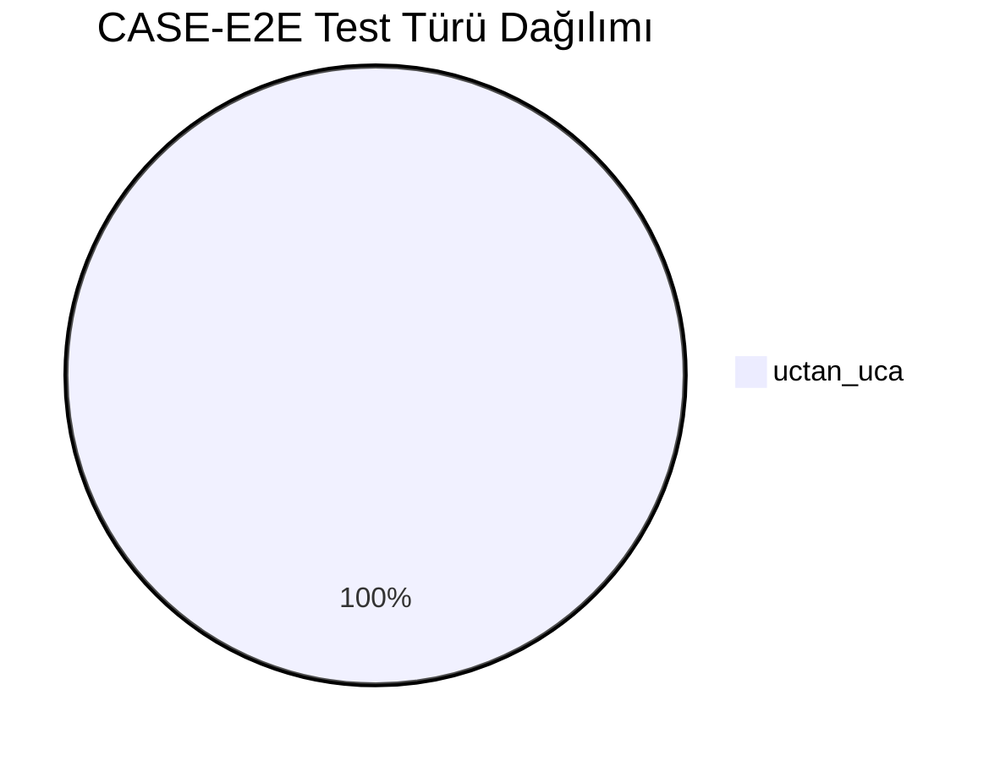
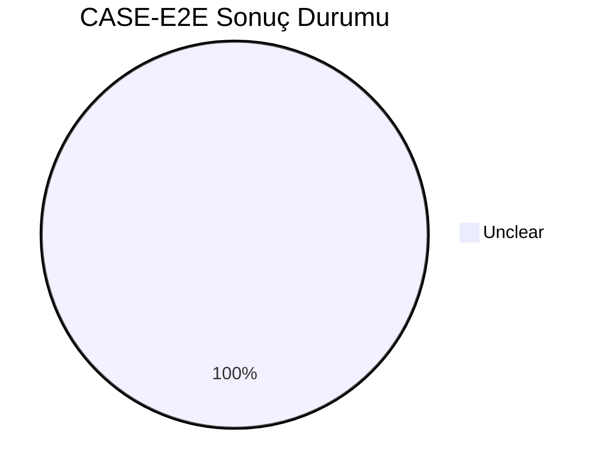
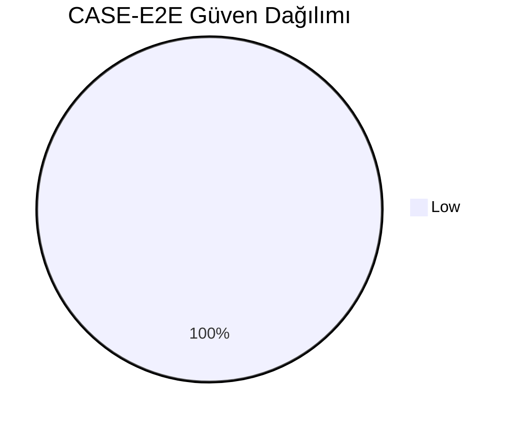
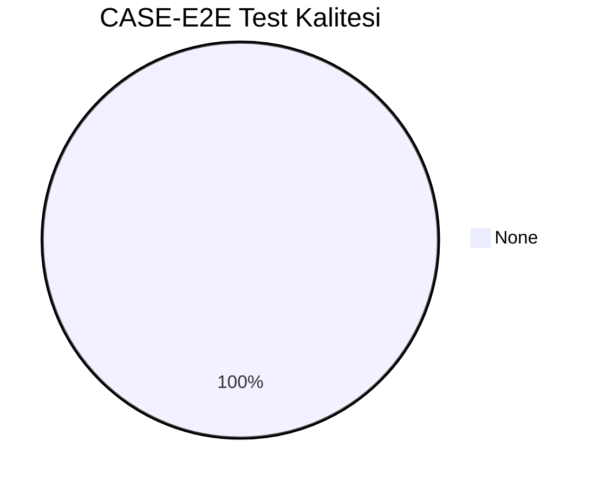
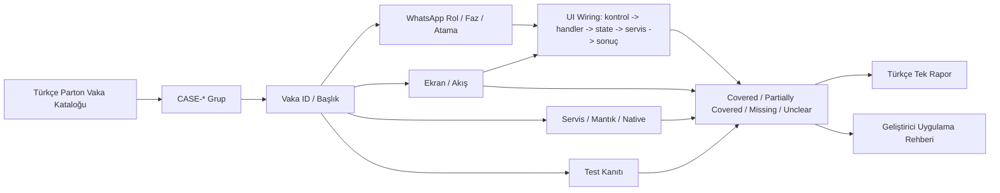
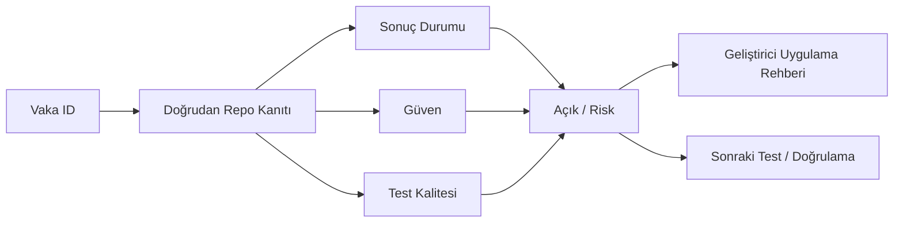

# CASE-E2E Vaka Test Görselleştirmesi

- Toplam vaka: `31`
- Sonuç kaynağı: `/Users/hakanbilir/MyDevZone/StaffMatch/parton-case-results.json`
- Kanıt politikası: isim benzerliği kapsama kanıtı değildir; her vaka doğrudan repo kanıtı ile eşleştirilmelidir.

## Öncelik Dağılımı

## Test Türü Dağılımı

## Vaka Test Sonuç Özeti

## Güven Dağılımı

## Test Kalitesi Dağılımı

## Vaka Eşleştirme Akışı

## Sonuç Akışı

## Sonuç Matrisi

| Vaka ID | Başlık | Durum | Güven | Test Kalitesi | Kanıt | Açık | Olası Kod Alanı | UI Wiring Kanıtı |
| --- | --- | --- | --- | --- | --- | --- | --- | --- |
| `T-193` | İşçi kayıt olur | Unclear | Low | None | Birim test yüzeyi var; tam kullanıcı yolunu koşturan UI/E2E suite kanıtı sınırlı. | E2E otomasyon eksikliği nedeniyle çok-aktör akışların regresyon güvencesi düşük. | test-only | kontrol -> handler -> state -> servis/native/API -> görünür sonuç |
| `T-194` | İşveren kayıt olur | Unclear | Low | None | Birim test yüzeyi var; tam kullanıcı yolunu koşturan UI/E2E suite kanıtı sınırlı. | E2E otomasyon eksikliği nedeniyle çok-aktör akışların regresyon güvencesi düşük. | test-only | kontrol -> handler -> state -> servis/native/API -> görünür sonuç |
| `T-195` | Şube oluşturulur | Unclear | Low | None | Birim test yüzeyi var; tam kullanıcı yolunu koşturan UI/E2E suite kanıtı sınırlı. | E2E otomasyon eksikliği nedeniyle çok-aktör akışların regresyon güvencesi düşük. | test-only | kontrol -> handler -> state -> servis/native/API -> görünür sonuç |
| `T-196` | İlan oluşturulur | Unclear | Low | None | Birim test yüzeyi var; tam kullanıcı yolunu koşturan UI/E2E suite kanıtı sınırlı. | E2E otomasyon eksikliği nedeniyle çok-aktör akışların regresyon güvencesi düşük. | test-only | kontrol -> handler -> state -> servis/native/API -> görünür sonuç |
| `T-197` | İlan uygun işçiye gösterilir | Unclear | Low | None | Birim test yüzeyi var; tam kullanıcı yolunu koşturan UI/E2E suite kanıtı sınırlı. | E2E otomasyon eksikliği nedeniyle çok-aktör akışların regresyon güvencesi düşük. | test-only | kontrol -> handler -> state -> servis/native/API -> görünür sonuç |
| `T-198` | İşçi başvurur | Unclear | Low | None | Birim test yüzeyi var; tam kullanıcı yolunu koşturan UI/E2E suite kanıtı sınırlı. | E2E otomasyon eksikliği nedeniyle çok-aktör akışların regresyon güvencesi düşük. | test-only | kontrol -> handler -> state -> servis/native/API -> görünür sonuç |
| `T-199` | İşveren onaylar | Unclear | Low | None | Birim test yüzeyi var; tam kullanıcı yolunu koşturan UI/E2E suite kanıtı sınırlı. | E2E otomasyon eksikliği nedeniyle çok-aktör akışların regresyon güvencesi düşük. | test-only | kontrol -> handler -> state -> servis/native/API -> görünür sonuç |
| `T-200` | İşçi gelebileceğini bildirir | Unclear | Low | None | Birim test yüzeyi var; tam kullanıcı yolunu koşturan UI/E2E suite kanıtı sınırlı. | E2E otomasyon eksikliği nedeniyle çok-aktör akışların regresyon güvencesi düşük. | test-only | kontrol -> handler -> state -> servis/native/API -> görünür sonuç |
| `T-201` | İşçi işe gelir ve check-in yapar | Unclear | Low | None | Birim test yüzeyi var; tam kullanıcı yolunu koşturan UI/E2E suite kanıtı sınırlı. | E2E otomasyon eksikliği nedeniyle çok-aktör akışların regresyon güvencesi düşük. | test-only | kontrol -> handler -> state -> servis/native/API -> görünür sonuç |
| `T-202` | Konum doğrulanır | Unclear | Low | None | Birim test yüzeyi var; tam kullanıcı yolunu koşturan UI/E2E suite kanıtı sınırlı. | E2E otomasyon eksikliği nedeniyle çok-aktör akışların regresyon güvencesi düşük. | test-only | kontrol -> handler -> state -> servis/native/API -> görünür sonuç |
| `T-203` | Jeton kesinleşir | Unclear | Low | None | Birim test yüzeyi var; tam kullanıcı yolunu koşturan UI/E2E suite kanıtı sınırlı. | E2E otomasyon eksikliği nedeniyle çok-aktör akışların regresyon güvencesi düşük. | test-only | kontrol -> handler -> state -> servis/native/API -> görünür sonuç |
| `T-204` | Değerlendirme yapılır | Unclear | Low | None | Birim test yüzeyi var; tam kullanıcı yolunu koşturan UI/E2E suite kanıtı sınırlı. | E2E otomasyon eksikliği nedeniyle çok-aktör akışların regresyon güvencesi düşük. | test-only | kontrol -> handler -> state -> servis/native/API -> görünür sonuç |
| `T-205` | İşçi onay alır | Unclear | Low | None | Birim test yüzeyi var; tam kullanıcı yolunu koşturan UI/E2E suite kanıtı sınırlı. | E2E otomasyon eksikliği nedeniyle çok-aktör akışların regresyon güvencesi düşük. | test-only | kontrol -> handler -> state -> servis/native/API -> görünür sonuç |
| `T-206` | 3 saat kala gelemiyorum der | Unclear | Low | None | Birim test yüzeyi var; tam kullanıcı yolunu koşturan UI/E2E suite kanıtı sınırlı. | E2E otomasyon eksikliği nedeniyle çok-aktör akışların regresyon güvencesi düşük. | test-only | kontrol -> handler -> state -> servis/native/API -> görünür sonuç |
| `T-207` | İşveren bilgilendirilir | Unclear | Low | None | Birim test yüzeyi var; tam kullanıcı yolunu koşturan UI/E2E suite kanıtı sınırlı. | E2E otomasyon eksikliği nedeniyle çok-aktör akışların regresyon güvencesi düşük. | test-only | kontrol -> handler -> state -> servis/native/API -> görünür sonuç |
| `T-209` | Jeton durumu doğru yönetilir | Unclear | Low | None | Birim test yüzeyi var; tam kullanıcı yolunu koşturan UI/E2E suite kanıtı sınırlı. | E2E otomasyon eksikliği nedeniyle çok-aktör akışların regresyon güvencesi düşük. | test-only | kontrol -> handler -> state -> servis/native/API -> görünür sonuç |
| `T-210` | İşçi fiziksel olarak gelir | Unclear | Low | None | Birim test yüzeyi var; tam kullanıcı yolunu koşturan UI/E2E suite kanıtı sınırlı. | E2E otomasyon eksikliği nedeniyle çok-aktör akışların regresyon güvencesi düşük. | test-only | kontrol -> handler -> state -> servis/native/API -> görünür sonuç |
| `T-211` | GPS doğrulaması başarısız olur | Unclear | Low | None | Birim test yüzeyi var; tam kullanıcı yolunu koşturan UI/E2E suite kanıtı sınırlı. | E2E otomasyon eksikliği nedeniyle çok-aktör akışların regresyon güvencesi düşük. | test-only | kontrol -> handler -> state -> servis/native/API -> görünür sonuç |
| `T-212` | Manuel itiraz açılır | Unclear | Low | None | Birim test yüzeyi var; tam kullanıcı yolunu koşturan UI/E2E suite kanıtı sınırlı. | E2E otomasyon eksikliği nedeniyle çok-aktör akışların regresyon güvencesi düşük. | test-only | kontrol -> handler -> state -> servis/native/API -> görünür sonuç |
| `T-213` | İşveren doğrular | Unclear | Low | None | Birim test yüzeyi var; tam kullanıcı yolunu koşturan UI/E2E suite kanıtı sınırlı. | E2E otomasyon eksikliği nedeniyle çok-aktör akışların regresyon güvencesi düşük. | test-only | kontrol -> handler -> state -> servis/native/API -> görünür sonuç |
| `T-214` | Jeton kararı doğru uygulanır | Unclear | Low | None | Birim test yüzeyi var; tam kullanıcı yolunu koşturan UI/E2E suite kanıtı sınırlı. | E2E otomasyon eksikliği nedeniyle çok-aktör akışların regresyon güvencesi düşük. | test-only | kontrol -> handler -> state -> servis/native/API -> görünür sonuç |
| `T-215` | İşveren işçiyi favoriye alır | Unclear | Low | None | Birim test yüzeyi var; tam kullanıcı yolunu koşturan UI/E2E suite kanıtı sınırlı. | E2E otomasyon eksikliği nedeniyle çok-aktör akışların regresyon güvencesi düşük. | test-only | kontrol -> handler -> state -> servis/native/API -> görünür sonuç |
| `T-216` | Yeni ilanı sadece favorilere açar | Unclear | Low | None | Birim test yüzeyi var; tam kullanıcı yolunu koşturan UI/E2E suite kanıtı sınırlı. | E2E otomasyon eksikliği nedeniyle çok-aktör akışların regresyon güvencesi düşük. | test-only | kontrol -> handler -> state -> servis/native/API -> görünür sonuç |
| `T-217` | İlgili işçi ilanı görür | Unclear | Low | None | Birim test yüzeyi var; tam kullanıcı yolunu koşturan UI/E2E suite kanıtı sınırlı. | E2E otomasyon eksikliği nedeniyle çok-aktör akışların regresyon güvencesi düşük. | test-only | kontrol -> handler -> state -> servis/native/API -> görünür sonuç |
| `T-218` | Başvuru ve onay tamamlanır | Unclear | Low | None | Birim test yüzeyi var; tam kullanıcı yolunu koşturan UI/E2E suite kanıtı sınırlı. | E2E otomasyon eksikliği nedeniyle çok-aktör akışların regresyon güvencesi düşük. | test-only | kontrol -> handler -> state -> servis/native/API -> görünür sonuç |
| `T-219` | İşveren 5 kişilik ilan açar | Unclear | Low | None | Birim test yüzeyi var; tam kullanıcı yolunu koşturan UI/E2E suite kanıtı sınırlı. | E2E otomasyon eksikliği nedeniyle çok-aktör akışların regresyon güvencesi düşük. | test-only | kontrol -> handler -> state -> servis/native/API -> görünür sonuç |
| `T-220` | 5 jeton provizyona alınır | Unclear | Low | None | Birim test yüzeyi var; tam kullanıcı yolunu koşturan UI/E2E suite kanıtı sınırlı. | E2E otomasyon eksikliği nedeniyle çok-aktör akışların regresyon güvencesi düşük. | test-only | kontrol -> handler -> state -> servis/native/API -> görünür sonuç |
| `T-221` | Başvurular gelir | Unclear | Low | None | Birim test yüzeyi var; tam kullanıcı yolunu koşturan UI/E2E suite kanıtı sınırlı. | E2E otomasyon eksikliği nedeniyle çok-aktör akışların regresyon güvencesi düşük. | test-only | kontrol -> handler -> state -> servis/native/API -> görünür sonuç |
| `T-222` | 5 kişi onaylanır | Unclear | Low | None | Birim test yüzeyi var; tam kullanıcı yolunu koşturan UI/E2E suite kanıtı sınırlı. | E2E otomasyon eksikliği nedeniyle çok-aktör akışların regresyon güvencesi düşük. | test-only | kontrol -> handler -> state -> servis/native/API -> görünür sonuç |
| `T-223` | 1 kişi iptal eder | Unclear | Low | None | Birim test yüzeyi var; tam kullanıcı yolunu koşturan UI/E2E suite kanıtı sınırlı. | E2E otomasyon eksikliği nedeniyle çok-aktör akışların regresyon güvencesi düşük. | test-only | kontrol -> handler -> state -> servis/native/API -> görünür sonuç |
| `T-225` | Gelen kişiler kadar jeton kesinleşir | Unclear | Low | None | Birim test yüzeyi var; tam kullanıcı yolunu koşturan UI/E2E suite kanıtı sınırlı. | E2E otomasyon eksikliği nedeniyle çok-aktör akışların regresyon güvencesi düşük. | test-only | kontrol -> handler -> state -> servis/native/API -> görünür sonuç |

## Vakalar

| Vaka ID | Başlık | Öncelik | Test Türü | Rol | Canlı Test Fazı | Görsel Eşleştirme Notu |
| --- | --- | --- | --- | --- | --- | --- |
| `T-193` | İşçi kayıt olur | Kritik | Uçtan Uca | Çoklu Aktör | Final Fazı - Uçtan Uca | Ekran / servis / test kanıtı ile eşleştirilecek |
| `T-194` | İşveren kayıt olur | Kritik | Uçtan Uca | Çoklu Aktör | Final Fazı - Uçtan Uca | Ekran / servis / test kanıtı ile eşleştirilecek |
| `T-195` | Şube oluşturulur | Kritik | Uçtan Uca | İşveren | Final Fazı - Uçtan Uca | Ekran / servis / test kanıtı ile eşleştirilecek |
| `T-196` | İlan oluşturulur | Kritik | Uçtan Uca | Çoklu Aktör | Final Fazı - Uçtan Uca | Ekran / servis / test kanıtı ile eşleştirilecek |
| `T-197` | İlan uygun işçiye gösterilir | Kritik | Uçtan Uca | İşçi | Final Fazı - Uçtan Uca | Ekran / servis / test kanıtı ile eşleştirilecek |
| `T-198` | İşçi başvurur | Kritik | Uçtan Uca | Çoklu Aktör | Final Fazı - Uçtan Uca | Ekran / servis / test kanıtı ile eşleştirilecek |
| `T-199` | İşveren onaylar | Kritik | Uçtan Uca | Çoklu Aktör | Final Fazı - Uçtan Uca | Ekran / servis / test kanıtı ile eşleştirilecek |
| `T-200` | İşçi gelebileceğini bildirir | Kritik | Uçtan Uca | Çoklu Aktör | Final Fazı - Uçtan Uca | Ekran / servis / test kanıtı ile eşleştirilecek |
| `T-201` | İşçi işe gelir ve check-in yapar | Kritik | Uçtan Uca | Çoklu Aktör | Final Fazı - Uçtan Uca | Ekran / servis / test kanıtı ile eşleştirilecek |
| `T-202` | Konum doğrulanır | Kritik | Uçtan Uca | Çoklu Aktör | Final Fazı - Uçtan Uca | Ekran / servis / test kanıtı ile eşleştirilecek |
| `T-203` | Jeton kesinleşir | Kritik | Uçtan Uca | Çoklu Aktör | Final Fazı - Uçtan Uca | Ekran / servis / test kanıtı ile eşleştirilecek |
| `T-204` | Değerlendirme yapılır | Kritik | Uçtan Uca | Çoklu Aktör | Final Fazı - Uçtan Uca | Ekran / servis / test kanıtı ile eşleştirilecek |
| `T-205` | İşçi onay alır | Kritik | Uçtan Uca | Çoklu Aktör | Final Fazı - Uçtan Uca | Ekran / servis / test kanıtı ile eşleştirilecek |
| `T-206` | 3 saat kala gelemiyorum der | Kritik | Uçtan Uca | Çoklu Aktör | Final Fazı - Uçtan Uca | Ekran / servis / test kanıtı ile eşleştirilecek |
| `T-207` | İşveren bilgilendirilir | Kritik | Uçtan Uca | Çoklu Aktör | Final Fazı - Uçtan Uca | Ekran / servis / test kanıtı ile eşleştirilecek |
| `T-209` | Jeton durumu doğru yönetilir | Kritik | Uçtan Uca | Çoklu Aktör | Final Fazı - Uçtan Uca | Ekran / servis / test kanıtı ile eşleştirilecek |
| `T-210` | İşçi fiziksel olarak gelir | Kritik | Uçtan Uca | Çoklu Aktör | Final Fazı - Uçtan Uca | Ekran / servis / test kanıtı ile eşleştirilecek |
| `T-211` | GPS doğrulaması başarısız olur | Kritik | Uçtan Uca | Çoklu Aktör | Final Fazı - Uçtan Uca | Ekran / servis / test kanıtı ile eşleştirilecek |
| `T-212` | Manuel itiraz açılır | Kritik | Uçtan Uca | Çoklu Aktör | Final Fazı - Uçtan Uca | Ekran / servis / test kanıtı ile eşleştirilecek |
| `T-213` | İşveren doğrular | Kritik | Uçtan Uca | Çoklu Aktör | Final Fazı - Uçtan Uca | Ekran / servis / test kanıtı ile eşleştirilecek |
| `T-214` | Jeton kararı doğru uygulanır | Kritik | Uçtan Uca | Çoklu Aktör | Final Fazı - Uçtan Uca | Ekran / servis / test kanıtı ile eşleştirilecek |
| `T-215` | İşveren işçiyi favoriye alır | Kritik | Uçtan Uca | İşçi | Final Fazı - Uçtan Uca | Ekran / servis / test kanıtı ile eşleştirilecek |
| `T-216` | Yeni ilanı sadece favorilere açar | Kritik | Uçtan Uca | Çoklu Aktör | Final Fazı - Uçtan Uca | Ekran / servis / test kanıtı ile eşleştirilecek |
| `T-217` | İlgili işçi ilanı görür | Kritik | Uçtan Uca | İşçi | Final Fazı - Uçtan Uca | Ekran / servis / test kanıtı ile eşleştirilecek |
| `T-218` | Başvuru ve onay tamamlanır | Kritik | Uçtan Uca | Çoklu Aktör | Final Fazı - Uçtan Uca | Ekran / servis / test kanıtı ile eşleştirilecek |
| `T-219` | İşveren 5 kişilik ilan açar | Kritik | Uçtan Uca | Çoklu Aktör | Final Fazı - Uçtan Uca | Ekran / servis / test kanıtı ile eşleştirilecek |
| `T-220` | 5 jeton provizyona alınır | Kritik | Uçtan Uca | Çoklu Aktör | Final Fazı - Uçtan Uca | Ekran / servis / test kanıtı ile eşleştirilecek |
| `T-221` | Başvurular gelir | Kritik | Uçtan Uca | Çoklu Aktör | Final Fazı - Uçtan Uca | Ekran / servis / test kanıtı ile eşleştirilecek |
| `T-222` | 5 kişi onaylanır | Kritik | Uçtan Uca | Çoklu Aktör | Final Fazı - Uçtan Uca | Ekran / servis / test kanıtı ile eşleştirilecek |
| `T-223` | 1 kişi iptal eder | Kritik | Uçtan Uca | Çoklu Aktör | Final Fazı - Uçtan Uca | Ekran / servis / test kanıtı ile eşleştirilecek |
| `T-225` | Gelen kişiler kadar jeton kesinleşir | Kritik | Uçtan Uca | Çoklu Aktör | Final Fazı - Uçtan Uca | Ekran / servis / test kanıtı ile eşleştirilecek |

## Manuel Tamamlama Kontrol Listesi

- Her vaka için ilişkili ekran/görünüm, servis/modül, native/platform alanı ve test dosyası yazılmalıdır.
- UI wiring kanıtı; ekran kontrolü, handler, state sahibi, validasyon, servis/native/API yan etkisi ve görünür sonucu birlikte göstermelidir.
- Kritik vakalarda enforcement kanıtı ve varsa test kanıtı ayrı ayrı gösterilmelidir.
- Kanıt zayıfsa durum `Unclear` veya `Partially Covered` kalmalıdır.
