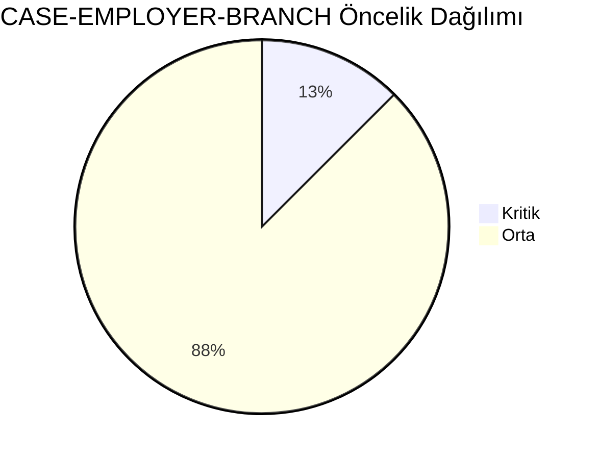
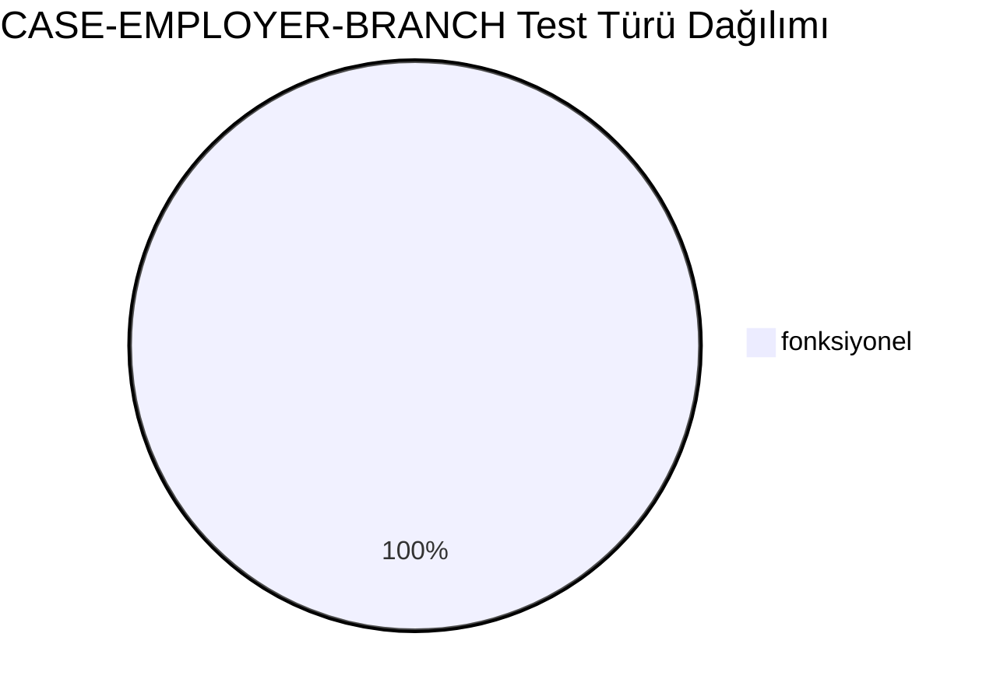
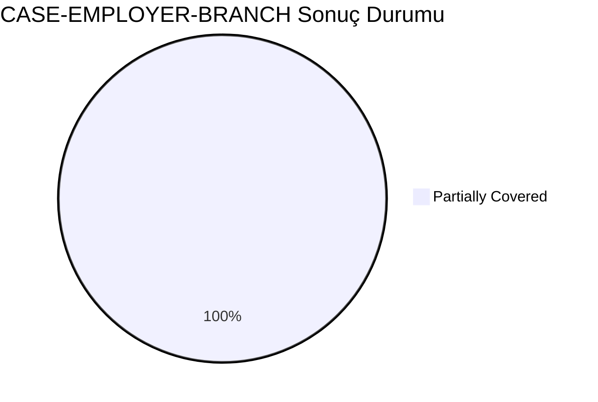
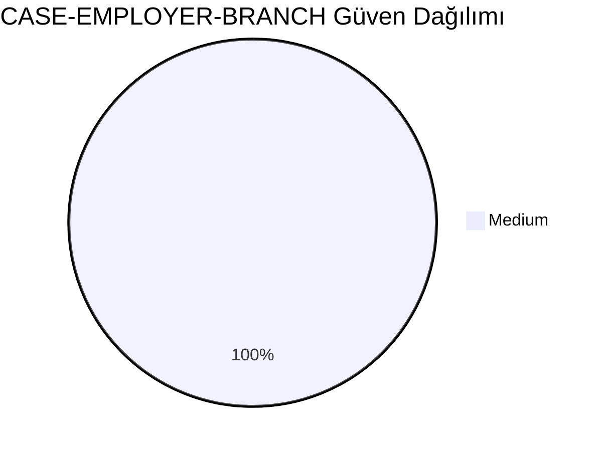
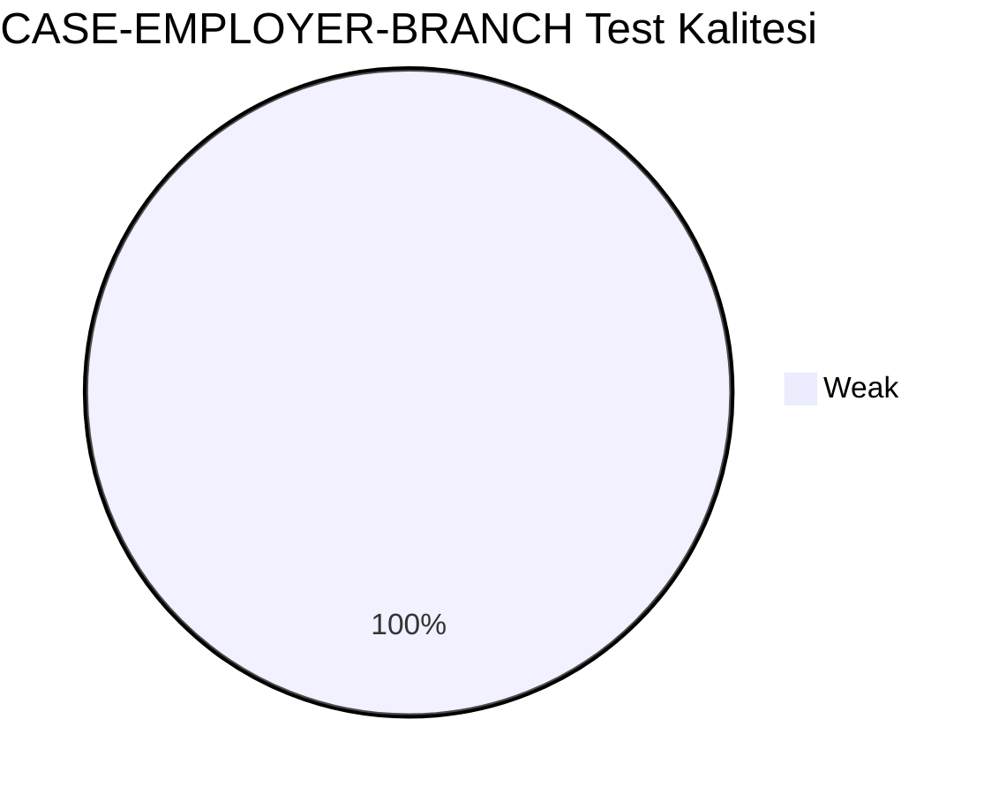
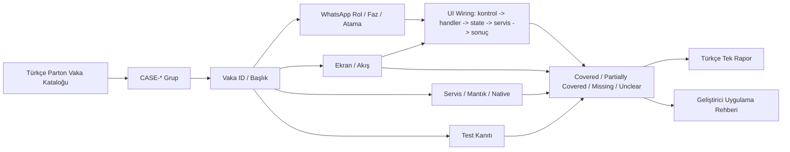
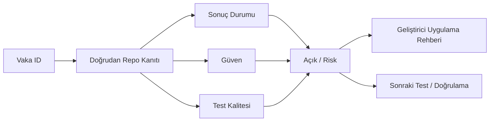

# CASE-EMPLOYER-BRANCH Vaka Test Görselleştirmesi

- Toplam vaka: `8`
- Sonuç kaynağı: `/Users/hakanbilir/MyDevZone/StaffMatch/parton-case-results.json`
- Kanıt politikası: isim benzerliği kapsama kanıtı değildir; her vaka doğrudan repo kanıtı ile eşleştirilmelidir.

## Öncelik Dağılımı

## Test Türü Dağılımı

## Vaka Test Sonuç Özeti

## Güven Dağılımı

## Test Kalitesi Dağılımı

## Vaka Eşleştirme Akışı

## Sonuç Akışı

## Sonuç Matrisi

| Vaka ID | Başlık | Durum | Güven | Test Kalitesi | Kanıt | Açık | Olası Kod Alanı | UI Wiring Kanıtı |
| --- | --- | --- | --- | --- | --- | --- | --- | --- |
| `T-031` | Yeni şube ekleme | Partially Covered | Medium | Weak | Employer/Manager Graph ve BranchRepository akışları mevcut. | Branch yetki sınırları çoğunlukla rule/backend tarafında; client kanıtı tek başına yeterli değil. | shared | kontrol -> handler -> state -> servis/native/API -> görünür sonuç |
| `T-032` | Aynı işverene çoklu şube ekleme | Partially Covered | Medium | Weak | Employer/Manager Graph ve BranchRepository akışları mevcut. | Branch yetki sınırları çoğunlukla rule/backend tarafında; client kanıtı tek başına yeterli değil. | shared | kontrol -> handler -> state -> servis/native/API -> görünür sonuç |
| `T-033` | Şube konumunun doğru kaydedilmesi | Partially Covered | Medium | Weak | Employer/Manager Graph ve BranchRepository akışları mevcut. | Branch yetki sınırları çoğunlukla rule/backend tarafında; client kanıtı tek başına yeterli değil. | shared | kontrol -> handler -> state -> servis/native/API -> görünür sonuç |
| `T-034` | Şube güncelleme sonrası ilan ilişkisi | Partially Covered | Medium | Weak | Employer/Manager Graph ve BranchRepository akışları mevcut. | Branch yetki sınırları çoğunlukla rule/backend tarafında; client kanıtı tek başına yeterli değil. | shared | kontrol -> handler -> state -> servis/native/API -> görünür sonuç |
| `T-035` | Pasife alınan şubedeki ilanların durumu | Partially Covered | Medium | Weak | Employer/Manager Graph ve BranchRepository akışları mevcut. | Branch yetki sınırları çoğunlukla rule/backend tarafında; client kanıtı tek başına yeterli değil. | shared | kontrol -> handler -> state -> servis/native/API -> görünür sonuç |
| `T-036` | Yanlış koordinat ile şube oluşturma | Partially Covered | Medium | Weak | Employer/Manager Graph ve BranchRepository akışları mevcut. | Branch yetki sınırları çoğunlukla rule/backend tarafında; client kanıtı tek başına yeterli değil. | shared | kontrol -> handler -> state -> servis/native/API -> görünür sonuç |
| `T-037` | Sadece kendi şubelerini görüntüleme yetkisi | Partially Covered | Medium | Weak | Employer/Manager Graph ve BranchRepository akışları mevcut. | Branch yetki sınırları çoğunlukla rule/backend tarafında; client kanıtı tek başına yeterli değil. | shared | kontrol -> handler -> state -> servis/native/API -> görünür sonuç |
| `T-038` | Şube silme sonrası geçmiş ilan görünürlüğü | Partially Covered | Medium | Weak | Employer/Manager Graph ve BranchRepository akışları mevcut. | Branch yetki sınırları çoğunlukla rule/backend tarafında; client kanıtı tek başına yeterli değil. | shared | kontrol -> handler -> state -> servis/native/API -> görünür sonuç |

## Vakalar

| Vaka ID | Başlık | Öncelik | Test Türü | Rol | Canlı Test Fazı | Görsel Eşleştirme Notu |
| --- | --- | --- | --- | --- | --- | --- |
| `T-031` | Yeni şube ekleme | Orta | Fonksiyonel | İşveren | Faz 2 - İşveren Profil | Ekran / servis / test kanıtı ile eşleştirilecek |
| `T-032` | Aynı işverene çoklu şube ekleme | Orta | Fonksiyonel | İşveren | Faz 2 - İşveren Profil | Ekran / servis / test kanıtı ile eşleştirilecek |
| `T-033` | Şube konumunun doğru kaydedilmesi | Kritik | Fonksiyonel | İşveren | Faz 2 - İşveren Profil | Ekran / servis / test kanıtı ile eşleştirilecek |
| `T-034` | Şube güncelleme sonrası ilan ilişkisi | Orta | Fonksiyonel | İşveren | Faz 2 - İşveren Profil | Ekran / servis / test kanıtı ile eşleştirilecek |
| `T-035` | Pasife alınan şubedeki ilanların durumu | Orta | Fonksiyonel | İşveren | Faz 2 - İşveren Profil | Ekran / servis / test kanıtı ile eşleştirilecek |
| `T-036` | Yanlış koordinat ile şube oluşturma | Orta | Fonksiyonel | İşveren | Faz 2 - İşveren Profil | Ekran / servis / test kanıtı ile eşleştirilecek |
| `T-037` | Sadece kendi şubelerini görüntüleme yetkisi | Orta | Fonksiyonel | İşveren | Faz 2 - İşveren Profil | Ekran / servis / test kanıtı ile eşleştirilecek |
| `T-038` | Şube silme sonrası geçmiş ilan görünürlüğü | Orta | Fonksiyonel | İşveren | Faz 2 - İşveren Profil | Ekran / servis / test kanıtı ile eşleştirilecek |

## Manuel Tamamlama Kontrol Listesi

- Her vaka için ilişkili ekran/görünüm, servis/modül, native/platform alanı ve test dosyası yazılmalıdır.
- UI wiring kanıtı; ekran kontrolü, handler, state sahibi, validasyon, servis/native/API yan etkisi ve görünür sonucu birlikte göstermelidir.
- Kritik vakalarda enforcement kanıtı ve varsa test kanıtı ayrı ayrı gösterilmelidir.
- Kanıt zayıfsa durum `Unclear` veya `Partially Covered` kalmalıdır.
