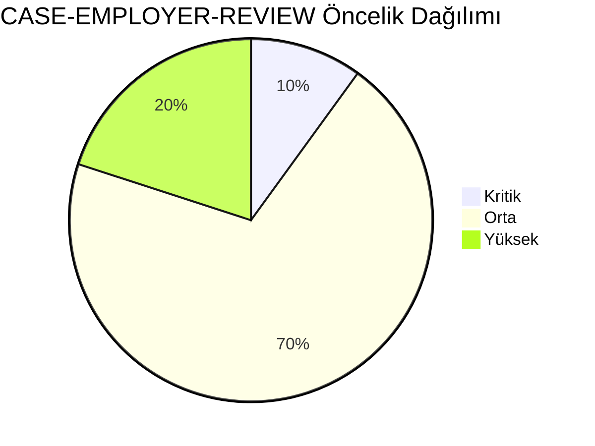
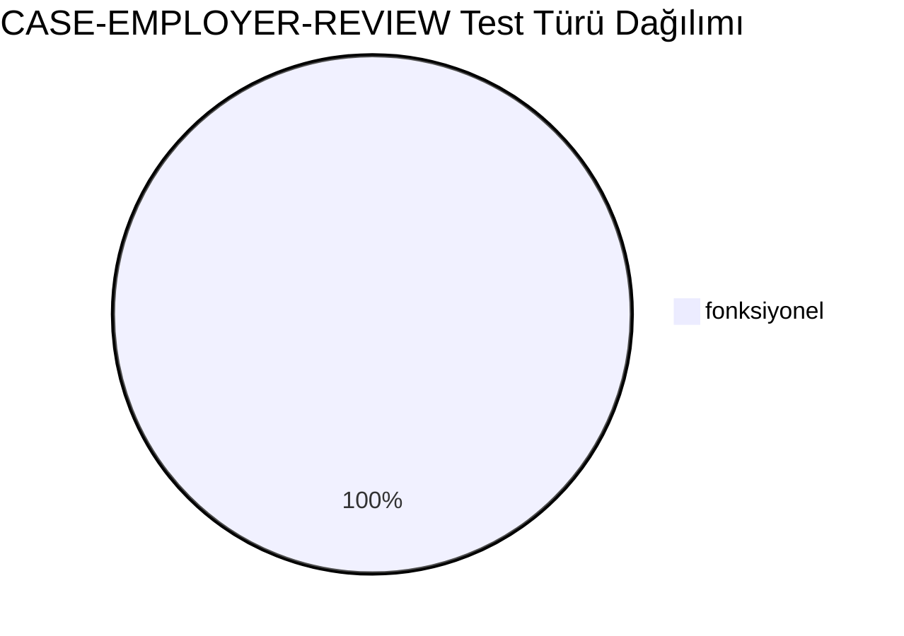
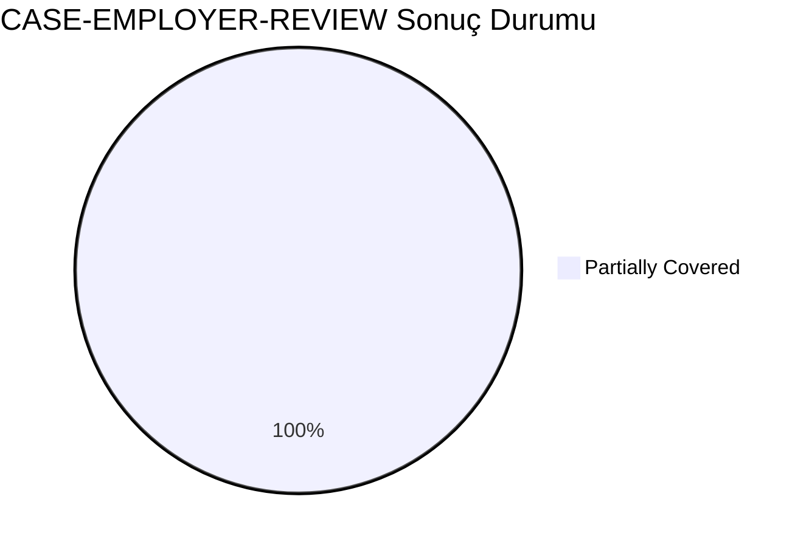
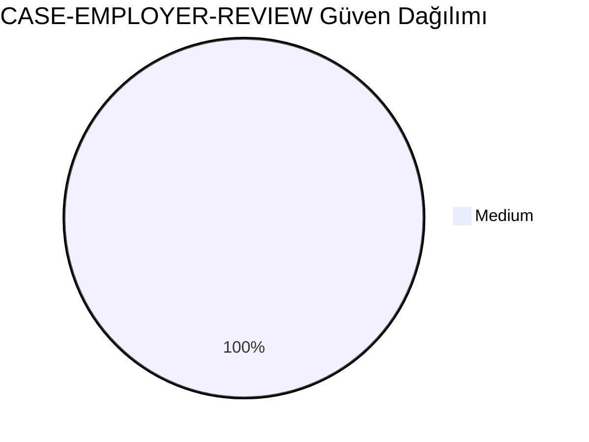
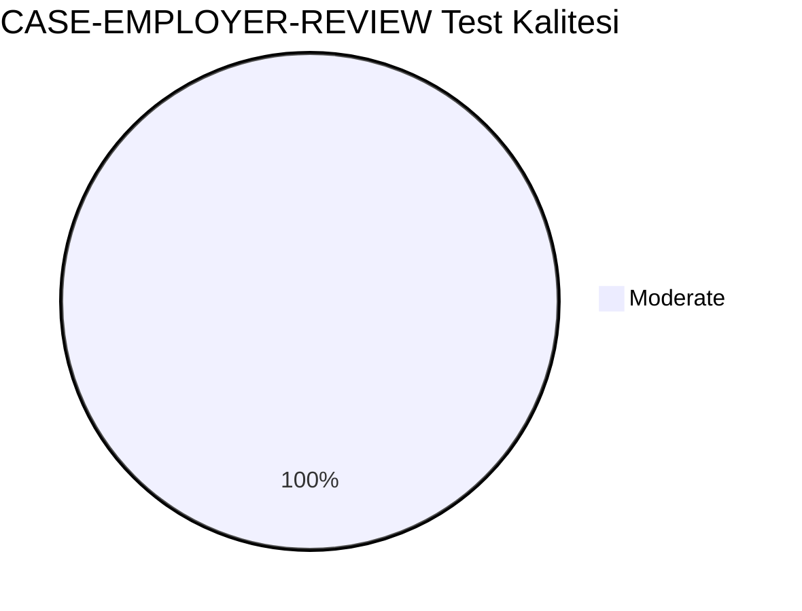
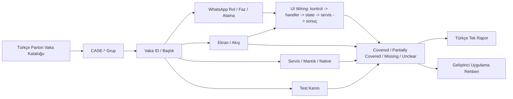
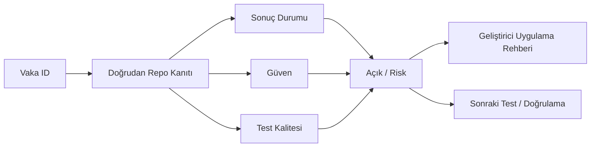

# CASE-EMPLOYER-REVIEW Vaka Test Görselleştirmesi

- Toplam vaka: `10`
- Sonuç kaynağı: `/Users/hakanbilir/MyDevZone/StaffMatch/parton-case-results.json`
- Kanıt politikası: isim benzerliği kapsama kanıtı değildir; her vaka doğrudan repo kanıtı ile eşleştirilmelidir.

## Öncelik Dağılımı

## Test Türü Dağılımı

## Vaka Test Sonuç Özeti

## Güven Dağılımı

## Test Kalitesi Dağılımı

## Vaka Eşleştirme Akışı

## Sonuç Akışı

## Sonuç Matrisi

| Vaka ID | Başlık | Durum | Güven | Test Kalitesi | Kanıt | Açık | Olası Kod Alanı | UI Wiring Kanıtı |
| --- | --- | --- | --- | --- | --- | --- | --- | --- |
| `T-089` | Başvuranları listeleme | Partially Covered | Medium | Moderate | EmployerJobApplicantsViewModel onay/red/iptal ve completion süreçlerini yönetiyor. | Moderator/suistimal kararları ve tutarlılık için bağımsız E2E/contract test eksik. | shared | kontrol -> handler -> state -> servis/native/API -> görünür sonuç |
| `T-090` | Aday filtreleme | Partially Covered | Medium | Moderate | EmployerJobApplicantsViewModel onay/red/iptal ve completion süreçlerini yönetiyor. | Moderator/suistimal kararları ve tutarlılık için bağımsız E2E/contract test eksik. | shared | kontrol -> handler -> state -> servis/native/API -> görünür sonuç |
| `T-091` | Aday onaylama | Partially Covered | Medium | Moderate | EmployerJobApplicantsViewModel onay/red/iptal ve completion süreçlerini yönetiyor. | Moderator/suistimal kararları ve tutarlılık için bağımsız E2E/contract test eksik. | shared | kontrol -> handler -> state -> servis/native/API -> görünür sonuç |
| `T-092` | Aday reddetme | Partially Covered | Medium | Moderate | EmployerJobApplicantsViewModel onay/red/iptal ve completion süreçlerini yönetiyor. | Moderator/suistimal kararları ve tutarlılık için bağımsız E2E/contract test eksik. | shared | kontrol -> handler -> state -> servis/native/API -> görünür sonuç |
| `T-093` | Kontenjan dolunca ilanı kapatma | Partially Covered | Medium | Moderate | EmployerJobApplicantsViewModel onay/red/iptal ve completion süreçlerini yönetiyor. | Moderator/suistimal kararları ve tutarlılık için bağımsız E2E/contract test eksik. | shared | kontrol -> handler -> state -> servis/native/API -> görünür sonuç |
| `T-094` | Kontenjan üstü aday onayının engellenmesi | Partially Covered | Medium | Moderate | EmployerJobApplicantsViewModel onay/red/iptal ve completion süreçlerini yönetiyor. | Moderator/suistimal kararları ve tutarlılık için bağımsız E2E/contract test eksik. | shared | kontrol -> handler -> state -> servis/native/API -> görünür sonuç |
| `T-096` | Red bildirimlerinin doğru gitmesi | Partially Covered | Medium | Moderate | EmployerJobApplicantsViewModel onay/red/iptal ve completion süreçlerini yönetiyor. | Moderator/suistimal kararları ve tutarlılık için bağımsız E2E/contract test eksik. | shared | kontrol -> handler -> state -> servis/native/API -> görünür sonuç |
| `T-097` | Onay bildirimlerinin doğru gitmesi | Partially Covered | Medium | Moderate | EmployerJobApplicantsViewModel onay/red/iptal ve completion süreçlerini yönetiyor. | Moderator/suistimal kararları ve tutarlılık için bağımsız E2E/contract test eksik. | shared | kontrol -> handler -> state -> servis/native/API -> görünür sonuç |
| `T-098` | Onaylı adayı sonradan iptal etme | Partially Covered | Medium | Moderate | EmployerJobApplicantsViewModel onay/red/iptal ve completion süreçlerini yönetiyor. | Moderator/suistimal kararları ve tutarlılık için bağımsız E2E/contract test eksik. | shared | kontrol -> handler -> state -> servis/native/API -> görünür sonuç |
| `T-099` | İlanı kapatma sonrası onaylı adayların durumu | Partially Covered | Medium | Moderate | EmployerJobApplicantsViewModel onay/red/iptal ve completion süreçlerini yönetiyor. | Moderator/suistimal kararları ve tutarlılık için bağımsız E2E/contract test eksik. | shared | kontrol -> handler -> state -> servis/native/API -> görünür sonuç |

## Vakalar

| Vaka ID | Başlık | Öncelik | Test Türü | Rol | Canlı Test Fazı | Görsel Eşleştirme Notu |
| --- | --- | --- | --- | --- | --- | --- |
| `T-089` | Başvuranları listeleme | Orta | Fonksiyonel | İşveren | Faz 4 - Başvuru ve Aday Yönetimi | Ekran / servis / test kanıtı ile eşleştirilecek |
| `T-090` | Aday filtreleme | Orta | Fonksiyonel | İşveren | Faz 4 - Başvuru ve Aday Yönetimi | Ekran / servis / test kanıtı ile eşleştirilecek |
| `T-091` | Aday onaylama | Orta | Fonksiyonel | İşveren | Faz 4 - Başvuru ve Aday Yönetimi | Ekran / servis / test kanıtı ile eşleştirilecek |
| `T-092` | Aday reddetme | Orta | Fonksiyonel | İşveren | Faz 4 - Başvuru ve Aday Yönetimi | Ekran / servis / test kanıtı ile eşleştirilecek |
| `T-093` | Kontenjan dolunca ilanı kapatma | Orta | Fonksiyonel | İşveren | Faz 4 - Başvuru ve Aday Yönetimi | Ekran / servis / test kanıtı ile eşleştirilecek |
| `T-094` | Kontenjan üstü aday onayının engellenmesi | Kritik | Fonksiyonel | İşveren | Faz 4 - Başvuru ve Aday Yönetimi | Ekran / servis / test kanıtı ile eşleştirilecek |
| `T-096` | Red bildirimlerinin doğru gitmesi | Yüksek | Fonksiyonel | İşveren | Faz 4 - Başvuru ve Aday Yönetimi | Ekran / servis / test kanıtı ile eşleştirilecek |
| `T-097` | Onay bildirimlerinin doğru gitmesi | Yüksek | Fonksiyonel | İşveren | Faz 4 - Başvuru ve Aday Yönetimi | Ekran / servis / test kanıtı ile eşleştirilecek |
| `T-098` | Onaylı adayı sonradan iptal etme | Orta | Fonksiyonel | İşveren | Faz 4 - Başvuru ve Aday Yönetimi | Ekran / servis / test kanıtı ile eşleştirilecek |
| `T-099` | İlanı kapatma sonrası onaylı adayların durumu | Orta | Fonksiyonel | İşveren | Faz 4 - Başvuru ve Aday Yönetimi | Ekran / servis / test kanıtı ile eşleştirilecek |

## Manuel Tamamlama Kontrol Listesi

- Her vaka için ilişkili ekran/görünüm, servis/modül, native/platform alanı ve test dosyası yazılmalıdır.
- UI wiring kanıtı; ekran kontrolü, handler, state sahibi, validasyon, servis/native/API yan etkisi ve görünür sonucu birlikte göstermelidir.
- Kritik vakalarda enforcement kanıtı ve varsa test kanıtı ayrı ayrı gösterilmelidir.
- Kanıt zayıfsa durum `Unclear` veya `Partially Covered` kalmalıdır.
