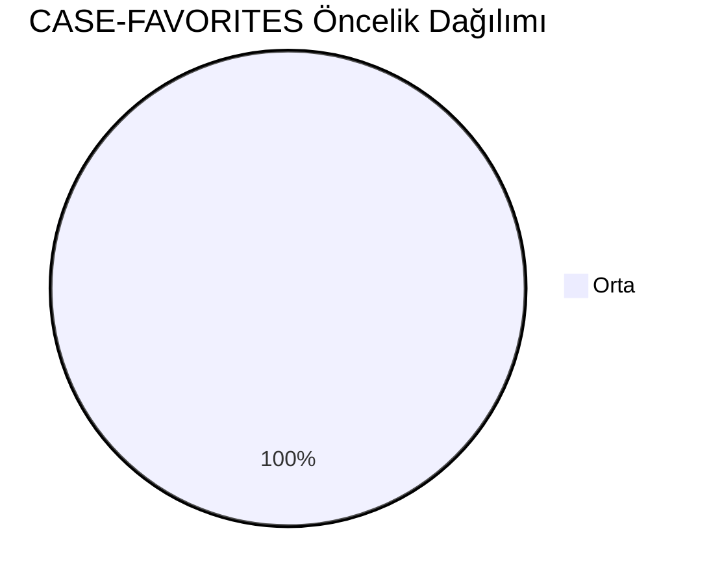
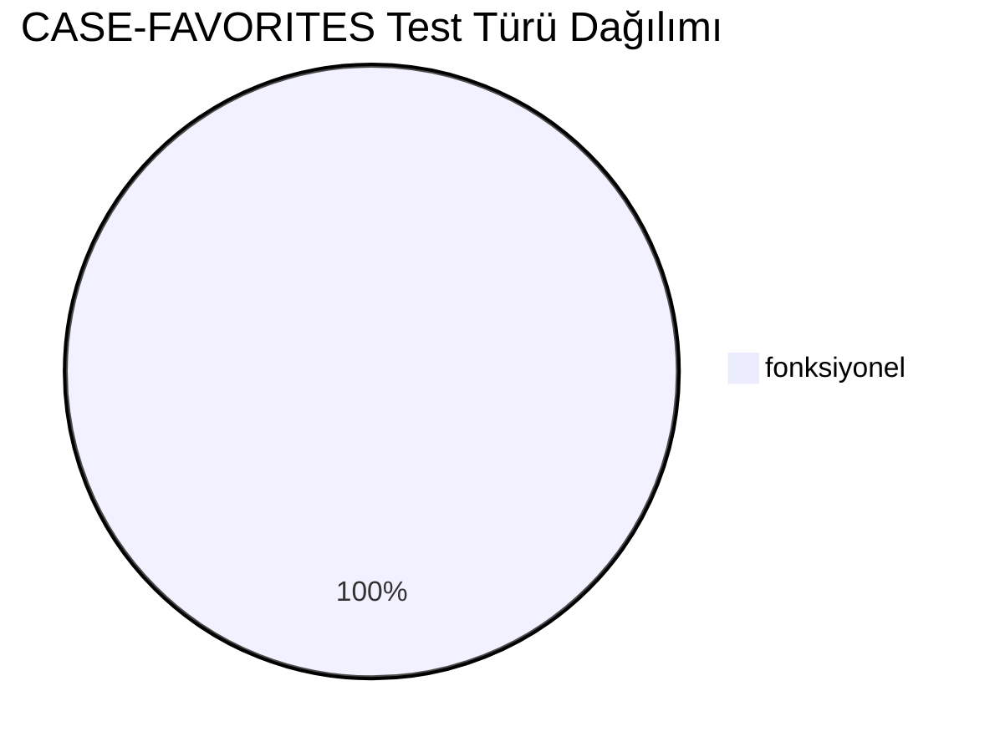
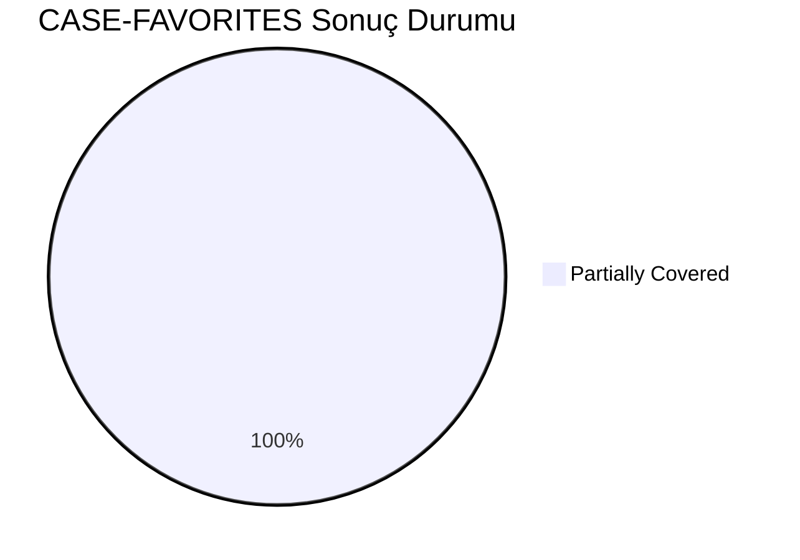
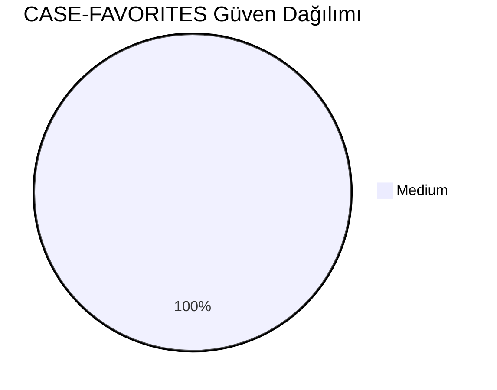
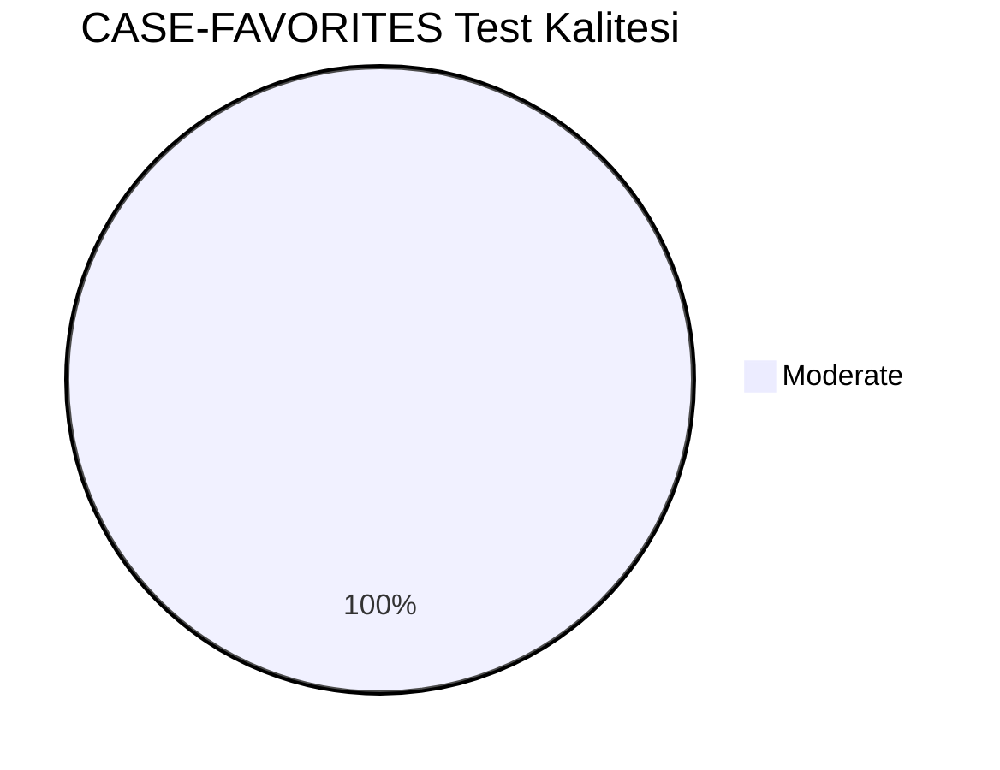
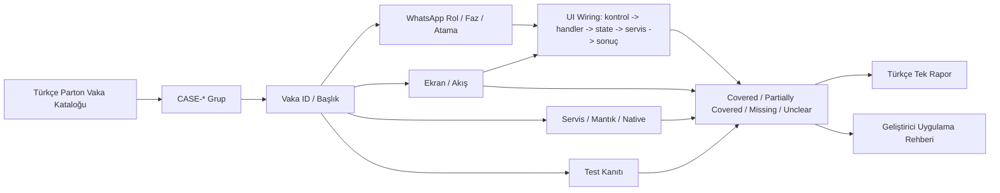
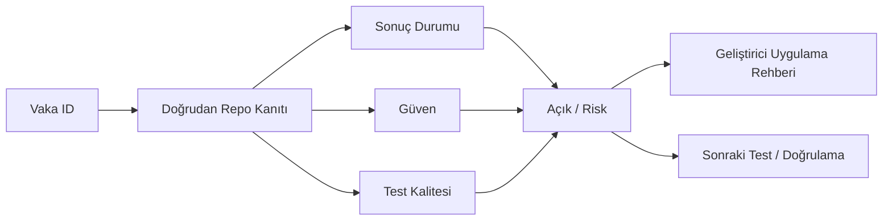

# CASE-FAVORITES Vaka Test Görselleştirmesi

- Toplam vaka: `8`
- Sonuç kaynağı: `/Users/hakanbilir/MyDevZone/StaffMatch/parton-case-results.json`
- Kanıt politikası: isim benzerliği kapsama kanıtı değildir; her vaka doğrudan repo kanıtı ile eşleştirilmelidir.

## Öncelik Dağılımı

## Test Türü Dağılımı

## Vaka Test Sonuç Özeti

## Güven Dağılımı

## Test Kalitesi Dağılımı

## Vaka Eşleştirme Akışı

## Sonuç Akışı

## Sonuç Matrisi

| Vaka ID | Başlık | Durum | Güven | Test Kalitesi | Kanıt | Açık | Olası Kod Alanı | UI Wiring Kanıtı |
| --- | --- | --- | --- | --- | --- | --- | --- | --- |
| `T-164` | İşverenin işçiyi favoriye alması | Partially Covered | Medium | Moderate | EmployeeHomeViewModel.toggleFavoriteEmployer ve employer favori çalışan akışları var. | Çapraz cihaz senkronizasyonu ve offline çatışma çözümlemesi için güçlü test yok. | shared | kontrol -> handler -> state -> servis/native/API -> görünür sonuç |
| `T-165` | İşçinin işvereni favoriye alması | Partially Covered | Medium | Moderate | EmployeeHomeViewModel.toggleFavoriteEmployer ve employer favori çalışan akışları var. | Çapraz cihaz senkronizasyonu ve offline çatışma çözümlemesi için güçlü test yok. | shared | kontrol -> handler -> state -> servis/native/API -> görünür sonuç |
| `T-166` | Tek taraflı favori mantığı | Partially Covered | Medium | Moderate | EmployeeHomeViewModel.toggleFavoriteEmployer ve employer favori çalışan akışları var. | Çapraz cihaz senkronizasyonu ve offline çatışma çözümlemesi için güçlü test yok. | shared | kontrol -> handler -> state -> servis/native/API -> görünür sonuç |
| `T-167` | Karşılıklı favori davranışı varsa testi | Partially Covered | Medium | Moderate | EmployeeHomeViewModel.toggleFavoriteEmployer ve employer favori çalışan akışları var. | Çapraz cihaz senkronizasyonu ve offline çatışma çözümlemesi için güçlü test yok. | shared | kontrol -> handler -> state -> servis/native/API -> görünür sonuç |
| `T-168` | Favorilere özel ilan oluşturma | Partially Covered | Medium | Moderate | EmployeeHomeViewModel.toggleFavoriteEmployer ve employer favori çalışan akışları var. | Çapraz cihaz senkronizasyonu ve offline çatışma çözümlemesi için güçlü test yok. | shared | kontrol -> handler -> state -> servis/native/API -> görünür sonuç |
| `T-169` | Bu ilanın sadece favorilere görünmesi | Partially Covered | Medium | Moderate | EmployeeHomeViewModel.toggleFavoriteEmployer ve employer favori çalışan akışları var. | Çapraz cihaz senkronizasyonu ve offline çatışma çözümlemesi için güçlü test yok. | shared | kontrol -> handler -> state -> servis/native/API -> görünür sonuç |
| `T-170` | Favoriler ekranında ilan görünmesi | Partially Covered | Medium | Moderate | EmployeeHomeViewModel.toggleFavoriteEmployer ve employer favori çalışan akışları var. | Çapraz cihaz senkronizasyonu ve offline çatışma çözümlemesi için güçlü test yok. | shared | kontrol -> handler -> state -> servis/native/API -> görünür sonuç |
| `T-171` | Favoriden çıkarınca erişimin kalkması | Partially Covered | Medium | Moderate | EmployeeHomeViewModel.toggleFavoriteEmployer ve employer favori çalışan akışları var. | Çapraz cihaz senkronizasyonu ve offline çatışma çözümlemesi için güçlü test yok. | shared | kontrol -> handler -> state -> servis/native/API -> görünür sonuç |

## Vakalar

| Vaka ID | Başlık | Öncelik | Test Türü | Rol | Canlı Test Fazı | Görsel Eşleştirme Notu |
| --- | --- | --- | --- | --- | --- | --- |
| `T-164` | İşverenin işçiyi favoriye alması | Orta | Fonksiyonel | İşçi | Faz 6 - Sonrası ve Sadakat | Ekran / servis / test kanıtı ile eşleştirilecek |
| `T-165` | İşçinin işvereni favoriye alması | Orta | Fonksiyonel | İşveren | Faz 6 - Sonrası ve Sadakat | Ekran / servis / test kanıtı ile eşleştirilecek |
| `T-166` | Tek taraflı favori mantığı | Orta | Fonksiyonel | İşveren | Faz 6 - Sonrası ve Sadakat | Ekran / servis / test kanıtı ile eşleştirilecek |
| `T-167` | Karşılıklı favori davranışı varsa testi | Orta | Fonksiyonel | İşveren | Faz 6 - Sonrası ve Sadakat | Ekran / servis / test kanıtı ile eşleştirilecek |
| `T-168` | Favorilere özel ilan oluşturma | Orta | Fonksiyonel | İşveren | Faz 6 - Sonrası ve Sadakat | Ekran / servis / test kanıtı ile eşleştirilecek |
| `T-169` | Bu ilanın sadece favorilere görünmesi | Orta | Fonksiyonel | İşveren | Faz 6 - Sonrası ve Sadakat | Ekran / servis / test kanıtı ile eşleştirilecek |
| `T-170` | Favoriler ekranında ilan görünmesi | Orta | Fonksiyonel | İşveren | Faz 6 - Sonrası ve Sadakat | Ekran / servis / test kanıtı ile eşleştirilecek |
| `T-171` | Favoriden çıkarınca erişimin kalkması | Orta | Fonksiyonel | İşveren | Faz 6 - Sonrası ve Sadakat | Ekran / servis / test kanıtı ile eşleştirilecek |

## Manuel Tamamlama Kontrol Listesi

- Her vaka için ilişkili ekran/görünüm, servis/modül, native/platform alanı ve test dosyası yazılmalıdır.
- UI wiring kanıtı; ekran kontrolü, handler, state sahibi, validasyon, servis/native/API yan etkisi ve görünür sonucu birlikte göstermelidir.
- Kritik vakalarda enforcement kanıtı ve varsa test kanıtı ayrı ayrı gösterilmelidir.
- Kanıt zayıfsa durum `Unclear` veya `Partially Covered` kalmalıdır.
