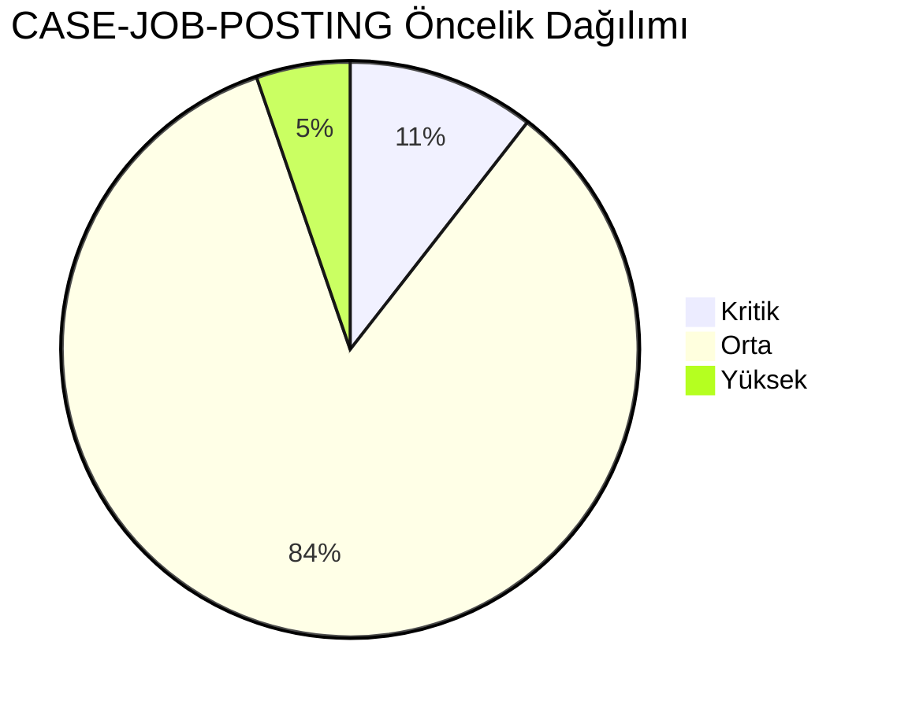
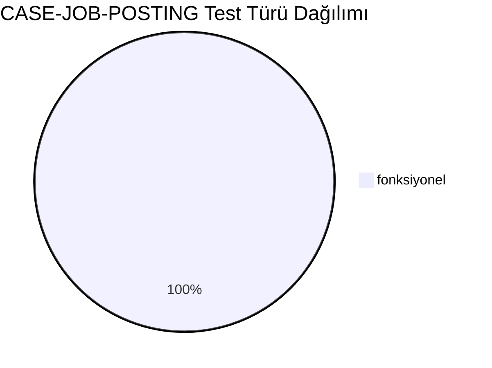
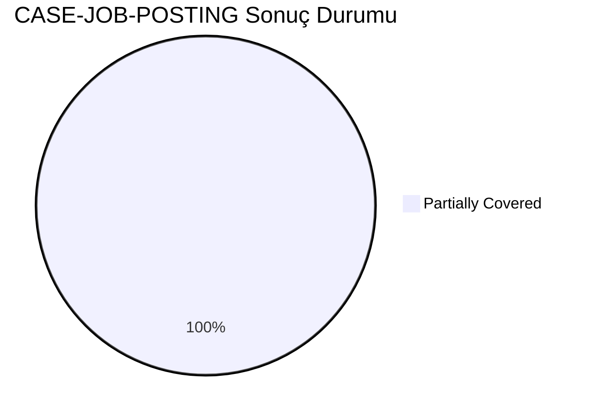
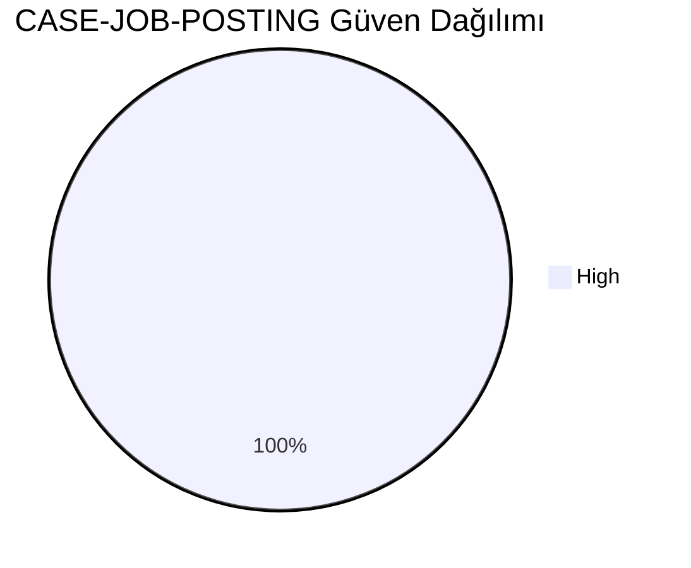
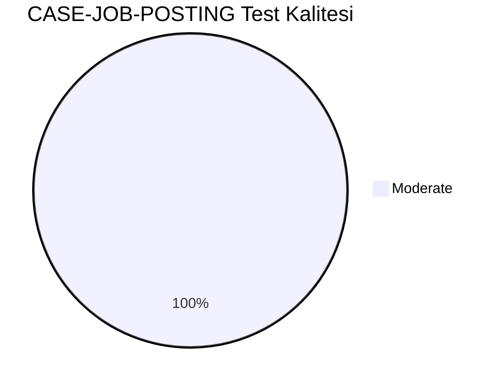
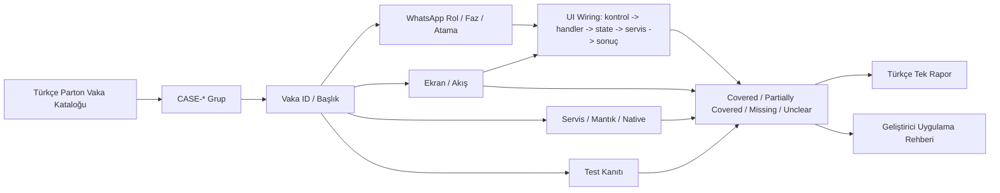
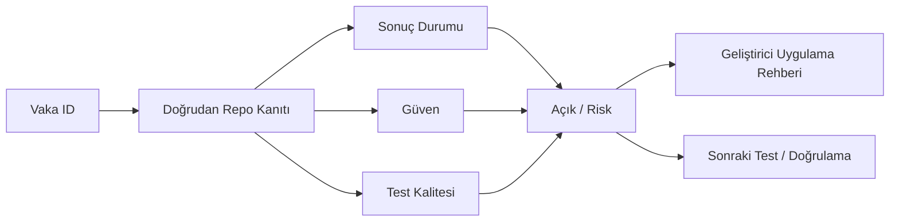

# CASE-JOB-POSTING Vaka Test Görselleştirmesi

- Toplam vaka: `19`
- Sonuç kaynağı: `/Users/hakanbilir/MyDevZone/StaffMatch/parton-case-results.json`
- Kanıt politikası: isim benzerliği kapsama kanıtı değildir; her vaka doğrudan repo kanıtı ile eşleştirilmelidir.

## Öncelik Dağılımı

## Test Türü Dağılımı

## Vaka Test Sonuç Özeti

## Güven Dağılımı

## Test Kalitesi Dağılımı

## Vaka Eşleştirme Akışı

## Sonuç Akışı

## Sonuç Matrisi

| Vaka ID | Başlık | Durum | Güven | Test Kalitesi | Kanıt | Açık | Olası Kod Alanı | UI Wiring Kanıtı |
| --- | --- | --- | --- | --- | --- | --- | --- | --- |
| `T-039` | Geçerli sektör ile ilan oluşturma | Partially Covered | High | Moderate | EmployerJobFormViewModel kapsamlı validasyon + submit, Firestore rules mutasyon anahtar kontrolü. | Bazı ilan kısıtları backend side doğrulanıyor; tüm kenar koşullar için E2E yok. | shared | kontrol -> handler -> state -> servis/native/API -> görünür sonuç |
| `T-040` | Geçerli meslek ile ilan oluşturma | Partially Covered | High | Moderate | EmployerJobFormViewModel kapsamlı validasyon + submit, Firestore rules mutasyon anahtar kontrolü. | Bazı ilan kısıtları backend side doğrulanıyor; tüm kenar koşullar için E2E yok. | shared | kontrol -> handler -> state -> servis/native/API -> görünür sonuç |
| `T-041` | Gelecek tarihli ilan oluşturma | Partially Covered | High | Moderate | EmployerJobFormViewModel kapsamlı validasyon + submit, Firestore rules mutasyon anahtar kontrolü. | Bazı ilan kısıtları backend side doğrulanıyor; tüm kenar koşullar için E2E yok. | shared | kontrol -> handler -> state -> servis/native/API -> görünür sonuç |
| `T-042` | Geçmiş tarihli ilan oluşturma denemesi | Partially Covered | High | Moderate | EmployerJobFormViewModel kapsamlı validasyon + submit, Firestore rules mutasyon anahtar kontrolü. | Bazı ilan kısıtları backend side doğrulanıyor; tüm kenar koşullar için E2E yok. | shared | kontrol -> handler -> state -> servis/native/API -> görünür sonuç |
| `T-043` | Başlangıç saati bitiş saatinden sonra girilmesi | Partially Covered | High | Moderate | EmployerJobFormViewModel kapsamlı validasyon + submit, Firestore rules mutasyon anahtar kontrolü. | Bazı ilan kısıtları backend side doğrulanıyor; tüm kenar koşullar için E2E yok. | shared | kontrol -> handler -> state -> servis/native/API -> görünür sonuç |
| `T-044` | Cinsiyet filtresi ile ilan oluşturma | Partially Covered | High | Moderate | EmployerJobFormViewModel kapsamlı validasyon + submit, Firestore rules mutasyon anahtar kontrolü. | Bazı ilan kısıtları backend side doğrulanıyor; tüm kenar koşullar için E2E yok. | shared | kontrol -> handler -> state -> servis/native/API -> görünür sonuç |
| `T-045` | Belge zorunluluğu ekleme | Partially Covered | High | Moderate | EmployerJobFormViewModel kapsamlı validasyon + submit, Firestore rules mutasyon anahtar kontrolü. | Bazı ilan kısıtları backend side doğrulanıyor; tüm kenar koşullar için E2E yok. | shared | kontrol -> handler -> state -> servis/native/API -> görünür sonuç |
| `T-046` | Personel sayısı 1 olan ilan | Partially Covered | High | Moderate | EmployerJobFormViewModel kapsamlı validasyon + submit, Firestore rules mutasyon anahtar kontrolü. | Bazı ilan kısıtları backend side doğrulanıyor; tüm kenar koşullar için E2E yok. | shared | kontrol -> handler -> state -> servis/native/API -> görünür sonuç |
| `T-047` | Çoklu personel sayılı ilan | Partially Covered | High | Moderate | EmployerJobFormViewModel kapsamlı validasyon + submit, Firestore rules mutasyon anahtar kontrolü. | Bazı ilan kısıtları backend side doğrulanıyor; tüm kenar koşullar için E2E yok. | shared | kontrol -> handler -> state -> servis/native/API -> görünür sonuç |
| `T-048` | Aynı saatlerde çakışan çoklu ilan | Partially Covered | High | Moderate | EmployerJobFormViewModel kapsamlı validasyon + submit, Firestore rules mutasyon anahtar kontrolü. | Bazı ilan kısıtları backend side doğrulanıyor; tüm kenar koşullar için E2E yok. | shared | kontrol -> handler -> state -> servis/native/API -> görünür sonuç |
| `T-049` | Yetersiz jeton ile ilan açma denemesi | Partially Covered | High | Moderate | EmployerJobFormViewModel kapsamlı validasyon + submit, Firestore rules mutasyon anahtar kontrolü. | Bazı ilan kısıtları backend side doğrulanıyor; tüm kenar koşullar için E2E yok. | shared | kontrol -> handler -> state -> servis/native/API -> görünür sonuç |
| `T-050` | Yeterli jeton ile provizyona alma | Partially Covered | High | Moderate | EmployerJobFormViewModel kapsamlı validasyon + submit, Firestore rules mutasyon anahtar kontrolü. | Bazı ilan kısıtları backend side doğrulanıyor; tüm kenar koşullar için E2E yok. | shared | kontrol -> handler -> state -> servis/native/API -> görünür sonuç |
| `T-051` | İlan taslak kaydetme | Partially Covered | High | Moderate | EmployerJobFormViewModel kapsamlı validasyon + submit, Firestore rules mutasyon anahtar kontrolü. | Bazı ilan kısıtları backend side doğrulanıyor; tüm kenar koşullar için E2E yok. | shared | kontrol -> handler -> state -> servis/native/API -> görünür sonuç |
| `T-052` | İlanı sonradan düzenleme | Partially Covered | High | Moderate | EmployerJobFormViewModel kapsamlı validasyon + submit, Firestore rules mutasyon anahtar kontrolü. | Bazı ilan kısıtları backend side doğrulanıyor; tüm kenar koşullar için E2E yok. | shared | kontrol -> handler -> state -> servis/native/API -> görünür sonuç |
| `T-053` | Personel sayısını artırma | Partially Covered | High | Moderate | EmployerJobFormViewModel kapsamlı validasyon + submit, Firestore rules mutasyon anahtar kontrolü. | Bazı ilan kısıtları backend side doğrulanıyor; tüm kenar koşullar için E2E yok. | shared | kontrol -> handler -> state -> servis/native/API -> görünür sonuç |
| `T-054` | Personel sayısını azaltma | Partially Covered | High | Moderate | EmployerJobFormViewModel kapsamlı validasyon + submit, Firestore rules mutasyon anahtar kontrolü. | Bazı ilan kısıtları backend side doğrulanıyor; tüm kenar koşullar için E2E yok. | shared | kontrol -> handler -> state -> servis/native/API -> görünür sonuç |
| `T-055` | İlanı yayından kaldırma | Partially Covered | High | Moderate | EmployerJobFormViewModel kapsamlı validasyon + submit, Firestore rules mutasyon anahtar kontrolü. | Bazı ilan kısıtları backend side doğrulanıyor; tüm kenar koşullar için E2E yok. | shared | kontrol -> handler -> state -> servis/native/API -> görünür sonuç |
| `T-056` | İlanı sadece favorilere açma | Partially Covered | High | Moderate | EmployerJobFormViewModel kapsamlı validasyon + submit, Firestore rules mutasyon anahtar kontrolü. | Bazı ilan kısıtları backend side doğrulanıyor; tüm kenar koşullar için E2E yok. | shared | kontrol -> handler -> state -> servis/native/API -> görünür sonuç |
| `T-057` | Favorilere özel ilanda uygun aday yoksa davranış | Partially Covered | High | Moderate | EmployerJobFormViewModel kapsamlı validasyon + submit, Firestore rules mutasyon anahtar kontrolü. | Bazı ilan kısıtları backend side doğrulanıyor; tüm kenar koşullar için E2E yok. | shared | kontrol -> handler -> state -> servis/native/API -> görünür sonuç |

## Vakalar

| Vaka ID | Başlık | Öncelik | Test Türü | Rol | Canlı Test Fazı | Görsel Eşleştirme Notu |
| --- | --- | --- | --- | --- | --- | --- |
| `T-039` | Geçerli sektör ile ilan oluşturma | Orta | Fonksiyonel | İşveren | Faz 3 - İlan ve Uygunluk | Ekran / servis / test kanıtı ile eşleştirilecek |
| `T-040` | Geçerli meslek ile ilan oluşturma | Orta | Fonksiyonel | İşveren | Faz 3 - İlan ve Uygunluk | Ekran / servis / test kanıtı ile eşleştirilecek |
| `T-041` | Gelecek tarihli ilan oluşturma | Orta | Fonksiyonel | İşveren | Faz 3 - İlan ve Uygunluk | Ekran / servis / test kanıtı ile eşleştirilecek |
| `T-042` | Geçmiş tarihli ilan oluşturma denemesi | Orta | Fonksiyonel | İşveren | Faz 3 - İlan ve Uygunluk | Ekran / servis / test kanıtı ile eşleştirilecek |
| `T-043` | Başlangıç saati bitiş saatinden sonra girilmesi | Orta | Fonksiyonel | İşveren | Faz 3 - İlan ve Uygunluk | Ekran / servis / test kanıtı ile eşleştirilecek |
| `T-044` | Cinsiyet filtresi ile ilan oluşturma | Orta | Fonksiyonel | İşveren | Faz 3 - İlan ve Uygunluk | Ekran / servis / test kanıtı ile eşleştirilecek |
| `T-045` | Belge zorunluluğu ekleme | Orta | Fonksiyonel | İşveren | Faz 3 - İlan ve Uygunluk | Ekran / servis / test kanıtı ile eşleştirilecek |
| `T-046` | Personel sayısı 1 olan ilan | Orta | Fonksiyonel | İşveren | Faz 3 - İlan ve Uygunluk | Ekran / servis / test kanıtı ile eşleştirilecek |
| `T-047` | Çoklu personel sayılı ilan | Orta | Fonksiyonel | İşveren | Faz 3 - İlan ve Uygunluk | Ekran / servis / test kanıtı ile eşleştirilecek |
| `T-048` | Aynı saatlerde çakışan çoklu ilan | Orta | Fonksiyonel | İşveren | Faz 3 - İlan ve Uygunluk | Ekran / servis / test kanıtı ile eşleştirilecek |
| `T-049` | Yetersiz jeton ile ilan açma denemesi | Kritik | Fonksiyonel | İşveren | Faz 3 - İlan ve Uygunluk | Ekran / servis / test kanıtı ile eşleştirilecek |
| `T-050` | Yeterli jeton ile provizyona alma | Kritik | Fonksiyonel | İşveren | Faz 3 - İlan ve Uygunluk | Ekran / servis / test kanıtı ile eşleştirilecek |
| `T-051` | İlan taslak kaydetme | Orta | Fonksiyonel | İşveren | Faz 3 - İlan ve Uygunluk | Ekran / servis / test kanıtı ile eşleştirilecek |
| `T-052` | İlanı sonradan düzenleme | Orta | Fonksiyonel | İşveren | Faz 3 - İlan ve Uygunluk | Ekran / servis / test kanıtı ile eşleştirilecek |
| `T-053` | Personel sayısını artırma | Orta | Fonksiyonel | İşveren | Faz 3 - İlan ve Uygunluk | Ekran / servis / test kanıtı ile eşleştirilecek |
| `T-054` | Personel sayısını azaltma | Orta | Fonksiyonel | İşveren | Faz 3 - İlan ve Uygunluk | Ekran / servis / test kanıtı ile eşleştirilecek |
| `T-055` | İlanı yayından kaldırma | Orta | Fonksiyonel | İşveren | Faz 3 - İlan ve Uygunluk | Ekran / servis / test kanıtı ile eşleştirilecek |
| `T-056` | İlanı sadece favorilere açma | Orta | Fonksiyonel | İşveren | Faz 3 - İlan ve Uygunluk | Ekran / servis / test kanıtı ile eşleştirilecek |
| `T-057` | Favorilere özel ilanda uygun aday yoksa davranış | Yüksek | Fonksiyonel | İşveren | Faz 3 - İlan ve Uygunluk | Ekran / servis / test kanıtı ile eşleştirilecek |

## Manuel Tamamlama Kontrol Listesi

- Her vaka için ilişkili ekran/görünüm, servis/modül, native/platform alanı ve test dosyası yazılmalıdır.
- UI wiring kanıtı; ekran kontrolü, handler, state sahibi, validasyon, servis/native/API yan etkisi ve görünür sonucu birlikte göstermelidir.
- Kritik vakalarda enforcement kanıtı ve varsa test kanıtı ayrı ayrı gösterilmelidir.
- Kanıt zayıfsa durum `Unclear` veya `Partially Covered` kalmalıdır.
