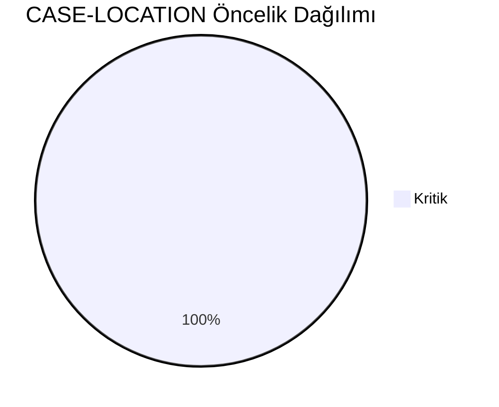
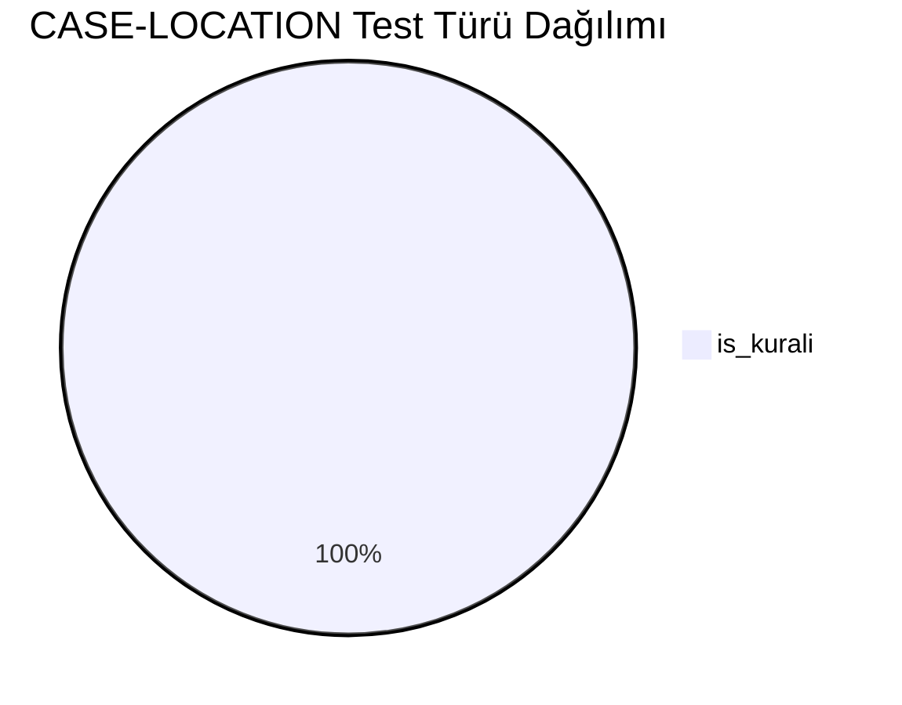
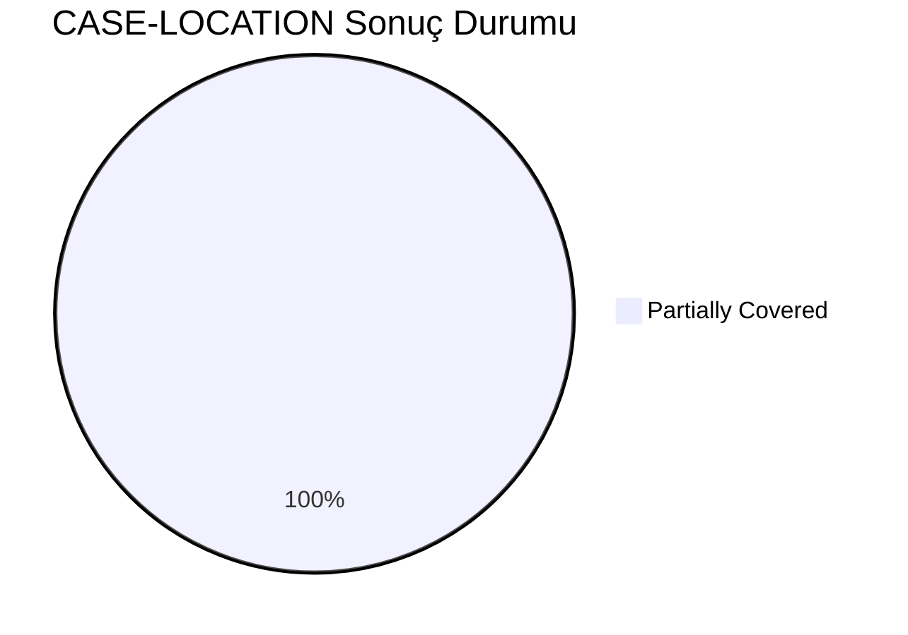
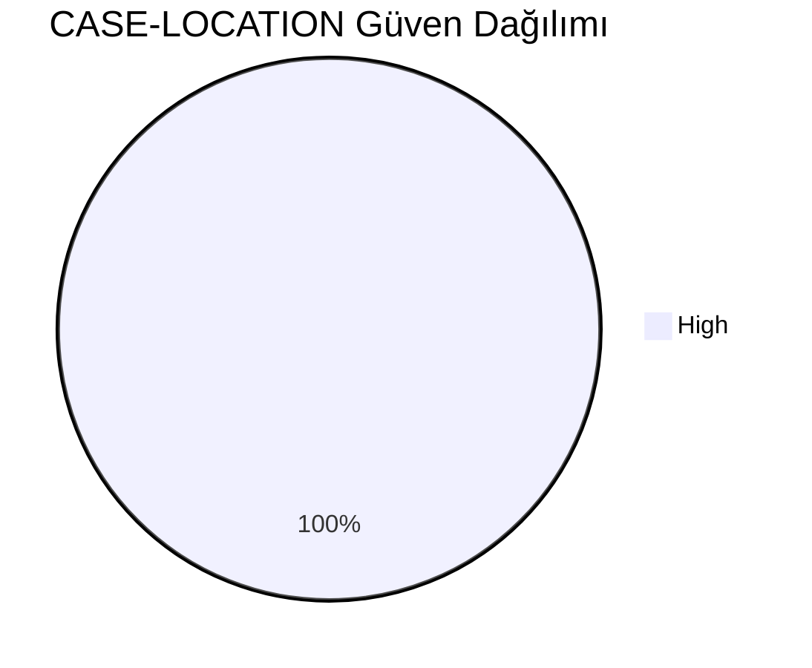
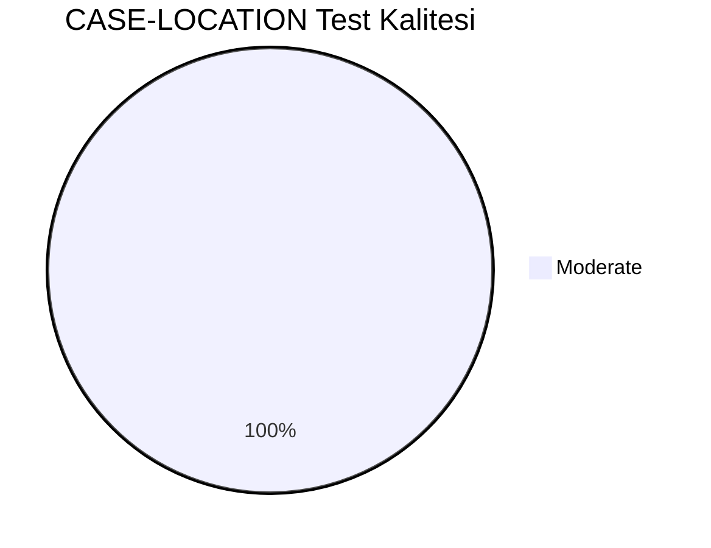
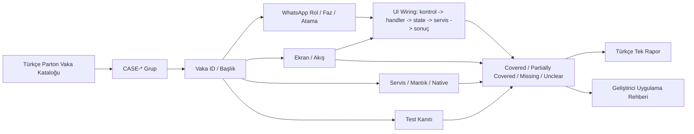
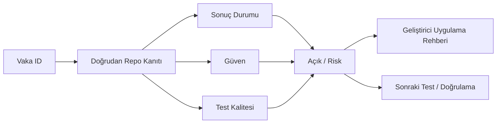

# CASE-LOCATION Vaka Test Görselleştirmesi

- Toplam vaka: `13`
- Sonuç kaynağı: `/Users/hakanbilir/MyDevZone/StaffMatch/parton-case-results.json`
- Kanıt politikası: isim benzerliği kapsama kanıtı değildir; her vaka doğrudan repo kanıtı ile eşleştirilmelidir.

## Öncelik Dağılımı

## Test Türü Dağılımı

## Vaka Test Sonuç Özeti

## Güven Dağılımı

## Test Kalitesi Dağılımı

## Vaka Eşleştirme Akışı

## Sonuç Akışı

## Sonuç Matrisi

| Vaka ID | Başlık | Durum | Güven | Test Kalitesi | Kanıt | Açık | Olası Kod Alanı | UI Wiring Kanıtı |
| --- | --- | --- | --- | --- | --- | --- | --- | --- |
| `T-136` | Şube koordinatı doğruysa doğrulama | Partially Covered | High | Moderate | LocationObserver + check-in/out koordinat doğrulama + jobs feed city/district filtreleri. | Gerçek cihaz/OS varyasyonları ve spoof tespiti için runtime kanıt yok. | native | kontrol -> handler -> state -> servis/native/API -> görünür sonuç |
| `T-137` | Şube koordinatı yanlışsa hata yakalama | Partially Covered | High | Moderate | LocationObserver + check-in/out koordinat doğrulama + jobs feed city/district filtreleri. | Gerçek cihaz/OS varyasyonları ve spoof tespiti için runtime kanıt yok. | native | kontrol -> handler -> state -> servis/native/API -> görünür sonuç |
| `T-138` | 50 metre yarıçap doğrulaması | Partially Covered | High | Moderate | LocationObserver + check-in/out koordinat doğrulama + jobs feed city/district filtreleri. | Gerçek cihaz/OS varyasyonları ve spoof tespiti için runtime kanıt yok. | native | kontrol -> handler -> state -> servis/native/API -> görünür sonuç |
| `T-139` | 100 metre yarıçap doğrulaması | Partially Covered | High | Moderate | LocationObserver + check-in/out koordinat doğrulama + jobs feed city/district filtreleri. | Gerçek cihaz/OS varyasyonları ve spoof tespiti için runtime kanıt yok. | native | kontrol -> handler -> state -> servis/native/API -> görünür sonuç |
| `T-140` | Kapalı alanda GPS sapması | Partially Covered | High | Moderate | LocationObserver + check-in/out koordinat doğrulama + jobs feed city/district filtreleri. | Gerçek cihaz/OS varyasyonları ve spoof tespiti için runtime kanıt yok. | native | kontrol -> handler -> state -> servis/native/API -> görünür sonuç |
| `T-141` | AVM içinde lokasyon sapması | Partially Covered | High | Moderate | LocationObserver + check-in/out koordinat doğrulama + jobs feed city/district filtreleri. | Gerçek cihaz/OS varyasyonları ve spoof tespiti için runtime kanıt yok. | native | kontrol -> handler -> state -> servis/native/API -> görünür sonuç |
| `T-142` | Plaza ve çok katlı yapı senaryosu | Partially Covered | High | Moderate | LocationObserver + check-in/out koordinat doğrulama + jobs feed city/district filtreleri. | Gerçek cihaz/OS varyasyonları ve spoof tespiti için runtime kanıt yok. | native | kontrol -> handler -> state -> servis/native/API -> görünür sonuç |
| `T-143` | Kırsal bölgede düşük GPS kalitesi | Partially Covered | High | Moderate | LocationObserver + check-in/out koordinat doğrulama + jobs feed city/district filtreleri. | Gerçek cihaz/OS varyasyonları ve spoof tespiti için runtime kanıt yok. | native | kontrol -> handler -> state -> servis/native/API -> görünür sonuç |
| `T-144` | Wi-Fi destekli konum doğrulama | Partially Covered | High | Moderate | LocationObserver + check-in/out koordinat doğrulama + jobs feed city/district filtreleri. | Gerçek cihaz/OS varyasyonları ve spoof tespiti için runtime kanıt yok. | native | kontrol -> handler -> state -> servis/native/API -> görünür sonuç |
| `T-145` | Hareket halindeyken check-in | Partially Covered | High | Moderate | LocationObserver + check-in/out koordinat doğrulama + jobs feed city/district filtreleri. | Gerçek cihaz/OS varyasyonları ve spoof tespiti için runtime kanıt yok. | native | kontrol -> handler -> state -> servis/native/API -> görünür sonuç |
| `T-146` | Arka planda konum izni yokken davranış | Partially Covered | High | Moderate | LocationObserver + check-in/out koordinat doğrulama + jobs feed city/district filtreleri. | Gerçek cihaz/OS varyasyonları ve spoof tespiti için runtime kanıt yok. | native | kontrol -> handler -> state -> servis/native/API -> görünür sonuç |
| `T-147` | iOS ve Android farkları | Partially Covered | High | Moderate | LocationObserver + check-in/out koordinat doğrulama + jobs feed city/district filtreleri. | Gerçek cihaz/OS varyasyonları ve spoof tespiti için runtime kanıt yok. | native | kontrol -> handler -> state -> servis/native/API -> görünür sonuç |
| `T-148` | Sahte GPS aracı tespiti | Partially Covered | High | Moderate | LocationObserver + check-in/out koordinat doğrulama + jobs feed city/district filtreleri. | Gerçek cihaz/OS varyasyonları ve spoof tespiti için runtime kanıt yok. | native | kontrol -> handler -> state -> servis/native/API -> görünür sonuç |

## Vakalar

| Vaka ID | Başlık | Öncelik | Test Türü | Rol | Canlı Test Fazı | Görsel Eşleştirme Notu |
| --- | --- | --- | --- | --- | --- | --- |
| `T-136` | Şube koordinatı doğruysa doğrulama | Kritik | İş Kuralı | İşveren | Faz 5 - İş Günü Yönetimi | Ekran / servis / test kanıtı ile eşleştirilecek |
| `T-137` | Şube koordinatı yanlışsa hata yakalama | Kritik | İş Kuralı | İşveren | Faz 5 - İş Günü Yönetimi | Ekran / servis / test kanıtı ile eşleştirilecek |
| `T-138` | 50 metre yarıçap doğrulaması | Kritik | İş Kuralı | Çoklu Aktör | Faz 5 - İş Günü Yönetimi | Ekran / servis / test kanıtı ile eşleştirilecek |
| `T-139` | 100 metre yarıçap doğrulaması | Kritik | İş Kuralı | Çoklu Aktör | Faz 5 - İş Günü Yönetimi | Ekran / servis / test kanıtı ile eşleştirilecek |
| `T-140` | Kapalı alanda GPS sapması | Kritik | İş Kuralı | Çoklu Aktör | Faz 5 - İş Günü Yönetimi | Ekran / servis / test kanıtı ile eşleştirilecek |
| `T-141` | AVM içinde lokasyon sapması | Kritik | İş Kuralı | Çoklu Aktör | Faz 5 - İş Günü Yönetimi | Ekran / servis / test kanıtı ile eşleştirilecek |
| `T-142` | Plaza ve çok katlı yapı senaryosu | Kritik | İş Kuralı | Çoklu Aktör | Faz 5 - İş Günü Yönetimi | Ekran / servis / test kanıtı ile eşleştirilecek |
| `T-143` | Kırsal bölgede düşük GPS kalitesi | Kritik | İş Kuralı | Çoklu Aktör | Faz 5 - İş Günü Yönetimi | Ekran / servis / test kanıtı ile eşleştirilecek |
| `T-144` | Wi-Fi destekli konum doğrulama | Kritik | İş Kuralı | Çoklu Aktör | Faz 5 - İş Günü Yönetimi | Ekran / servis / test kanıtı ile eşleştirilecek |
| `T-145` | Hareket halindeyken check-in | Kritik | İş Kuralı | Çoklu Aktör | Faz 5 - İş Günü Yönetimi | Ekran / servis / test kanıtı ile eşleştirilecek |
| `T-146` | Arka planda konum izni yokken davranış | Kritik | İş Kuralı | Çoklu Aktör | Faz 5 - İş Günü Yönetimi | Ekran / servis / test kanıtı ile eşleştirilecek |
| `T-147` | iOS ve Android farkları | Kritik | İş Kuralı | Çoklu Aktör | Faz 5 - İş Günü Yönetimi | Ekran / servis / test kanıtı ile eşleştirilecek |
| `T-148` | Sahte GPS aracı tespiti | Kritik | İş Kuralı | Çoklu Aktör | Faz 5 - İş Günü Yönetimi | Ekran / servis / test kanıtı ile eşleştirilecek |

## Manuel Tamamlama Kontrol Listesi

- Her vaka için ilişkili ekran/görünüm, servis/modül, native/platform alanı ve test dosyası yazılmalıdır.
- UI wiring kanıtı; ekran kontrolü, handler, state sahibi, validasyon, servis/native/API yan etkisi ve görünür sonucu birlikte göstermelidir.
- Kritik vakalarda enforcement kanıtı ve varsa test kanıtı ayrı ayrı gösterilmelidir.
- Kanıt zayıfsa durum `Unclear` veya `Partially Covered` kalmalıdır.
