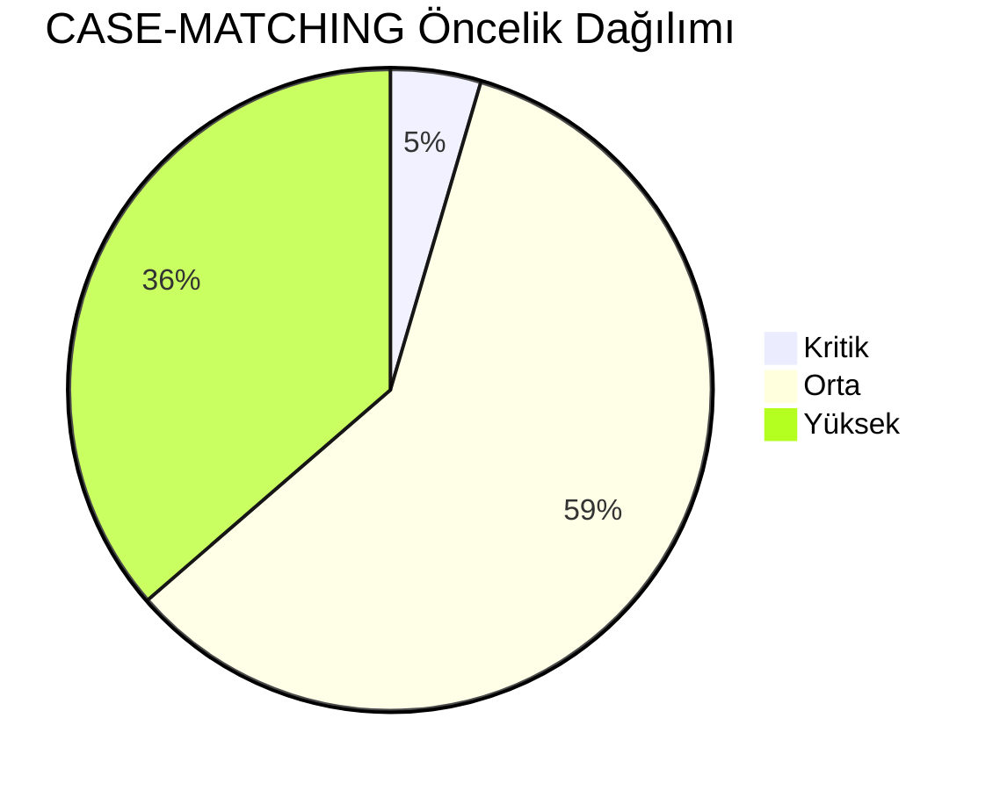
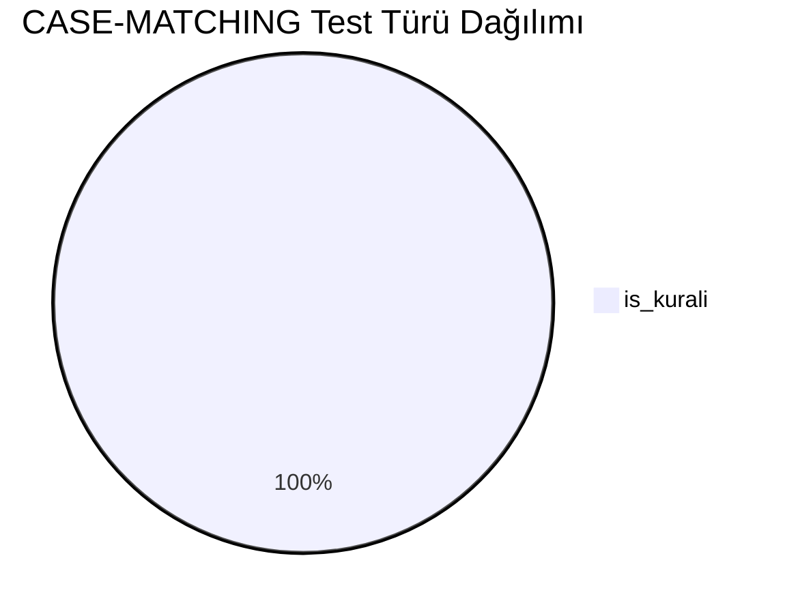
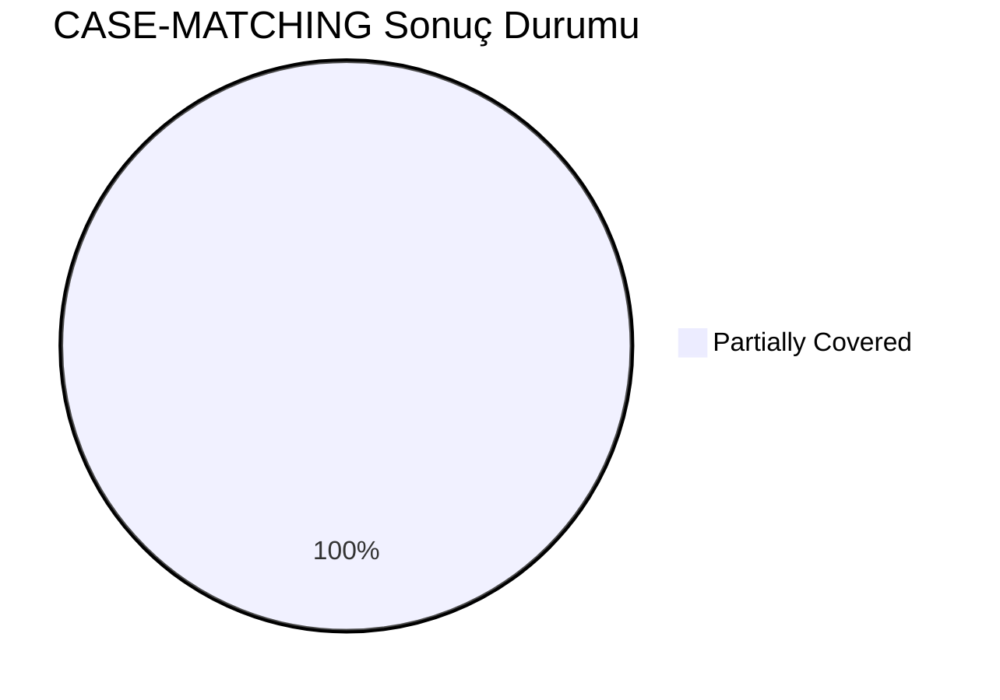
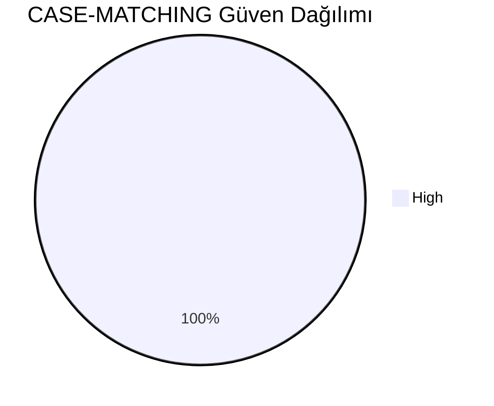
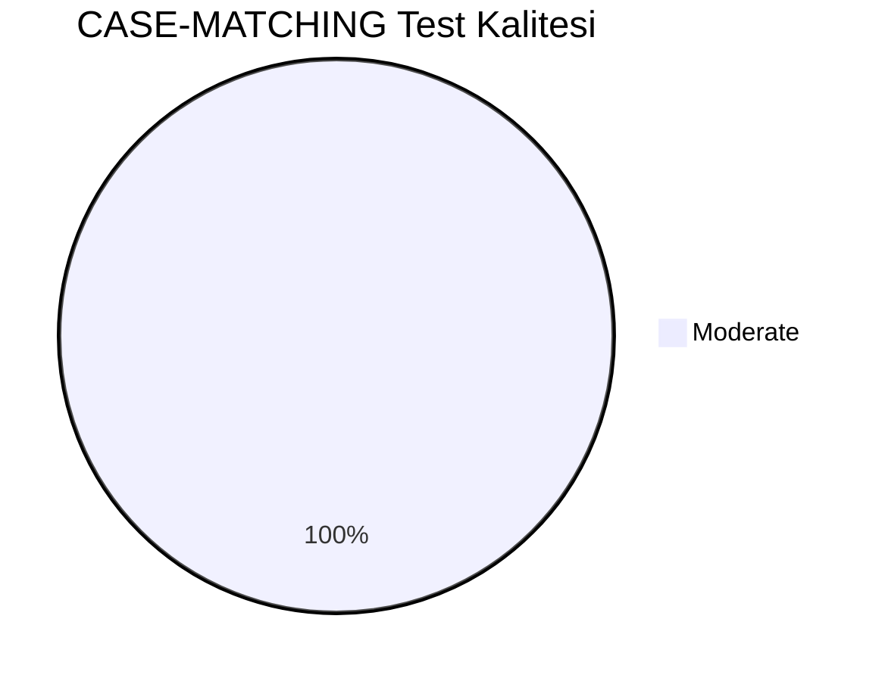
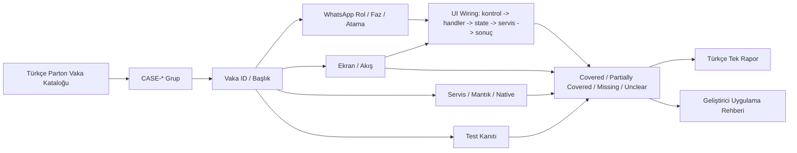
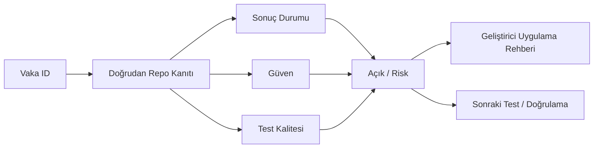

# CASE-MATCHING Vaka Test Görselleştirmesi

- Toplam vaka: `22`
- Sonuç kaynağı: `/Users/hakanbilir/MyDevZone/StaffMatch/parton-case-results.json`
- Kanıt politikası: isim benzerliği kapsama kanıtı değildir; her vaka doğrudan repo kanıtı ile eşleştirilmelidir.

## Öncelik Dağılımı

## Test Türü Dağılımı

## Vaka Test Sonuç Özeti

## Güven Dağılımı

## Test Kalitesi Dağılımı

## Vaka Eşleştirme Akışı

## Sonuç Akışı

## Sonuç Matrisi

| Vaka ID | Başlık | Durum | Güven | Test Kalitesi | Kanıt | Açık | Olası Kod Alanı | UI Wiring Kanıtı |
| --- | --- | --- | --- | --- | --- | --- | --- | --- |
| `T-058` | Uygun gün eşleşmesi | Partially Covered | High | Moderate | EmployeeJobMatchEngine skor hesapları ve FirebaseJobsFeedRepository feed filtreleme. | İş kuralı açıklanabilirliği ve fairness analitiği/guardrail testleri sınırlı. | shared | kontrol -> handler -> state -> servis/native/API -> görünür sonuç |
| `T-059` | Uygun olmayan gün için ilanın gösterilmemesi | Partially Covered | High | Moderate | EmployeeJobMatchEngine skor hesapları ve FirebaseJobsFeedRepository feed filtreleme. | İş kuralı açıklanabilirliği ve fairness analitiği/guardrail testleri sınırlı. | shared | kontrol -> handler -> state -> servis/native/API -> görünür sonuç |
| `T-060` | Uygun saat eşleşmesi | Partially Covered | High | Moderate | EmployeeJobMatchEngine skor hesapları ve FirebaseJobsFeedRepository feed filtreleme. | İş kuralı açıklanabilirliği ve fairness analitiği/guardrail testleri sınırlı. | shared | kontrol -> handler -> state -> servis/native/API -> görünür sonuç |
| `T-061` | Uygun olmayan saat için ilanın gösterilmemesi | Partially Covered | High | Moderate | EmployeeJobMatchEngine skor hesapları ve FirebaseJobsFeedRepository feed filtreleme. | İş kuralı açıklanabilirliği ve fairness analitiği/guardrail testleri sınırlı. | shared | kontrol -> handler -> state -> servis/native/API -> görünür sonuç |
| `T-062` | Sektör uyumlu ilanın görünmesi | Partially Covered | High | Moderate | EmployeeJobMatchEngine skor hesapları ve FirebaseJobsFeedRepository feed filtreleme. | İş kuralı açıklanabilirliği ve fairness analitiği/guardrail testleri sınırlı. | shared | kontrol -> handler -> state -> servis/native/API -> görünür sonuç |
| `T-063` | Sektör uyumsuz ilanın görünmemesi | Partially Covered | High | Moderate | EmployeeJobMatchEngine skor hesapları ve FirebaseJobsFeedRepository feed filtreleme. | İş kuralı açıklanabilirliği ve fairness analitiği/guardrail testleri sınırlı. | shared | kontrol -> handler -> state -> servis/native/API -> görünür sonuç |
| `T-064` | Meslek uyumlu ilanın görünmesi | Partially Covered | High | Moderate | EmployeeJobMatchEngine skor hesapları ve FirebaseJobsFeedRepository feed filtreleme. | İş kuralı açıklanabilirliği ve fairness analitiği/guardrail testleri sınırlı. | shared | kontrol -> handler -> state -> servis/native/API -> görünür sonuç |
| `T-065` | Meslek uyumsuz ilanın görünmemesi | Partially Covered | High | Moderate | EmployeeJobMatchEngine skor hesapları ve FirebaseJobsFeedRepository feed filtreleme. | İş kuralı açıklanabilirliği ve fairness analitiği/guardrail testleri sınırlı. | shared | kontrol -> handler -> state -> servis/native/API -> görünür sonuç |
| `T-066` | Belgesi olan kullanıcının ilgili ilanı görmesi | Partially Covered | High | Moderate | EmployeeJobMatchEngine skor hesapları ve FirebaseJobsFeedRepository feed filtreleme. | İş kuralı açıklanabilirliği ve fairness analitiği/guardrail testleri sınırlı. | shared | kontrol -> handler -> state -> servis/native/API -> görünür sonuç |
| `T-067` | Belgesi olmayan kullanıcının ilgili ilanı görmemesi | Partially Covered | High | Moderate | EmployeeJobMatchEngine skor hesapları ve FirebaseJobsFeedRepository feed filtreleme. | İş kuralı açıklanabilirliği ve fairness analitiği/guardrail testleri sınırlı. | shared | kontrol -> handler -> state -> servis/native/API -> görünür sonuç |
| `T-068` | Konum yakınlığına göre sıralama | Partially Covered | High | Moderate | EmployeeJobMatchEngine skor hesapları ve FirebaseJobsFeedRepository feed filtreleme. | İş kuralı açıklanabilirliği ve fairness analitiği/guardrail testleri sınırlı. | shared | kontrol -> handler -> state -> servis/native/API -> görünür sonuç |
| `T-069` | Çoklu sektör seçen işçiye tüm uygun ilanların görünmesi | Partially Covered | High | Moderate | EmployeeJobMatchEngine skor hesapları ve FirebaseJobsFeedRepository feed filtreleme. | İş kuralı açıklanabilirliği ve fairness analitiği/guardrail testleri sınırlı. | shared | kontrol -> handler -> state -> servis/native/API -> görünür sonuç |
| `T-070` | Çoklu meslek seçen işçiye tüm uygun ilanların görünmesi | Partially Covered | High | Moderate | EmployeeJobMatchEngine skor hesapları ve FirebaseJobsFeedRepository feed filtreleme. | İş kuralı açıklanabilirliği ve fairness analitiği/guardrail testleri sınırlı. | shared | kontrol -> handler -> state -> servis/native/API -> görünür sonuç |
| `T-071` | Kısmi saat çakışmasında davranış | Partially Covered | High | Moderate | EmployeeJobMatchEngine skor hesapları ve FirebaseJobsFeedRepository feed filtreleme. | İş kuralı açıklanabilirliği ve fairness analitiği/guardrail testleri sınırlı. | shared | kontrol -> handler -> state -> servis/native/API -> görünür sonuç |
| `T-072` | Tam kapsama kuralı testi | Partially Covered | High | Moderate | EmployeeJobMatchEngine skor hesapları ve FirebaseJobsFeedRepository feed filtreleme. | İş kuralı açıklanabilirliği ve fairness analitiği/guardrail testleri sınırlı. | shared | kontrol -> handler -> state -> servis/native/API -> görünür sonuç |
| `T-073` | Gece vardiyası eşleşmesi | Partially Covered | High | Moderate | EmployeeJobMatchEngine skor hesapları ve FirebaseJobsFeedRepository feed filtreleme. | İş kuralı açıklanabilirliği ve fairness analitiği/guardrail testleri sınırlı. | shared | kontrol -> handler -> state -> servis/native/API -> görünür sonuç |
| `T-074` | Favori işveren ilanlarının ayrı gösterimi | Partially Covered | High | Moderate | EmployeeJobMatchEngine skor hesapları ve FirebaseJobsFeedRepository feed filtreleme. | İş kuralı açıklanabilirliği ve fairness analitiği/guardrail testleri sınırlı. | shared | kontrol -> handler -> state -> servis/native/API -> görünür sonuç |
| `T-075` | Sadece favorilere açık ilanın diğer işçilere görünmemesi | Partially Covered | High | Moderate | EmployeeJobMatchEngine skor hesapları ve FirebaseJobsFeedRepository feed filtreleme. | İş kuralı açıklanabilirliği ve fairness analitiği/guardrail testleri sınırlı. | shared | kontrol -> handler -> state -> servis/native/API -> görünür sonuç |
| `T-076` | En yakın işin üstte görünmesi | Partially Covered | High | Moderate | EmployeeJobMatchEngine skor hesapları ve FirebaseJobsFeedRepository feed filtreleme. | İş kuralı açıklanabilirliği ve fairness analitiği/guardrail testleri sınırlı. | shared | kontrol -> handler -> state -> servis/native/API -> görünür sonuç |
| `T-077` | En yüksek eşleşme skorunun üstte görünmesi | Partially Covered | High | Moderate | EmployeeJobMatchEngine skor hesapları ve FirebaseJobsFeedRepository feed filtreleme. | İş kuralı açıklanabilirliği ve fairness analitiği/guardrail testleri sınırlı. | shared | kontrol -> handler -> state -> servis/native/API -> görünür sonuç |
| `T-078` | Favori işveren ilanının öncelikli görünmesi | Partially Covered | High | Moderate | EmployeeJobMatchEngine skor hesapları ve FirebaseJobsFeedRepository feed filtreleme. | İş kuralı açıklanabilirliği ve fairness analitiği/guardrail testleri sınırlı. | shared | kontrol -> handler -> state -> servis/native/API -> görünür sonuç |
| `T-079` | Tarihi en yakın olan ilanın önceliği | Partially Covered | High | Moderate | EmployeeJobMatchEngine skor hesapları ve FirebaseJobsFeedRepository feed filtreleme. | İş kuralı açıklanabilirliği ve fairness analitiği/guardrail testleri sınırlı. | shared | kontrol -> handler -> state -> servis/native/API -> görünür sonuç |

## Vakalar

| Vaka ID | Başlık | Öncelik | Test Türü | Rol | Canlı Test Fazı | Görsel Eşleştirme Notu |
| --- | --- | --- | --- | --- | --- | --- |
| `T-058` | Uygun gün eşleşmesi | Yüksek | İş Kuralı | Çoklu Aktör | Faz 3 - İlan ve Uygunluk | Ekran / servis / test kanıtı ile eşleştirilecek |
| `T-059` | Uygun olmayan gün için ilanın gösterilmemesi | Yüksek | İş Kuralı | Çoklu Aktör | Faz 3 - İlan ve Uygunluk | Ekran / servis / test kanıtı ile eşleştirilecek |
| `T-060` | Uygun saat eşleşmesi | Yüksek | İş Kuralı | Çoklu Aktör | Faz 3 - İlan ve Uygunluk | Ekran / servis / test kanıtı ile eşleştirilecek |
| `T-061` | Uygun olmayan saat için ilanın gösterilmemesi | Yüksek | İş Kuralı | Çoklu Aktör | Faz 3 - İlan ve Uygunluk | Ekran / servis / test kanıtı ile eşleştirilecek |
| `T-062` | Sektör uyumlu ilanın görünmesi | Orta | İş Kuralı | Çoklu Aktör | Faz 3 - İlan ve Uygunluk | Ekran / servis / test kanıtı ile eşleştirilecek |
| `T-063` | Sektör uyumsuz ilanın görünmemesi | Orta | İş Kuralı | Çoklu Aktör | Faz 3 - İlan ve Uygunluk | Ekran / servis / test kanıtı ile eşleştirilecek |
| `T-064` | Meslek uyumlu ilanın görünmesi | Orta | İş Kuralı | Çoklu Aktör | Faz 3 - İlan ve Uygunluk | Ekran / servis / test kanıtı ile eşleştirilecek |
| `T-065` | Meslek uyumsuz ilanın görünmemesi | Orta | İş Kuralı | Çoklu Aktör | Faz 3 - İlan ve Uygunluk | Ekran / servis / test kanıtı ile eşleştirilecek |
| `T-066` | Belgesi olan kullanıcının ilgili ilanı görmesi | Orta | İş Kuralı | Çoklu Aktör | Faz 3 - İlan ve Uygunluk | Ekran / servis / test kanıtı ile eşleştirilecek |
| `T-067` | Belgesi olmayan kullanıcının ilgili ilanı görmemesi | Orta | İş Kuralı | Çoklu Aktör | Faz 3 - İlan ve Uygunluk | Ekran / servis / test kanıtı ile eşleştirilecek |
| `T-068` | Konum yakınlığına göre sıralama | Kritik | İş Kuralı | Çoklu Aktör | Faz 3 - İlan ve Uygunluk | Ekran / servis / test kanıtı ile eşleştirilecek |
| `T-069` | Çoklu sektör seçen işçiye tüm uygun ilanların görünmesi | Yüksek | İş Kuralı | İşçi | Faz 3 - İlan ve Uygunluk | Ekran / servis / test kanıtı ile eşleştirilecek |
| `T-070` | Çoklu meslek seçen işçiye tüm uygun ilanların görünmesi | Yüksek | İş Kuralı | İşçi | Faz 3 - İlan ve Uygunluk | Ekran / servis / test kanıtı ile eşleştirilecek |
| `T-071` | Kısmi saat çakışmasında davranış | Orta | İş Kuralı | Çoklu Aktör | Faz 3 - İlan ve Uygunluk | Ekran / servis / test kanıtı ile eşleştirilecek |
| `T-072` | Tam kapsama kuralı testi | Orta | İş Kuralı | Çoklu Aktör | Faz 3 - İlan ve Uygunluk | Ekran / servis / test kanıtı ile eşleştirilecek |
| `T-073` | Gece vardiyası eşleşmesi | Yüksek | İş Kuralı | Çoklu Aktör | Faz 3 - İlan ve Uygunluk | Ekran / servis / test kanıtı ile eşleştirilecek |
| `T-074` | Favori işveren ilanlarının ayrı gösterimi | Orta | İş Kuralı | İşveren | Faz 3 - İlan ve Uygunluk | Ekran / servis / test kanıtı ile eşleştirilecek |
| `T-075` | Sadece favorilere açık ilanın diğer işçilere görünmemesi | Orta | İş Kuralı | İşçi | Faz 3 - İlan ve Uygunluk | Ekran / servis / test kanıtı ile eşleştirilecek |
| `T-076` | En yakın işin üstte görünmesi | Orta | İş Kuralı | Çoklu Aktör | Faz 3 - İlan ve Uygunluk | Ekran / servis / test kanıtı ile eşleştirilecek |
| `T-077` | En yüksek eşleşme skorunun üstte görünmesi | Yüksek | İş Kuralı | Çoklu Aktör | Faz 3 - İlan ve Uygunluk | Ekran / servis / test kanıtı ile eşleştirilecek |
| `T-078` | Favori işveren ilanının öncelikli görünmesi | Orta | İş Kuralı | İşveren | Faz 3 - İlan ve Uygunluk | Ekran / servis / test kanıtı ile eşleştirilecek |
| `T-079` | Tarihi en yakın olan ilanın önceliği | Orta | İş Kuralı | Çoklu Aktör | Faz 3 - İlan ve Uygunluk | Ekran / servis / test kanıtı ile eşleştirilecek |

## Manuel Tamamlama Kontrol Listesi

- Her vaka için ilişkili ekran/görünüm, servis/modül, native/platform alanı ve test dosyası yazılmalıdır.
- UI wiring kanıtı; ekran kontrolü, handler, state sahibi, validasyon, servis/native/API yan etkisi ve görünür sonucu birlikte göstermelidir.
- Kritik vakalarda enforcement kanıtı ve varsa test kanıtı ayrı ayrı gösterilmelidir.
- Kanıt zayıfsa durum `Unclear` veya `Partially Covered` kalmalıdır.
