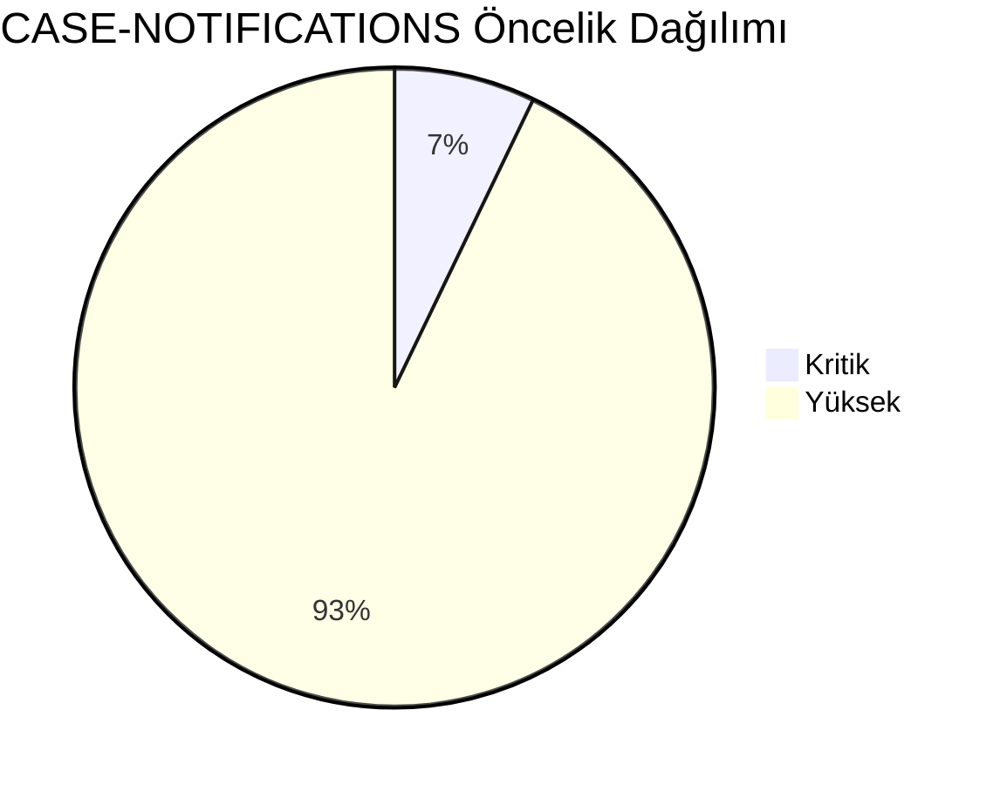
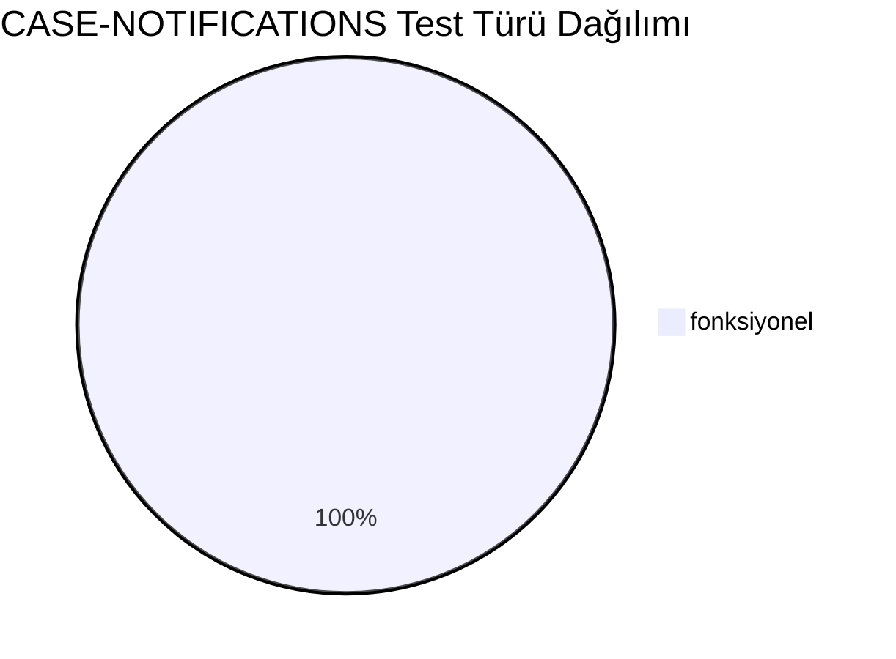
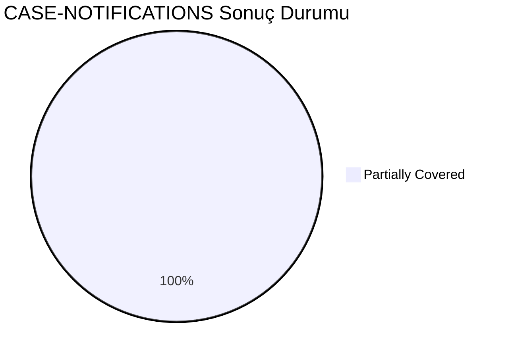
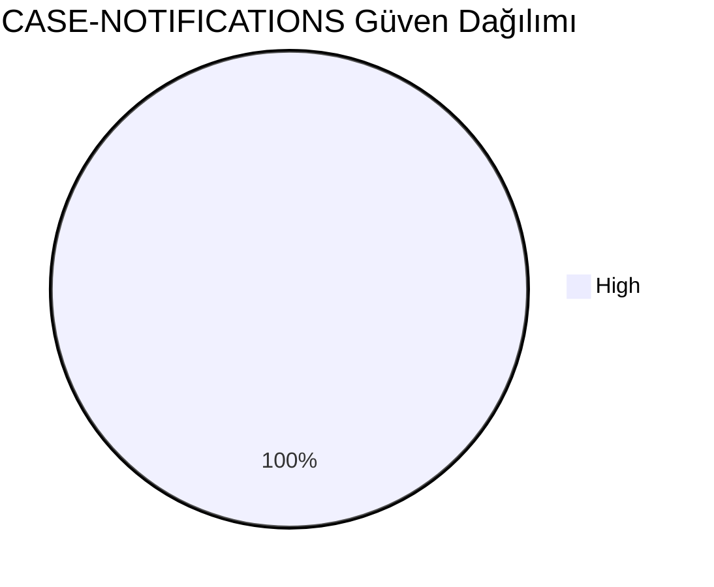
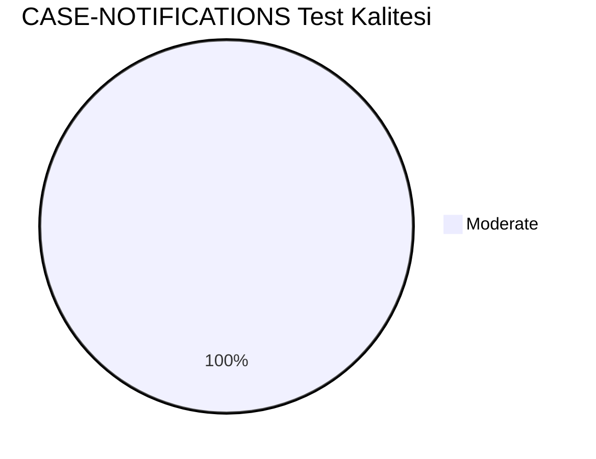
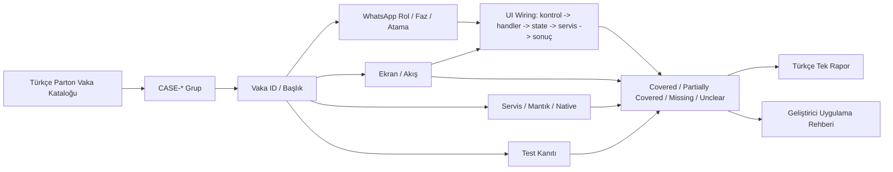
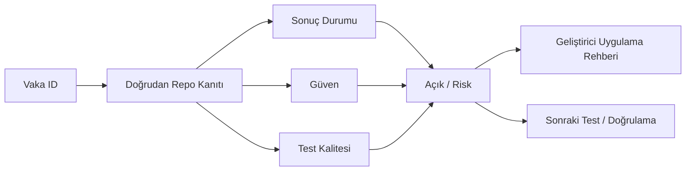

# CASE-NOTIFICATIONS Vaka Test Görselleştirmesi

- Toplam vaka: `14`
- Sonuç kaynağı: `/Users/hakanbilir/MyDevZone/StaffMatch/parton-case-results.json`
- Kanıt politikası: isim benzerliği kapsama kanıtı değildir; her vaka doğrudan repo kanıtı ile eşleştirilmelidir.

## Öncelik Dağılımı

## Test Türü Dağılımı

## Vaka Test Sonuç Özeti

## Güven Dağılımı

## Test Kalitesi Dağılımı

## Vaka Eşleştirme Akışı

## Sonuç Akışı

## Sonuç Matrisi

| Vaka ID | Başlık | Durum | Güven | Test Kalitesi | Kanıt | Açık | Olası Kod Alanı | UI Wiring Kanıtı |
| --- | --- | --- | --- | --- | --- | --- | --- | --- |
| `T-100` | Yeni uygun ilan bildirimi | Partially Covered | High | Moderate | StaffMatchFirebaseMessagingService + MainActivity deep link consume + NotificationNavigationBridge. | Background delivery ve üretim FCM edge-case’leri için entegrasyon testi kanıtı düşük. | native | kontrol -> handler -> state -> servis/native/API -> görünür sonuç |
| `T-101` | Başvuru alındı bildirimi | Partially Covered | High | Moderate | StaffMatchFirebaseMessagingService + MainActivity deep link consume + NotificationNavigationBridge. | Background delivery ve üretim FCM edge-case’leri için entegrasyon testi kanıtı düşük. | native | kontrol -> handler -> state -> servis/native/API -> görünür sonuç |
| `T-102` | Onay bildirimi | Partially Covered | High | Moderate | StaffMatchFirebaseMessagingService + MainActivity deep link consume + NotificationNavigationBridge. | Background delivery ve üretim FCM edge-case’leri için entegrasyon testi kanıtı düşük. | native | kontrol -> handler -> state -> servis/native/API -> görünür sonuç |
| `T-103` | Red bildirimi | Partially Covered | High | Moderate | StaffMatchFirebaseMessagingService + MainActivity deep link consume + NotificationNavigationBridge. | Background delivery ve üretim FCM edge-case’leri için entegrasyon testi kanıtı düşük. | native | kontrol -> handler -> state -> servis/native/API -> görünür sonuç |
| `T-104` | 3 saat kala check-in bildirimi | Partially Covered | High | Moderate | StaffMatchFirebaseMessagingService + MainActivity deep link consume + NotificationNavigationBridge. | Background delivery ve üretim FCM edge-case’leri için entegrasyon testi kanıtı düşük. | native | kontrol -> handler -> state -> servis/native/API -> görünür sonuç |
| `T-105` | 10 dakika kala işe geldim bildirimi | Partially Covered | High | Moderate | StaffMatchFirebaseMessagingService + MainActivity deep link consume + NotificationNavigationBridge. | Background delivery ve üretim FCM edge-case’leri için entegrasyon testi kanıtı düşük. | native | kontrol -> handler -> state -> servis/native/API -> görünür sonuç |
| `T-106` | 24 saat sonra değerlendirme bildirimi | Partially Covered | High | Moderate | StaffMatchFirebaseMessagingService + MainActivity deep link consume + NotificationNavigationBridge. | Background delivery ve üretim FCM edge-case’leri için entegrasyon testi kanıtı düşük. | native | kontrol -> handler -> state -> servis/native/API -> görünür sonuç |
| `T-107` | Favori işveren ilan bildirimi | Partially Covered | High | Moderate | StaffMatchFirebaseMessagingService + MainActivity deep link consume + NotificationNavigationBridge. | Background delivery ve üretim FCM edge-case’leri için entegrasyon testi kanıtı düşük. | native | kontrol -> handler -> state -> servis/native/API -> görünür sonuç |
| `T-108` | Sadece favorilere özel bildirim | Partially Covered | High | Moderate | StaffMatchFirebaseMessagingService + MainActivity deep link consume + NotificationNavigationBridge. | Background delivery ve üretim FCM edge-case’leri için entegrasyon testi kanıtı düşük. | native | kontrol -> handler -> state -> servis/native/API -> görünür sonuç |
| `T-109` | Bildirim tıklanınca doğru ekrana yönlendirme | Partially Covered | High | Moderate | StaffMatchFirebaseMessagingService + MainActivity deep link consume + NotificationNavigationBridge. | Background delivery ve üretim FCM edge-case’leri için entegrasyon testi kanıtı düşük. | native | kontrol -> handler -> state -> servis/native/API -> görünür sonuç |
| `T-110` | Çift bildirim oluşmaması | Partially Covered | High | Moderate | StaffMatchFirebaseMessagingService + MainActivity deep link consume + NotificationNavigationBridge. | Background delivery ve üretim FCM edge-case’leri için entegrasyon testi kanıtı düşük. | native | kontrol -> handler -> state -> servis/native/API -> görünür sonuç |
| `T-111` | Push kapalıysa uygulama içi bildirim | Partially Covered | High | Moderate | StaffMatchFirebaseMessagingService + MainActivity deep link consume + NotificationNavigationBridge. | Background delivery ve üretim FCM edge-case’leri için entegrasyon testi kanıtı düşük. | native | kontrol -> handler -> state -> servis/native/API -> görünür sonuç |
| `T-112` | Gecikmeli bildirim senaryosu | Partially Covered | High | Moderate | StaffMatchFirebaseMessagingService + MainActivity deep link consume + NotificationNavigationBridge. | Background delivery ve üretim FCM edge-case’leri için entegrasyon testi kanıtı düşük. | native | kontrol -> handler -> state -> servis/native/API -> görünür sonuç |
| `T-113` | Yanlış kullanıcıya bildirim gitmemesi | Partially Covered | High | Moderate | StaffMatchFirebaseMessagingService + MainActivity deep link consume + NotificationNavigationBridge. | Background delivery ve üretim FCM edge-case’leri için entegrasyon testi kanıtı düşük. | native | kontrol -> handler -> state -> servis/native/API -> görünür sonuç |

## Vakalar

| Vaka ID | Başlık | Öncelik | Test Türü | Rol | Canlı Test Fazı | Görsel Eşleştirme Notu |
| --- | --- | --- | --- | --- | --- | --- |
| `T-100` | Yeni uygun ilan bildirimi | Yüksek | Fonksiyonel | Çoklu Aktör | Faz 5 - İş Günü Yönetimi | Ekran / servis / test kanıtı ile eşleştirilecek |
| `T-101` | Başvuru alındı bildirimi | Yüksek | Fonksiyonel | Çoklu Aktör | Faz 5 - İş Günü Yönetimi | Ekran / servis / test kanıtı ile eşleştirilecek |
| `T-102` | Onay bildirimi | Yüksek | Fonksiyonel | Çoklu Aktör | Faz 5 - İş Günü Yönetimi | Ekran / servis / test kanıtı ile eşleştirilecek |
| `T-103` | Red bildirimi | Yüksek | Fonksiyonel | Çoklu Aktör | Faz 5 - İş Günü Yönetimi | Ekran / servis / test kanıtı ile eşleştirilecek |
| `T-104` | 3 saat kala check-in bildirimi | Kritik | Fonksiyonel | Çoklu Aktör | Faz 5 - İş Günü Yönetimi | Ekran / servis / test kanıtı ile eşleştirilecek |
| `T-105` | 10 dakika kala işe geldim bildirimi | Yüksek | Fonksiyonel | Çoklu Aktör | Faz 5 - İş Günü Yönetimi | Ekran / servis / test kanıtı ile eşleştirilecek |
| `T-106` | 24 saat sonra değerlendirme bildirimi | Yüksek | Fonksiyonel | Çoklu Aktör | Faz 5 - İş Günü Yönetimi | Ekran / servis / test kanıtı ile eşleştirilecek |
| `T-107` | Favori işveren ilan bildirimi | Yüksek | Fonksiyonel | İşveren | Faz 5 - İş Günü Yönetimi | Ekran / servis / test kanıtı ile eşleştirilecek |
| `T-108` | Sadece favorilere özel bildirim | Yüksek | Fonksiyonel | Çoklu Aktör | Faz 5 - İş Günü Yönetimi | Ekran / servis / test kanıtı ile eşleştirilecek |
| `T-109` | Bildirim tıklanınca doğru ekrana yönlendirme | Yüksek | Fonksiyonel | Çoklu Aktör | Faz 5 - İş Günü Yönetimi | Ekran / servis / test kanıtı ile eşleştirilecek |
| `T-110` | Çift bildirim oluşmaması | Yüksek | Fonksiyonel | Çoklu Aktör | Faz 5 - İş Günü Yönetimi | Ekran / servis / test kanıtı ile eşleştirilecek |
| `T-111` | Push kapalıysa uygulama içi bildirim | Yüksek | Fonksiyonel | Çoklu Aktör | Faz 5 - İş Günü Yönetimi | Ekran / servis / test kanıtı ile eşleştirilecek |
| `T-112` | Gecikmeli bildirim senaryosu | Yüksek | Fonksiyonel | Çoklu Aktör | Faz 5 - İş Günü Yönetimi | Ekran / servis / test kanıtı ile eşleştirilecek |
| `T-113` | Yanlış kullanıcıya bildirim gitmemesi | Yüksek | Fonksiyonel | Çoklu Aktör | Faz 5 - İş Günü Yönetimi | Ekran / servis / test kanıtı ile eşleştirilecek |

## Manuel Tamamlama Kontrol Listesi

- Her vaka için ilişkili ekran/görünüm, servis/modül, native/platform alanı ve test dosyası yazılmalıdır.
- UI wiring kanıtı; ekran kontrolü, handler, state sahibi, validasyon, servis/native/API yan etkisi ve görünür sonucu birlikte göstermelidir.
- Kritik vakalarda enforcement kanıtı ve varsa test kanıtı ayrı ayrı gösterilmelidir.
- Kanıt zayıfsa durum `Unclear` veya `Partially Covered` kalmalıdır.
