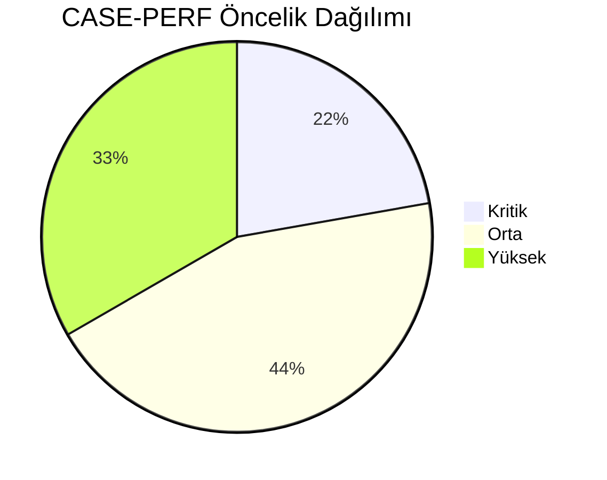
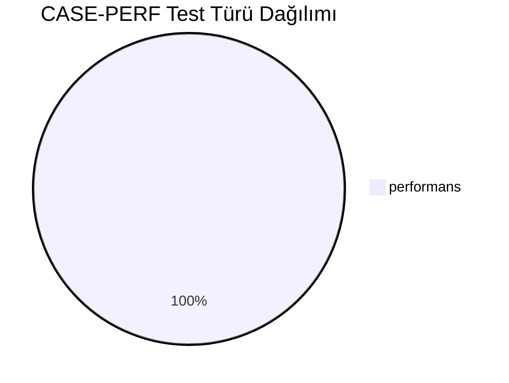
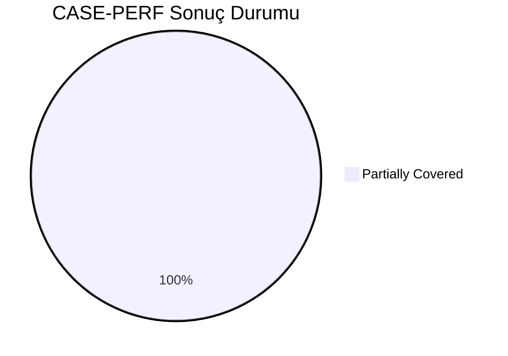
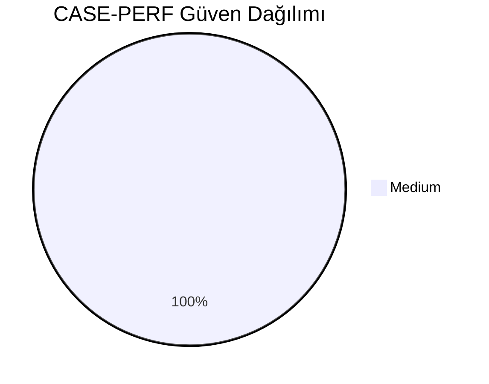
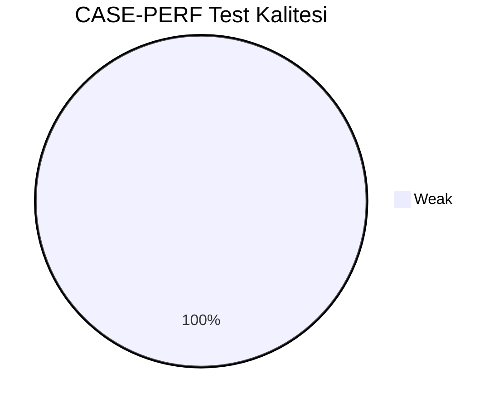
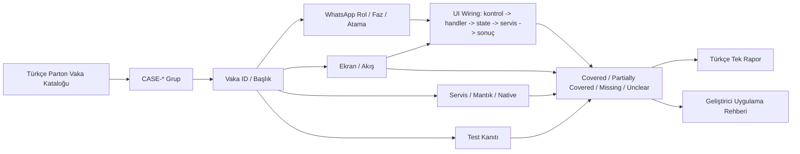
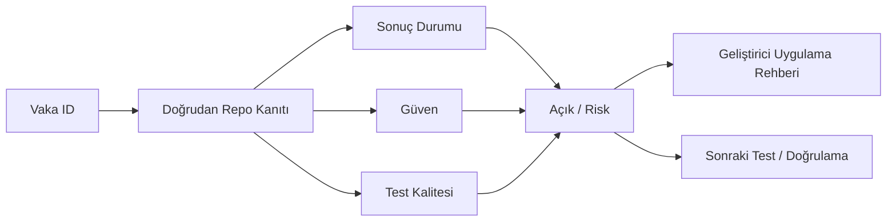

# CASE-PERF Vaka Test Görselleştirmesi

- Toplam vaka: `9`
- Sonuç kaynağı: `/Users/hakanbilir/MyDevZone/StaffMatch/parton-case-results.json`
- Kanıt politikası: isim benzerliği kapsama kanıtı değildir; her vaka doğrudan repo kanıtı ile eşleştirilmelidir.

## Öncelik Dağılımı

## Test Türü Dağılımı

## Vaka Test Sonuç Özeti

## Güven Dağılımı

## Test Kalitesi Dağılımı

## Vaka Eşleştirme Akışı

## Sonuç Akışı

## Sonuç Matrisi

| Vaka ID | Başlık | Durum | Güven | Test Kalitesi | Kanıt | Açık | Olası Kod Alanı | UI Wiring Kanıtı |
| --- | --- | --- | --- | --- | --- | --- | --- | --- |
| `T-226` | Aynı anda binlerce ilan bildirimi gönderimi | Partially Covered | Medium | Weak | Flow combine/cache ve repo-level parallel fetch mevcut; benchmark/profiling çıktısı yok. | Ölçüme dayalı performans bütçesi ve otomatik performans regression testleri eksik. | shared | kontrol -> handler -> state -> servis/native/API -> görünür sonuç |
| `T-227` | Aynı anda binlerce başvuru | Partially Covered | Medium | Weak | Flow combine/cache ve repo-level parallel fetch mevcut; benchmark/profiling çıktısı yok. | Ölçüme dayalı performans bütçesi ve otomatik performans regression testleri eksik. | shared | kontrol -> handler -> state -> servis/native/API -> görünür sonuç |
| `T-228` | Yoğun anda eşleşme motoru performansı | Partially Covered | Medium | Weak | Flow combine/cache ve repo-level parallel fetch mevcut; benchmark/profiling çıktısı yok. | Ölçüme dayalı performans bütçesi ve otomatik performans regression testleri eksik. | shared | kontrol -> handler -> state -> servis/native/API -> görünür sonuç |
| `T-229` | Çok şubeli işverenlerde ilan performansı | Partially Covered | Medium | Weak | Flow combine/cache ve repo-level parallel fetch mevcut; benchmark/profiling çıktısı yok. | Ölçüme dayalı performans bütçesi ve otomatik performans regression testleri eksik. | shared | kontrol -> handler -> state -> servis/native/API -> görünür sonuç |
| `T-230` | Konum doğrulama yoğun yük testi | Partially Covered | Medium | Weak | Flow combine/cache ve repo-level parallel fetch mevcut; benchmark/profiling çıktısı yok. | Ölçüme dayalı performans bütçesi ve otomatik performans regression testleri eksik. | shared | kontrol -> handler -> state -> servis/native/API -> görünür sonuç |
| `T-231` | Bildirim kuyruğu gecikme testi | Partially Covered | Medium | Weak | Flow combine/cache ve repo-level parallel fetch mevcut; benchmark/profiling çıktısı yok. | Ölçüme dayalı performans bütçesi ve otomatik performans regression testleri eksik. | shared | kontrol -> handler -> state -> servis/native/API -> görünür sonuç |
| `T-232` | Jeton işlemlerinde eşzamanlılık testi | Partially Covered | Medium | Weak | Flow combine/cache ve repo-level parallel fetch mevcut; benchmark/profiling çıktısı yok. | Ölçüme dayalı performans bütçesi ve otomatik performans regression testleri eksik. | shared | kontrol -> handler -> state -> servis/native/API -> görünür sonuç |
| `T-233` | Duplicate işlem oluşmaması | Partially Covered | Medium | Weak | Flow combine/cache ve repo-level parallel fetch mevcut; benchmark/profiling çıktısı yok. | Ölçüme dayalı performans bütçesi ve otomatik performans regression testleri eksik. | shared | kontrol -> handler -> state -> servis/native/API -> görünür sonuç |
| `T-234` | Veritabanı kilitlenme testi | Partially Covered | Medium | Weak | Flow combine/cache ve repo-level parallel fetch mevcut; benchmark/profiling çıktısı yok. | Ölçüme dayalı performans bütçesi ve otomatik performans regression testleri eksik. | shared | kontrol -> handler -> state -> servis/native/API -> görünür sonuç |

## Vakalar

| Vaka ID | Başlık | Öncelik | Test Türü | Rol | Canlı Test Fazı | Görsel Eşleştirme Notu |
| --- | --- | --- | --- | --- | --- | --- |
| `T-226` | Aynı anda binlerce ilan bildirimi gönderimi | Yüksek | Performans | Çoklu Aktör | Risk Fazı - Negatif/Suistimal | Ekran / servis / test kanıtı ile eşleştirilecek |
| `T-227` | Aynı anda binlerce başvuru | Orta | Performans | Çoklu Aktör | Risk Fazı - Negatif/Suistimal | Ekran / servis / test kanıtı ile eşleştirilecek |
| `T-228` | Yoğun anda eşleşme motoru performansı | Yüksek | Performans | Çoklu Aktör | Risk Fazı - Negatif/Suistimal | Ekran / servis / test kanıtı ile eşleştirilecek |
| `T-229` | Çok şubeli işverenlerde ilan performansı | Orta | Performans | İşveren | Risk Fazı - Negatif/Suistimal | Ekran / servis / test kanıtı ile eşleştirilecek |
| `T-230` | Konum doğrulama yoğun yük testi | Kritik | Performans | Çoklu Aktör | Risk Fazı - Negatif/Suistimal | Ekran / servis / test kanıtı ile eşleştirilecek |
| `T-231` | Bildirim kuyruğu gecikme testi | Yüksek | Performans | Çoklu Aktör | Risk Fazı - Negatif/Suistimal | Ekran / servis / test kanıtı ile eşleştirilecek |
| `T-232` | Jeton işlemlerinde eşzamanlılık testi | Kritik | Performans | Çoklu Aktör | Risk Fazı - Negatif/Suistimal | Ekran / servis / test kanıtı ile eşleştirilecek |
| `T-233` | Duplicate işlem oluşmaması | Orta | Performans | Çoklu Aktör | Risk Fazı - Negatif/Suistimal | Ekran / servis / test kanıtı ile eşleştirilecek |
| `T-234` | Veritabanı kilitlenme testi | Orta | Performans | Çoklu Aktör | Risk Fazı - Negatif/Suistimal | Ekran / servis / test kanıtı ile eşleştirilecek |

## Manuel Tamamlama Kontrol Listesi

- Her vaka için ilişkili ekran/görünüm, servis/modül, native/platform alanı ve test dosyası yazılmalıdır.
- UI wiring kanıtı; ekran kontrolü, handler, state sahibi, validasyon, servis/native/API yan etkisi ve görünür sonucu birlikte göstermelidir.
- Kritik vakalarda enforcement kanıtı ve varsa test kanıtı ayrı ayrı gösterilmelidir.
- Kanıt zayıfsa durum `Unclear` veya `Partially Covered` kalmalıdır.
