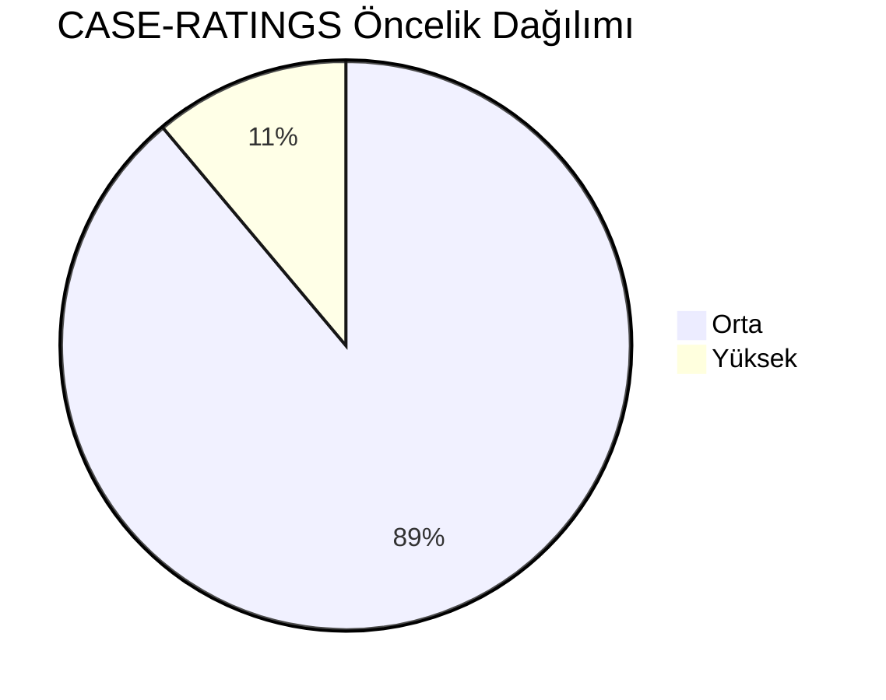
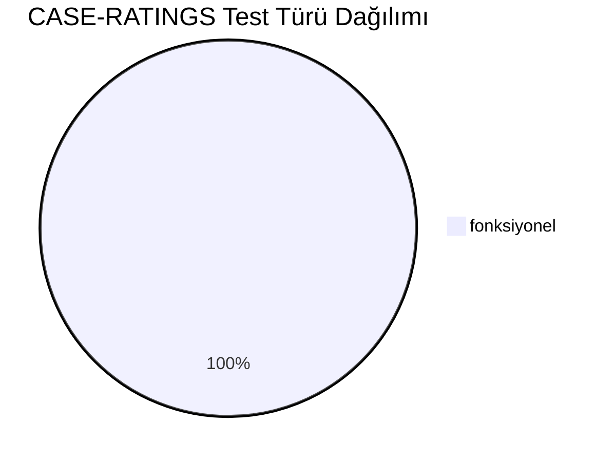
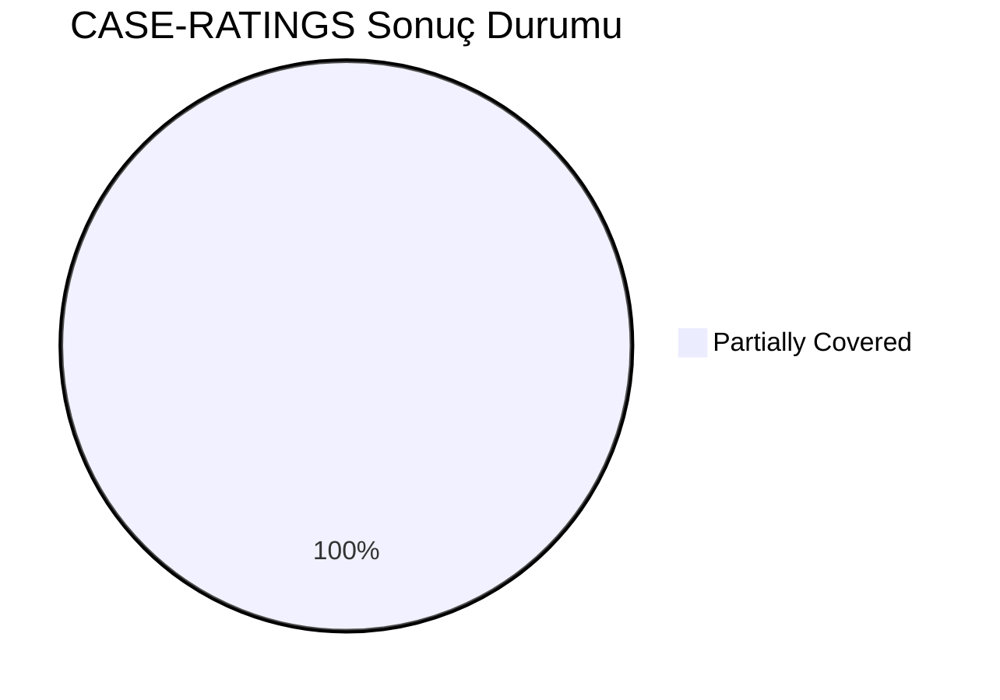
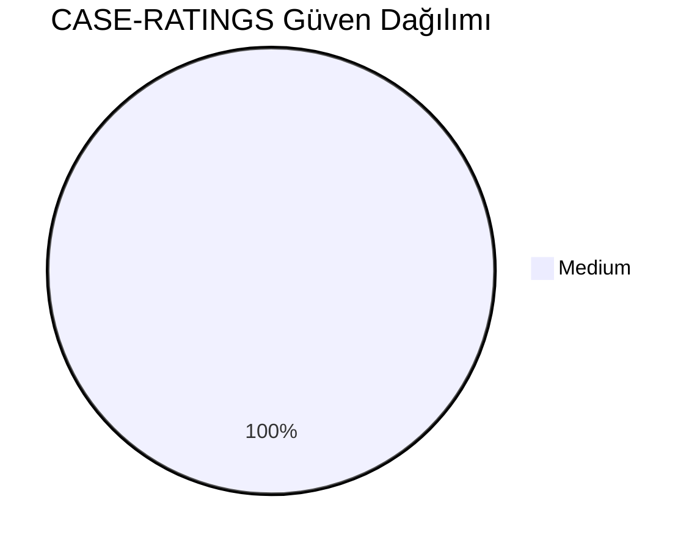
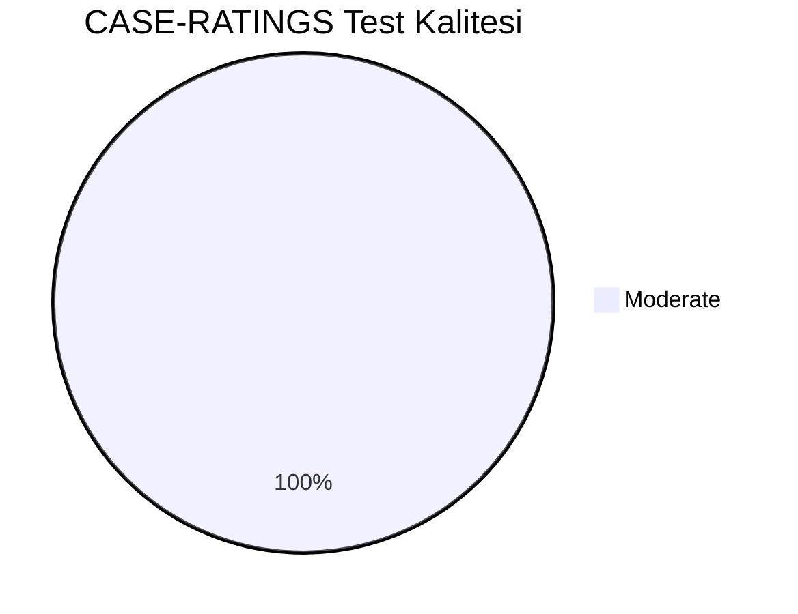
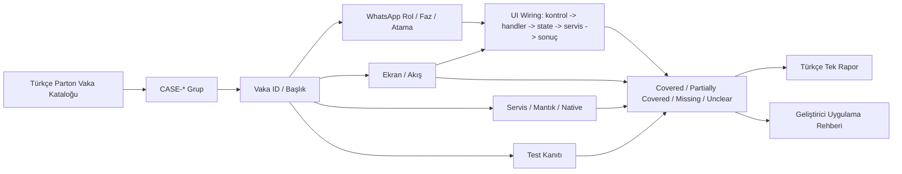
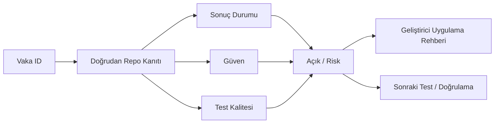

# CASE-RATINGS Vaka Test Görselleştirmesi

- Toplam vaka: `9`
- Sonuç kaynağı: `/Users/hakanbilir/MyDevZone/StaffMatch/parton-case-results.json`
- Kanıt politikası: isim benzerliği kapsama kanıtı değildir; her vaka doğrudan repo kanıtı ile eşleştirilmelidir.

## Öncelik Dağılımı

## Test Türü Dağılımı

## Vaka Test Sonuç Özeti

## Güven Dağılımı

## Test Kalitesi Dağılımı

## Vaka Eşleştirme Akışı

## Sonuç Akışı

## Sonuç Matrisi

| Vaka ID | Başlık | Durum | Güven | Test Kalitesi | Kanıt | Açık | Olası Kod Alanı | UI Wiring Kanıtı |
| --- | --- | --- | --- | --- | --- | --- | --- | --- |
| `T-172` | 24 saat sonra değerlendirme bildirimi | Partially Covered | Medium | Moderate | EmployeeHomeViewModel.submitBranchRating + JobRatingRepository + completion state alanları. | Abuse-resistant puanlama kurallarının tamamı client repoda kanıtlanamıyor. | shared | kontrol -> handler -> state -> servis/native/API -> görünür sonuç |
| `T-173` | İşçinin işvereni puanlaması | Partially Covered | Medium | Moderate | EmployeeHomeViewModel.submitBranchRating + JobRatingRepository + completion state alanları. | Abuse-resistant puanlama kurallarının tamamı client repoda kanıtlanamıyor. | shared | kontrol -> handler -> state -> servis/native/API -> görünür sonuç |
| `T-174` | İşverenin işçiyi puanlaması | Partially Covered | Medium | Moderate | EmployeeHomeViewModel.submitBranchRating + JobRatingRepository + completion state alanları. | Abuse-resistant puanlama kurallarının tamamı client repoda kanıtlanamıyor. | shared | kontrol -> handler -> state -> servis/native/API -> görünür sonuç |
| `T-175` | Yorum bırakma | Partially Covered | Medium | Moderate | EmployeeHomeViewModel.submitBranchRating + JobRatingRepository + completion state alanları. | Abuse-resistant puanlama kurallarının tamamı client repoda kanıtlanamıyor. | shared | kontrol -> handler -> state -> servis/native/API -> görünür sonuç |
| `T-176` | Hakaret içerikli yorum filtresi | Partially Covered | Medium | Moderate | EmployeeHomeViewModel.submitBranchRating + JobRatingRepository + completion state alanları. | Abuse-resistant puanlama kurallarının tamamı client repoda kanıtlanamıyor. | shared | kontrol -> handler -> state -> servis/native/API -> görünür sonuç |
| `T-177` | Aynı iş için tekrar puan verememe | Partially Covered | Medium | Moderate | EmployeeHomeViewModel.submitBranchRating + JobRatingRepository + completion state alanları. | Abuse-resistant puanlama kurallarının tamamı client repoda kanıtlanamıyor. | shared | kontrol -> handler -> state -> servis/native/API -> görünür sonuç |
| `T-178` | İşe gelmeyen kullanıcı için değerlendirme kuralı | Partially Covered | Medium | Moderate | EmployeeHomeViewModel.submitBranchRating + JobRatingRepository + completion state alanları. | Abuse-resistant puanlama kurallarının tamamı client repoda kanıtlanamıyor. | shared | kontrol -> handler -> state -> servis/native/API -> görünür sonuç |
| `T-179` | İptal edilen işte değerlendirme tetiklenmesi | Partially Covered | Medium | Moderate | EmployeeHomeViewModel.submitBranchRating + JobRatingRepository + completion state alanları. | Abuse-resistant puanlama kurallarının tamamı client repoda kanıtlanamıyor. | shared | kontrol -> handler -> state -> servis/native/API -> görünür sonuç |
| `T-180` | Puan ortalamasının doğru hesaplanması | Partially Covered | Medium | Moderate | EmployeeHomeViewModel.submitBranchRating + JobRatingRepository + completion state alanları. | Abuse-resistant puanlama kurallarının tamamı client repoda kanıtlanamıyor. | shared | kontrol -> handler -> state -> servis/native/API -> görünür sonuç |

## Vakalar

| Vaka ID | Başlık | Öncelik | Test Türü | Rol | Canlı Test Fazı | Görsel Eşleştirme Notu |
| --- | --- | --- | --- | --- | --- | --- |
| `T-172` | 24 saat sonra değerlendirme bildirimi | Yüksek | Fonksiyonel | Çoklu Aktör | Faz 6 - Sonrası ve Sadakat | Ekran / servis / test kanıtı ile eşleştirilecek |
| `T-173` | İşçinin işvereni puanlaması | Orta | Fonksiyonel | İşveren | Faz 6 - Sonrası ve Sadakat | Ekran / servis / test kanıtı ile eşleştirilecek |
| `T-174` | İşverenin işçiyi puanlaması | Orta | Fonksiyonel | İşçi | Faz 6 - Sonrası ve Sadakat | Ekran / servis / test kanıtı ile eşleştirilecek |
| `T-175` | Yorum bırakma | Orta | Fonksiyonel | Çoklu Aktör | Faz 6 - Sonrası ve Sadakat | Ekran / servis / test kanıtı ile eşleştirilecek |
| `T-176` | Hakaret içerikli yorum filtresi | Orta | Fonksiyonel | Çoklu Aktör | Faz 6 - Sonrası ve Sadakat | Ekran / servis / test kanıtı ile eşleştirilecek |
| `T-177` | Aynı iş için tekrar puan verememe | Orta | Fonksiyonel | Çoklu Aktör | Faz 6 - Sonrası ve Sadakat | Ekran / servis / test kanıtı ile eşleştirilecek |
| `T-178` | İşe gelmeyen kullanıcı için değerlendirme kuralı | Orta | Fonksiyonel | Çoklu Aktör | Faz 6 - Sonrası ve Sadakat | Ekran / servis / test kanıtı ile eşleştirilecek |
| `T-179` | İptal edilen işte değerlendirme tetiklenmesi | Orta | Fonksiyonel | Çoklu Aktör | Faz 6 - Sonrası ve Sadakat | Ekran / servis / test kanıtı ile eşleştirilecek |
| `T-180` | Puan ortalamasının doğru hesaplanması | Orta | Fonksiyonel | Çoklu Aktör | Faz 6 - Sonrası ve Sadakat | Ekran / servis / test kanıtı ile eşleştirilecek |

## Manuel Tamamlama Kontrol Listesi

- Her vaka için ilişkili ekran/görünüm, servis/modül, native/platform alanı ve test dosyası yazılmalıdır.
- UI wiring kanıtı; ekran kontrolü, handler, state sahibi, validasyon, servis/native/API yan etkisi ve görünür sonucu birlikte göstermelidir.
- Kritik vakalarda enforcement kanıtı ve varsa test kanıtı ayrı ayrı gösterilmelidir.
- Kanıt zayıfsa durum `Unclear` veya `Partially Covered` kalmalıdır.
