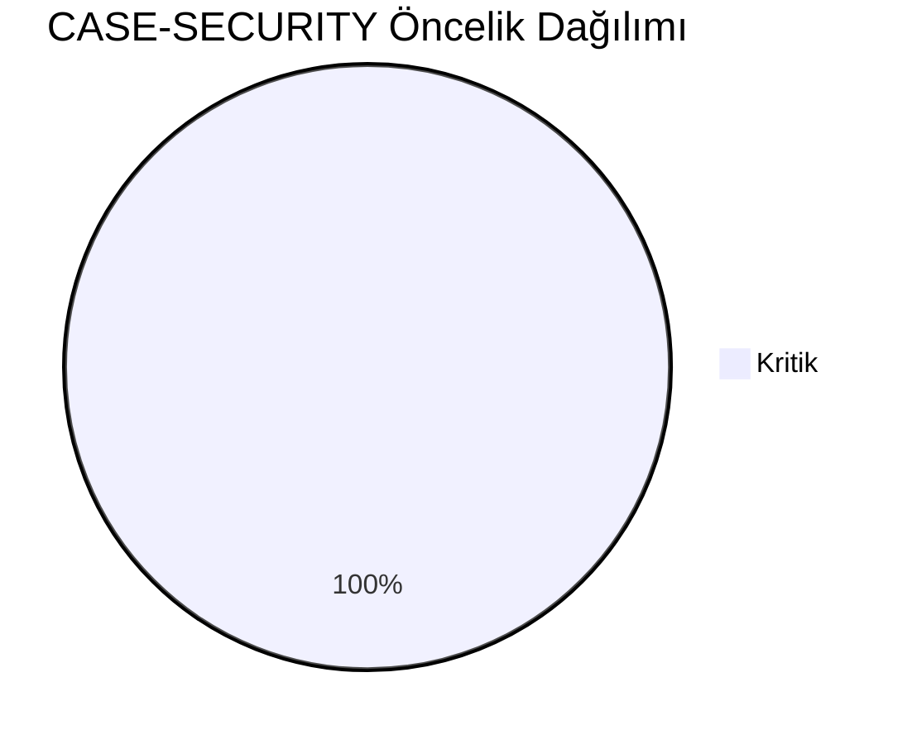
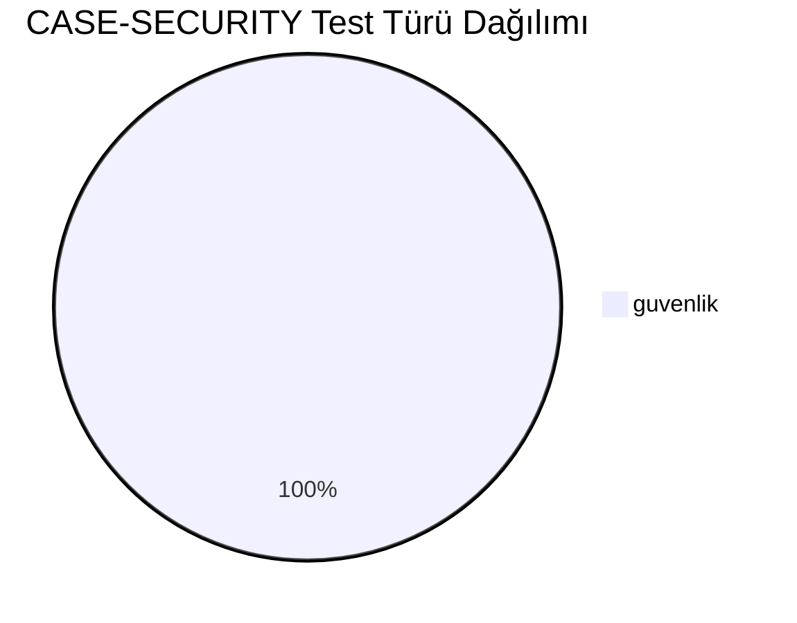
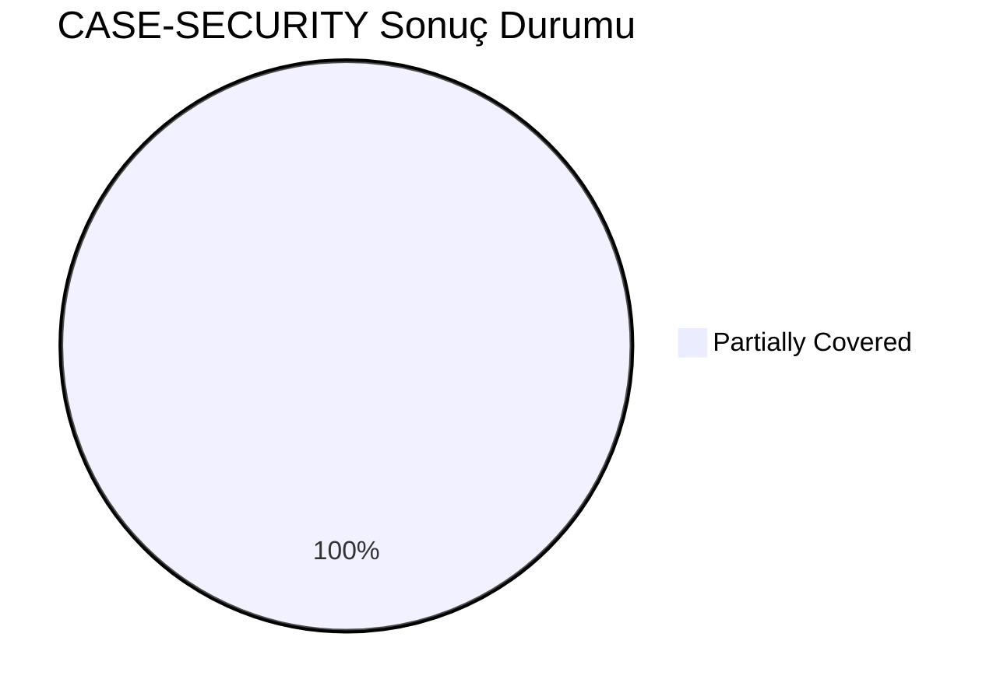
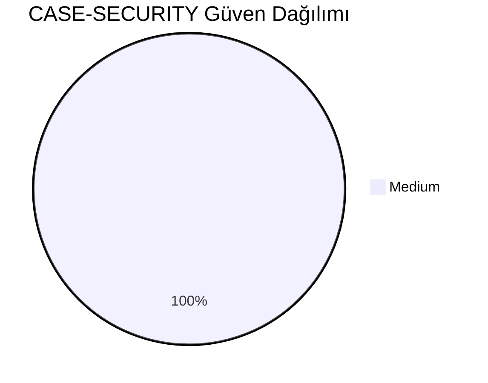
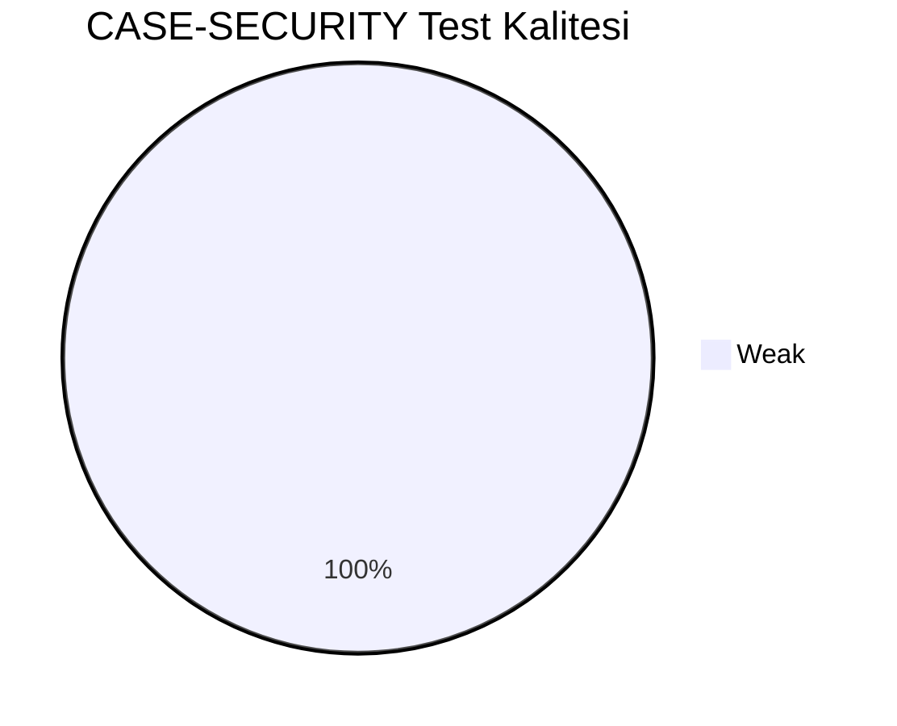
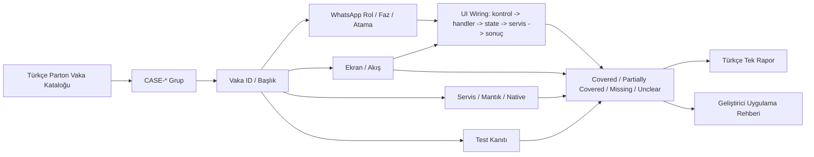
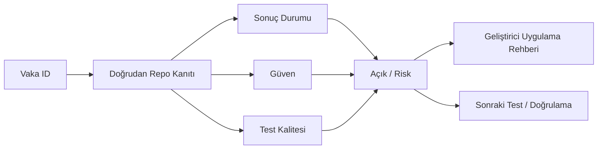

# CASE-SECURITY Vaka Test Görselleştirmesi

- Toplam vaka: `9`
- Sonuç kaynağı: `/Users/hakanbilir/MyDevZone/StaffMatch/parton-case-results.json`
- Kanıt politikası: isim benzerliği kapsama kanıtı değildir; her vaka doğrudan repo kanıtı ile eşleştirilmelidir.

## Öncelik Dağılımı

## Test Türü Dağılımı

## Vaka Test Sonuç Özeti

## Güven Dağılımı

## Test Kalitesi Dağılımı

## Vaka Eşleştirme Akışı

## Sonuç Akışı

## Sonuç Matrisi

| Vaka ID | Başlık | Durum | Güven | Test Kalitesi | Kanıt | Açık | Olası Kod Alanı | UI Wiring Kanıtı |
| --- | --- | --- | --- | --- | --- | --- | --- | --- |
| `T-244` | Kullanıcı yalnızca kendi verisini görebiliyor mu | Partially Covered | Medium | Weak | Firestore authz rules + encrypted sensitive fields + cleartext kapalı network config. | Manifest içinde API anahtarı açık; sabit secret ve tam güvenlik testi zinciri yetersiz. | shared | kontrol -> handler -> state -> servis/native/API -> görünür sonuç |
| `T-245` | İşveren sadece kendi adaylarını görebiliyor mu | Partially Covered | Medium | Weak | Firestore authz rules + encrypted sensitive fields + cleartext kapalı network config. | Manifest içinde API anahtarı açık; sabit secret ve tam güvenlik testi zinciri yetersiz. | shared | kontrol -> handler -> state -> servis/native/API -> görünür sonuç |
| `T-246` | Yetkisiz API erişim testi | Partially Covered | Medium | Weak | Firestore authz rules + encrypted sensitive fields + cleartext kapalı network config. | Manifest içinde API anahtarı açık; sabit secret ve tam güvenlik testi zinciri yetersiz. | shared | kontrol -> handler -> state -> servis/native/API -> görünür sonuç |
| `T-247` | Oturum yönetimi güvenliği | Partially Covered | Medium | Weak | Firestore authz rules + encrypted sensitive fields + cleartext kapalı network config. | Manifest içinde API anahtarı açık; sabit secret ve tam güvenlik testi zinciri yetersiz. | shared | kontrol -> handler -> state -> servis/native/API -> görünür sonuç |
| `T-248` | Şifre sıfırlama güvenliği | Partially Covered | Medium | Weak | Firestore authz rules + encrypted sensitive fields + cleartext kapalı network config. | Manifest içinde API anahtarı açık; sabit secret ve tam güvenlik testi zinciri yetersiz. | shared | kontrol -> handler -> state -> servis/native/API -> görünür sonuç |
| `T-249` | Belge dosyalarının yetkisiz erişime kapalı olması | Partially Covered | Medium | Weak | Firestore authz rules + encrypted sensitive fields + cleartext kapalı network config. | Manifest içinde API anahtarı açık; sabit secret ve tam güvenlik testi zinciri yetersiz. | shared | kontrol -> handler -> state -> servis/native/API -> görünür sonuç |
| `T-250` | Konum verisinin güvenli saklanması | Partially Covered | Medium | Weak | Firestore authz rules + encrypted sensitive fields + cleartext kapalı network config. | Manifest içinde API anahtarı açık; sabit secret ve tam güvenlik testi zinciri yetersiz. | shared | kontrol -> handler -> state -> servis/native/API -> görünür sonuç |
| `T-251` | Hassas alanların gereksiz gösterilmemesi | Partially Covered | Medium | Weak | Firestore authz rules + encrypted sensitive fields + cleartext kapalı network config. | Manifest içinde API anahtarı açık; sabit secret ve tam güvenlik testi zinciri yetersiz. | shared | kontrol -> handler -> state -> servis/native/API -> görünür sonuç |
| `T-252` | Loglarda hassas veri sızıntısı olmaması | Partially Covered | Medium | Weak | Firestore authz rules + encrypted sensitive fields + cleartext kapalı network config. | Manifest içinde API anahtarı açık; sabit secret ve tam güvenlik testi zinciri yetersiz. | shared | kontrol -> handler -> state -> servis/native/API -> görünür sonuç |

## Vakalar

| Vaka ID | Başlık | Öncelik | Test Türü | Rol | Canlı Test Fazı | Görsel Eşleştirme Notu |
| --- | --- | --- | --- | --- | --- | --- |
| `T-244` | Kullanıcı yalnızca kendi verisini görebiliyor mu | Kritik | Güvenlik | Çoklu Aktör | Risk Fazı - Negatif/Suistimal | Ekran / servis / test kanıtı ile eşleştirilecek |
| `T-245` | İşveren sadece kendi adaylarını görebiliyor mu | Kritik | Güvenlik | Çoklu Aktör | Risk Fazı - Negatif/Suistimal | Ekran / servis / test kanıtı ile eşleştirilecek |
| `T-246` | Yetkisiz API erişim testi | Kritik | Güvenlik | Çoklu Aktör | Risk Fazı - Negatif/Suistimal | Ekran / servis / test kanıtı ile eşleştirilecek |
| `T-247` | Oturum yönetimi güvenliği | Kritik | Güvenlik | Çoklu Aktör | Risk Fazı - Negatif/Suistimal | Ekran / servis / test kanıtı ile eşleştirilecek |
| `T-248` | Şifre sıfırlama güvenliği | Kritik | Güvenlik | Çoklu Aktör | Risk Fazı - Negatif/Suistimal | Ekran / servis / test kanıtı ile eşleştirilecek |
| `T-249` | Belge dosyalarının yetkisiz erişime kapalı olması | Kritik | Güvenlik | Çoklu Aktör | Risk Fazı - Negatif/Suistimal | Ekran / servis / test kanıtı ile eşleştirilecek |
| `T-250` | Konum verisinin güvenli saklanması | Kritik | Güvenlik | Çoklu Aktör | Risk Fazı - Negatif/Suistimal | Ekran / servis / test kanıtı ile eşleştirilecek |
| `T-251` | Hassas alanların gereksiz gösterilmemesi | Kritik | Güvenlik | Çoklu Aktör | Risk Fazı - Negatif/Suistimal | Ekran / servis / test kanıtı ile eşleştirilecek |
| `T-252` | Loglarda hassas veri sızıntısı olmaması | Kritik | Güvenlik | Çoklu Aktör | Risk Fazı - Negatif/Suistimal | Ekran / servis / test kanıtı ile eşleştirilecek |

## Manuel Tamamlama Kontrol Listesi

- Her vaka için ilişkili ekran/görünüm, servis/modül, native/platform alanı ve test dosyası yazılmalıdır.
- UI wiring kanıtı; ekran kontrolü, handler, state sahibi, validasyon, servis/native/API yan etkisi ve görünür sonucu birlikte göstermelidir.
- Kritik vakalarda enforcement kanıtı ve varsa test kanıtı ayrı ayrı gösterilmelidir.
- Kanıt zayıfsa durum `Unclear` veya `Partially Covered` kalmalıdır.
