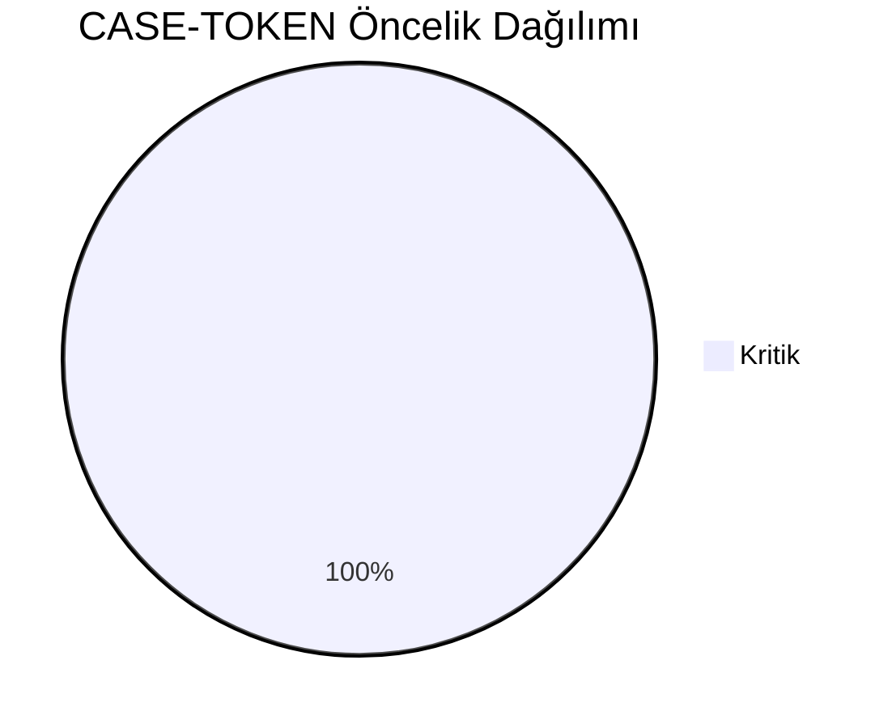
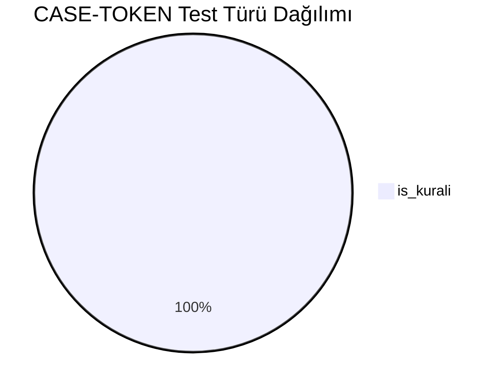
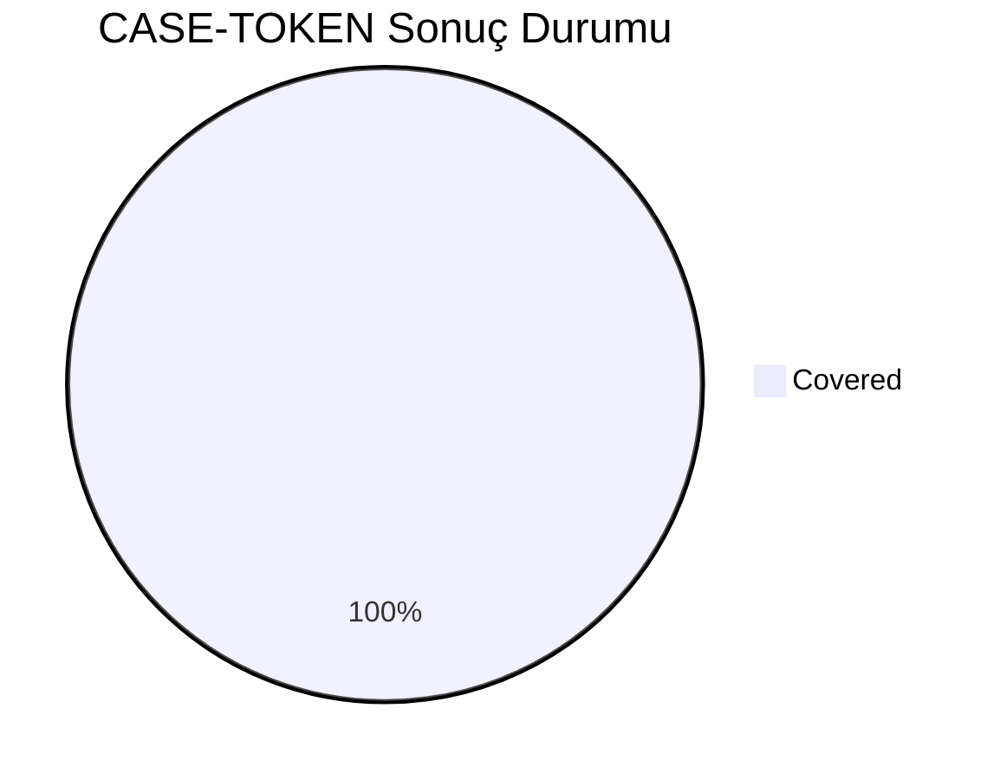
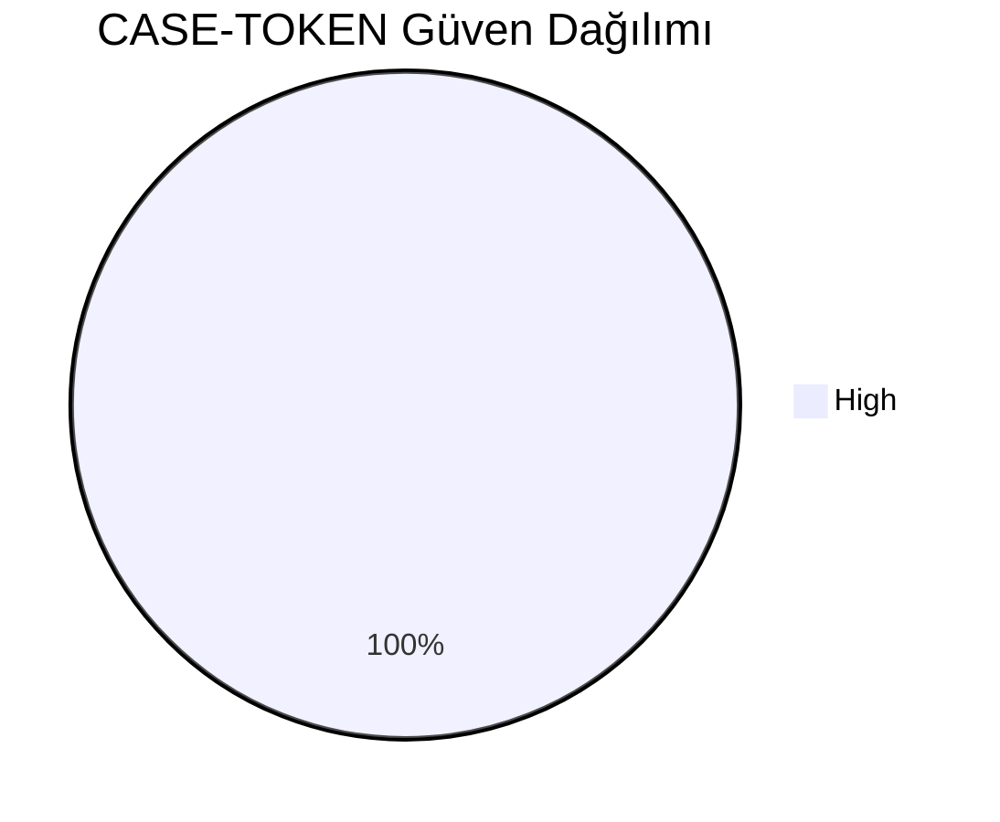
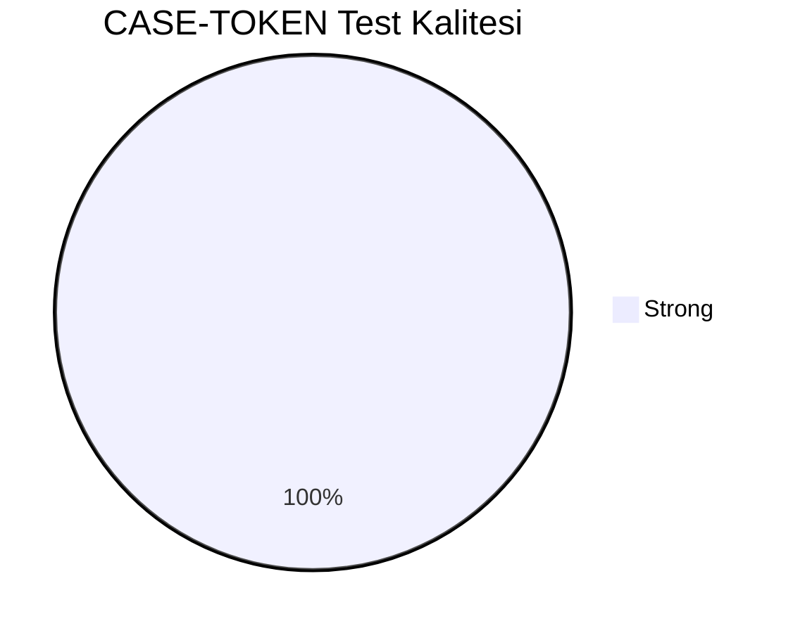
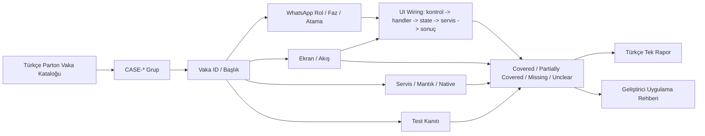
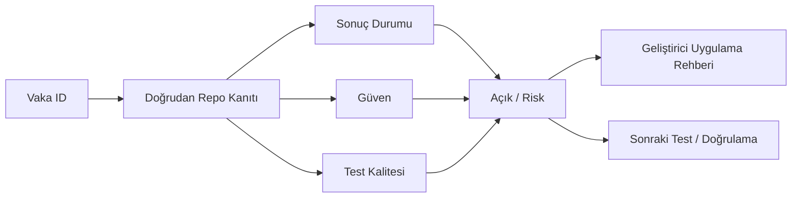

# CASE-TOKEN Vaka Test Görselleştirmesi

- Toplam vaka: `15`
- Sonuç kaynağı: `/Users/hakanbilir/MyDevZone/StaffMatch/parton-case-results.json`
- Kanıt politikası: isim benzerliği kapsama kanıtı değildir; her vaka doğrudan repo kanıtı ile eşleştirilmelidir.

## Öncelik Dağılımı

## Test Türü Dağılımı

## Vaka Test Sonuç Özeti

## Güven Dağılımı

## Test Kalitesi Dağılımı

## Vaka Eşleştirme Akışı

## Sonuç Akışı

## Sonuç Matrisi

| Vaka ID | Başlık | Durum | Güven | Test Kalitesi | Kanıt | Açık | Olası Kod Alanı | UI Wiring Kanıtı |
| --- | --- | --- | --- | --- | --- | --- | --- | --- |
| `T-149` | Yeterli jeton ile ilan açılması | Covered | High | Strong | SyncFcmTokenUseCase + FirebaseFcmTokenRepository + SyncFcmTokenUseCaseTest ile rol-bazlı token yönetişimi kanıtlı. | Gerçek üretim token rotasyonu için platform/FCM teslim gecikmesi gözlemleri bu repoda yok. | shared | kontrol -> handler -> state -> servis/native/API -> görünür sonuç |
| `T-150` | Yetersiz jetonla ilan açamama | Covered | High | Strong | SyncFcmTokenUseCase + FirebaseFcmTokenRepository + SyncFcmTokenUseCaseTest ile rol-bazlı token yönetişimi kanıtlı. | Gerçek üretim token rotasyonu için platform/FCM teslim gecikmesi gözlemleri bu repoda yok. | shared | kontrol -> handler -> state -> servis/native/API -> görünür sonuç |
| `T-151` | Personel sayısı kadar jeton bloklama | Covered | High | Strong | SyncFcmTokenUseCase + FirebaseFcmTokenRepository + SyncFcmTokenUseCaseTest ile rol-bazlı token yönetişimi kanıtlı. | Gerçek üretim token rotasyonu için platform/FCM teslim gecikmesi gözlemleri bu repoda yok. | shared | kontrol -> handler -> state -> servis/native/API -> görünür sonuç |
| `T-152` | İlan iptalinde jeton iadesi | Covered | High | Strong | SyncFcmTokenUseCase + FirebaseFcmTokenRepository + SyncFcmTokenUseCaseTest ile rol-bazlı token yönetişimi kanıtlı. | Gerçek üretim token rotasyonu için platform/FCM teslim gecikmesi gözlemleri bu repoda yok. | shared | kontrol -> handler -> state -> servis/native/API -> görünür sonuç |
| `T-153` | Hiç başvuru gelmeyen ilanda jeton durumu | Covered | High | Strong | SyncFcmTokenUseCase + FirebaseFcmTokenRepository + SyncFcmTokenUseCaseTest ile rol-bazlı token yönetişimi kanıtlı. | Gerçek üretim token rotasyonu için platform/FCM teslim gecikmesi gözlemleri bu repoda yok. | shared | kontrol -> handler -> state -> servis/native/API -> görünür sonuç |
| `T-154` | Başvuru var ama onay yoksa jeton durumu | Covered | High | Strong | SyncFcmTokenUseCase + FirebaseFcmTokenRepository + SyncFcmTokenUseCaseTest ile rol-bazlı token yönetişimi kanıtlı. | Gerçek üretim token rotasyonu için platform/FCM teslim gecikmesi gözlemleri bu repoda yok. | shared | kontrol -> handler -> state -> servis/native/API -> görünür sonuç |
| `T-155` | Onay var ama işçi gelmediyse jeton durumu | Covered | High | Strong | SyncFcmTokenUseCase + FirebaseFcmTokenRepository + SyncFcmTokenUseCaseTest ile rol-bazlı token yönetişimi kanıtlı. | Gerçek üretim token rotasyonu için platform/FCM teslim gecikmesi gözlemleri bu repoda yok. | shared | kontrol -> handler -> state -> servis/native/API -> görünür sonuç |
| `T-156` | İşçi geldiğinde jetonun kesinleşmesi | Covered | High | Strong | SyncFcmTokenUseCase + FirebaseFcmTokenRepository + SyncFcmTokenUseCaseTest ile rol-bazlı token yönetişimi kanıtlı. | Gerçek üretim token rotasyonu için platform/FCM teslim gecikmesi gözlemleri bu repoda yok. | shared | kontrol -> handler -> state -> servis/native/API -> görünür sonuç |
| `T-157` | Çok kişili ilanda kısmi gelişte kısmi jeton düşüşü | Covered | High | Strong | SyncFcmTokenUseCase + FirebaseFcmTokenRepository + SyncFcmTokenUseCaseTest ile rol-bazlı token yönetişimi kanıtlı. | Gerçek üretim token rotasyonu için platform/FCM teslim gecikmesi gözlemleri bu repoda yok. | shared | kontrol -> handler -> state -> servis/native/API -> görünür sonuç |
| `T-158` | Personel sayısı artırıldığında ek provizyon | Covered | High | Strong | SyncFcmTokenUseCase + FirebaseFcmTokenRepository + SyncFcmTokenUseCaseTest ile rol-bazlı token yönetişimi kanıtlı. | Gerçek üretim token rotasyonu için platform/FCM teslim gecikmesi gözlemleri bu repoda yok. | shared | kontrol -> handler -> state -> servis/native/API -> görünür sonuç |
| `T-159` | Personel sayısı azaltıldığında iade | Covered | High | Strong | SyncFcmTokenUseCase + FirebaseFcmTokenRepository + SyncFcmTokenUseCaseTest ile rol-bazlı token yönetişimi kanıtlı. | Gerçek üretim token rotasyonu için platform/FCM teslim gecikmesi gözlemleri bu repoda yok. | shared | kontrol -> handler -> state -> servis/native/API -> görünür sonuç |
| `T-160` | Ağ hatasında çift jeton düşüşü engeli | Covered | High | Strong | SyncFcmTokenUseCase + FirebaseFcmTokenRepository + SyncFcmTokenUseCaseTest ile rol-bazlı token yönetişimi kanıtlı. | Gerçek üretim token rotasyonu için platform/FCM teslim gecikmesi gözlemleri bu repoda yok. | shared | kontrol -> handler -> state -> servis/native/API -> görünür sonuç |
| `T-161` | Başarısız ödeme sonrası ilanın durumu | Covered | High | Strong | SyncFcmTokenUseCase + FirebaseFcmTokenRepository + SyncFcmTokenUseCaseTest ile rol-bazlı token yönetişimi kanıtlı. | Gerçek üretim token rotasyonu için platform/FCM teslim gecikmesi gözlemleri bu repoda yok. | shared | kontrol -> handler -> state -> servis/native/API -> görünür sonuç |
| `T-162` | Jeton hareket geçmişi raporlama | Covered | High | Strong | SyncFcmTokenUseCase + FirebaseFcmTokenRepository + SyncFcmTokenUseCaseTest ile rol-bazlı token yönetişimi kanıtlı. | Gerçek üretim token rotasyonu için platform/FCM teslim gecikmesi gözlemleri bu repoda yok. | shared | kontrol -> handler -> state -> servis/native/API -> görünür sonuç |
| `T-163` | Anlık bakiye güncelleme | Covered | High | Strong | SyncFcmTokenUseCase + FirebaseFcmTokenRepository + SyncFcmTokenUseCaseTest ile rol-bazlı token yönetişimi kanıtlı. | Gerçek üretim token rotasyonu için platform/FCM teslim gecikmesi gözlemleri bu repoda yok. | shared | kontrol -> handler -> state -> servis/native/API -> görünür sonuç |

## Vakalar

| Vaka ID | Başlık | Öncelik | Test Türü | Rol | Canlı Test Fazı | Görsel Eşleştirme Notu |
| --- | --- | --- | --- | --- | --- | --- |
| `T-149` | Yeterli jeton ile ilan açılması | Kritik | İş Kuralı | İşveren | Faz 5 - İş Günü Yönetimi | Ekran / servis / test kanıtı ile eşleştirilecek |
| `T-150` | Yetersiz jetonla ilan açamama | Kritik | İş Kuralı | İşveren | Faz 5 - İş Günü Yönetimi | Ekran / servis / test kanıtı ile eşleştirilecek |
| `T-151` | Personel sayısı kadar jeton bloklama | Kritik | İş Kuralı | İşveren | Faz 5 - İş Günü Yönetimi | Ekran / servis / test kanıtı ile eşleştirilecek |
| `T-152` | İlan iptalinde jeton iadesi | Kritik | İş Kuralı | İşveren | Faz 5 - İş Günü Yönetimi | Ekran / servis / test kanıtı ile eşleştirilecek |
| `T-153` | Hiç başvuru gelmeyen ilanda jeton durumu | Kritik | İş Kuralı | İşveren | Faz 5 - İş Günü Yönetimi | Ekran / servis / test kanıtı ile eşleştirilecek |
| `T-154` | Başvuru var ama onay yoksa jeton durumu | Kritik | İş Kuralı | İşveren | Faz 5 - İş Günü Yönetimi | Ekran / servis / test kanıtı ile eşleştirilecek |
| `T-155` | Onay var ama işçi gelmediyse jeton durumu | Kritik | İş Kuralı | İşçi | Faz 5 - İş Günü Yönetimi | Ekran / servis / test kanıtı ile eşleştirilecek |
| `T-156` | İşçi geldiğinde jetonun kesinleşmesi | Kritik | İş Kuralı | İşveren | Faz 5 - İş Günü Yönetimi | Ekran / servis / test kanıtı ile eşleştirilecek |
| `T-157` | Çok kişili ilanda kısmi gelişte kısmi jeton düşüşü | Kritik | İş Kuralı | İşveren | Faz 5 - İş Günü Yönetimi | Ekran / servis / test kanıtı ile eşleştirilecek |
| `T-158` | Personel sayısı artırıldığında ek provizyon | Kritik | İş Kuralı | İşveren | Faz 5 - İş Günü Yönetimi | Ekran / servis / test kanıtı ile eşleştirilecek |
| `T-159` | Personel sayısı azaltıldığında iade | Kritik | İş Kuralı | İşveren | Faz 5 - İş Günü Yönetimi | Ekran / servis / test kanıtı ile eşleştirilecek |
| `T-160` | Ağ hatasında çift jeton düşüşü engeli | Kritik | İş Kuralı | İşveren | Faz 5 - İş Günü Yönetimi | Ekran / servis / test kanıtı ile eşleştirilecek |
| `T-161` | Başarısız ödeme sonrası ilanın durumu | Kritik | İş Kuralı | İşveren | Faz 5 - İş Günü Yönetimi | Ekran / servis / test kanıtı ile eşleştirilecek |
| `T-162` | Jeton hareket geçmişi raporlama | Kritik | İş Kuralı | İşveren | Faz 5 - İş Günü Yönetimi | Ekran / servis / test kanıtı ile eşleştirilecek |
| `T-163` | Anlık bakiye güncelleme | Kritik | İş Kuralı | İşveren | Faz 5 - İş Günü Yönetimi | Ekran / servis / test kanıtı ile eşleştirilecek |

## Manuel Tamamlama Kontrol Listesi

- Her vaka için ilişkili ekran/görünüm, servis/modül, native/platform alanı ve test dosyası yazılmalıdır.
- UI wiring kanıtı; ekran kontrolü, handler, state sahibi, validasyon, servis/native/API yan etkisi ve görünür sonucu birlikte göstermelidir.
- Kritik vakalarda enforcement kanıtı ve varsa test kanıtı ayrı ayrı gösterilmelidir.
- Kanıt zayıfsa durum `Unclear` veya `Partially Covered` kalmalıdır.
