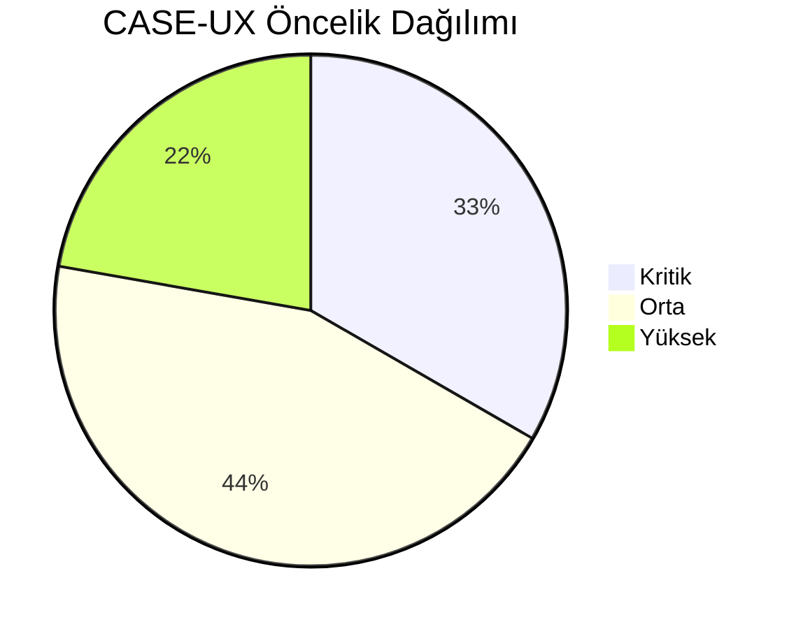
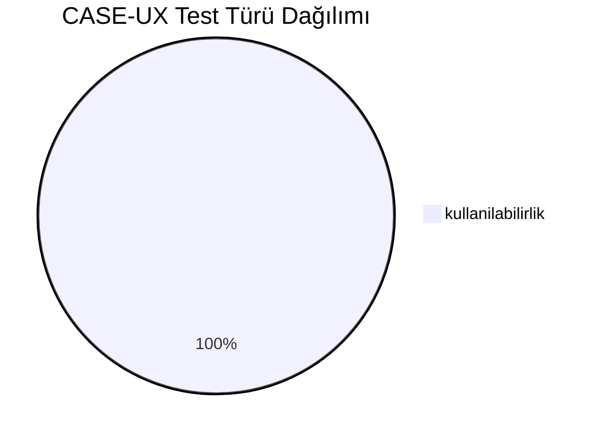
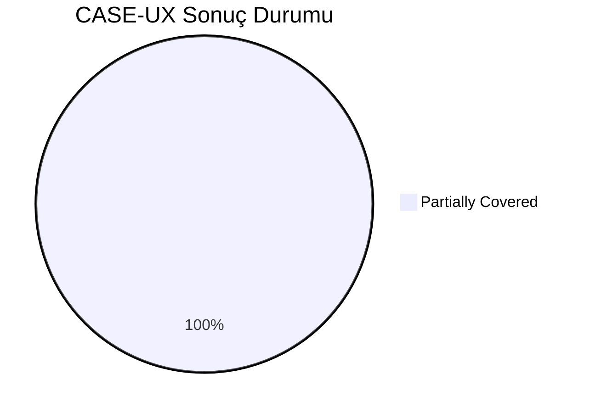
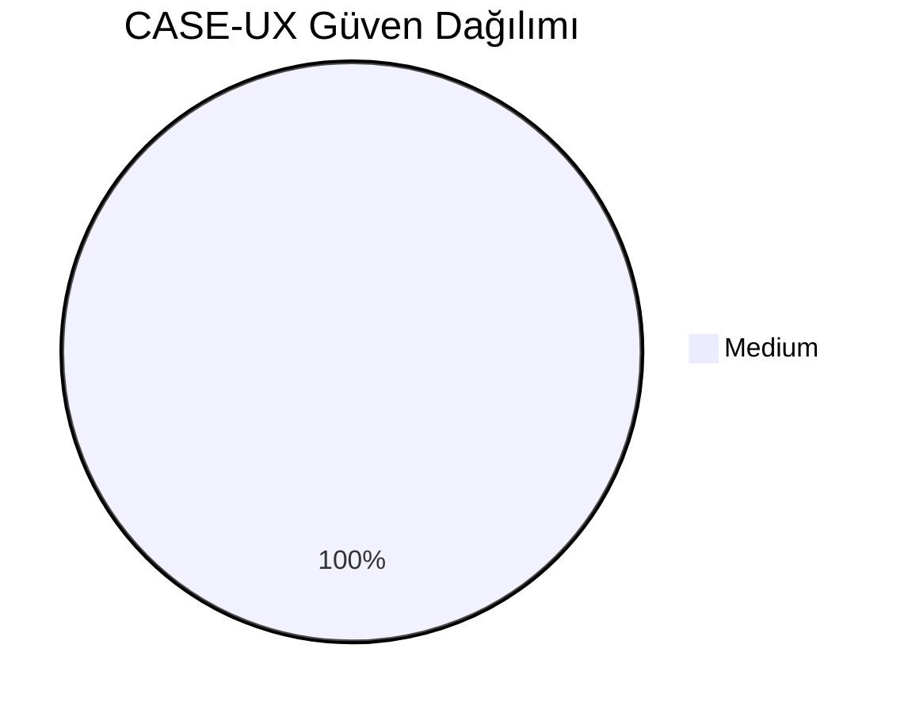
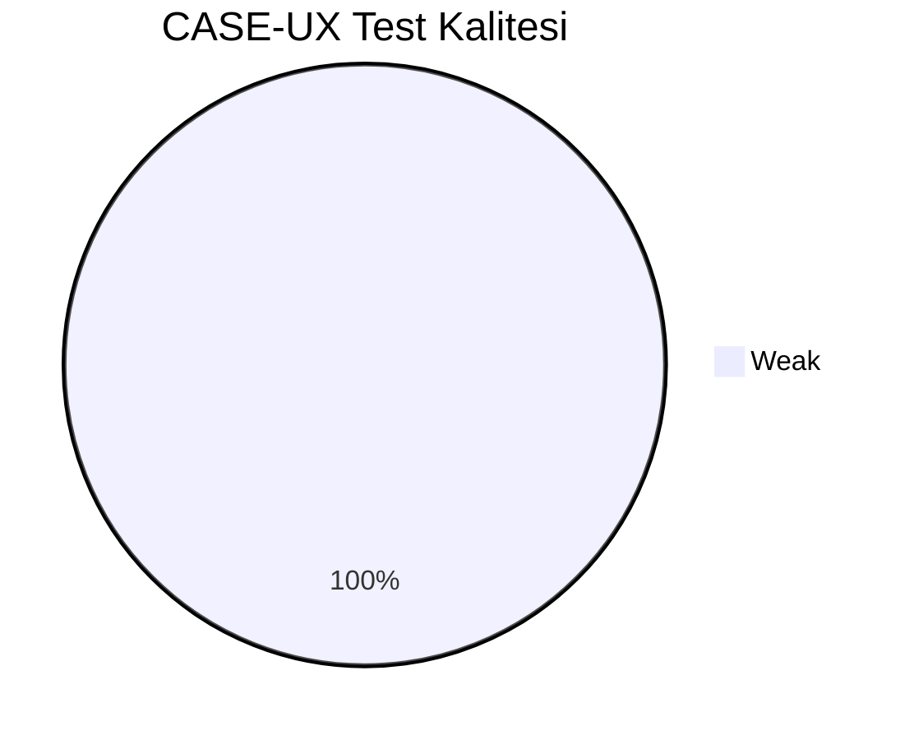
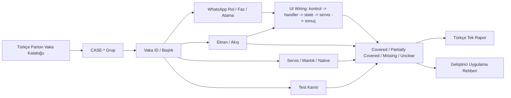
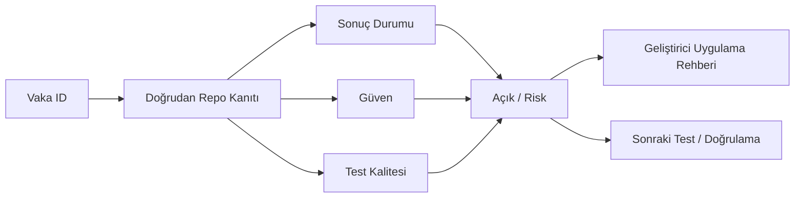

# CASE-UX Vaka Test Görselleştirmesi

- Toplam vaka: `9`
- Sonuç kaynağı: `/Users/hakanbilir/MyDevZone/StaffMatch/parton-case-results.json`
- Kanıt politikası: isim benzerliği kapsama kanıtı değildir; her vaka doğrudan repo kanıtı ile eşleştirilmelidir.

## Öncelik Dağılımı

## Test Türü Dağılımı

## Vaka Test Sonuç Özeti

## Güven Dağılımı

## Test Kalitesi Dağılımı

## Vaka Eşleştirme Akışı

## Sonuç Akışı

## Sonuç Matrisi

| Vaka ID | Başlık | Durum | Güven | Test Kalitesi | Kanıt | Açık | Olası Kod Alanı | UI Wiring Kanıtı |
| --- | --- | --- | --- | --- | --- | --- | --- | --- |
| `T-235` | İlk kez kullanan işçi akışı anlayabiliyor mu | Partially Covered | Medium | Weak | Compose ekranlarında snackbar/dialog/empty-state geri bildirimleri mevcut. | Kullanılabilirlik test çıktıları ve ölçülebilir UX KPI doğrulaması bulunmuyor. | frontend | kontrol -> handler -> state -> servis/native/API -> görünür sonuç |
| `T-236` | Profil oluşturma süresi uygun mu | Partially Covered | Medium | Weak | Compose ekranlarında snackbar/dialog/empty-state geri bildirimleri mevcut. | Kullanılabilirlik test çıktıları ve ölçülebilir UX KPI doğrulaması bulunmuyor. | frontend | kontrol -> handler -> state -> servis/native/API -> görünür sonuç |
| `T-237` | İşveren ilan açma akışı anlaşılır mı | Partially Covered | Medium | Weak | Compose ekranlarında snackbar/dialog/empty-state geri bildirimleri mevcut. | Kullanılabilirlik test çıktıları ve ölçülebilir UX KPI doğrulaması bulunmuyor. | frontend | kontrol -> handler -> state -> servis/native/API -> görünür sonuç |
| `T-238` | Uygun işler ekranı yeterince net mi | Partially Covered | Medium | Weak | Compose ekranlarında snackbar/dialog/empty-state geri bildirimleri mevcut. | Kullanılabilirlik test çıktıları ve ölçülebilir UX KPI doğrulaması bulunmuyor. | frontend | kontrol -> handler -> state -> servis/native/API -> görünür sonuç |
| `T-239` | Başvuru durumu okunabilir mi | Partially Covered | Medium | Weak | Compose ekranlarında snackbar/dialog/empty-state geri bildirimleri mevcut. | Kullanılabilirlik test çıktıları ve ölçülebilir UX KPI doğrulaması bulunmuyor. | frontend | kontrol -> handler -> state -> servis/native/API -> görünür sonuç |
| `T-240` | Check-in zamanı kullanıcıya anlaşılır geliyor mu | Partially Covered | Medium | Weak | Compose ekranlarında snackbar/dialog/empty-state geri bildirimleri mevcut. | Kullanılabilirlik test çıktıları ve ölçülebilir UX KPI doğrulaması bulunmuyor. | frontend | kontrol -> handler -> state -> servis/native/API -> görünür sonuç |
| `T-241` | Konum izni isteme akışı ikna edici mi | Partially Covered | Medium | Weak | Compose ekranlarında snackbar/dialog/empty-state geri bildirimleri mevcut. | Kullanılabilirlik test çıktıları ve ölçülebilir UX KPI doğrulaması bulunmuyor. | frontend | kontrol -> handler -> state -> servis/native/API -> görünür sonuç |
| `T-242` | Favoriler ekranı anlaşılır mı | Partially Covered | Medium | Weak | Compose ekranlarında snackbar/dialog/empty-state geri bildirimleri mevcut. | Kullanılabilirlik test çıktıları ve ölçülebilir UX KPI doğrulaması bulunmuyor. | frontend | kontrol -> handler -> state -> servis/native/API -> görünür sonuç |
| `T-243` | Jeton mantığı anlaşılır mı | Partially Covered | Medium | Weak | Compose ekranlarında snackbar/dialog/empty-state geri bildirimleri mevcut. | Kullanılabilirlik test çıktıları ve ölçülebilir UX KPI doğrulaması bulunmuyor. | frontend | kontrol -> handler -> state -> servis/native/API -> görünür sonuç |

## Vakalar

| Vaka ID | Başlık | Öncelik | Test Türü | Rol | Canlı Test Fazı | Görsel Eşleştirme Notu |
| --- | --- | --- | --- | --- | --- | --- |
| `T-235` | İlk kez kullanan işçi akışı anlayabiliyor mu | Orta | Kullanılabilirlik | İşçi | Ölçüm Fazı - Kullanılabilirlik | Ekran / servis / test kanıtı ile eşleştirilecek |
| `T-236` | Profil oluşturma süresi uygun mu | Yüksek | Kullanılabilirlik | Çoklu Aktör | Ölçüm Fazı - Kullanılabilirlik | Ekran / servis / test kanıtı ile eşleştirilecek |
| `T-237` | İşveren ilan açma akışı anlaşılır mı | Orta | Kullanılabilirlik | Çoklu Aktör | Ölçüm Fazı - Kullanılabilirlik | Ekran / servis / test kanıtı ile eşleştirilecek |
| `T-238` | Uygun işler ekranı yeterince net mi | Yüksek | Kullanılabilirlik | Çoklu Aktör | Ölçüm Fazı - Kullanılabilirlik | Ekran / servis / test kanıtı ile eşleştirilecek |
| `T-239` | Başvuru durumu okunabilir mi | Orta | Kullanılabilirlik | Çoklu Aktör | Ölçüm Fazı - Kullanılabilirlik | Ekran / servis / test kanıtı ile eşleştirilecek |
| `T-240` | Check-in zamanı kullanıcıya anlaşılır geliyor mu | Kritik | Kullanılabilirlik | Çoklu Aktör | Ölçüm Fazı - Kullanılabilirlik | Ekran / servis / test kanıtı ile eşleştirilecek |
| `T-241` | Konum izni isteme akışı ikna edici mi | Kritik | Kullanılabilirlik | Çoklu Aktör | Ölçüm Fazı - Kullanılabilirlik | Ekran / servis / test kanıtı ile eşleştirilecek |
| `T-242` | Favoriler ekranı anlaşılır mı | Orta | Kullanılabilirlik | Çoklu Aktör | Ölçüm Fazı - Kullanılabilirlik | Ekran / servis / test kanıtı ile eşleştirilecek |
| `T-243` | Jeton mantığı anlaşılır mı | Kritik | Kullanılabilirlik | Çoklu Aktör | Ölçüm Fazı - Kullanılabilirlik | Ekran / servis / test kanıtı ile eşleştirilecek |

## Manuel Tamamlama Kontrol Listesi

- Her vaka için ilişkili ekran/görünüm, servis/modül, native/platform alanı ve test dosyası yazılmalıdır.
- UI wiring kanıtı; ekran kontrolü, handler, state sahibi, validasyon, servis/native/API yan etkisi ve görünür sonucu birlikte göstermelidir.
- Kritik vakalarda enforcement kanıtı ve varsa test kanıtı ayrı ayrı gösterilmelidir.
- Kanıt zayıfsa durum `Unclear` veya `Partially Covered` kalmalıdır.
