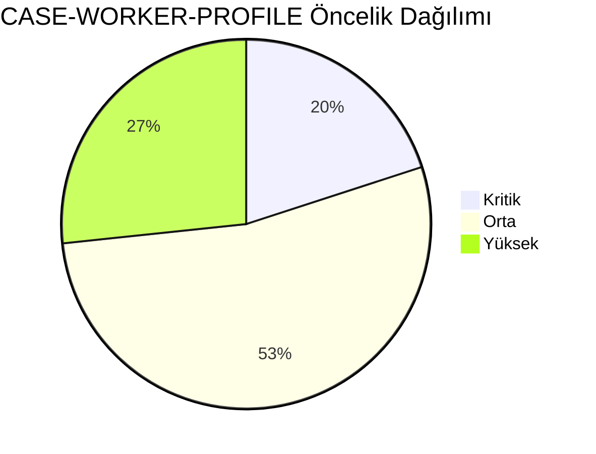
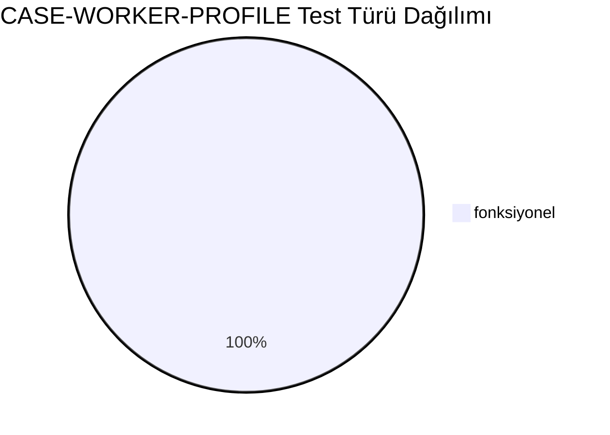
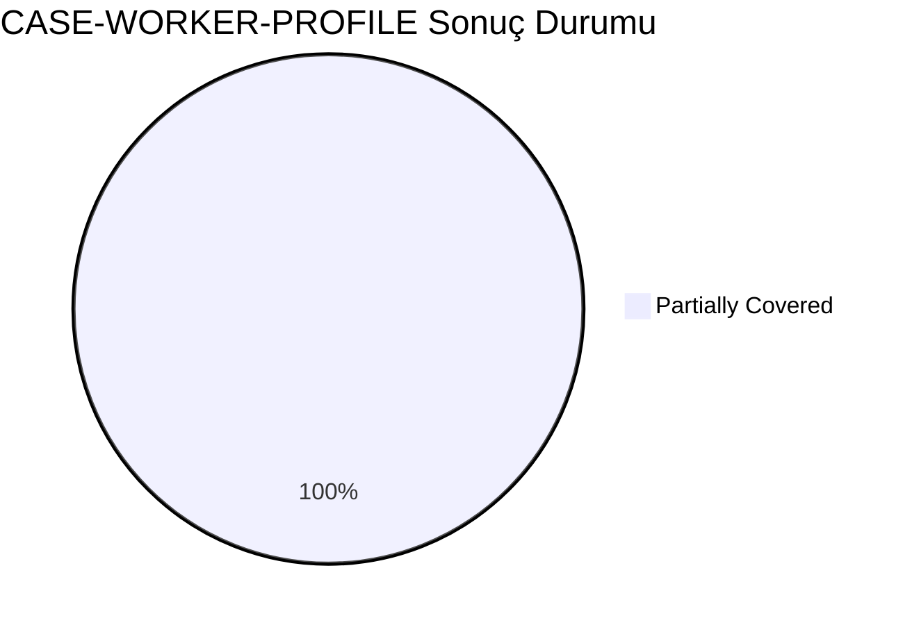
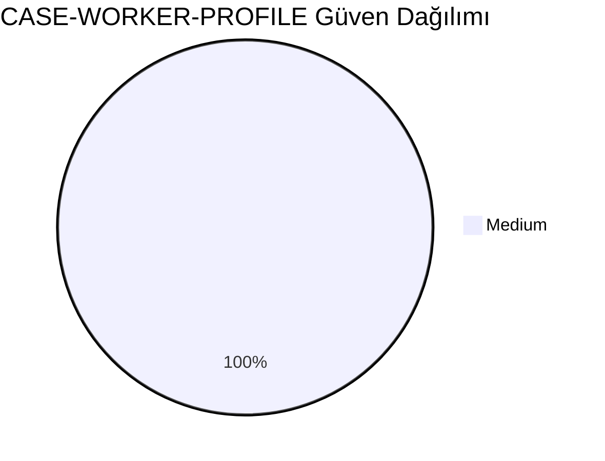
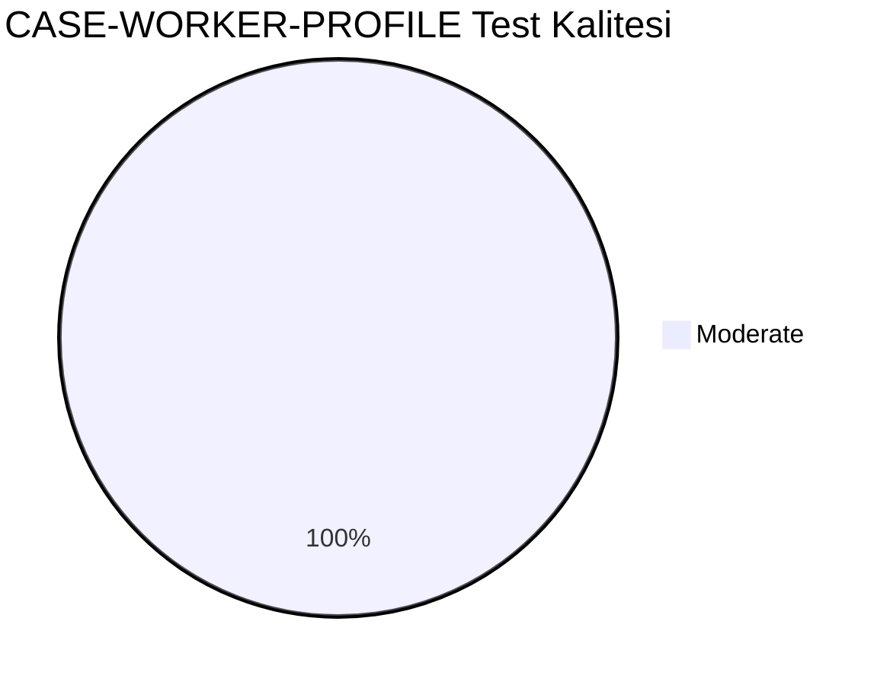
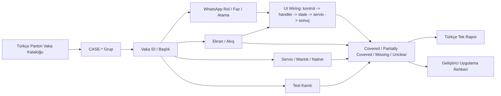
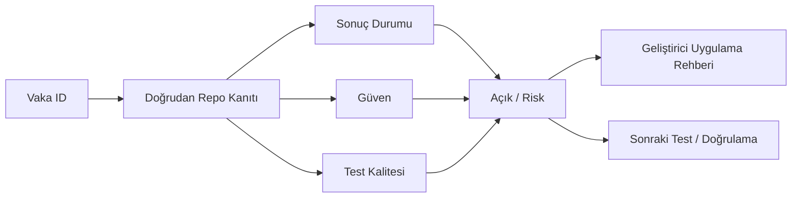

# CASE-WORKER-PROFILE Vaka Test Görselleştirmesi

- Toplam vaka: `15`
- Sonuç kaynağı: `/Users/hakanbilir/MyDevZone/StaffMatch/parton-case-results.json`
- Kanıt politikası: isim benzerliği kapsama kanıtı değildir; her vaka doğrudan repo kanıtı ile eşleştirilmelidir.

## Öncelik Dağılımı

## Test Türü Dağılımı

## Vaka Test Sonuç Özeti

## Güven Dağılımı

## Test Kalitesi Dağılımı

## Vaka Eşleştirme Akışı

## Sonuç Akışı

## Sonuç Matrisi

| Vaka ID | Başlık | Durum | Güven | Test Kalitesi | Kanıt | Açık | Olası Kod Alanı | UI Wiring Kanıtı |
| --- | --- | --- | --- | --- | --- | --- | --- | --- |
| `T-016` | Uygun gün seçiminin doğru kaydedilmesi | Partially Covered | Medium | Moderate | EmployeeProfileScreen/ViewModel ve profil doğrulama yardımcıları mevcut. | Profil tamamlama edge-case senaryolarında E2E ve veri migrasyon güvence kapsamı sınırlı. | shared | kontrol -> handler -> state -> servis/native/API -> görünür sonuç |
| `T-017` | Gün içinde birden fazla saat aralığı ekleme | Partially Covered | Medium | Moderate | EmployeeProfileScreen/ViewModel ve profil doğrulama yardımcıları mevcut. | Profil tamamlama edge-case senaryolarında E2E ve veri migrasyon güvence kapsamı sınırlı. | shared | kontrol -> handler -> state -> servis/native/API -> görünür sonuç |
| `T-018` | Çakışan saat aralıklarını engelleme | Partially Covered | Medium | Moderate | EmployeeProfileScreen/ViewModel ve profil doğrulama yardımcıları mevcut. | Profil tamamlama edge-case senaryolarında E2E ve veri migrasyon güvence kapsamı sınırlı. | shared | kontrol -> handler -> state -> servis/native/API -> görünür sonuç |
| `T-019` | Gece vardiyası uygunluğu tanımlama | Partially Covered | Medium | Moderate | EmployeeProfileScreen/ViewModel ve profil doğrulama yardımcıları mevcut. | Profil tamamlama edge-case senaryolarında E2E ve veri migrasyon güvence kapsamı sınırlı. | shared | kontrol -> handler -> state -> servis/native/API -> görünür sonuç |
| `T-020` | Çoklu sektör seçimi | Partially Covered | Medium | Moderate | EmployeeProfileScreen/ViewModel ve profil doğrulama yardımcıları mevcut. | Profil tamamlama edge-case senaryolarında E2E ve veri migrasyon güvence kapsamı sınırlı. | shared | kontrol -> handler -> state -> servis/native/API -> görünür sonuç |
| `T-021` | Çoklu meslek seçimi | Partially Covered | Medium | Moderate | EmployeeProfileScreen/ViewModel ve profil doğrulama yardımcıları mevcut. | Profil tamamlama edge-case senaryolarında E2E ve veri migrasyon güvence kapsamı sınırlı. | shared | kontrol -> handler -> state -> servis/native/API -> görünür sonuç |
| `T-022` | Belge seçimi doğru kaydediliyor mu | Partially Covered | Medium | Moderate | EmployeeProfileScreen/ViewModel ve profil doğrulama yardımcıları mevcut. | Profil tamamlama edge-case senaryolarında E2E ve veri migrasyon güvence kapsamı sınırlı. | shared | kontrol -> handler -> state -> servis/native/API -> görünür sonuç |
| `T-023` | Belge yükleme varsa dosya tipi kontrolü | Partially Covered | Medium | Moderate | EmployeeProfileScreen/ViewModel ve profil doğrulama yardımcıları mevcut. | Profil tamamlama edge-case senaryolarında E2E ve veri migrasyon güvence kapsamı sınırlı. | shared | kontrol -> handler -> state -> servis/native/API -> görünür sonuç |
| `T-024` | Geçersiz belge yükleme | Partially Covered | Medium | Moderate | EmployeeProfileScreen/ViewModel ve profil doğrulama yardımcıları mevcut. | Profil tamamlama edge-case senaryolarında E2E ve veri migrasyon güvence kapsamı sınırlı. | shared | kontrol -> handler -> state -> servis/native/API -> görünür sonuç |
| `T-025` | Konum pinleme doğruluğu | Partially Covered | Medium | Moderate | EmployeeProfileScreen/ViewModel ve profil doğrulama yardımcıları mevcut. | Profil tamamlama edge-case senaryolarında E2E ve veri migrasyon güvence kapsamı sınırlı. | shared | kontrol -> handler -> state -> servis/native/API -> görünür sonuç |
| `T-026` | Profil güncelleme sonrası eşleşme güncelleniyor mu | Partially Covered | Medium | Moderate | EmployeeProfileScreen/ViewModel ve profil doğrulama yardımcıları mevcut. | Profil tamamlama edge-case senaryolarında E2E ve veri migrasyon güvence kapsamı sınırlı. | shared | kontrol -> handler -> state -> servis/native/API -> görünür sonuç |
| `T-027` | Yaş değişikliği sonrası ilan görünürlüğü değişiyor mu | Partially Covered | Medium | Moderate | EmployeeProfileScreen/ViewModel ve profil doğrulama yardımcıları mevcut. | Profil tamamlama edge-case senaryolarında E2E ve veri migrasyon güvence kapsamı sınırlı. | shared | kontrol -> handler -> state -> servis/native/API -> görünür sonuç |
| `T-028` | Cinsiyet değişikliği sonrası eşleşme güncelleniyor mu | Partially Covered | Medium | Moderate | EmployeeProfileScreen/ViewModel ve profil doğrulama yardımcıları mevcut. | Profil tamamlama edge-case senaryolarında E2E ve veri migrasyon güvence kapsamı sınırlı. | shared | kontrol -> handler -> state -> servis/native/API -> görünür sonuç |
| `T-029` | Eksik profille başvuru engeli | Partially Covered | Medium | Moderate | EmployeeProfileScreen/ViewModel ve profil doğrulama yardımcıları mevcut. | Profil tamamlama edge-case senaryolarında E2E ve veri migrasyon güvence kapsamı sınırlı. | shared | kontrol -> handler -> state -> servis/native/API -> görünür sonuç |
| `T-030` | Profil silinince aktif başvuruların durumu | Partially Covered | Medium | Moderate | EmployeeProfileScreen/ViewModel ve profil doğrulama yardımcıları mevcut. | Profil tamamlama edge-case senaryolarında E2E ve veri migrasyon güvence kapsamı sınırlı. | shared | kontrol -> handler -> state -> servis/native/API -> görünür sonuç |

## Vakalar

| Vaka ID | Başlık | Öncelik | Test Türü | Rol | Canlı Test Fazı | Görsel Eşleştirme Notu |
| --- | --- | --- | --- | --- | --- | --- |
| `T-016` | Uygun gün seçiminin doğru kaydedilmesi | Yüksek | Fonksiyonel | İşçi | Faz 2 - İşçi Profil | Ekran / servis / test kanıtı ile eşleştirilecek |
| `T-017` | Gün içinde birden fazla saat aralığı ekleme | Orta | Fonksiyonel | İşçi | Faz 2 - İşçi Profil | Ekran / servis / test kanıtı ile eşleştirilecek |
| `T-018` | Çakışan saat aralıklarını engelleme | Kritik | Fonksiyonel | İşçi | Faz 2 - İşçi Profil | Ekran / servis / test kanıtı ile eşleştirilecek |
| `T-019` | Gece vardiyası uygunluğu tanımlama | Yüksek | Fonksiyonel | İşçi | Faz 2 - İşçi Profil | Ekran / servis / test kanıtı ile eşleştirilecek |
| `T-020` | Çoklu sektör seçimi | Orta | Fonksiyonel | İşçi | Faz 2 - İşçi Profil | Ekran / servis / test kanıtı ile eşleştirilecek |
| `T-021` | Çoklu meslek seçimi | Orta | Fonksiyonel | İşçi | Faz 2 - İşçi Profil | Ekran / servis / test kanıtı ile eşleştirilecek |
| `T-022` | Belge seçimi doğru kaydediliyor mu | Orta | Fonksiyonel | İşçi | Faz 2 - İşçi Profil | Ekran / servis / test kanıtı ile eşleştirilecek |
| `T-023` | Belge yükleme varsa dosya tipi kontrolü | Orta | Fonksiyonel | İşçi | Faz 2 - İşçi Profil | Ekran / servis / test kanıtı ile eşleştirilecek |
| `T-024` | Geçersiz belge yükleme | Orta | Fonksiyonel | İşçi | Faz 2 - İşçi Profil | Ekran / servis / test kanıtı ile eşleştirilecek |
| `T-025` | Konum pinleme doğruluğu | Kritik | Fonksiyonel | İşçi | Faz 2 - İşçi Profil | Ekran / servis / test kanıtı ile eşleştirilecek |
| `T-026` | Profil güncelleme sonrası eşleşme güncelleniyor mu | Yüksek | Fonksiyonel | İşçi | Faz 2 - İşçi Profil | Ekran / servis / test kanıtı ile eşleştirilecek |
| `T-027` | Yaş değişikliği sonrası ilan görünürlüğü değişiyor mu | Orta | Fonksiyonel | İşçi | Faz 2 - İşçi Profil | Ekran / servis / test kanıtı ile eşleştirilecek |
| `T-028` | Cinsiyet değişikliği sonrası eşleşme güncelleniyor mu | Yüksek | Fonksiyonel | İşçi | Faz 2 - İşçi Profil | Ekran / servis / test kanıtı ile eşleştirilecek |
| `T-029` | Eksik profille başvuru engeli | Kritik | Fonksiyonel | İşçi | Faz 2 - İşçi Profil | Ekran / servis / test kanıtı ile eşleştirilecek |
| `T-030` | Profil silinince aktif başvuruların durumu | Orta | Fonksiyonel | İşçi | Faz 2 - İşçi Profil | Ekran / servis / test kanıtı ile eşleştirilecek |

## Manuel Tamamlama Kontrol Listesi

- Her vaka için ilişkili ekran/görünüm, servis/modül, native/platform alanı ve test dosyası yazılmalıdır.
- UI wiring kanıtı; ekran kontrolü, handler, state sahibi, validasyon, servis/native/API yan etkisi ve görünür sonucu birlikte göstermelidir.
- Kritik vakalarda enforcement kanıtı ve varsa test kanıtı ayrı ayrı gösterilmelidir.
- Kanıt zayıfsa durum `Unclear` veya `Partially Covered` kalmalıdır.
